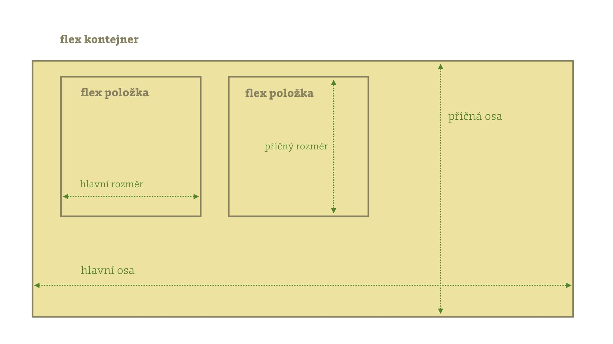

# Flexbox: Vše o průžných layoutech v CSS

Flexbox je jeden z nových způsobů, jak v CSS zapisovat layout, ale také zarovnání a distribuci volné plochy.

<div class="related web-only" markdown="1">
- [CSS Grid](css-grid.md)
- [CSS Multicolumn](css-multicolumn.md)
- [CSS Box Alignment](css-box-alignment.md)
</div>

V této aktualizované příručce přibyly texty s příklady pro všechny vlastnosti, které ve flexboxu můžete používat.

*Flex* v češtině znamená *pružný*, *přizpůsobivý*. Flexboxy jsou tedy *pružné* elementy layoutu. Jednou z hlavních předností flexboxu je totiž schopnost vyplňovat zbylý prostor.

Pokud sháníte příručku k vlastnostem flexboxu, tady je.

## Všechny vlastnosti {#vlastnosti}

Vlastnosti se týkají buď kontejneru, tedy rodičovského prvku nebo položek.

### Kontejner flexboxu {#vlastnosti-kontejner}

Hodnota [vlastnosti `display`](css-display.md) `flex` nastaví prvku kontext formátování flexboxem, takže jeho přímí potomkové mohou mít specifické vlastnosti. Možná je také „inline“ hodnota: `inline-flex`.

<div class="rwd-scrollable prop-table f-6" markdown="1">

| Vlastnost                            | Co dělá a příklad    |
|--------------------------------------|----------------------|
| [`flex-wrap`](css-flex-wrap.md) <br> [](css-flex-wrap.md)       | Definuje, zda se položky mohou zalamovat na více řádků nebo ne. Výchozí je nezalamovat. <br>Např. `flex-wrap: wrap` – položky se mohou vykreslit na další řádek. |
| [`flex-direction`](css-flex-direction.md) <br> [](css-flex-direction.md)       | Určí směr toku rozvržení. Výchozí je zleva doprava, do řádku. <br>Např. `flex-direction: column` – položky se skládají shora dolů, do sloupce. |
| [`flex-flow`](css-flex-flow.md) <br> [](css-flex-flow.md)       | Zkratka pro `flex-wrap` a `flex-direction`. <br>Např. `flex-flow: wrap column` – položky se zalomují a skládají shora dolů. |

</div>

<div class="web-only" markdown="1">
<!-- Kopie z css-multicolumn.md -->

Dále lze na kontejner flexboxu aplikovat také vlastnosti [zarovnání boxů (CSS Box Alignment)](css-box-alignment.md):

<div class="rwd-scrollable prop-table f-6" markdown="1">

| Vlastnost                               | Co dělá a příklad  |
|-----------------------------------------|--------------------|
| [`align-items`](css-align-items.md) <br> [](css-align-items.md)     | Zarovnání na blokové ose (obvykle svisle). <br> Např. `align-items: end` zarovná položky ke spodní hraně kontejneru. |
| [`place-items`](css-place-items.md) <br> [](css-place-items.md)     | Zkratka pro zarovnání položek v obou směrech. <br> Např. `place-items: end center` zarovná položky ke spodní hraně a vodorovně na střed. |

</div>

K dispozici máme i vlastnosti CSS Box Align, řídící rozdělení volného prostoru, který uvnitř kontejneru zůstává mezi položkami.

<div class="rwd-scrollable prop-table f-6" markdown="1">

| Vlastnost                               | Co dělá?  |
|-----------------------------------------|-----------|
| [`justify-content`](css-justify-content.md) <br> [](css-justify-content.md) | Rozdělení prostoru na řádkové ose (obvykle vodorovně). <br> Např. `justify-content: space-between` rozdělí prostor mezi položky. |
| [`align-content`](css-align-content.md) <br> [](css-align-content.md) | Rozdělení prostoru na blokové ose (obvykle svisle). <br> Např. `align-content: start` zajistí zarovnání položek k horní hraně kontejneru. |
| [`place-content`](css-place-content.md) <br> [](css-place-content.md) | Zkratka pro rozdělení prostoru v obou směrech. <br> Např. `place-content: start space-between` zajistí zarovnání položek k horní hraně kontejneru a vodorovné dělení prostoru mezi položky. |

</div>

<!-- /Kopie z css-multicolumn.md -->
</div>

### Položky flexboxu {#vlastnosti-polozky}

<div class="rwd-scrollable prop-table f-6" markdown="1">

| Vlastnost                            | Co dělá a příklad    |
|--------------------------------------|----------------------|
| [`flex-grow`](css-flex-grow.md) <br> [](css-flex-grow.md)       | Jak moc může položka růst. Výchozí je `0`. <br>Např. `flex-grow: 1` – bere si podíl v hodnotě `1` z volného prostoru. |
| [`flex-shrink`](css-flex-shrink.md) <br> [](css-flex-shrink.md)       | Faktor smršťování položky. Výchozí je `1`. <br>Např. `flex-shrink: 0` – položka se nesmršťuje. |
| [`flex-basis`](css-flex-basis.md) <br> [](css-flex-basis.md)       | Výchozí velikost položky. Výchozí je `auto`, tzn. podle `width` nebo `height`. <br>Např. `flex-basis: 0` – nehledí se na rozměr obsahu ani `width` či `height`. |

</div>

<div class="web-only" markdown="1">
<!-- Kopie z css-multicolumn.md -->

Také na položky flexboxu můžeme aplikovat vlastnosti [zarovnání boxů](css-box-alignment.md):

Následujícími vlastnostmi pro konkrétní položku definujeme, jak se bude zarovnávat.

<div class="rwd-scrollable prop-table f-6" markdown="1">

| Vlastnost                               | Co dělá?  |
|-----------------------------------------|-----------|
| [`justify-self`](css-justify-self.md) <br> [](css-justify-self.md)   | Zarovnání na řádkové ose (obvykle vodorovně). <br> Např. `justify-self: center` vodorovně centruje položku. |
| [`align-self`](css-align-self.md) <br> [](css-align-self.md)   | Zarovnání na blokové ose (obvykle svisle). <br> Např. `align-self: end` zarovná položku ke spodní hraně. |
| [`place-self`](css-place-self.md)  <br> [](css-place-self.md)  | Zkratka pro zarovnání jednotlivé položky v obou směrech. <br> Např. `place-self: end center` zarovná položku ke spodní hraně a vodorovně doprostřed. |

</div>

<!-- /Kopie z css-multicolumn.md -->
</div>

Nyní známe vlastosti a teď pojďme prozkoumat jednoduchý příklad.

## Základy v jednoduchém příkladu {#priklad}

Představme si triviální třísloupcový layout:

```html
<div class="container">
  <p class="col col--1">First is loooooong.</p>
  <p class="col col--2">Second is looooonger.<br/>…<br/>…</p>
  <p class="col col--3">Third is short.</p>  
</div>
```

HTML je jednoduché. O to přísnější máme požadavky na design. A víte co? Ukážeme si rovnou, jak je splnit pomocí flexboxu.

CodePen: [cdpn.io/e/jOVVeVL](https://cdpn.io/e/jOVVeVL)

V dalším textu kód z CodePenu ještě poctivě vysvětlíme.

<!-- AdSnippet -->

### Všechny sloupce mají být stejně vysoké {#priklad-sloupce}

Ano, i v případech kdy má ten jeden delší obsah než zbylé dva. To je to nejjednodušší. Stačí z rodiče pomocí [vlastnosti `display`](css-display.md) udělat kontejner flexboxu:

```css
.container {
  display: flex;
}
```

### Layout se při nedostatku místa zalomí {#priklad-zalamovani}

V případě, že zde nebude dost prostoru pro všechny položky, zalomíme. To definujeme pomocí [vlastnosti `flex-wrap`](css-flex-wrap.md):

```css
.container {
  flex-wrap: wrap;
}
```

### První dva sloupce jsou pružné, třetí nikoliv {#priklad-treti}

Zároveň jsme si vymysleli, že první dva sloupce se budou změnšovat a zvětšovat, přičemž druhý dvakrát více než první. Třetí naopak nikoliv, zůstane vždy na svém. Tady pomůže [zkratka vlastností položky flexboxu, `flex`](css-flex.md):

```css
/* Pružná položka, zabírá jednu část volného místa: */
.col--1 {
  flex: 1;  
}

/* Pružná položka, zabírá dvě části volného místa: */
.col--2 {
  flex: 2;  
}  

/* Fixně široká položka: */
.col--3 {
  flex: none;
}
```

### Na menších displejích se změní směr {#priklad-smer}

Na mobilech zpravila není pro rozvržení prvků vedle sebe prostor. Přidáme proto změnu směru layoutu, což zajistíme [vlastností `flex-direction`](css-flex-direction.md):

```css
@media (max-width: 400px) {
  .container {
    flex-direction: column;
  }
}
```

Příklad si utíkejte vyzkoušet naživo na CodePen. [cdpn.io/e/jOVVeVL](https://cdpn.io/e/jOVVeVL)

Je to hezké, že?

## Flexbox je mistr na layouty komponent {#layouty-komponent}

Je dobré zmínit, že flexbox je určený pro layout komponent uvnitř stránek. Tedy navigací, formulářů, stránkovacích komponent atd. atd.

Pro celostránkové layouty se více hodí [CSS Grid Layout](css-grid.md). Užití flexboxu pro celostránkové layouty je samozřejmě možné. Jen se na velmi pomalých zařízeních nebo internetových připojeních nebude vykreslovat optimálně. Píše o tom třeba Jake Archibald. [vrdl.in/zuscj](http://jakearchibald.com/2014/dont-use-flexbox-for-page-layout/)

## Šup na základní pojmy — flex kontejner a flex položka, hlavní a příčná osa {#pojmy}

Flexbox tvoří nerozlučná dvojice dvou typů elementů – flex kontejner a flex položka. Flex položkou se stává každý přímý potomek kontejneru.

```html
<ul class="flex-container">
  <li>…</li>
  <li>…</li>
</ul>
```

Flexbox nadefinujeme snadno jen pomocí flex kontejneru:

```css
.flex-container {
  display: flex;
}
```

Všechny `<li>` se tady stávají flex položkami.

Kromě flex kontejnerů a položek nás v dalším textu budou zajímat ještě osy. Ukažme si to na zjednodušeném schématu:



- flex kontejner – rodičovský element
- flex položka – všichni přímí potomci flex kontejneru
- hlavní osa – výchozí je horizontální, ale lze změnit
- příčná osa – vždy příčná k hlavní, takže ve výchozí podobě svislá
- hlavní rozměr – výchozí je šířka, ale řídí se nastavením hlavní osy
- příčný rozměr – výchozí je výška

## Podpora {#podpora}

Dostupnost vlastností flexboxu v prohlížečích je velmi dobrá, vždyť s podporou přišel už Internet Explorer 10! Grafy na CanIUse jsou tedy pěkně zelené. [caniuse.com/flexbox](https://caniuse.com/flexbox)

Konkrétní podporu je ale potřeba rozpadnout podle jednotlivých vlastností, uvedených výše v tabulce. Tam je situace už různorodější. Bojem s více či méně příjemnými chybami je provázena implementace v IE, protože jde o nejstarší dnes sloužící prohlížeče. Detailně se tím zabývá Philip Walton v repozitáři Flexbugs. [github.com/philipwalton/flexbugs](https://github.com/philipwalton/flexbugs)

<!-- AdSnippet -->
