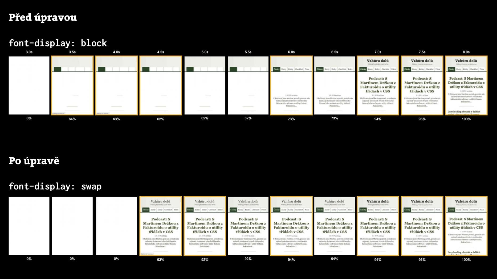

# Deskriptor font-display: Jak na řízené vykreslování webfontů?

Vlastnost `font-display` určuje, jak se bude během stahování vykreslovat webový font. Umožní renderovat webfonty bez zbytečného probliknutí a jednotně v moderních prohlížečích.

Správně bychom měli mluvit o „deskriptoru zobrazení fontu“ pro pravidlo [@font-face](css3-font-face.md).

Dáme si rychlou ukázku řešení, které bude dobré pro většinu webů:

```css
@font-face {
  src: url(roboto.woff2) format('woff2');
  font-family: 'Roboto';
  font-display: fallback;
}
```

Podobně to funguje také u Google Fonts, pomocí parametru `display=`, což je v době psaní textu velká novinka:

```html
<link 
  href="https://fonts.googleapis.com/css?family=Roboto&display=fallback"
  rel="stylesheet">
```

Oba zápisy zajistí, aby prohlížeč čekal desetinu sekundy na stažení webfontu „Roboto“. Pokud to stihne, zobrazí texty rovnou tímto písmem. V opačném případě vykreslí obsah v systémovém písmu a Roboto se renderuje až po stažení potřebných souborů.

Ptáte se na rozdíl oproti výchozímu chování ve většině moderních prohlížečů? Na pomalých připojeních se text zobrazí skoro o tři vteřiny dříve.

V článku dále následují detaily pro ty z vás, kteří máte více než jednu minutu času.

## Jaké problémy to řeší? Rozličné výchozí nastavení prohlížečů a potřeby projektů {#problemy}

Různé [prohlížeče](prohlizece.md) totiž k vykreslování během stahování fontů přistupují různě. Například:

* _Firefox, novější Safari, Chrome a z něj vycházející prohlížeče_  
Pokud zjistí přítomnost webfontu, a ten se nestihne načíst do tří sekund, celou tu dobu nezobrazí vůbec žádný text (proběhne FOIT, Flash of Invisible Text). To je z pohledu optimalizace vykreslování u většiny webu dost nepříjemné.
* _Starší Safari_  
Čeká na stažení webfontu. Dokud se to nepovede, uživatel nevidí žádný text (FOIT jako prase, pokud to to chcete pojmenovat…).
* _Internet Explorer a starý Edge_  
Vykreslí systémové písmo. Webfont až v momentě, kdy se stáhne. Tady často nastává jiný nechtěný efekt – FOUT, Flash of Unstyled Text.

Druhá svízel leží v tom, že pro různé weby se hodí různé přístupy. E-shopům a obsahovým webům bude například vyhovovat chování Firefoxu a Chrome. Hodně „vydizajnovaným“ webům zase spíše nastavení staršího Safari.

Právě proto je skvělé, že vlastnost `font-display` máme.

<figure>

<figcaption markdown="1">
*Před nějakým časem proběhla optimalizace vykreslování webfontů i tady, na Vzhůru dolů. Zdroj: [WebpageTest.org](https://www.webpagetest.org/video/compare.php?tests=180202_C6_72249cb14e4d83425fed89aa08f505d9-r%3A1-c%3A0%2C180202_FW_26ca4048d675991c4b12f67e7aaecf8e-r%3A1-c%3A0&thumbSize=200&ival=500&end=visual)*
</figcaption>
</figure>

Než se pustíme do popisu možných hodnot vlastnosti, musíme si definovat typy časových úseků, které máme při definování chování k dispozici.

## Časové intervaly {#intervaly}

Životní cyklus zobrazení webového fontu probíhá vždy těmito třemi fázemi:

1. _Interval blokování (Block period)_  
Obsah je v tomto čase schovaný (FOIT) a čeká se na stažení fontu. Jakmile se to prohlížeči povede, zobrazí font.
2. _Interval náhrady (Swap period)_  
Vykresluje se náhradní (systémové) písmo a opět se čeká na font. Po jeho stažení se provede náhrada (zde nastává FOUT).
3. _Interval selhání (Failure period)_  
Pokud se v předchozích dvou intervalech nepovede stáhnout font, zůstává viditelný fallback, tedy náhradní řešení. Nejčastěji je to zvolené systémové písmo.

Po teoretické přípravě se můžeme pustit do toho hlavního, a totiž popisu jednotlivých hodnost vlastnosti `font-display`.

## Hodnoty {#hodnoty}

V následujícím grafu pracuji jen s prvními dvěma intervaly – blokování a náhrady. Interval selhání vždy následuje za nimi. Různé hodnoty deskriptoru mají různě dlouhé první dva intervaly:

<figure>

<figcaption markdown="1">
*Hodnoty deskriptoru font-display*
</figcaption>
</figure>

### font-display: fallback {#fallback}

Nařizuje velmi krátký blokující interval (obvykle `100ms`) následovaný krátkým intervalem náhrady (`3s`).

Jinými slovy: `100ms` se při vypnutém obsahu čeká na stažení fontu. Stihne se to? Po desetině vteřiny se zobrazí stažené písmo. Nestihne se to? Zobrazí se náhradní písmo. Pokud prohlížeč font nestihne zobrazit do dalších tří sekund, zůstane tam náhradní písmo navždy.

<!-- AdSnippet -->

Tohle je strategie, kterou obecně doporučuji všem obsahovým webům a e-shopům, pokud by vás to snad zajímalo.

Ve [specifikaci](https://www.w3.org/TR/css-fonts-4/#descdef-font-face-font-display) říkají, že hodnota je vhodná pro delší texty, kde je použití vykreslení webfontem záhodno. Nesmí samozřejmě vadit, že někteří uživatelé chvíli uvidí náhradní písmo a časem dojde k překreslení.

### font-display: optional {#optional}

Nařizuje velmi krátký blokující interval (obvykle `100ms` a méně), interval náhrady zde žádný není.

Toto nastavení se chová podobně jako `fallback`, takže 100ms „vidíme“ tak leda neviditelný obsah a pak fallbackové písmo. Díky nepřítomnosti intervalu náhrady se prohlížeč sám rozhoduje o zobrazení webfontu. Někdy nemusí zobrazit webfont vůbec, když je na pomalém připojení. Jindy zase webfont stahuje s nízkou prioritou na pozadí a třeba jej zobrazí až se vstupem na další stránku webu. Tak to popisují na [CSS Tricks](https://css-tricks.com/really-dislike-fout-font-display-optional-might-jam/).

Tahle hodnota je ideální opět pro delší texty, oproti `fallback` ale dáváme přednost stabilitě zobrazení. Tady prostě překreslení textu do staženého webfontu nenastane. Hodnota `optional` se hodí tam, kde je webfont opravu jen „nice to have“, čili vylepšení, které nic zásadního nepřináší.

### font-display: swap {#swap}

Zajistí velmi krátký interval blokování (obvykle `100ms` a méně) a nekonečný interval náhrady.

Nějaké písmo je tedy kromě úvodní desetiny vteřiny vždy vidět. Nejdříve náhradní a po stažení pak zvolený webfont. Nevýhoda? I na rychlých připojeních často dojde k probliknutí náhradního písma.

`swap` by se měl používat na kratší texty, ve kterých je důležité sdělení nevysázené příliš odlišným typem písma, například nadpisy článků nebo názvy produktů v detailu produktu na e-shopech.

### font-display: block {#block}

Dává prohlížeči k dispozici třísekundový interval blokování a pak nekonečný interval náhrady.

Hodnota `block` odpovídá aktuálnímu chování většiny prohlížečů: Chrome, Firefoxu a Safari.

<!-- AdSnippet -->

Tohle nastavení by se mělo využívat k vykreslování kratších textů. Hlavně v případech, kdy vám záleží na tom, aby nedošlo k probliknutí systémového písma. Typicky třeba hlavní nadpisy stránky, když je webfont výrazně odlišný od fallbacku. Nebo pro vykreslování [ikonfontů](ikonfonty-vs-svg.md), pokud je ještě používáte.

### font-display: auto {#auto}

Tady šéfuje prohlížeč. Strategii zobrazení fontu určuje on. Takže jsme v situaci jejich výchozího nastavení, popsané o pár odstavců výše, které většinou odpovídá hodnotě `block`.

## Google Fonts {#google-fonts}

Ačkoliv je CSS vlastnost `font-display` použitelná už přes rok, poměrně dost vadila nemožnost jejího použití v kódu externích dodavatelů webfontů. V době psaní textu to ale změnil ten nejvýznamnější z nich – [Google Fonts](https://github.com/google/fonts/issues/358).

Při vkládání odkazu, který generuje CSS, je potřeba jen uvést parametr `display`:

```html
<link
  href="https://fonts.googleapis.com/css?family=Roboto&display=swap"
  rel="stylesheet">
```

Další „vendoři“, jako Adobe Fonts nebo Fonts.com, se zatím nepřidali. Sleduje to a průběžně o tom informuje [Zach Leatherman](https://www.zachleat.com/web/google-fonts-display/).

## Podpora v prohlížečích {#podpora}

Podle [CanIUse](https://caniuse.com/#feat=css-font-rendering-controls) je podpora deskriptoru `font-display` mezi moderními prohlížeči takřka stoprocentní. Po přechodu Edge na jádro Chromium chybí podpora z relevantních prohlížečů už jen v Internet Exploreru. Jeho výchozí nastavení ale pracuje s něčím jako hodnotou `swap`, ovšem [zcela bez intervalu blokování](https://font-display.glitch.me/). Na stránce je prostě vykreslený fallbackový font a jakmile se stáhne webfont, dojde k překreslení.

## Řešení JavaScriptem? Stále se nám může hodit {#js}

Asi je dobré zmínit, že dříve se tento problém dal vyřešit jen pomocí javascriptových knihoven, např. [FontFaceObserver](https://github.com/bramstein/fontfaceobserver) nebo [WebFontLoader](https://github.com/typekit/webfontloader). Ve velkém množství případů už nebudou potřeba, nativní řešení s `font-display` je samozřejmě efektivější.

Jak mě ale [upozornil Michal Matuška](https://twitter.com/fireball_/status/1130829875298865153), je zde stále několik důvodů, proč u řešení JavaScriptem můžete chtít zůstat:

1. *Vícenásobná překreslení*  
Jsou nepříjemná hlavně pokud jsou různé řezy jednoho písma v jednom textu (italic, bold…) stažená různě nebo za pomocí různých strategií `font-display`. JavaScript umožní počkat na stažení všech a překreslovat stránku najednou. (Problém se dá řešit i pomocí `font-display:optional`.)
2. *Detekce pomalejšího připojení*  
JavaScriptem lze například také vypnout webfonty v režimu [Spořiče dat](https://support.google.com/chrome/answer/2392284?co=GENIE.Platform%3DAndroid&hl=cs) (prohlížeč vrací `navigator.connection.saveData === true`) nebo na pomalém připojení (`navigator.connection.effectiveType === "slow-2g"`).
3. *Externí dodavatelé webfontů*  
JS se může hodit například také v kombinaci pro spolupráci stránky s externími dodavateli webfontů, kteří `font-display` neumí, jako je výše uvedený Adobe Fonts. Obecně je však lepší přesunout soubory s fonty na vlastní doménu, pokud je to možné.

Více je v textu [Should I Use JavaScript to Load My Web Fonts?](https://www.filamentgroup.com/lab/js-web-fonts.html) od Filament Group.

<!-- AdSnippet -->
