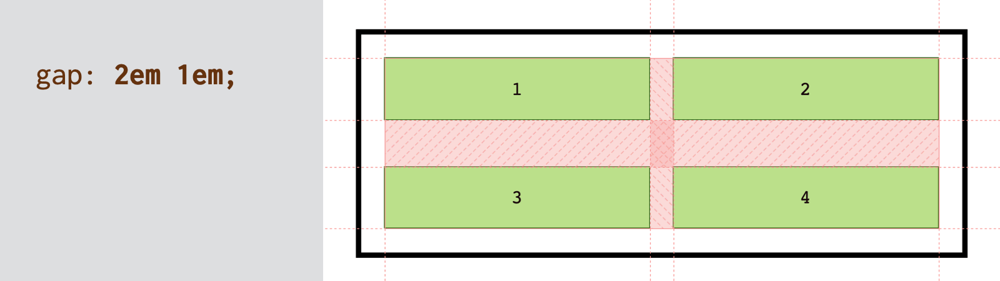
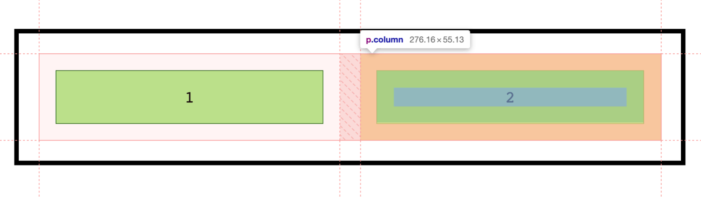
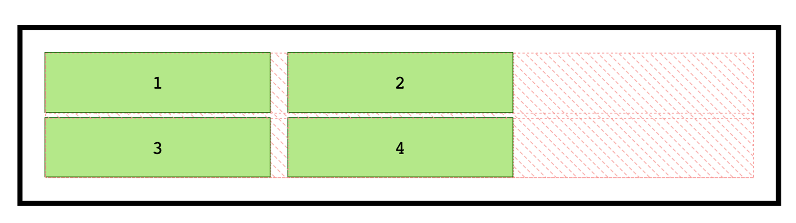
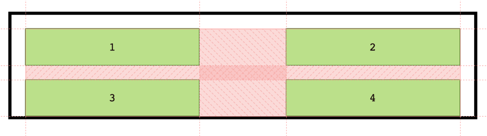
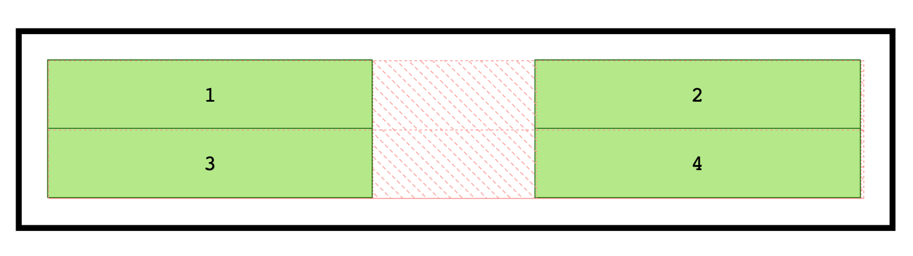

# CSS vlastnost gap

Pomocí CSS vlastnosti `gap` můžeme definovat mezery v rozvrženích vytvářených pomocí CSS layoutů. Téhle mezeře se občas i v češtině podle anglického originálu říká „gutter“. A brzy taky možná „gap“.

<div class="connected" markdown="1">


`gap` je mezera mezi vnitřními prvky layoutu.

<div class="web-only" markdown="1">

Vlastnost `gap` je možné použít ve všech moderních layoutech – v [gridu](css-grid.md), [flexboxu](css-flexbox.md) i [multicol](css-multicolumn.md). Patří však do specifikace [CSS Box Alignment](css-box-alignment.md).

</div>

<div class="ebook-only" markdown="1">

→ [vrdl.cz/p/css-gap](https://www.vzhurudolu.cz/prirucka/css-gap)

</div>

</div>

Od příchodu Safari verze 14.1 je možné `gap` ve všech prohlížečích používat nejen v rámci gridu, ale také ve flexboxu. To je skvělé a taky proto se vyplatí tuto vlastnost umět použít.

Zápis `gap` je zkratkou pro jiné dvě vlastnosti:

- `row-gap` – prostor mezi řádky (v „blokovém“ či svislém směru)
- `column-gap` – prostor mezi sloupci (tedy v „inline“, tedy obvykle vodorovném směru)

Zkratka se zapisuje takto:

```css
gap: <hodnota row-gap> <hodnota column-gap>;
```

Nastavujeme zde, jak je v CSS zvykem, nejprve svislý a pak až vodorovný směr. Druhá hodnota je volitelná. Pokud se neuvede, použije se jedna hodnota pro oba směry. I to je ostatně ve stylech běžné.

## Příklad {#priklad}

Vezměme ukázku se čtyřmi položkami v layoutu:

```html
<div class="container">
  <p class="column">1</p>
  <p class="column">2</p>
  <p class="column">3</p>
  <p class="column">4</p>
</div>
```

Layout v CSS definujeme následovně:

```css
.container {
  display: grid;
  grid-template-columns: 1fr 1fr;
  gap: 2em 1em;
}
```

Vysvětleme si to:

- [Deklarace `display:grid`](css-display.md) zajistí zobrazení pomocí CSS gridu.
- [Vlastnost `grid-template-columns`](css-grid-template-rows-columns.md) definují podobu mřížky. Zde jde sloupce o rovnoměrné šířce.
- `gap: 2em 1em` je instrukce pro vložení mezery svisle a pak i vodorovně.

<p></p>

CodePen: [cdpn.io/e/JgXWod](https://codepen.io/machal/pen/JgXWod?editors=1100)

Totéž bychom samozřejmě mohli zapsat v nezkrácených deklaracích následovně:

```css
.container {
  row-gap: 2em;
  column-gap: 1em;
}
```

## Raději gap než margin či padding (ale nic proti nim!) {#margin-padding}

Vlastnost `gap` je pro definování mezer v layoutu daleko efektivnější než `padding` nebo `margin`. Nijak se totiž nepočítá do šířky ani výšky položky layoutu a také se vždy vykresluje jen mezi položkami samotnými.

Je také pěkné si nastavit mezery mezi prvky v layoutu pro celý kontejner na jednom místě. Z toho důvodu právě vlastnost `gap` vznikla.

<!-- AdSnippet -->

Je však samozřejmě možné a bezpečné zároveň nastavovat mezery pomocí vnějších i vnitřních okrajů prvku nebo případně `gap` s dvojkou `margin`/`padding` kombinovat. Toho se určitě nebojte.

Jen si pak dejte pozor na interpretaci v prohlížečích, protože viditelná mezera vám naroste:

```css
.container {
  display: grid;
  grid-template-columns: 1fr 1fr;
  gap: 1em;
}

.column {
  padding: 1em;
  margin: 1em;
}
```

Anketní otázka: Jak velká bude mezera mezi položkou 1 a 2? Zvládnete ji zodpovědět ještě než se podíváte na obrázek?

Nechám vám chvilku času.

Ještě chvilku.

A teď už přichází obrázek:

<p></p>

Ano, viditelná mezera mezi položkami bude široká celé `3em`. Sečteme dva vnější okraje (`margin`) a mezeru (`gap`).

CodePen: [cdpn.io/e/JjJJNmo](https://codepen.io/machal/pen/JjJJNmo?editors=1100)

## Možné hodnoty {#hodnoty}

Následuje přehled možných hodnot vlastnosti `gap`. Čistě pro inspiraci, naložte s tím dle svého.

### Různé hodnoty pro svislý i vodorovný směr {#hodnoty-ruzne}

```css
.container {
  gap: 5px 1rem;
}  
```

Jak už jsem uvedl, toto je možné. V prvním čísle je svislý směr, v druhém vodorovný.

Pojďme si to vyzkoušet na flexboxovém layoutu, který jsme ještě vlastností `gap`  nestihli nepotrápit:

```css
.container {
  display: flex;
  flex-wrap: wrap;
  gap: 5px 1rem;
}

.column {
  width: 10em;
}
```

<p></p>

Raději si to zopakujme. Zápis `gap:5px 1rem` říká, že svisle mezi řádku chci mezeru `5px` a vodorovně mezi sloupci pak `1rem`.

CodePen: [cdpn.io/e/VwWWWwP](https://codepen.io/machal/pen/VwWWWwP?editors=1100)

### Použití funkce `calc()` {#hodnoty-calc}

Uvádění [výpočetní funkce `calc()`](css3-calc.md) se v hodnotách `gap` může hodit:

```css
.container {
  gap: calc(1rem - 2px);
}
```

Dříve toto nefungovalo v Safari, ale nyní je to už zprovozněné. Do slunné Kalifornie posíláme klíčenku s poděkováním! Pokud firmě Apple nevěříte, zkuste si to na CodePenu.

CodePen: [cdpn.io/e/KKqqqpJ](https://codepen.io/machal/pen/KKqqqpJ?editors=1100)

A k čemu, že se funkce `calc()` může hodit? Příkladem budiž odpočítání šířky rámečků (`border`) buňek layoutu z celkové šířky mezery.

<div class="ebook-only" markdown="1">

Neznáte [funkci `calc()`](css3-calc.md)? Podívejte se na speciální zmínku v poslední kapitole této knihy.

</div>

### Klíčové slovo `normal` {#hodnoty-normal}

Šup s tím hned do vody, tedy do ukázky kódu:

```css
.container {
  gap: normal;
}
```

Slovo `normal` představuje použitou hodnotu `1em` u vícesloupcového layoutu a hodnotu `0px` v kontextu gridu a flexboxu. Asi to není zase tak moc zajímavé… Já jen… Když byste se náhodou ptali… nebo vám to někdo položil jako otázku v testu.

### Procenta a jejich uvádění ve svislém směru {#hodnoty-procenta}

Procentuální hodnoty můžete chtít použít, ale dejte si pozor na hodnoty ve svislém směru.

```css
.container {
  gap: 10%;
}
```

Ve vodorovném směru je to jednoduché – spočítá se deset procent ze šířky rodičovského kontejneru a tato hodnota se vloží jako mezera mezi prvky.

Zajímavější je svislý směr.

V [layoutu tvořeném mřížkou](css-grid.md) se spočítá deset procent z výchozí výšky rodičovského kontejneru. Prostě z výšky před aplikováním mezery pomocí vlastnosti `gap`.

<p></p>

Pravděpodobně se vám tedy stane, že mezera vytlačí spodní prvky z kontejneru.

CodePen: [cdpn.io/e/OJggmrx](https://codepen.io/machal/pen/OJggmrx?editors=1100)

V případě [flexboxového layoutu](css-flexbox.md) a neznámé výšky kontejneru se procentuální `gap` ve svislém směru vůbec nezapočítá. Je z něj čistá nula. Ptáte se, kdy je výška kontejneru neznámá? Inu, ve flexboxu skoro vždy – dokud ji výslovně nedefinujete.

<p></p>

Zkoušení naživo je možné opět v následující ukázce.

CodePen: [cdpn.io/e/ZEyyKZZ](https://codepen.io/machal/pen/ZEyyKZZ?editors=1100)

## Co byste o `gap` měli vědět? {#vedet}

Když už jsme v tom, mám pár poznámek. Doslova pár:

1. Mezery tvořené `gap` mají vliv na minimální rozestupy mezi položkami. Je však možné další rozestupy přidat pomocí vlastností jako [`justify-content`](css-justify-content.md) nebo [`align-content`](css-align-content.md). Jejich hodnota `space-between` má podobnou funkcionalitu jako `gap` a je možné je vzájemně kombinovat.
2. Když už se `gap` dá použít všude, nedá se to použít i pro mezery mezi buňkami uvnitř `<table>`? Nedá, děkujeme za optání. Tabulková zobrazení místo používají vlastnost `border-spacing`.

## Podpora v prohlížečích {#podpora}

Pokud jde o moderní prohlížeče, vlastnost `gap` ve flexboxu a gridu podporují všechny.

- Grid: Prakticky plná podpora. Internet Explorer 11 vlastnost `gap` nepodporuje, ale to je možné dohnat [použitím nástroje Autoprefixer](css-grid-msie.md).
- Flexbox: Nepodporuje IE 11.
- Vícesloupcový layout: Nepodporuje IE 11 a zatím ani Safari.

Takže pokud potřebujete mezery v gridu a flexboxu a neřešíte Explorer, jste takzvaně ve vatě.

### Dříve jen v gridu

Dřívější zápisy „děrovacích“ vlastností byly ve specifikaci definovány jinak, s prefixem `grid-`: `grid-row-gap`, `grid-column-gap` a `grid-gap` a zaměřené čistě jen na CSS grid. Nyní jsou ale z této části specifikace vyjmuté a vyvíjené pod samostatným modulem [CSS Box Alignment](css-box-alignment.md).

Logicky totiž nespadají jen do možnosti definovat layout v mřížce, ale také ve flexboxu nebo vícesloupcovém layoutu. 

<!-- AdSnippet -->

Vlastnost `gap`, tedy bez prefixu `grid-` je podporována v Chrome 68+, Safari 11.2 Release 50+ a Opeře 54+. Ale to už je dneska vlastně jen historické okénko.

Detailní informace o podpoře jsou na CanIUse. [caniuse.com/gap](https://caniuse.com/#search=gap)
