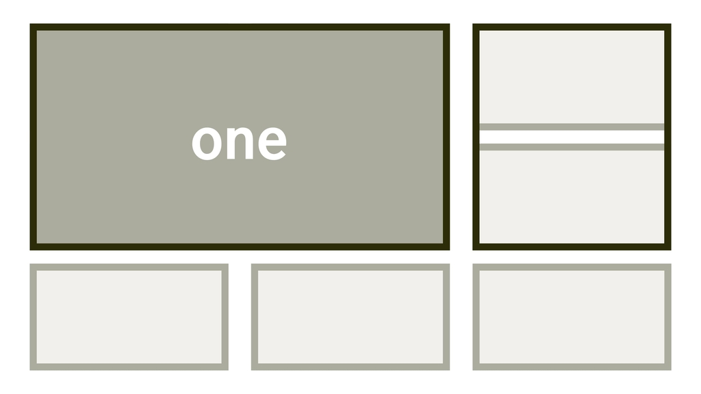

# Vlastnost grid-area

CSS vlastnost `grid-area` slouží k umísťování položek v definovaném CSS gridu.

<span class="book-index" data-book-index="grid-area"></span>

<div class="connected" markdown="1">



<div class="web-only" markdown="1">

Vlastnost `grid-area` je součástí specifikace [CSS gridu](css-grid.md).

</div>

<div class="ebook-only" markdown="1">

→ [vrdl.cz/p/css-grid-area](https://www.vzhurudolu.cz/prirucka/css-grid-area)

</div>

</div>

Jde o zkratku pro vlastnosti `grid-column-start`, `grid-column-end` a `grid-row-start`, `grid-row-end` nebo také zkratku pro zkratky [`grid-column` a `grid-row`](css-grid-row-column.md), aby to nebylo úplně jednoduché.

Může mít jednu až čtyři hodnoty. Obecně zápis vypadá asi takto:

```css
grid-area:
  <grid-row-start> / <grid-column-start> /  
  <grid-row-end> / <grid-column-end>;
```

## Jedna hodnota {#jedna-hodnota}

Umístění do už pojmenované oblasti mřížky je snadné. Nejprve si nadefinujeme mřížku a pomocí [`grid-template-areas`](css-grid-template-areas.md) pojmenujeme některé z jejích oblastí:

```css
.container {
  display: grid;
  grid-template-columns: 1fr 1fr;
  grid-template-rows: auto auto;
  gap: 10px;
  grid-template-areas:
    "first first"
    ".     second";
}
```

Pak už do oblastí `first` a `second` můžeme umísťovat:

```css
.first {
  grid-area: first;
}
```

<!-- AdSnippet -->

Je to zápis ekvivalentní k tomuto:

```css
.first {
  grid-row-start: first;
  grid-column-start: first;
  grid-row-end: first;
  grid-column-end: first;
}
```

CodePen: [cdpn.io/e/bXeWjb](https://codepen.io/machal/pen/bXeWjb?editors=1100)

## Další možné zápisy {#dalsi-zapisy}

Automaticky umísťuj do další buňky mřížky:

```css
.item {
  grid-area: auto;
}
```

Umísti oblast do řádku 2 a sloupce 4:

```css
.item {
  grid-area: 2 / 4;
}
```

Umísti oblast do třetího sloupce a roztáhni se do všech řádků (od prvního (`1`) do posledního `-1`):

```css
.item {
  grid-area: 1 / 3 / -1;
}
```

Na různé další možnosti hodnot, včetně demíček na CodePenu, se podívejte do příručky ke zkratkám [`grid-column` a `grid-row`](css-grid-row-column.md).

## Přístupnost: pozor na změnu pořadí {#pristupnost}

Pomocí vlastnosti `grid-area` můžete zcela odlišit pořadí prvků v kódu od vizuálního pořadí. Pozor na to, dokument se pak může špatně používat při navigaci z klávesnice nebo při práci přes odečítač obrazovky.

<div class="web-only" markdown="1">

Více to rozebírám v textu [CSS layout a přístupnost](css-layout-pristupnost.md).

</div>

<div class="ebook-only" markdown="1">

Více to rozebírám v části [CSS layout a přístupnost](css-layout-pristupnost.md) osmé kapitoly.

</div>

<!-- AdSnippet -->
