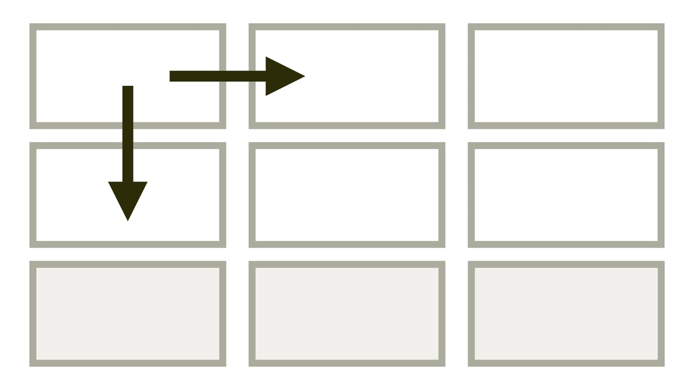
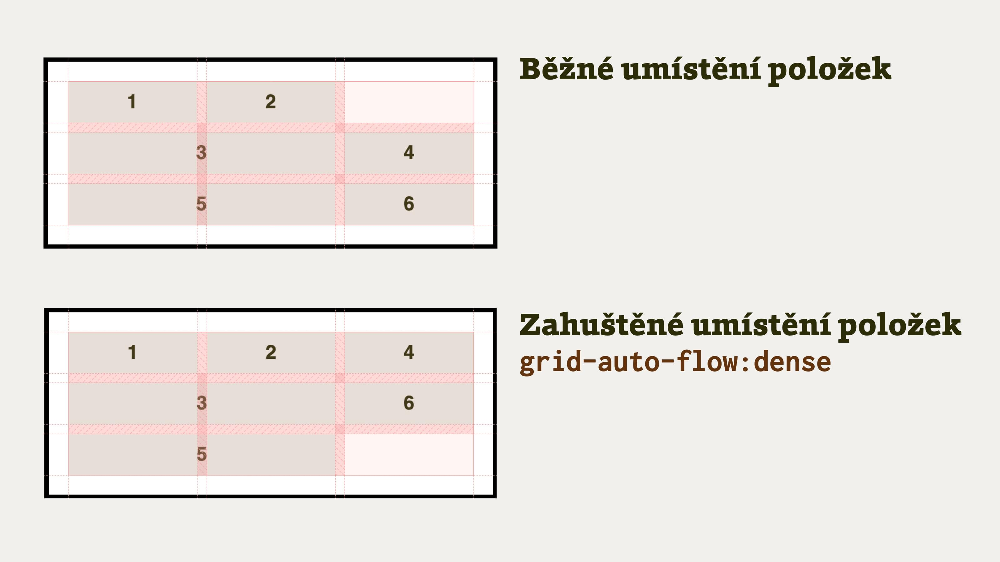

# Vlastnost grid-auto-flow

Vlastnost `grid-auto-flow` určuje, jak bude fungovat algoritmus automatického umísťování prvků do mřížky.

<div class="book-index" data-book-index="grid-auto-flow"></div>

<div class="connected" markdown="1">



<div class="web-only" markdown="1">

Vlastnost `grid-auto-flow` je součástí specifikace [CSS gridu](css-grid.md).

</div>

<div class="ebook-only" markdown="1">

→ [vrdl.in/cssgaf](https://www.vzhurudolu.cz/prirucka/css-grid-auto-flow)

</div>

</div>

Běžně vlastnost slouží ke změně směru vykreslování rozvržení. Možností použití je ale celá řada.

Nejzajímavější je asi hodnota `dense`, vyvolávající „zahuštěné“ vykreslení, kdy prohlížeč dá přednost kompaktnosti vykreslení položek před jejich pořadím definovaným v kódu.

## Hodnoty {#hodnoty}

<div class="rwd-scrollable prop-table f-6"  markdown="1">

| **Hodnota**                | **Co dělá?**       |
|----------------------------|--------------------|
| `row`     | Výchozí hodnota. Prvky layoutu se vykreslují po řádcích. |
| `column`  | Prvky layoutu se vykreslují po sloupcích. |
| `dense`   | Vykresluje se po řádcích, ale prohlížeč může vyplnit mezery změnou pořadí prvků. |
| `column dense`   | Vykresluje se po sloupcích, ale prohlížeč může vyplnit mezery změnou pořadí prvků.|

</div>

Co teď? Vzhůru do ukázek!

## Příklad: změna směru pomocí grid-auto-flow:column {#priklad-column}

<div class="book-index" data-book-index="Směr layoutu"></div>

Tohle je jednoduché, prostě se jen změní směr vykreslování z řádků na sloupečky.

Řekněme, že máme šest položek v layoutu:

```html
<div class="container">
  <p class="column">1</p>
  <p class="column">2</p>
  <p class="column">3</p>
  <p class="column">4</p>
  <p class="column">5</p>
  <p class="column">6</p>
</div>
```

Layout je definovaný jako mřížka o třech sloupcích a dvou řádcích:

```css
.container {
  display: grid;
  grid-template-columns: 1fr 1fr 1fr;
  grid-template-rows: 1fr 1fr;
  gap: 10px;
}
```

Výchozí směr vykreslení je `grid-auto-flow:row`, tedy po řádcích.

CodePen: [vrdl.in/hiyjr](https://codepen.io/machal/pen/KKVjvRm?editors=1100)

Můžeme jej ale změnit do svislého (sloupcového) směru:

```css
.container {
  grid-auto-flow: column;
}
```

<figure>

<figcaption markdown="1">
*Změnit směr rozvržení mřížkou jde snadno s pomocí vlastnosti grid-auto-flow.*
</figcaption>
</figure>

CodePen: [vrdl.in/i8mbo](https://codepen.io/machal/pen/voXWGv?editors=1100)

V CodePenu si to můžete zkusit také pro vlastnosti implicitního gridu: [`grid-auto-rows` a `grid-auto-columns`](css-grid-auto-rows-columns.md), stačí odstranit komentář v CSS.

## Příklad: zahuštěné vykreslování s grid-auto-flow:dense {#priklad-dense}

<div class="book-index" data-book-index="Zahuštěné vykreslování"></div>

Hodnota `dense` zajistí „zahuštěné“ vykreslení. Ve směru vykreslení nezůstávají v layoutu mezery mezi prvky. Mezery pak zůstanou až na konci layoutu.

<!-- AdSnippet -->

Důležité je, že prohlížeč může po nastavení `grid-auto-flow:dense` změnit pořadí vykreslení prvků.

Místo dlouhých řečí ale pojďme na příklad. Opět zde máme šest položek:

```html
<div class="container">
  <p class="column column-1">1</p>
  <p class="column column-2">2</p>
  <p class="column column-3">3</p>
  <p class="column column-4">4</p>
  <p class="column column-5">5</p>
  <p class="column column-6">6</p>
</div>
```

Layout je definovaný takto:

```css
.container {
  display: grid;
  grid-template-columns: repeat(auto-fill, minmax(120px, 1fr));
  gap: 10px;
  grid-auto-flow: dense;
}
```

Vysvětlíme:

- Ve vlastnosti [`grid-template-columns`](css-grid-template-rows-columns.md) uvádíme, že je možný libovolný počet sloupců ([funkce `repeat()`](css-repeat.md)), ale každý musí být minimálně 120px široký – [`minmax(120px, 1fr)`](css-minmax.md).
- `grid-auto-flow:dense` říká prohlížeči: Vykresli to zahuštěně, takže nezáleží na pořadí prvků, ale na tom, aby ve směru layoutu (což je tady `row`) nezůstaly mezery.

<figure class="figure-thirds">

<figcaption markdown="1">
Zahuštěné vykreslení (hodnota dense)  prostě dává přednost hustotě před pořadím.
</figcaption>
</figure>

CodePen: [vrdl.in/2caxb](https://codepen.io/machal/pen/VoKroo?editors=1100)

<div class="pbi-avoid" markdown="1">

## Přístupnost: pozor na změnu pořadí {#pristupnost}

<div class="book-index" data-book-index="Pořadí v layoutu"></div>
<div class="book-index" data-book-index="Přístupnost"></div>

Pomocí deklarace `grid-auto-flow:dense` může automatika prohlížeče odlišit pořadí prvků v kódu od vizuálního pořadí.

Pozor na to! Dokument pak může zlobit při navigaci z klávesnice nebo pro odečítače obrazovky. Snažte se proto tuto deklaraci používat jen pro prvky, u kterých na pořadí zase tak moc nezáleží.

</div>
<!-- .pbi-avoid -->

<div class="web-only" markdown="1">

Více to rozebírám v textu [CSS layout a přístupnost](css-layout-pristupnost.md).

</div>

<div class="ebook-only" markdown="1">

Více to rozebírám v části [CSS layout a přístupnost](css-layout-pristupnost.md) osmé kapitoly.

</div>

## Podpora v prohlížečích {#podpora}

Vlastnost `grid-auto-flow` a její hodnoty jsou plně podporovány ve všech prohlížečích s jedinou výjimkou – Internet Exploreru.

V MSIE nám bohužel nepomůže v případě této vlastnosti ani [Autoprefixer](autoprefixer.md) nebo jiný nástroj. Můžeme na něj ale vyzrát vhodným napsáním kódu tak, abychom měli pod kontrolou desktopové zobrazení, které Explorer používá, a ostatním prohlížečům pomocí vlastnosti `grid-auto-flow` nechali jen menší displeje.

<!-- AdSnippet -->
