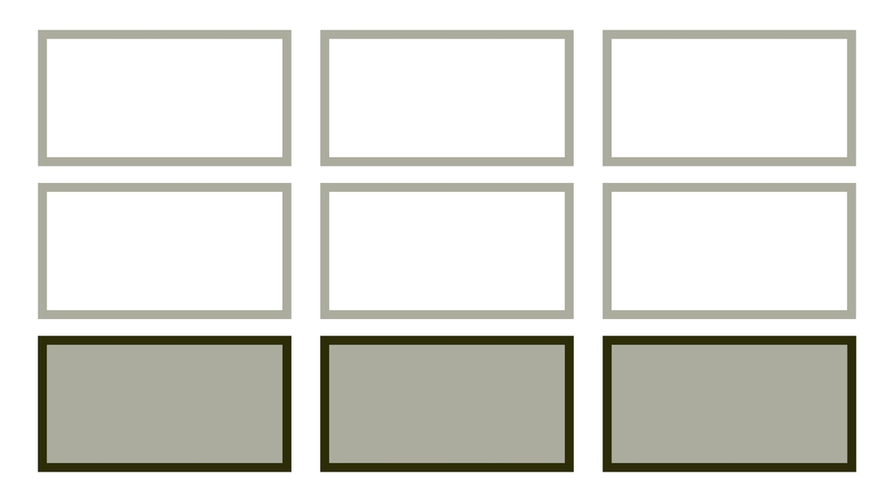
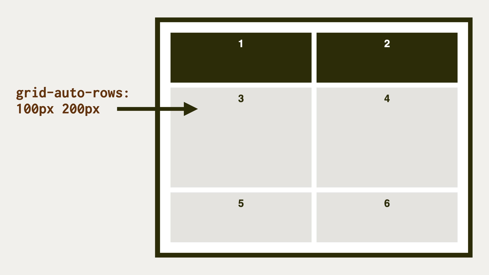

# Vlastnosti grid-auto-rows a grid-auto-columns: definice implicitního gridu

Vlastnosti `grid-auto-rows` a `grid-auto-columns` použijete pro tvorbu implicitního, čili výslovně nedefinovaného gridu v CSS.

<div class="connected" markdown="1">



<div class="web-only" markdown="1">

Vlastnosti `grid-auto-rows` a `grid-auto-columns` jsou součástí [CSS gridu](css-grid.md).

</div>

<div class="ebook-only" markdown="1">

→ [vrdl.cz/p/css-grid-auto-rows-columns](https://www.vzhurudolu.cz/prirucka/css-grid-auto-rows-columns)

</div>

</div>

Jsou tedy doplňkem vlastností [`grid-template-rows` a `grid-template-columns`](css-grid-template-rows-columns.md), které naopak slouží pro vytváření gridu explicitního, tedy autorsky definovaného.

Tyto vlastnosti jsou užitečné pro implicitní řádky (`grid-auto-rows`), a to v případech, kdy máte v HTML neznámý počet položek. Řádky se vám v layoutu tvoří samy a vy nemusíte definovat mřížku pro různé počty položek v ní.

## Možné hodnoty {#hodnoty}

Vlastnostem implicitního gridu `grid-auto-rows` a `grid-auto-columns` můžete přiřazovat stejné hodnoty jako jejich „explicitním kolegyním“  – `grid-template-rows` a `grid-template-columns`.

<!-- AdSnippet -->

Příklady se budou točit kolem definování řádků, ale samozřejmě platí i pro sloupce:

Výchozí hodnota je `auto`:

```css
grid-auto-rows: auto;
```

Říká se tím, že výšku řádku definuje výška obsahu v buňkách.

### Jedna hodnota pro všechny řádky

```css
grid-auto-rows: 100px;
grid-auto-rows: 10%;
grid-auto-rows: 1fr;
```

V takovém případě prostě natvrdo nastavíme minimální výšku buněk mřížky. Obsah to samozřejmě může svou výškou přebít.

### Více hodnot, které se při větším počtu sloupců opakují

```css
grid-auto-rows: 100px 200px;
grid-auto-rows: 10% 33.3%;
grid-auto-rows: 1fr minmax(100px, auto);
```

Hodnota `100px 200px` říká, že první a pak každý lichý nedefinovaný, a tedy implicitní řádek bude mít výchozí výšku `100px`, sudé řádky pak `200px`.

### Klíčová slova

```css
grid-auto-columns: min-content;
grid-auto-columns: max-content;
```

Je samozřejmě možné používat [funkce a klíčová slova](css-minmax.md), stejně jako při definici explicitní mřížky.

Ukázky máme tedy za sebou. Jak ale onen implicitní grid vzniká a kde je možné tyto vlastnosti využít?

## Příklad: Více položek v gridu, než je definovaných řádků {#priklad-radky}

Jak už jsem říkal – vlastnosti `grid-auto-` častěji použijete pro řádky layoutu, tedy `grid-auto-rows`. Může se vám totiž snadno stát, že v mřížce je předem daný počet sloupečků, ale neznámý počet položek, a tedy řádků:

```css
.container {
  display: grid;
  grid-template-columns: 1fr 1fr;
}
```

Vlastnost `grid-template-rows` umí definovat rozměry známých řádků. Nezvládá ovšem definovat opakování hodnot.

Pokud bychom chtěli střídat výšku `100px` a `200px` pro liché a sudé řádky, přičemž počet řádků neznáme, i pro tohle je výborná vlastnost `grid-auto-rows`:

```css
.container {
  grid-auto-rows: 100px 200px;
}  
```

<figure>

<figcaption markdown="1">
*Vlastnost `grid-auto-rows` v akci. Dává rozměry položkám, se kterými nepočítá explicitně definovaná mřížka.*
</figcaption>
</figure>

CodePen: [cdpn.io/e/PMGJpa](https://codepen.io/machal/pen/PMGJpa?editors=1100)

## Příklad: Umístění položky mimo explicitní grid {#priklad-umisteni}

Další možností, jak může explicitní grid vzniknout, je umístění položky zcela mimo definovanou mřížku. Řekněme, že ji definujeme jako 2 × 2:

```css
.container {
  display: grid;
  grid-template-columns: 1fr 1fr;
  grid-auto-columns: 1fr;
}
```

Jenže v HTML máme šest a ne čtyři položky. A co víc – pátou a šestou položku nezbedný kodér umístil na pozice v mřížce, které neexistují:

```css
.column.fifth {
  grid-column: 3;
  grid-row: 1;
}

.column.sixth {
  grid-column: 3;
  grid-row: 2;
}
```

Prohlížeč nám při pokusu o umístění do třetího sloupce, tedy na pozici nedefinovanou explicitním gridem, grid rozšíří. Ale rozšíří jej mřížkou implicitní. Výchozí rozměry prvků nám tedy zřejmě nebudou vyhovovat.

Opravíme to až touto deklarací:

```css
.container {
  grid-auto-columns: 1fr;
}
```

<figure>

<figcaption markdown="1">
*Rozdíl mezi nedefinovanou implicitní mřížkou (`grid-auto-columns:auto`) a definovanou (`grid-auto-columns:1fr`), ve které pátá a šestá položka dostane definovanou šírku.*
</figcaption>
</figure>

CodePen: [cdpn.io/e/ymazjy](https://codepen.io/machal/pen/ymazjy?editors=1100)

## Podpora v prohlížečích {#podpora}

Vlastnosti `grid-auto-rows` a `grid-auto-columns` podporuje kdejaký prohlížeč, včetně Internet Exploreru od verze 10. Jupí! V MSIE je potřeba používat vlastnosti pojmenované jako `-ms-grid-rows` a `-ms-grid-columns` nebo to řešit Autoprefixerem.

<!-- AdSnippet -->
