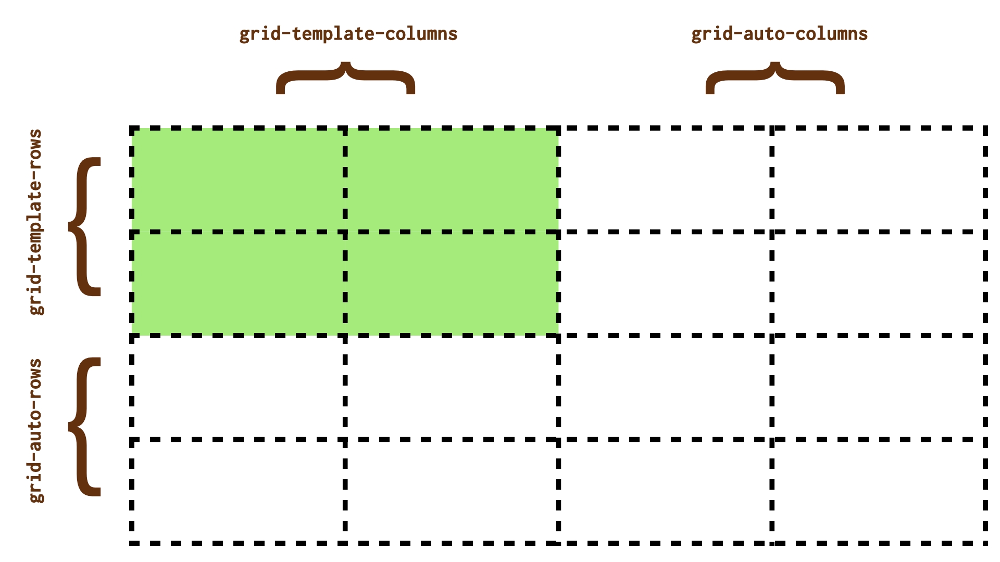
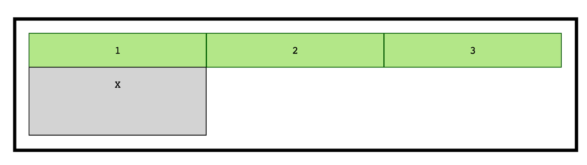
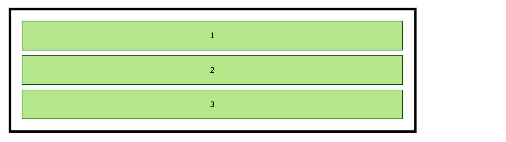
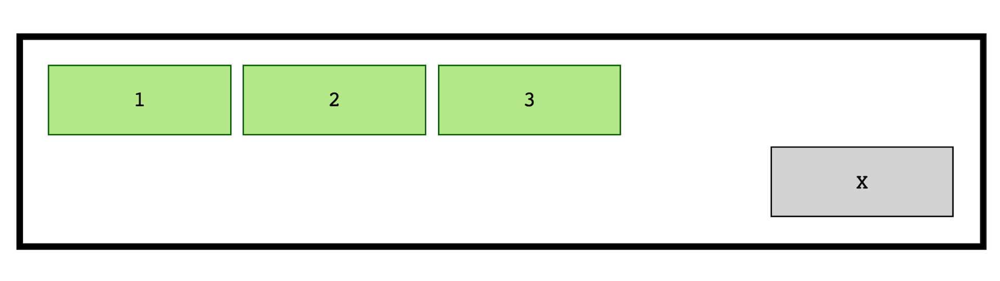

# CSS Grid: Explicitní a implicitní mřížka

Kromě výslovně uvedené explicitní mřížky existuje ještě implicitní mřížka.
V naprosté většině v CSS Gridu definujeme explicitní mřížku, předem uvedenou.

Může se nám ale stát, že položku umístíme na místo, kam explicitní mřížka nesahá. V takovém případě se nám mřížka automaticky rozšíří o implicitní část. Budete se divit, ale i tu můžeme předem nadefinovat.

<figure>

<figcaption markdown="1">
*Obrázek: Mřížka s explicitní (doslovně definovanou) a implicitní (automaticky definovanou) částí.*
</figcaption>
</figure>

Podívejme se, jaké vlastnosti obě mřížky definují:

- *Explicitní*, výslovně definovanou, lze nastavit vlastnostmi obsahujícími slovo `template`:  
Jde konkrétně o vlastnosti `grid-template-*` – [`grid-template-rows`, `grid-template-columns`](css-grid-template-rows-columns.md) a [`grid-template-areas`](css-grid-template-areas.md),
- *Implicitní*, která obvykle není předem definovaná k vykreslení. Lze ji nastavit vlastnosti obsahujícími slovo `auto`:  
Jde o vlastností  `grid-auto-*` [`grid-auto-rows`, `grid-auto-columns`](css-grid-auto-rows-columns.md) a [`grid-auto-flow`](css-grid-auto-flow.md).

## Příklad s přidáním položky na novou řádku

Ve naprosté většině případů mřížku definujeme jako explicitní. Vezměme třeba tento jednoduchoučný kód:

```html
<div class="container">
  <p class="item">1</p>
  <p class="item">2</p>
  <p class="item">3</p>
</div>
```

V CSS pak layout rozdělíme do tří sloupců, které se spravedlivě dělí o prostor:

```css
.container {
  display: grid;
  grid-template-columns: 1fr 1fr 1fr;
}
```

Co se ale stane, když do DOMu přidáme čvrtou položku?

```html
<div class="container">
  <p class="item">1</p>
  <p class="item">2</p>
  <p class="item">3</p>
  <p class="item item--x">X</p>
</div>
```

Přidá se jako čtvrtá položka vedle třetí? Co myslíte?

Samozřejmě, že ne. Vždyť jsme prohlížeči výslovně (explicitně) řekli, že chceme třísloupcový layout.

V takovém případě prohlížeče layout zalomí a přidají nový řádek. Jenže počkat – vždyť jsme žádné řádky nedefinovali! Tohle je přesně místo, kde můžeme seznámit s implicitním gridem.

Implicitní layout definují vlastnosti [`grid-auto-rows`, `grid-auto-columns`](css-grid-auto-rows-columns.md), které mají výchozí hodnotu `auto`. To neznamená nic jiného než: „Přidávej směle nové řádky (nebo sloupce, pokud má layout opačný směr) a nic dalšího neřeš, nazdar.“

Pokud bychom si ale přáli jiné parametry pro ty potenciální nové prvky mřížky, můžeme to prostě definovat:

```css
.container {
  grid-auto-rows: 1fr 2fr;
}
```

Mřížce tím nepřikazujeme, aby byla rovnou dvouřádková. Říkáme zhruba toto: „Zatím nic nevykresluj, ale pokud by náhodou přibyla položka na druhou řádku, vykresli ji dvakrát tak vysokou než jsou ty na prvním řádku.“ Tak tohle je ten slavný implicitní grid. Vypadá to teď jako na obrázku.

<figure>

<figcaption markdown="1">
*Obrázek: A helemese, na druhém řádku je položka. Ta se zformátuje podle automatického, implicitního gridu.*
</figcaption>
</figure>

CodePen: [cdpn.io/e/zYrGoqQ](https://codepen.io/machal/pen/zYrGoqQ?editors=1100)

## Příklad s přidáním položky na neznámou pozici

Tentokrát budeme drsní a žádnou explicitní mřížku definovat nebudeme. Jdeme na to:

```html
<div class="container">
  <p class="item">1</p>
  <p class="item">2</p>
  <p class="item">3</p>
</div>
```

Ve stylech sice zapneme formátovací kontext mřížky, nějakou tu mezeru pomocí [vlastnosti `gap`](css-gap.md), ale tím to hasne:

```css
.container {
  display: grid;
  gap: 10px;
}
```

Prohlížeč si řekne: „Hmm… grid! Ovšem pozor – nemá deklaraceci layoutu, takže to prostě vypíšu pod sebe.“ A jak řekl, tak udělá:

<figure>

<figcaption markdown="1">
*Obrázek: Tady žádný grid není, co jiného bychom měli čekat?*
</figcaption>
</figure>

Jenže přesně na to vývojář čeká a prohlížeč jde zaskočit přidáním čtvrté položky do kontejneru s tímto předpisem:

```css
.item--new {
  grid-column: 5;
  grid-row: 2;
}
```

Prohlížeč: „No toto! Máme tam přeci jen tři sloupce a jeden řádek. A ty mi tady něco umísťuješ do pátého slupce a druhého řádku!“

Naštěstí si ale náš milý prohlížeč vzpomene, že kromě explicitního mřížky jej učili ještě implicitní. Tedy, že tam, kde chybí explicitní buňky, může vyskládat ty implicitní:

<figure>

<figcaption markdown="1">
*Obrázek: Hele, grid!*
</figcaption>
</figure>

Výchozí výška i šířka implicitních buněk je na hodnotě `auto`, takže se rozměry určí podle obsahu položky. No a když tam žádný není… nemužeme se pak divit, že čtvrtý sloupec je méně široký než první tři a nový pátý. Nemá totiž žádný obsah. Mohli bychom to opravit přípravou implicitní mřížky, například takto:

```css
.container {
  grid-auto-columns: 1fr;
}
```

Všechny nově přidané sloupečky by pak měly stejnou šířku.

CodePen: [cdpn.io/e/PoZqbqm](https://codepen.io/machal/pen/PoZqbqm?editors=1100)

Hotovo! Snad se vám díky těmto dvěma příkladům povedlo proniknout do konceptu implicitní a explicitní mřížku, který je pro chápání CSS gridu velmi důležitý.
