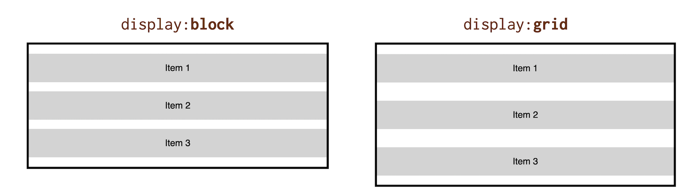
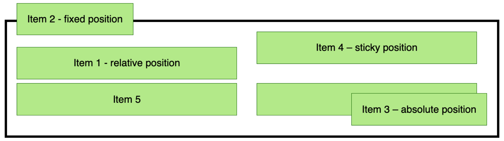

# Formátovací kontext mřížky v CSS

Další teoretická znalost o CSS gridu, která se nám může velmi hodit, je formátovací kontext (grid formatting context).

Každá hodnota vlastnosti `display` totiž zapíná nový způsob zacházení s potomky prvku a může měnit vztahy prvku a jeho okolí.

Tak jako `display:block` má od časů CSS 2.1 svůj *block formatting context*, CSS grid má kontext svůj vlastní.

Co se tedy v prohlížečích stane pěkného – nebo pro někoho nepěkného – když napíšeme `display:grid` nebo `display:inline-grid`?

## Svislé vnější okraje se neslučují. Chválabohu

Hodnoty vlastnosti `margin` shora a zdola se neslučují s hodnotami sousedních prvků. To, co znáte z blokových elementů, ve světě CSS gridu neplatí.

Je to logické. Mřížka má tvořit rozvržení prvků stránky a při takové práci by nám slučování vnějších okrajů působilo ještě větší trable než nám působí u blokových prvků.

Chcete ukázku? Vezměme, že máme dva bloky se třemi vnitřními položkami. Každá položka má tento předpis v CSS:

```css
.item {
  margin: 1em 0;
}
```

Výsledek se různí podle formátovacího kontextu:

- `display:block` slučuje svislé okraje, takže mezi položkami je shora i zdola mezera jen `1em`.
- `display:grid` naproti tomu okraje neslučuje, takže mezi jednotlivými .`.item` tvoří mezeru dvakrát `margin`, tedy `2em`.



CodePen: [cdpn.io/e/GRobVpz](https://codepen.io/machal/pen/GRobVpz?editors=1100)

## Floaty nechte plavat

Pro formátovací kontext mřížky platí, že:

* Vlastnosti `float` a `clear` nemají žádný efekt na položky mřížky. Radši si ani nepředstavuji, co by vývojáři dělali, kdyby tomu tak nebylo.
* Plovoucí prvky (např. `float:left`), nijak nevstupují do kontejneru mřížky. Sousedící kontejner mohou posunout, zmenšit, ale nikdy nevstoupí dovnitř, aby rozbily položky.

Brrr! Raději pojďme od „floatů“ pryč. Začalo se mi dělat nevolno…

## Vlastnost `vertical-align` nemá na položky mřížky žádný efekt

`vertical-align` slouží ke svislému zarovnání textového obsahu. Pro zarovnání v mřížce zde máme jiné úžasné vlastnosti, o kterých bude ještě řeč.

<!-- TODO odkaz na zarovnávací vlastnosti -->

## Pseudoelementy `::first-line` and `::first-letter` u kontejnerů mřížky nefungují

I tohle je naprosto logické. Tyto vlastnosti dávají smysl u typografických bloků. Grid je šéf přes layout, nikoliv psaný text.

Pokud byste chtěli vidět tohle všechno v akci, neváhejte se podívat na můj CodePen, ve kterém jsem se Grid pokusil rozbít všemi zde uvedenými způsoby. A byl jsem neúspěšný.

CodePen: [cdpn.io/e/GRoJmgN](https://codepen.io/machal/pen/GRoJmgN?editors=1100)

## A co pozicování?

Úplně to sem nepatří, ale vlastnost `position` funguje dobře, děkuji za optání.

Pozicovat můžete samotný grid kontejner, ale i jeho položky, pokud z kontejneru uděláte takzvaný *containing block* pomocí `position:absolute`.

Vyzkoušel jsem to za vás, protože jsem byl zvědavý:



CodePen: [cdpn.io/e/qBbdmrd](https://codepen.io/machal/pen/qBbdmrd?editors=1100)

