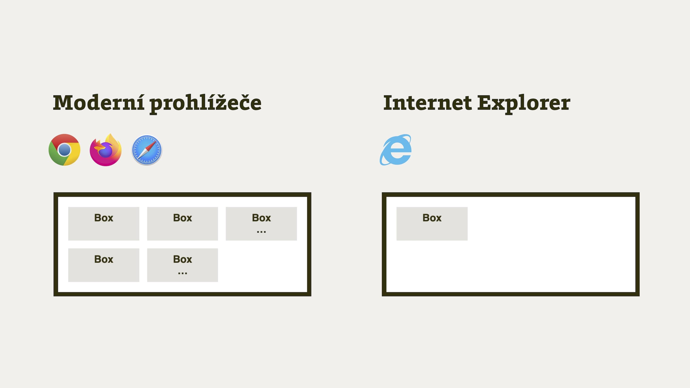

# CSS Grid v Internet Exploreru

„Neumí to Explorer“ je, když to přeženeme, na prvních devíti místech z 10 důvodů, proč lidé ještě v roce 2021 nepoužívají [CSS Grid](css-grid.md).

Problém to ale v realitě zase tak moc není, protože u většiny projektů už nejspíš [není MSIE nutné používat](msie.md).

A pokud Explorer podporovat musíte, vězte, že nějakou (a ne úplně malou podporu) gridu má. To je jedna věc.

Druhá věc je, že tu podporu Exploreru můžete rozšířit pomocí chytrého hacku. V tomto textu se totiž budeme zabývat automatizovaným řešením pro zlepšení podpory Gridu pomocí nástroje [Autoprefixer](autoprefixer.md).

<p class="video">
Video: <a href="https://www.youtube.com/watch?v=JjmXOB01Yq0">CSS Grid v Internet Exploreru</a> ~ Základy a krátké demo podle obsahu článku.
</p>

Pojďme tedy dát kombinaci gridu s MSIE novou šanci.

## Co Internet Explorer z gridu podporuje a co ne {#podpora}

jisté rozdíly mezi IE a ostatními zde jsou. Z těch důležitých například napráskejme, že Internet Explorer nativně neumí následující:

- automatické umísťování prvků do mřížky („auto-placement“),
- pojmenovávání oblastí mřížky ([vlastnosti jako `grid-template-areas`](css-grid-template-areas.md)),
- mezery mezi buňkami mřížky (např. [`grid-gap`](css-gap.md)).

Velká část uvedeného pro vás ale přečtením tohodle dlouhého textu přestane platit.

<!-- AdSnippet -->

Naopak se málo ví, že stařičký IE nativně podporuje následující:

- implicitní (nepředdefinovanou) mřížky,
- [funkci `repeat()`](css-repeat.md), jen jinak: `repeat(12, 1fr 20px)` zapisuje jako `(1fr 20px)[12]`,
- další skvělou funkci – [`minmax()`](css-minmax.md),
- klíčová slova `min-content` a `max-content`.

To myslím není zlé.

Jen připomínám, že rozdíly nevznikly v nějakém microsoftím „týmu pro vytáčení webařů“. Jejich příčinou je rychlá implementace gridu v ranné fázi specifikace týmem v Microsoftu. Specifikace se bohužel časem změnila, ale grid v Exploreru zůstal v původní variantě.

## Třísloupcové demo aneb „Jak to kurnikšopa funguje?“ {#demo}

Podívejme se na jednoduchý layout, u kterého si ukážeme jak přesně Autoprefixer zařídí fungování gridu v MSIE.

CodePen: [cdpn.io/e/BvJjdz](https://codepen.io/machal/pen/BvJjdz?editors=1100).

Jde o rozvržení definované následujícím způsobem:

```css
.container {
  display: grid;
  grid-template-columns: 1fr 3fr 1fr;
  grid-column-gap: 0.5em;  
  grid-template-areas: "a b c";
}
```

Pro zájemce polopaticky:

- `display: grid` asi vysvětlovat nemusím. Definujeme prostě kontejner mřížky.
- `grid-template-columns: 1fr 3fr 1fr` specifikuje samotnou mřížku. O [jednotce `fr`](css-jednotka-fr.md) píšu v jiném textu.
- `grid-column-gap: 0.5em` je zápis pro mezeru mezi sloupci layoutu.  
- `grid-template-areas` je šablona pojmenování oblastí pro následné využití v CSS.

Teď to nejlepší. Tenhle kód nám Autoprefixer přeloží tak, aby v pohodě fungoval v Internet Exploreru 11. Včetně mezer (`-gap`) a pojmenovaných oblastí (`-areas`). Tedy vlastností, které tenhle pravěký prohlížeč neumí.

### Proč takhle složitě? Protože Autoprefixer

Vy znalejší jste si jistě všimli, že pro takto jednoduchý layout by bylo zbytečné definovat šablonu pojmenování oblastí – `grid-template-areas`. To je ale oběť na oltář podpory v Internet Exploreru.

Dalším kódem už jen umístíme sloupečky do pojmenovaných oblastí:

```css
.side-1 {
  grid-area: a;
}

.content {
  grid-area: b;
}

.side-2 {
  grid-area: c;
}
```

A šup! V další fázi se můžeme kochat kódem, který vypotí Autoprefixer.

### Kód produkovaný Autoprefixerem

Nejprve rodič layoutu:

```css
.container {
  display: -ms-grid;
  -ms-grid-columns: 1fr 0.5em 3fr 0.5em 1fr;
}
```

Následuje samozřejmě výše uvedený kód pro moderní prohlížeče. Ten pro zjednodušení vynechávám. Opět ale oba řádky vysvětlím:

- `display: -ms-grid` – prefixovaný zapínač Gridu v Exploreru.
- `-ms-grid-columns: 1fr 0.5em 3fr 0.5em 1fr` – magie. Autoprefixer spojil definici mřížky s definicí mezer (`grid-column-gap`), abychom ty (sakramentsky návykové) díry v layoutu mohli využívat i v Exploreru, který žádnou z „gap vlastností“ nepodporuje.

Kód prvků layoutu, jež Autoprefixer vyrobí pro potřeby Exploreru, vypadá takhle:

```css
.side-1 {
  -ms-grid-row: 1;
  -ms-grid-column: 1;
}

.content {
  -ms-grid-row: 1;
  -ms-grid-column: 3;
}

.side-2 {
  -ms-grid-row: 1;
  -ms-grid-column: 5;
}
```

IE totiž neumí ani žádnou z vlastností `*-area`. Autoprefixer tak automaticky spočítá umístění do patřičných sloupečků.

Pokud vám nesedí počty sloupců u vlastnosti `-ms-grid-column`, pak raději zopakuji, že Autoprefixer uměle přidává sloupečky, abychom mohli používat mezery `-gap`.

Demo jsme snad rozebrali do posledního kamínku. Tady je ještě v celé kráse: [cdpn.io/e/BvJjdz](https://codepen.io/machal/pen/BvJjdz).


## Co Autoprefixer umí? {#autoprefixer-vlastnosti}

Následuje sumář aktuálně podporovaných a nepodporovaných vlastností Gridu.

Dobrá zpráva zní, že těch druhých je poměrně málo.

### Autoprefixer umí: Definování šablony mřížky {#autoprefixer-vlastnosti-sablona}

- [`grid-template-columns`](css-grid-template-rows-columns.md) se přeloží do `-ms-grid-columns`.
- [`grid-template-rows`](css-grid-template-rows-columns.md) se přeloží do `-ms-grid-rows`.
- [`grid-template-areas`](css-grid-template-areas.md) slouží k tomu, aby Autoprefixer pochopil, jak vypadá váš layout. Žádný kód ale negeneruje.
- [`grid-template`](css-grid-template.md) je jen zkratka pro `grid-template-columns`, `grid-template-rows` a `grid-template-areas`. Přeloží se tedy do nich.

### Umí: Zarovnávání {#autoprefixer-vlastnosti-sablona}

- [`align-self`](css-align-self.md) se přeloží do `-ms-grid-row-align`.
- [`justify-self`](css-justify-self.md) se přeloží do `-ms-grid-column-align`.

### Částečně umí: Umístění položky do mřížky {#autoprefixer-vlastnosti-sablona}

Překlad následujících vlastností funguje, ale nesmíte v nich použít záporná čísla:

- [`grid-row-start`](css-grid-row-column.md) se přeloží do `-ms-grid-row`. Pokud chcete použít `span`, musíte definovat `grid-row-end`.
- [`grid-column-start`](css-grid-row-column.md) se přeloží do `-ms-grid-column`. Pokud chcete použít `span`, musíte definovat `grid-row-end`.
- [`grid-row-end`](css-grid-row-column.md). Musíte ale definovat `grid-row-start`.
- `grid-column-end`. Musíte ale definovat `grid-row-start`.
- [`grid-row`](css-grid-row-column.md) se přeloží do `-ms-grid-row`.
- `grid-column` se přeloží do `-ms-grid-column`.

### Částečně umí: Definice pojmenovaných oblastí {#autoprefixer-vlastnosti-oblasti}

Následující vlastnost funguje, ale každý potomek gridu musí mít unikátní jméno oblasti:

- [`grid-area`](css-grid-area.md) - Autoprefixer z oblastí udělá explicitní zápis pomocí `grid-row-end` a `grid-column-end`.

### Částečně umí: Definice mezer {#autoprefixer-vlastnosti-mezery}

- [`grid-gap`](css-gap.md) a explicitní vlastnosti `grid-row-gap` nebo `grid-column-gap`.

Autoprefixer namísto `-gap` vygeneruje extra řádky nebo sloupečky. Fajn řešení, ne? Je ale důležité, abyste grid zapsali pomocí `grid-template-areas` a zároveň `grid-template-columns`.

### Neumí vůbec: Vlastnost grid a automatické umístění {#autoprefixer-vlastnosti-neumi}

Tady máte zatím smůlu:

- [`grid`](css-grid-zkratka.md) je zkratka pro `grid-template-rows`, `grid-template-columns` a `grid-template-areas`. Doporučuje se namísto ní použí `grid-template`.
- Automatické umístění: [`grid-auto-columns`, `grid-auto-rows`](css-grid-auto-rows-columns.md) nebo [`grid-auto-flow`](css-grid-auto-flow.md).

Automatické umísťování ale u jednodušších layoutů udělat jde, jak za chvíli uvidíte.

<!-- AdSnippet -->

## Au­to­ma­tic­ké umís­ťo­vá­ní do mříž­ky (autoplacement)

*Autoplacement* je další důležitá vlastnost gridu, Explorer ji neumí, ale i tady vám může částečně pomoci Explorer.

Pojďme tradičně na příklad. Chceme layout 2 × 2 prvky. HTML kód vypadá takto:

```html
<div class="container">
  <p class="box">Box</p>
  <p class="box">Box</p>
  <p class="box">Box</p>
  <p class="box">Box</p>
</div>
```

Díky automatickému umístění bude v moderních prohlížečích stačit definovat mřížku v CSS:

```css
.container {
  display: grid;
  grid-template-columns: 1fr 1fr;
  grid-template-rows: auto auto;
}
```

Prvky se nám pěkně rozmístí. Jenže smůla, tohle nebude fungovat v Internet Exploreru.

<figure>

<figcaption markdown="1">
*Ale to je nepříjemné, automatické umístění v MSIE nefunguje*
</figcaption>
</figure>

Pro MSIE 10 a 11, ve kterých nějaká verze CSS Gridu funguje, nám zde Autoprefixer přidá pseudotřídy:

```css
.container > *:nth-child(1) {
  -ms-grid-row: 1;
  -ms-grid-column: 1;
}

.container > *:nth-child(2) {
  -ms-grid-row: 1;
  -ms-grid-column: 2;
}
```

…a tak dále.

### Chcete autoplacement? Pozor na výjimky

Autoplacement rozhodně nefunguje ve všech použitích mřížky. Následuje seznam možných problémů, ale bude jich více.

- *Nefunguje pro neznámý počet položek*  
Je možné tedy automatizace použít jen pro explicitní mřížky definované pomocí `grid-template-*` vlastností, nikoliv `grid-auto-*`.
- *Pozor na zpětné nasazení na starých projektech*  
Doporučení zní: Nechte grid vypnutý a pomocí CSS komentářů jej zapínejte pouze pro nové deklarace.
- *Neumí to repeat() v kombinaci a auto-fill, auto-fit*  
I když IE [funkci `repeat()`](css-repeat.md) zvládá, klíčová slova `auto-fill` a `auto-fit` bohužel ne.
- *Vyberte si: Buď autoplacement nebo manuální umístění v gridu*  
V moderních prohlížečích lze obojí kombinovat, v IE bohužel ne. Buď tedy budete všechny prvky gridu umísťovat ručně (použijte vlastnost `grid-template-areas` v definici gridu) nebo automaticky (bez `*-areas`).
- *Pozor na pseudoelementy*  
`::before` a `::after` uvnitř Gridu vám v IE rozbijí mřížku, to se vsaďte.
- *V Media Qeuries nelze změnit jen grid-gap*  
Namísto toho je Autoprefixeru potřeba znovu deklarovat explicitní mřížku pomocí vlastností `grid-template-*`.

Neřeší to všechno, ale máme tady o jeden silný důvod navíc použít.

## Co potřebujete pro překlad gridu pro IE pomocí Autoprefixeru?

Potřebujete tyto suroviny:

- *Automatizaci*  
Gulp, Grunt, skripty v NPM nebo podobné nástroje, které umí využít Autoprefixer.
- *Zapnout podporu IE11*  
V Browserslist, seznamu podporovaných prohlížečů, je nutné specifikovat také IE 11, případně i desátou verzi – např. takto `> 1%, IE 11, IE 10`.
- *Zapnout Grid a auto-umístění*  
Zavolat Autoprefixer s parametrem `grid: 'autoplace'`, který zařídí podporu právě pro automatické umístění. Alternativa jsou řídící komentáře přímo v CSS: `/* autoprefixer grid: autoplace */`.

Takto může vypadat konfigurace v automatizačním nástroji Gulpu:

```js
gulp.task('autoprefixer', () =>
  {
    return gulp.src('src/css/*.css')
      .pipe(autoprefixer({
        grid: autoplace
      }))
      .pipe(gulp.dest('dist/css'));
  }
);
```

V samotném CSS kódu se pak držte těchto pravidel:

- Definujte grid vždy kromě sloupců (`grid-template-columns`) nebo řádků také pojmenované oblasti: `grid-template-areas`.
- Používejte vlastnost `grid-template`, nikoliv zkratku `grid`.
- Vyhněte se pojmenovávání jmen řádků gridu.

Pokud na něco z toho zapomenete, Autoprefixer vás asi řádně potrápí, protože žádné prefixy nepřidá.

<!-- AdSnippet -->
