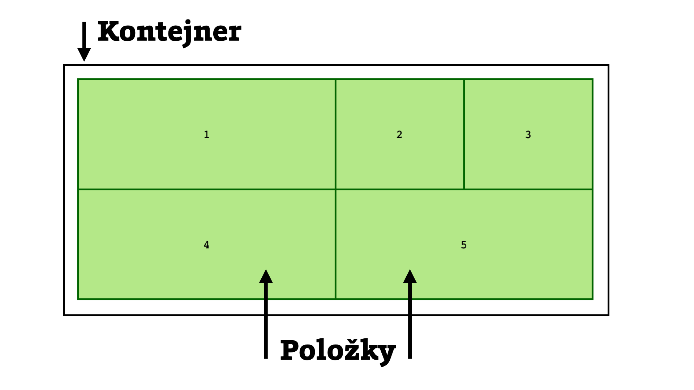
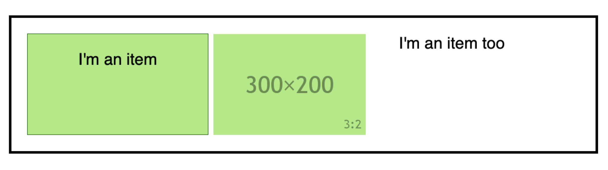
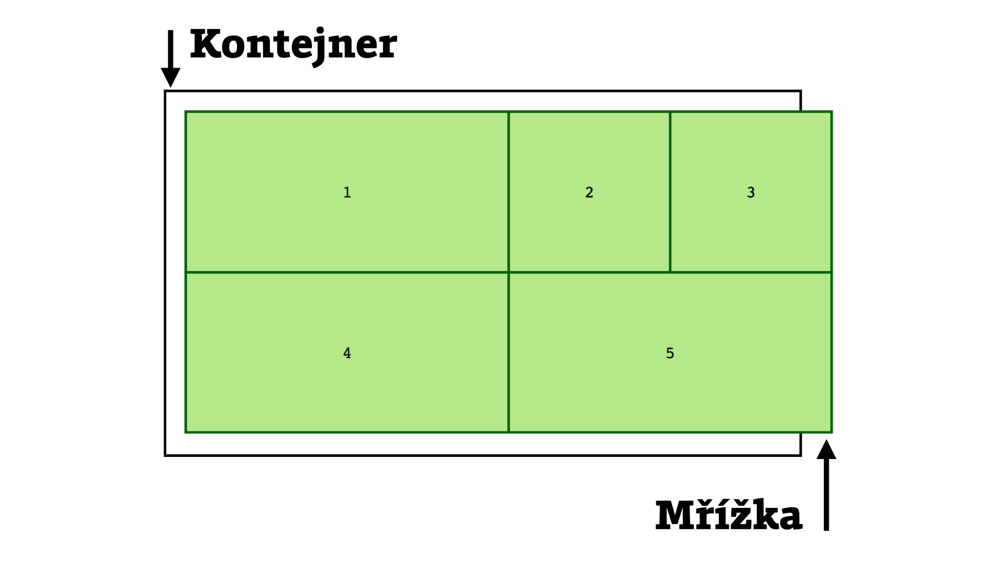
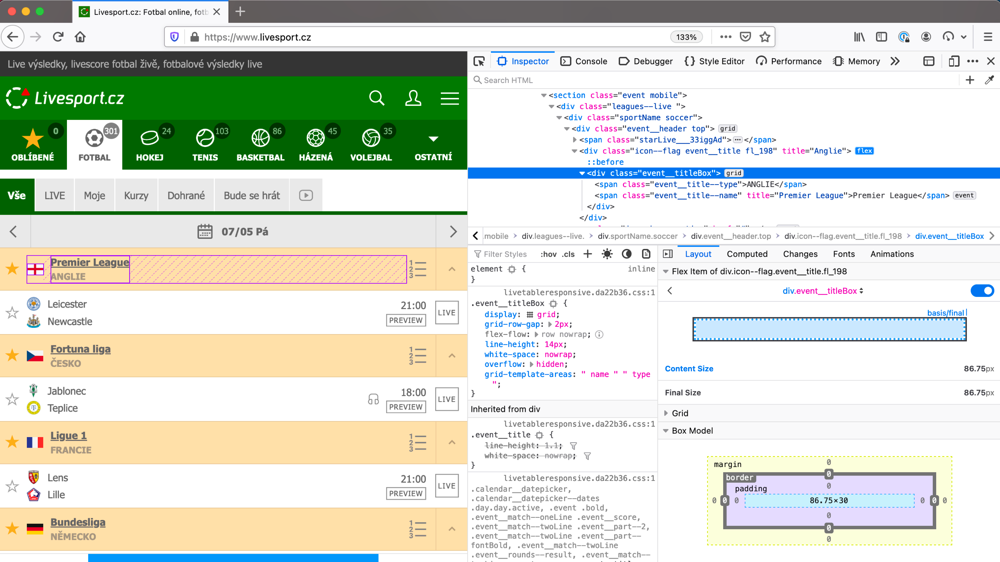
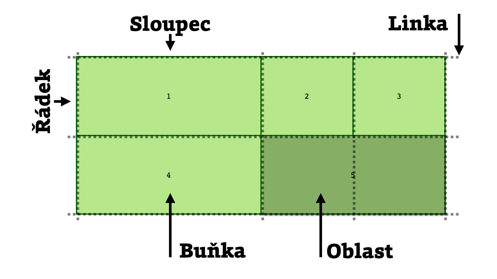
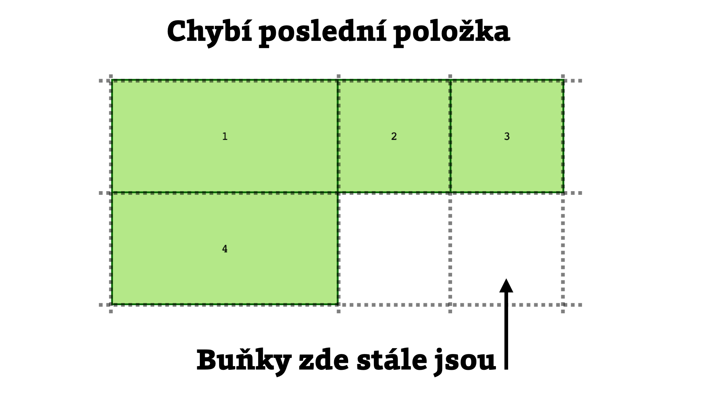
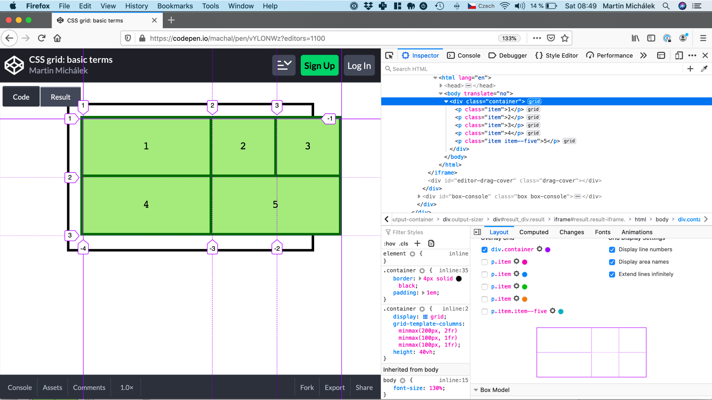

# Pojmy v CSS gridu – rozborka

V gridu se to hemží pojmy, které si musíme vyjasnit. Jsou totiž důležité pro pochopení tohoto typu rozvržení a náchylné na záměnu, což nám může způsobit nejednu malou katastrofu.

Vysvětlíme si to na příkladu. Vezměme, že máme toto HTML:

```html
<div class="container">
  <p class="item">1</p>
  <p class="item">2</p>
  <p class="item">3</p>
  <p class="item">4</p>
  <p class="item item--five">5</p>
</div>
```

Prozatím nechme stranou speciální nastavení páté položky, k tomu se propracujeme.

Mřížku definujeme jako třísloupcovou, ale řádky necháme na automatice gridu:

```css
.container {
  display: grid;
  grid-template-columns: 2fr 1fr 1fr;
}
```

První sloupec má dvojnásobnou šířku oproti druhému a třetímu. Definujeme to [zlomkovou jednotkou `fr`](css-jednotka-fr.md).

V prohlížeči bude naše mřížka vypadat následovně:

<figure>

<figcaption markdown="1">
*Obrázek: Byl jednou jeden kontejner.*
</figcaption>
</figure>

Na obrázku vidíme jeden kontejner a pět položek mřížky, čímž se dostáváme k našim pojmům. Budu je zde je uvádět česky s anglickým ekvivalentem v závorce, v dalších textech už povětšinou jen česky.

## Kontejner mřížky (grid container) {#kontejner}

Kontejner vytvoříme z jakéhokoliv prvku v HTML prostým deklarováním `display:grid` nebo `display:inline-grid`. 

Vznikne tím *grid formatting context* (formátovací kontext pro mřížku) a začnou platit trochu jiná pravidla než například pro *block formatting context* (blokový formátovací kontext), který by vznikl uvedením `display:block`.

V našem příkladu jsme tedy kontejner mřížky udělali z prvku `<div class="container">`.

Jednou z vlastností formátovacího kontextu mřížky je, že každý z přímých potomků ve stromě DOM bude prohlížečem považován za položku mřížky.

## Položka mřížky (grid item) {#polozka}

Položkou mřížky v ukázce jsou všechny prvky `<p class="item">`.

Položka nemá žádné speciální vlastnosti, kromě toho, že je nesvobodná – prohlížeč se ji totiž snaží vložit do definované mřížky.

Nesbododnou položku ale můžeme emancipovat tím, že i z ní uděláte kontejner (`display:grid`) a ona pak bude omezovat na svobodě své potomky. Pochopili jste mě správně – zanořování více mřížek do sebe je možné.

### Anonymní položky {#anonymni-polozka}

Musíme si tady uvědomit, že položkou je každý DOM uzel, který je přímým potomkem kontejneru mřížky.

Do této kategorie patří také například obrázky nebo takzvané *anonymní uzly*, což jsou textové bloky, potomkové kontejneru, neuzavřené v HTML elementu.

```html
<div class="container">
  <p class="item">I'm an item</p>
    
  I'm an item too
</div>
```

V této ukázce máme tedy rovnou tři položky a nějak si s nimi budeme muset poradit při definování mřížky. Já jsem to tady pojal jednoduše:

```css
.container {
  display: grid;
  grid-template-columns: 1fr 1fr 1fr;
}  
```

Rozdělil jsem plochu, kterou vymezuje kontejner, na tři rovnoměrné části. Na skutečné šířky položek bude mít vliv samotný obsah položek, ale o tom se budeme bavit později.

<figure>

<figcaption markdown="1">
*Obrázek: Obrázek i anonymní textový uzel jsou plnohodnotnými občany definované mřížky.*
</figcaption>
</figure>

Tuto specialitu zmiňuji hlavně proto, abychom se dokázali vyhnout problémům, které to přináší. Obecně ale velmi doporučuji definovat každou položku gridu do samostatného a pojmenovaného HTML prvku. Už jen proto, aby se vám na něj lépe cílilo pomocí CSS selektorů.

CodePen: [cdpn.io/e/ZEQGbgy](https://codepen.io/machal/pen/ZEQGbgy?editors=1100)

Kontejner mřížky je tedy rodičovský prvek, který v HTML definuje, že tady se bude odehrávat formátování CSS Gridem. Položka mřížky je každý jeho přímý potomek, včetně těch anonymních.

Než dojdeme k dalším pojmům, spácháme na naší původní ukázce nepěknou a ošklivou věc. Zmenšíme plochu stránky tak, aby šířka položek přesáhla šířku kontejneru.

Kontejner je teď menší než je samotná mřížka. Po vytečení „položek z kontejneru“ se dostáváme k dalším pojmům.

<figure>

<figcaption markdown="1">
*Obrázek: Tady je vidět rozdíl mezi kontejnerem mřížky a mřížkou samotnou.*
</figcaption>
</figure>

Mimochodem, s původně uvedeným CSS a HTML by to takhle udělat nešlo. Musel jsem styly trochu změnit tak, aby si položky kontejneru zachovávaly nějakou minimální šířku:

```css
.container {
  grid-template-columns:
    minmax(500px, 2fr) minmax(250px, 1fr) minmax(250px, 1fr);
}
```

Je pravděpodobné, že [funkci `minmax()`](css-minmax.md) zatím neznáte. Ona ale dělá přesně to, na co byste ji odhadovali – v našem případě zakazuje zmenšení první položky pod 200 pixelů a druhé a třetí pod 100 pixelů.

CodePen: [cdpn.io/e/qBbjjoj](https://codepen.io/machal/pen/qBbjjoj?editors=1100)

## Mřížka (grid) {#mrizka}

Mřížka je ona neviditelná pravidelná síť, do které umísťujeme náš layout.

Může být stejně velká jako kontejner, ale nemusí. Kontejner je jen jakési „okno“ pro vykreslování mřížky.

Říkám, že je neviditelná, ale takto to být nemusí vždy a všude. Autoři prohlížečů jsou v této oblasti webovým vývojářům velmi nápomocní a tak je možné samotnou mřížku pěkne vizualizovat v DevTools.

<figure>

<figcaption markdown="1">
*Obrázek: Grid v negližé, to je „CSS Grid Inspector“ ve Firefoxu.*
</figcaption>
</figure>

Vizualizace mřížky ve Firefoxu nebo i v Chrome pomůže pochopit, z čeho se váš grid skládá a jak to chápe prohlížeč. Velmi doporučuji to při práci na mřížkách používat.

<div class="f-6">

Jak na to?

- Ve Firefoxu: Otevřeme vývojářské nástroje (Ctrl/Cmd + Shift + I) > Záložka Inspector > ve stromě DOM vyznačíme prvek nesoucí kontejner gridu a klikneme na tlačítko Grid > Napravo otevřeme panel Layout.
- V Chrome: Otevřeme vývojářské nástroje (Ctrl/Cmd + Shift + I) > Záložka Elements > ve stromě DOM vyznačíme prvek nesoucí kontejner gridu.

</div>

Když už tedy víme, co je mřížka a umíte ji vizualizovat, pojďme si říct, z jakých stavebních prvků se přesně ta naše mřížka skládá.

<figure>

<figcaption markdown="1">
*Obrázek: Mřížka, linka, oblast, řádek, sloupec.*
</figcaption>
</figure>

## Linka mřížky (grid line) {#linka}

Základní prvek rozvržení mřížky. Čára, která mřížku dělí na řádky, sloupce a pak jednotlivé buňky.

Jak je patrné z obrázku výše, linky mají svá čísla. Pozor, začíná se vždy od `1`, nikoliv od nuly.

Při definici mřížky, například [vlastnostmi `grid-template-rows/columns`](css-grid-template-rows-columns.md) je možné si linky pojmenovat:

```css
.container {
  display: grid;
  grid-template-columns: [first] 2fr [second] 1fr [end];
}
```

Uvedený zápis zařídí následující:

* Pojmenuje vodorovné linky jako `first`, `second` a `end`.
* Mezi linkami definuje dva sloupce, první je `2fr` široký a druhý `1fr`.

Dostali jsme se díky tomu k dalšímu pojmu – sloupec mřížky. Než se si jej rozebereme, musíme se seznámit s jiným pojmem – stopa mřížky.

## Stopa mřížky (grid track) {#stopa}

Stopa je prostor, který je definovaný dvěma linkami. Vede přitom od začátku mřížky k jejímu konci. Je to asi vidět na obrázku výše.

Jde jen o obecný název pro řádek (vodorovnou stopu) nebo sloupec (svislou stopu).

## Řádek, sloupec mřížky (grid row, grid column) {#radek-sloupec}

Vodorovné a svislé stopy mřížky jsou označovány jako řádky a sloupce, přesně jako to už znáte z tabulek.

<div class="f-6">

Poznámka pro pokročilé: Pokud bychom chtěli být přesní, měli bychom uvést ještě pojem „osa mřížky“, což je stejně jako v geometrii přímka, jež určuje směry. V případě CSS Gridu jsou ty směry naštěstí jen dva.

V pojmologii CSS Gridu se nemluví o vodorovné a svislé ose, ale *blokové ose* (block axis) a *inline ose* (inline axis). Proč proboha? Je to kvůli tomu, že CSS musí obsloužit nejen jazyky se zápisem vodorovným (jako je ten náš), tak zápisem svislým. Pak se označení os prohodí, ale výhodou je, že ve směru psaní vždy zůstává bloková osa. Tím vás ale opravdu v textu už nechci více zatěžovat.

</div>

## Buňka mřížky (grid cell) {#bunka}

Buňka je prostor vymezený čtyřmi linkami mřížky, který už není možné dále dělit dalšími linkami. Je to nejmenší prostorová jednotka mřížky, odpovídající buňce tabulky.

Pozor, buňka mřížky zároveň není položkou mřížky. Mřížka má vždy obdélníkový tvar, takže je možné definovat nižší počet položek než má mřížka buněk.

Je to patrné v následujícím příkladu, kde jsme ubrali poslední položku. Mřížka však má stále tři sloupce a dva řádky:

<figure>

<figcaption markdown="1">
*Obrázek: Některé buňky neuvidíte, ale jsou tam pořád, potvory.*
</figcaption>
</figure>

CodePen: [cdpn.io/e/NWxqNYB](https://codepen.io/machal/pen/NWxqNYB?editors=1100)

Je dobré si uvědomit, že právě proto nejde buňku mřížky nijak zacílit pomocí CSS. Je to jen jakási interní stavební jednotka mřížky.

Abychom mohli buňku ovlivnit z CSS, musíme z ní udělat oblast.

## Oblast mřížky (grid area) {#oblast}

Buňka je prostor vymezený čtyřmi linkami mřížky, který ale může být možné dále dělit dalšími linkami. Oblast se tedy skládá z jedné nebo více buňek mřížky.

V naší ukázce jsme pátou položku ručně umístili na místo páté a šesté buňky mřížky:

```css
.item--five {
  grid-column: 2 / 4;
  grid-row: 2 / 3;
}
```

Tento zápis přesně říká o umístění oblasti následující:

- Svisle ji umísti mezi druhou a čtvrtou linku mřížky `grid-column: 2 / 4`, takže na místo druhého a třetího sloupce.
- Vodorovně ji umísti mezi druhou a třetí linku mřížky `grid-row: 2 / 3`, takže do druhého řádku.

CodePen: [cdpn.io/e/NWxqNYB](https://codepen.io/machal/pen/NWxqNYB?editors=1100)

## Mezery mezi buňkami (gap, gutter) {#gutter}

Jde o prostor mezi buňkami buňky, pro jehož definici se používá [vlastnost `gap`](css-gap.md):

```css
.container {
  display: grid;
  gap: 10px;
}
```

„Gutter“ by se měl asi přeložit jako „žlab“, ale v kontextu webdesignu by to bylo dost neobvyklé. Slovo „gutter“ se v hovorové *webařštině* vcelku běžně používá, takže si s ním občas jako se synonymem vystačíme.

Pojďme si desetipixelový „gutter“ nadefinovat v našem příkladu a podívat se, jak to bude vypadat v prohlížeči.

<figure>

<figcaption markdown="1">
*Obrázek: Obrázek z Firefoxu: Ale to je nemilé, linka mřížky už není jen linka.*
</figcaption>
</figure>

Jak je vidět z obrázku, z linek mřížky se staly obdélníky. Nikoliv úsečky, ale linkové sloupce a řádky, které mají svůj začátek i konec.

Ano, vlastnosti `gap` určuje šířku linek. Pokud ji nedefinujeme, jde o neviditelné úsečky tak jako tomu bylo v předchozích příkladech.

CodePen: [cdpn.io/e/vYLONWz](https://codepen.io/machal/pen/vYLONWz?editors=1100)

A to je vše, co jsem vám chtěl sdělit o stavebních prvcích v CSS Gridu.
