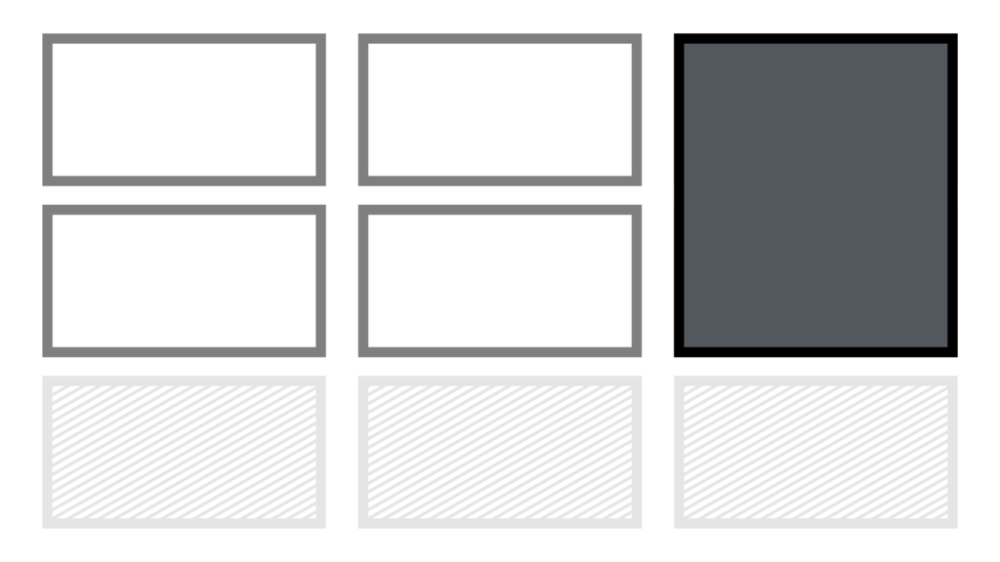
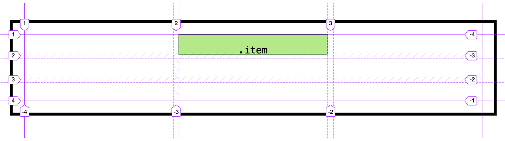

# Vlastnosti grid-column a grid-row

V textu se zaměříme na vlastnosti `grid-column` a `grid-row`, které slouží k umísťování položek v definované mřížce.

<div class="connected" markdown="1">



<div class="web-only" markdown="1">

Vlastnosti `grid-column` a `grid-row` jsou součástí specifikace [CSS gridu](css-grid.md).

</div>

<div class="ebook-only" markdown="1">

→ [vrdl.cz/p/css-grid-row-column](https://www.vzhurudolu.cz/prirucka/css-grid-row-column)

</div>

</div>

Ve skutečnosti se jedná o zkratky pro vlastnosti `grid-column-start`, `grid-column-end` a `grid-row-start`, `grid-row-end`.

Mě však připadá praktičtější používání zkratek, takže se zaměříme na ně:

```css
grid-row: <grid-row-start> / <grid-row-end>;
grid-column: <grid-column-start> / <grid-column-end>;
```

## Možné hodnoty {#hodnoty}

<div class="rwd-scrollable prop-table f-6"  markdown="1">

| Možnost                       | Ukázka hodnoty             |
|-------------------------------|----------------------------|
| Čísla linek                    | `1 / 2`                    |
| Jména linek                    | `first-line / second-line` |
| Rozsah                        | `1 / span 2`               |
| Jedno číslo                   | `3`                        |
| Záporná čísla                 | `-1 / -3`                  |
| Automatické umístění          | `auto`                     |

</div>

### Čísla linek {#cisla}

Tady je to jednoduché. Potřebujete dvě hodnoty – pro začátek a konec pozice v mřížce.

Řekněme, že máme tuto mřížku o 3 × 3 buňkách:

```css
.container {
  display: grid;
  gap: 10px;
  grid-template-columns: 1fr 1fr 1fr;
  grid-template-rows: 2rem 2rem 2rem;
}
```

Pokud bychom položku chtěli umístit do druhého sloupce a přes druhý a třetí řádek, zapíšeme to následovně:

```css
.item {
  grid-column: 2 / 3;
  grid-row: 2 / 4;  
}
```

Je to totéž, jako bychom napsali:

```css
.item {
  grid-column-start: 2;
  grid-column-end: 3;
  grid-row-start: 2;
  grid-row-end: 4;
}
```

Všimněte si, že řádky končíme na čísle 4, i když je máme jen tři. Je to dobrá připomínka toho, že se zde neodkazujeme na čísla řádků či sloupců, ale na čísla linek, které grid definují.

<p></p>

CodePen: [cdpn.io/e/YmZZVB](https://codepen.io/machal/pen/YmZZVB?editors=1100)

### Jména linek {#jmena}

Podobná situace je u pojmenovaných linek. Máme stejný příklad jako výše uvedeným, jen s pojmenovanými linkami:

```css
.container {
  display: grid;
  gap: 10px;
  grid-template-columns:
    [first-col] 1fr [second-col] 1fr [third-col] 1fr [end];
  grid-template-rows:
    [first-row] 2rem [second-row] 2rem [third-row] 2rem [end];
}
```

Umísťujeme pak elegantně a o fous více čitelně:

```css
.item {
  grid-column: second-col / third-col;
  grid-row: second-row / end;
}  
```

Výsledek však pochopitelně bude stejný.

CodePen: [cdpn.io/e/GVWrOB](https://codepen.io/machal/pen/GVWrOB?editors=1100)

### Rozsah {#span}

Klíčové slovo `span` slouží ke specifikování *rozsahu*, který v mřížce daná buňka zabírá.

<!-- AdSnippet -->

Podívejme se teď na tentýž příklad jako v první ukázce, jen si jeho pozici definujme pomocí rozsahu:

```css
.item {
  grid-column: 2 / span 1;
  grid-row: 2 / span 2;
}
```

Vysvětlíme:

- Zápis `span 1` u `grid-column` znamená „zabírá jeden sloupec“. Tady je to zbytečné, fungovalo by to i bez tého hodnoty.
- Zápis `span 1` u `grid-row` už je zajímavější. Říkáme tím, že má zabrat dva řádky buněk mřížky. Může to tedy být čitelnější než zápis `grid-row: 2 / 4`.

CodePen: [cdpn.io/e/LwWxWy](https://codepen.io/machal/pen/LwWxWy?editors=1100)

### Jedno číslo {#jedno}

Občas je možné vidět zápis `grid-row` a `grid-column` jen s jedním číslem:

```css
.item {
  grid-column: 2;
}  
```

Funguje to tak, jak asi očekáváte. Prohlížeče automaticky umísťují na jednu buňku mřížky (`span 1`), takže jim stačí uvést pozici začátku vykreslování.

CodePen: [cdpn.io/e/Qeppxd](https://codepen.io/machal/pen/Qeppxd?editors=1100)

### Záporná čísla {#zaporna}

Záporná čísla ve vlastnostech `grid-row` a `grid-column` počítají umístění zprava nebo zezdola. Pokud bychom tedy chtěli stejnou svislou pozici položky jako v našem příkladu, jen definovanou zápornými čísly, zapsali bychom ji takto:

```css
.item {
  grid-column: 2 / 3;
  grid-row: -1 / -3;
}
```

Kódem `grid-row: -1 / -3` říkáme: Chci umístění od první linky mřížky zezdola až po třetí linku mřížky v tomtéž směru.

CodePen: [cdpn.io/e/VoppWg](https://codepen.io/machal/pen/VoppWg?editors=1100)

### Automatické umístění {#auto}

Hodnota `auto` vypíná ruční umísťování a nechá pracovat algoritmus „autoplacementu“, postupného automatického umístění do existujících buněk rozvržení.

Vezměme stejný příklad:

```css
.item {
  grid-column: 2 / 3;
  grid-row: auto;
}
```

Prvek bude dále umístění do druhého sloupce, ale v tomto případě do prvního řádku. Algoritmnus automatického umísťování zde vždy začíná a dosud nevykresloval žádné jiné prvky mřížky, které by pozici mohly posunout.

CodePen: [cdpn.io/e/YmZZVB](https://codepen.io/machal/pen/YmZZVB?editors=1100)

## Podpora

Moderní prohlížeče jsou s těmito vlastnostmi úplně v pohodě. Horší je to samozřejmě v MSIE, ale to nevadí, protože podobné vlastnosti tam existují. [Autoprefixer](css-grid-msie.md) nám pomůže a např. `grid-row` se přeloží do `-ms-grid-row`.

<!-- AdSnippet -->
