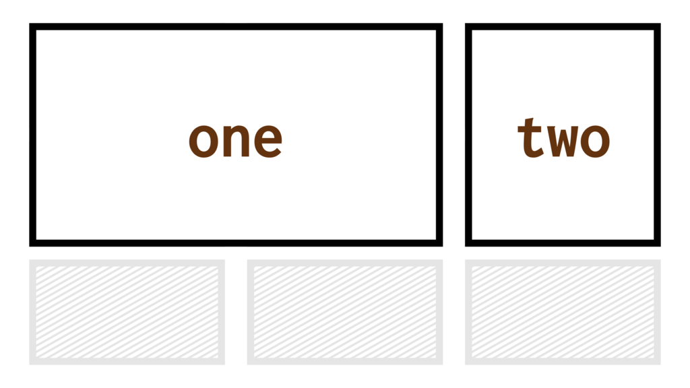
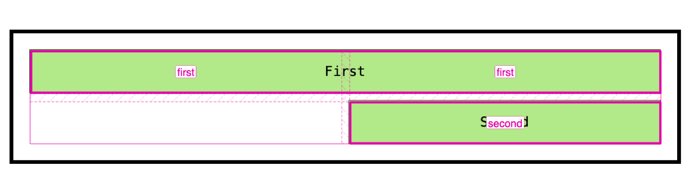
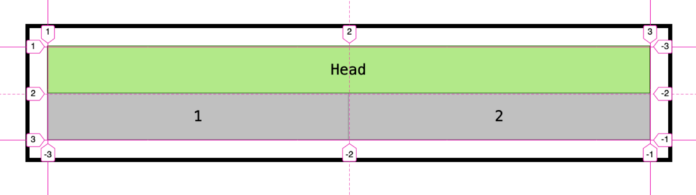
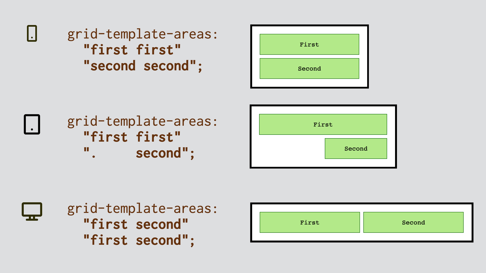

# Vlastnost grid-template-areas: Pojmenovávaní oblastí gridu

Vlastnost `grid-template-areas` slouží k pojmenovávání obdélníkových oblastí definovaných CSS gridem.

<div class="connected" markdown="1">



<div class="web-only" markdown="1">

Vlastnost `grid-template-areas` je součástí [CSS gridu](css-grid.md).

</div>

<div class="ebook-only" markdown="1">

→ [vrdl.cz/p/css-grid-template-areas](https://www.vzhurudolu.cz/prirucka/css-grid-template-areas)

</div>

</div>

`grid-template-areas` vytváří oblasti, které jsou pak použitelné ve vlastnostech jako `grid-area` a dalších, sloužících k umísťování elementů do gridu.

V příkladu na obrázku pojmenováváme oblasti následovně:

```css
.container {
  display: grid;
  grid-template-columns: 1fr 1fr;
  grid-template-rows: auto auto;
  gap: 10px;  
  grid-template-areas:
    "first first"
    ".     second";
}

.first {
  grid-area: first;
}

.second {
  grid-area: second;
}
```

<figure>

<figcaption markdown="1">
*Zeleně (světlou barvou) jsou vyznačené položky, růžově (výraznější překryvnou barvou) pak oblasti mřížky vyznačené ve Firefox DevTools.*
</figcaption>
</figure>

Vysvětleme výše uvedený kód:

- Grid je definovaný jako dvousloupcový (`grid-template-columns: 1fr 1fr`) a dvouřádkový (`grid-template-rows: auto auto`).
- V `grid-template-areas` je pak seznam řetězců, které označují oblasti. To je to, oč zde běží.
- První řádek hodnot (`"first first"`) říká, že na první dvě buňky layoutu patří do oblasti `first`.
- Tečka (`.`) uvádí prázdnou buňku, kde se nic zobrazovat nemá.
- Elementy `.first` a `.second` je pak potřeba ručně umístit do vyhrazených oblastí mřížky pomocí vlastnosti `grid-area`.

CodePen: [cdpn.io/e/bXeWjb](https://codepen.io/machal/pen/bXeWjb?editors=1100)

Následuje pár poznámek k vlastnosti `grid-template-areas`, které mě zaujaly při čtení specifikace.

## Definování mřížky oblastmi {#definovani-gridu}

Pojmenovanými oblastmi je možné definovat i samotný grid. V některých případech tedy nemusíte potřebovat vlastnosti [`grid-template-rows` a `grid-template-columns`](css-grid-template-rows-columns.md).

Tento kód vytvoří stejnou mřížku jako ve výše uvedeném příkladu:

```css
.container {
  display: grid;
  gap: 10px;
  grid-template-areas:
    "first first"
    ".     second";
}
```

CodePen: [cdpn.io/e/ymJXaX](https://codepen.io/machal/pen/ymJXaX?editors=1100)

## Implicitně vytvořené oblasti a linky {#implicitne}

Pojmenované oblasti souvisí s pojmenovanými linkami, které znáte z vlastnosti [`grid-template-rows`/`-columns`](css-grid-template-rows-columns.md).

<!-- AdSnippet -->

Například definování oblasti pojmenované `head`, automaticky vytvoří dvě linky – `head-start` a `head-end`.

A víte co je ještě lepší? Definováním linek `head-start` a `head-end` ve vlastnostech [grid-template-rows a grid-template-columns](css-grid-template-rows-columns.md) vytvoříte oblast `head`.

Vezměme tento grid definovaný jako dva sloupce a dva řádky:

```css
.container {
  display: grid;
  grid-template-columns: [head-start] 50% 50% [head-end];
  grid-template-rows: [head-start] auto [head-end] auto;  
}
```

Jak je vidět, pomocí `head-start` a `head-end` se pokoušíme na prvním řádku definovat oblast `head` bez použití `grid-template-areas`.

HTML je následující:

```html
<div class="container">
  <p class="item">1</p>
  <p class="item">2</p>
  <p class="item item--head">Head</p>
</div>
```

Pak stačí pomocí [vlastnosti `grid-area`](css-grid-area.md) prvek `.item-head` umístit:

```css
.item--head {
  grid-area: head;
}
```

<figure>

<figcaption markdown="1">
*Tady to je. Oblast definovaná jen pomocí linek. Takhle to ukazuje Firefox v DevTools.*
</figcaption>
</figure>

Na definování oblastí s pomocí linek jsou i DevTools prohlížečů krátké a nejenže ve vrstvě neukáží název oblasti (head), ale ani názvy linek (head-start, head-end). Nevadí. Hlavně, že správně funguje umístění do definované oblasti.

CodePen: [cdpn.io/e/qBjrLwe](https://codepen.io/machal/pen/qBjrLwe?editors=1100)

## Výhody definování oblastí mřížky {#vyhody}

Oblasti gridu samozřejmě není nutné definovat pokaždé. Hodit se ale budou pro komplexnější layouty, které zároveň potřebujeme definovat a spravovat ručně. Typickým příkladem jsou rozvržení celostránkové.

<!-- AdSnippet -->

Vlastnost `grid-template-areas` je ale užitečná ještě ve dvou směrech. Za prvé zlidšťuje zápis layoutu. Je totiž lepší mluvit o oblasti `heading` než o „oblasti mezi první a osmou buňkou prvního řádku gridu“. Za druhé umožňuje pěkné kejkle s Media Queries.

## Využití Media Queries {#media-queries}

V dalším demíčku si pojďme ukázat věc, která se mi na `grid-template-areas` velmi líbí – kombinaci s Media Queries.

Je to jednoduché – oblasti je prostě možné různě přehazovat v rámci definovaného gridu.

<figure>

<figcaption markdown="1">
*V kombinaci s Media Queries se z definovaných oblastí pomocí `grid-template-areas` stává fantastický pomocník.*
</figcaption>
</figure>

V tomto příkladu máme tyto responzivní deklarace:

```css
.container {
  grid-template-areas: 
    "first first"
    "second second";
}

@media screen and (min-width: 25em) {
  .container {
    grid-template-areas:
      "first first"
      ".     second";
  }
}

@media screen and (min-width: 37.5em) {
  .container {
    grid-template-areas:
      "first second"
      "first second";
  }
}
```

CodePen: [cdpn.io/e/jgrmoq](https://codepen.io/machal/pen/jgrmoq?editors=1100)

## Podpora v prohlížečích {#podpora}

Opět je zde jediná potíž. Internet Explorer 11, který `grid-template-areas` neumí. Už ale také víte, že [díky Autoprefixeru](css-grid-msie.md) to tak problematické být nemusí.

Moderní prohlížeče nemají s vlastností `grid-template-areas` žádný problém.

<!-- AdSnippet -->
