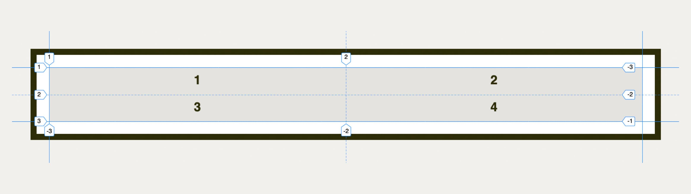
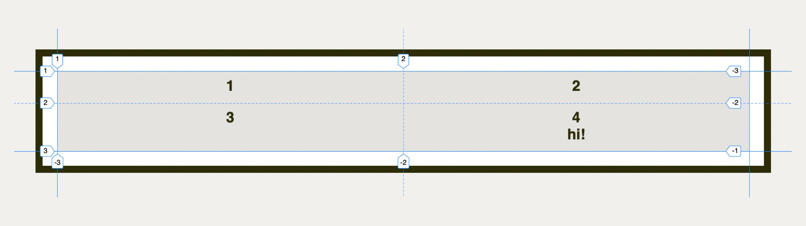
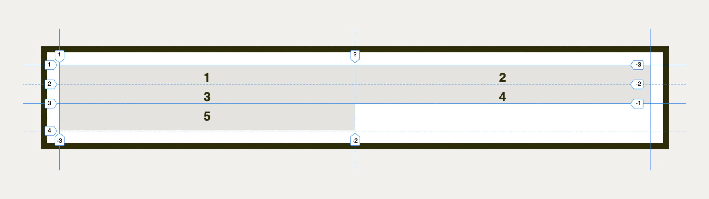
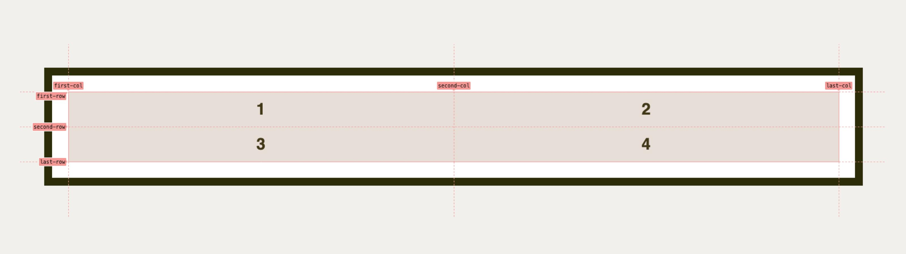

# Vlastnosti grid-template-rows a grid-template-columns: definice explicitního gridu

Vlastnosti `grid-template-rows` a `grid-template-columns` slouží k nastavení explicitní (tedy námi výslovně definované) mřížky v CSS gridu.

<div class="book-index" data-book-index="grid-template-rows"></div>
<div class="book-index" data-book-index="grid-template-columns"></div>

<div class="connected" markdown="1">


<div class="web-only" markdown="1">

Vlastnosti `grid-template-rows` a `grid-template-columns` jsou součástí [CSS gridu](css-grid.md).

</div>

<div class="ebook-only" markdown="1">

→ [vrdl.in/cssgtrc](https://www.vzhurudolu.cz/prirucka/css-grid-template-rows-columns)

</div>

</div>

## Jednoduchý příklad

Vezměme toto HTML:

```html
<div class="container">
  <p class="column">1</p>
  <p class="column">2</p>
  <p class="column">3</p>
  <p class="column">4</p>
</div>
```

Pokud bychom chtěli zajistit rozvržení do mřížky 4 × 4, použijeme následující CSS kód:

```css
.container {
  display: grid;
  grid-template-columns: 50% 50%;
  grid-template-rows: auto auto;
}
```

Vysvětleme:

- `display:grid` – „zapíná“ mřížkové zobrazení.
- `grid-template-columns:50% 50%` – definuje dva sloupečky mřížky. Každý bude zabírat polovinu šířky rodičovského kontejneru.
- `grid-template-rows:auto auto` – definuje dva řádky mřížky. Hodnota `auto` říká, že se výška každého z nich počítá automaticky podle výšky obsahu.

<p></p>

CodePen: [vrdl.in/xl4yh](https://codepen.io/machal/pen/jgWrmz?editors=1100)

Poznámka k hodnotě `auto` v definici řádků: Grid sjednocuje výšky položek v každém z nich, takže když změníme výšku jedné položky, její kolegyně se přizpůsobí.

```html
<div class="container">
  <p class="column">1</p>
  <p class="column">2</p>
  <p class="column">3</p>
  <p class="column">4<br>hi!</p>
</div>
```

<p></p>

CodePen: [vrdl.in/b18et](https://codepen.io/machal/pen/mNVEZB?editors=1100)

### Co když je položek více, než definuje grid? (Implicitní vs. explicitní mřížka) {#explicitni-implicitni}

<div class="book-index" data-book-index="Explicitní mřížka"></div>

Teď se stane nepěkná věc – zákeřný frontendový kodér do HTML přidá pátou položku:

```html
<div class="container">
  <p class="column">1</p>
  <p class="column">2</p>
  <p class="column">3</p>
  <p class="column">4</p>
  <p class="column">5</p>
</div>
```

Jak bude vypadat pátá položka zobrazená v gridu 2 × 2? V tomto případě stejně jako předchozí čtyři.

Algoritmus gridu jí přidělí 50% šířku a automatickou výšku.

<!-- AdSnippet -->

Jiná by byla situace, pokud bychom změnili definici výšky položek gridu:

```css
.container {
  grid-template-rows: 2rem 2rem;  
}
```

Pátá položka zde pak nemá definovanou výšku a musí použít nějakou výchozí, v tomto případě opět `auto`.

<p></p>

CodePen: [vrdl.in/xhecq](https://codepen.io/machal/pen/qeZqbV?editors=1100)

Rozměry položek vložených nad rámec počtu položek definovaných explicitním gridem, tedy vlastnostmi `grid-template-rows` a `grid-template-columns`, je možné určit vlastnostmi [`grid-auto-columns` a `grid-auto-rows`](css-grid-auto-rows-columns.md), které definují implicitní grid.

<div class="pbi-avoid" markdown="1">

## Další možnosti zápisu gridu {#hodnoty}

Hodnoty v následující tabulce je možné aplikovat jak na vlastnost `grid-template-columns`, tak na její sestru `grid-template-rows`, tedy na sloupce i řádky layoutu.

<div class="rwd-scrollable f-6"  markdown="1">

| **Možnost**                        | **Ukázka hodnoty**                       |
|------------------------------------|------------------------------------------|
| Bez explicitního gridu    | `none`                                   |
| Kombinace jednotek    | `150px auto 1fr 1fr`                     |
| Pojmenovávání linek | `[first] 150px [second] 1fr [end]` |
| Opakování            | `repeat(12, 1fr)`                        |
| Masonry                | `masonry`                                |

</div>

</div>
<!-- .pbi-avoid -->

Další řadu možností nabízí [funkce `minmax()`](css-minmax.md) a související hodnoty pro nastavení šířky podle obsahu, jako je `min-content`, `max-content` nebo `fit-content`.

Pojďme se ale podívat na možnosti hodnot z tabulky.

### Bez explicitního gridu {#none}

Hodnota `none` tvoří výchozí stav:

```css
.container {
  grid-template-columns: none;
}
```

Občas se ale může hodit použít ji i ve vlastním kódu, například když rušíme explicitní grid. Pokud to provedeme, platí pravidla pro implicitní, tedy nepřímo vyjádřenou mřížku – `grid-auto-columns` a `grid-auto-rows`.

### Kombinace jednotek a jednotka fr {#jednotky}

<div class="book-index" data-book-index="fr (jednotka)"></div>

V gridu je možné pro definici řádků a sloupečků používat všechny možné [jednotky](jednotky.md), které už pro rozvržení v CSS používáte.

Je tady ale ještě [jednotka `fr`](css-jednotka-fr.md). Jde o *fraction unit* a dá se o ní mluvit jako o podílu na zbytku.

Zápis může vypadat například takto:

```css
.container {
  grid-template-columns: 150px 1fr 1fr 150px;
}
```

CodePen: [vrdl.in/5vas0](https://codepen.io/machal/pen/VgKaMB?editors=1100)

`1fr` je v chování velice podobné číslu `1`, které používáte ve [vlastnosti `flex`](css-flex.md) u flexboxu.

### Pojmenovávání linek {#pojmenovane}

<div class="book-index" data-book-index="Pojmenované linky"></div>

Pojmenovávání linek se může hodit pro použití ve vlastnostech, které definují umístění prvků v gridu, jako je [`grid-column`, `grid-row`](css-grid-row-column.md) nebo [`grid-area`](css-grid-area.md).

Každý sloupec nebo řádka je v gridu definovaná dvěma linkami.

Sloupce a řádky mřížky je možné si představit jako sloupce a řádky v tabulce. Linky jsou rámečky kolem buněk tabulky.

```css
.container {
  display: grid;
  grid-template-columns: [first-col] 50% [second-col] 50% [last-col];
  grid-template-rows: [first-row] auto [second-row] auto [last-row];  
}
```

V ukázce je tedy první položka gridu umístěná vodorovně na pozici mezi `first-col` a `second-col`. Svisle pak mezi `first-row` a `second-row`.

<p></p>

CodePen: [vrdl.in/3sknv](https://codepen.io/machal/pen/wVGgaW?editors=1100)

### Opakování {#opakovani}

<div class="book-index" data-book-index="repeat()"></div>

U složitějších mřížek by bylo nepříjemné zapisovat řadu stejných hodnot do řádky. Vezměme například dvanáctisloupcovou mřížku:

```css
.container {
  display: grid;
  grid-template-columns: 1fr 1fr 1fr 1fr 1fr 1fr;
}
```

Proto je tady [funkce `repeat()`](css-repeat.md), která opakování zamezuje:

```css
.container {
  display: grid;
  grid-template-columns: repeat(6, 1fr);
}
```

Zápisem `repeat(6, 1fr)` říkáme: „Napiš šestkrát po sobě hodnotu `1fr`.“

## Masonry, zděné rozvržení {#masonry}

<div class="book-index" data-book-index="Masonry"></div>

Hodnota `masonry` je specifická, protože by v budoucnu měla zařídit nativní [masonry (nebo zděný) layout](css-masonry.md).

<figure class="web-only">

<figcaption markdown="1">
*Nativně vykreslený masonry layout. Zdroj: [Rachel Andrew](https://codepen.io/rachelandrew/pen/wvWmZWB).*
</figcaption>
</figure>

Toto ale na konci února 2022 zatím podporuje jen prohlížeč Firefox v případě nastavení volby uživatelem.

## Podpora v prohlížečích {#podpora}

Internet Explorer 11 vlastnosti `grid-template-rows`/`-columns` nepodporuje. Namísto `grid-template-columns` používá vlastnost `-ms-grid-columns` a místo `grid-template-rows` pak `-ms-grid-rows`. Toto se dá naštěstí obejít pomocí [nástroje Autoprefixer](css-grid-msie.md).

Explorer, tento stařičký, ale občas ještě [používaný prohlížeč](msie.md), také nezvládá automatické umísťování položek do mřížky. I to je možné alespoň částečně vyřešit pomocí Autoprefixeru.

V moderních prohlížečích nebudete mít s podporou problém.

<!-- AdSnippet -->
