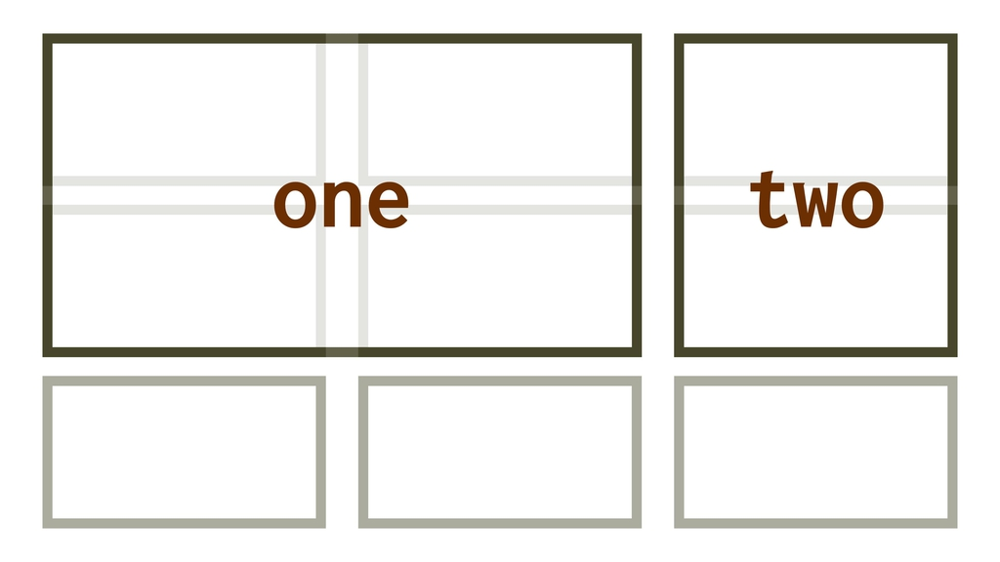

# Vlastnost grid-template

Vlastnost `grid-template` slouží k definování mřížky v CSS gridu.

Jde o zkratku (shorthand) pro vlastnosti [`grid-template-rows`, `grid-template-columns`](css-grid-template-rows-columns.md) a také [`grid-template-areas`](css-grid-template-areas.md).

<div class="connected" markdown="1">



<div class="web-only" markdown="1">

Vlastnost `grid-template` je součástí [CSS gridu](css-grid.md).

</div>

<div class="ebook-only" markdown="1">

→ [vrdl.cz/p/css-grid-template](https://www.vzhurudolu.cz/prirucka/css-grid-template)

</div>

</div>

## Definování sloupečků a řádků {#cols-rows}

V prvním demu si ukážeme `grid-template` jako zkratku pro vlastnosti `grid-template-rows` a `grid-template-columns`:

```css
.container {
  grid-template: auto auto / 2fr 1fr;
}  
```

To odpovídá zápisu:

```css
.container {
  grid-template-rows: auto auto;
  grid-template-columns: 2fr 1fr;
  grid-template-areas: none;
}
```

V živé ukázce si můžete vyzkoušet změnit některé hodnoty.

CodePen: [cdpn.io/e/YmWxzw](https://codepen.io/machal/pen/YmWxzw?editors=1100)

## Sloupečky, řádky a pojmenované stopy {#cols-rows-stopy}

V hranatých závorkách můžeme při zapisování hodnoty `grid-template` uvést také pojmenované řádky a sloupce.

<!-- AdSnippet -->

V kódu to vypadá následovně:

```css
.container {
  grid-template:
    [row-1] auto [row-2] auto
    / 
    [col-1] 2fr [col-2] 1fr;
```

To odpovídá zápisu:

```css
.container {
  grid-template-rows: [row-1] auto [row-2] auto;
  grid-template-columns: [col-1] 2fr [col-2] 1fr;  
  grid-template-areas: none;
}
```

Opět je k dispozici živá ukázka.

CodePen: [cdpn.io/e/dxXzpG](https://codepen.io/machal/pen/dxXzpG?editors=1100)

## Sloupečky, řádky a pojmenované oblasti {#cols-rows-oblasti}

V poslední ukázce uvidíte, že je také možné definovat rozměry gridu spolu s pojmenováním oblastí:

```css
.container {
  display: grid;
  grid-template:
    "heading heading" auto
    "one two" auto
    /
    2fr 1fr;
```

Je to už docela složité. Definují se nejprve řádky – jejich jména a výšky – a pak za lomítkem šířky sloupečků. Odpovídá to následujícímu:

```css
.container {
  grid-template-rows: auto auto;
  grid-template-columns: 2fr 1fr;  
  grid-template-areas:
    "heading heading"
    "one two";
}
```

CodePen: [cdpn.io/e/JgKyxK](https://codepen.io/machal/pen/JgKyxK?editors=1100)

## Co je dobré vědět? {#dobre-vedet}

Je zde pár kulišáren, na které bych vás rád upozornil:

- Všimněte si, že `grid-template` nastavuje `grid-template-areas: none`, takže resetuje i případné dříve nastavené oblasti.
- [Funkce `repeat()`](css-repeat.md) zde není povolena, protože se dává přednost vizuálnímu vyjádření mřížky, takzvanému „ASCII artu“.
- Stejnou syntaxi má další zkratka – [vlastnost `grid`](css-grid-zkratka.md), která ovšem navíc umožňuje nastavení rozměrů implicitního gridu (vlastnosti `grid-auto-columns`, `grid-auto-rows`, a `grid-auto-flow`), takže je pravděpodobné, že můžete chtít použít spíše právě ji.

## Podpora v prohlížečích {#podpora}

Internet Exploreru 11 vlastnost nepodporuje. Můžete to zkusit automaticky převádět [díky Autoprefixeru](css-grid-msie.md).

Pokud ale podporu MSIE s využitím Autoprefixeru plánujete, moje doporučení zní: Používejte vlastnost `grid-template`, nikoliv zkratku `grid` a vyhnete se problémům.

Moderní prohlížeče nemají s `grid-template` problém.

<!-- AdSnippet -->
