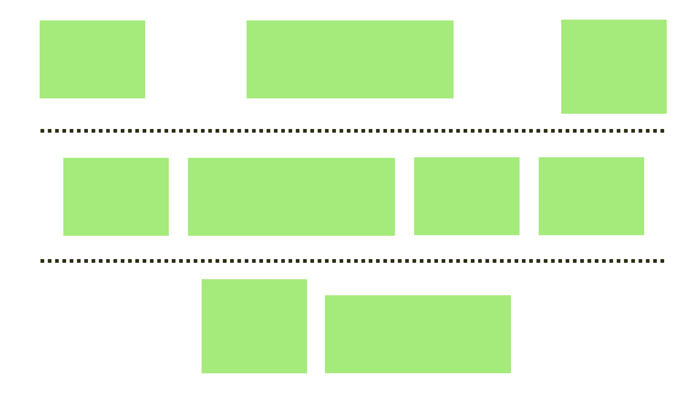
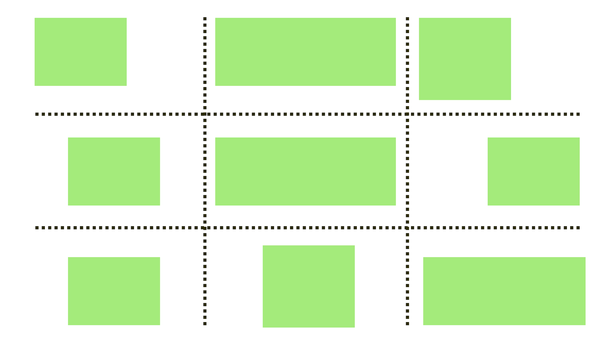
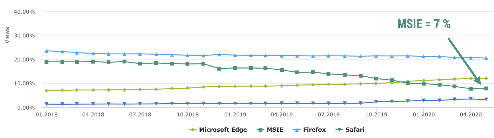

# CSS Grid v kontextu dalších systémů layoutu

„Musíš se teď odnaučit, co tě dřív učili.“ říká mistr Yoda Lukovi Skywalkerovi v páté epizodě kultovních Star Wars.

Neexistuje lepší citace pro začátek textu, který má zkušenější kodérky a kodéry přesvědčit, aby zkusili zapomenout na vše, co dosud o layoutu v CSS věděli a na uvolněné místo si v mysli dosadili CSS Grid – a trochu flexboxu.

Pokud snad s „webděláním“ začínáte – a pojmy jako „tabulkový layout“, `float` nebo Bootstrap vám nic neříkají – pak nezbývá než vám závidět. Tenhle text ani moc číst nemusíte.

## Grid versus „pseudolayout“

Za těch více než dvacet let, co dělám weby, mě bylo dopřáno realizovat rozvržení stránky i jejich komponent opravdu mnoha způsoby.

Z dnešního pohledu mě zní až krutě, že ani jeden z nich pro layout určený nebyl (a že jsem s nimi tedy bojoval zbytečně):

* Rámce `<frame>` sice dělí stránku do menších částí, ale jinak nemají s implementací jejího rozvržení nic společného.
* Tabulky `<table>` jsou určené pro vykreslení tabulkového obsahu. Dělat v nich rozvržení? Strašný *hack* určený dnes už jen expertům na kódování newsletterů.
* Plovoucí prvky (vlastnosti `float` a `clear`) vznikly pro zajištění obtékání elementů textovým obsahem. Layout? Dnes už prosím ne.
* Metoda „inline rozvržení“ (pomocí vlastnosti `display:inline-block`) přišla s možností  vkládat blokové prvky do řádků textů, ale layout stránek či komponent není její účel.
* Techniky využívající pozicování lámou přes koleno vlastnost `position`, která slouží k umístění prvků mimo přirozený proud stránky.
* Layout je možné tvořit i pomocí vlastností `column`, ale ty jsou určené pro automatizaci vícesloupcové sazby textu, nikoliv jiná použití.

Jak vidíme, technik upotřebitelných pro tvorbu layoutu máme v CSS víc než dost. To ale neznamená, že bychom je pro tvorbu rozvržení *měli* používat.

Každá z uvedených metod totiž pravděpodobně vyřeší jen některé z vašich problémů a ještě k tomu do kódu zavede problémy nové.

Paličku na maso je totiž v případě nouze možné využít také k zatloukání hřebíků. Jen si musíte dát pozor na prsty, hřebíky i stěnu, protože ten nástroj vymysleli na úplně jinou práci.

Pokud máte vyřešené problémy s kompatibilitou Gridu, o kterých píšu později, vašim cílem by mělo být na všechny tyto metody prostě zapomenout. V delší časové perspektivě bychom na ně měli zapomenout *všichni* a v *každém* případě.

Máme kladívko, takže paličkou dále už jen naklepávejme maso.

<figure>

<figcaption markdown="1">
*Obrázek: Jak říkaly naše babičky: „Paličkou na maso hřebíky nezatloukej, kladívkem neklepej maso a floaty nedělej layout v CSS“.*
</figcaption>
</figure>

Jedinou další technikou, kterou můžete potřebovat, je flexbox. Pojďme jej teď porovnat s naším milým Gridem.

## Grid versus flexbox

Předně chci zdůraznit, že Grid [flexbox](css-flexbox.md) nenahrazuje. Potřebujete obojí. Naučte se obojí.

Ale nějaké rozdíly zde jsou, podívejme se na ně.

### Jednorozměrný flexbox, vícerozměrný Grid

Grid autoři navrhli pro dvourozměrné layouty – po svislé i vodorovné ose. Flexbox se více hodí na rozvržení jednosměrná, ať už svislá nebo vodorovná.

<figure>

<figcaption markdown="1">
*Obrázek: Flexbox zná jen jeden směr. Víceřádkový layout už pak například nezarovnáte do sloupců.*
</figcaption>
</figure>

Jakmile je váš layout víceřádkový a nevystačíte si s pouhým zalomením bez definice pravidel layoutu druhé řádky, je pravděpodobné, že potřebujete Grid.

<figure>

<figcaption markdown="1">
*Obrázek: Grid je mřížka. Dvojrozměrná mřížka.*
</figcaption>
</figure>

### Flexbox je pro layout z obsahu, Grid více z mřížky

Grid je zaměřený více na „grid in“ layout, kdy se obsah musí vždy přizpůsobit autorsky definované mřížce.

Flexbox je výborný pro „content out“ situace, kdy se layout musí přizpůsobit obsahu a vy nechcete nastavovat parametry layoutu.

Vyplývá to trochu i z jejich podstaty na úrovni kódu:

* Když napíšete `display:flexbox`, potomci se poslušně seskupí do vodorovného rozvržení. Pro definici layoutu použijí své vlastní rozměry.
* Po napsání `display:grid` se nestane vůbec nic, dokud nedefinujete rozvržení pomocí vlastností řady `grid-template`. Tady vládne autor a jeho mřížka.

Ne, že by CSS Grid neuměl layout z obsahu, ale musíte si jej v každém případě nastavit. V případě flexboxu leccos pořeší automatika.

Pokud tedy chcete umístit pár prvků vedle sebe a není nutné jim definovat rozměry, volte flexbox. Pokud položkám flexboxu složitě nastavujete pravidla chování rozměrů, pak asi potřebujete Grid.

### Flexbox je více pro layout komponent, Grid pro layout celé stránky

Tím, že je flexbox jednosměrný, bude se vám častěji hodit na zarovnávání „věcí“ vedle sebe nebo pod sebe. Užijete jej pro záložkové i globální navigace nebo například zarovnání jednořádkových formulářů. Více jej oceníte u menších komponent uvnitř stránky.

Náš milý Grid je obousměrný, takže je vhodné s ním rozvrhnout například složitější formuláře, výpis produktů v kategorii e-shopu nebo celou stránku. Grid je příhodnější pro layout větších celků.

Toto pravidlo samozřejmě neberte dogmaticky. Osobně, když se rozhodnuji, jestli použít Grid nebo flexbox, kladu si otázku:

> Je možné přes rozvržení na některých šířkách okna položit neviditelnou vícerozměrnou mřížku?

Představivost mřížky je zde zásadní. A úplně nejlepší je, když mřížku v podkladech vizualizuje grafička nebo grafik.

### Kompatibilita s Internet Explorerem je silná stránka flexboxu

Flexbox ja takřka plně podporován prohlížeči Internet Explorer verze 10 i 11. Ty už jsou dneska víceméně na odpis, hlavně verze 10. Ale některé weby a webové aplikace mají stále slušnou návštěvnost z IE jedenácté verze. Pak je potřeba zvažovat, zda je možné Grid použít, například s pomocí náhradních řešení, o kterých zde budu také psát.

Grid v těchto prohlížečích podporu má, jenže s velkým „ale“. I s pomocí nástroje Autoprefixer, který pro ně vygeneruje náhradní kód, vám tam budou fungovat spíše jen základní vlastnosti.

Pokud nutně potřebujete obsloužit i uživatele těchto prohlížečů a není možné zajistit fallback k řešení v Gridu, pak může flexbox vaše problémy eliminovat.

<figure>

<figcaption markdown="1">
*Obrázek: Pozor, prudké klesání! Podíl MSIE na českém trhu se setrvale snižuje. V polovině roku 2020 byl kolem sedmi procent. Zdroj: [rankings.cz](http://ranking.gemius.com/cz/ranking/browsers/).*
</figcaption>
</figure>

### Společné vlastnosti

Je dobré si uvědomit, že velkou část vlastností mají CSS Grid s flexboxem společnou nebo podobnou:

* Všechny vlastnosti pro zarovnávání ve svislém a vodorovném směru.
* Flexibilní jednotky (Grid nabízí `fr`, flexbox pak čísla ve vlastnosti `flex-basis`).

Našli bychom toho více. Platí ale, že Grid tyhle vlastnosti pokrývá více ze šířky a více do hloubky a je celkově robustnější. Flexbox je takový menší brácha, specializovaný na jeden typ layoutu.

### Srovnání flexboxu a gridu

Abychom si v tom udělali pořádek i vizuálně, připravil jsem si pro vás tady takovou pěknou tabulku. Berte to tak, že to velmi zjednodušuji:

|   Vlastnost              |   Flexbox   |   Grid   |
|:-------------------------|:-----------:|:--------:|
|   Jednorozměrný layout   |       +     |     +    |
|   Dvojrozměrný layout    |             |     +    |
|   Layout z obsahu        |       +     |     ?    |
|   Layout z mřížky        |             |     +    |
|   Kompatibilita v IE     |       +     |     ?    |

Tabulka netabulka…  osobně vám doporučuji naučit se flexbox i Grid.

## Grid versus CSS frameworky

Vytvořit i poměrně jednoduchý layout nebylo pro kodérky a kodéry léta snadné. Proto začaly vznikat nástroje, které jim to měly usnadňovat. A taky usnadňovaly.

Problémy v kompatibilitě napříč prohlížeči vznikaly i při tvorbě na pohled jednoduchých rozvržení.

### Ranný webdesign: Jak to vlastně dělali sazeči knih a novin?

Někdy mezi roky 2005 až 2010 si začali začali webaři ve velkém všímat typografických principů ze sazby knih, novin a časopisů.

Prvním frameworkem, který jsem v té době pro tyto účely využíval, byl Blueprint CSS. Zavedl mřížku o 24 sloupcích, takže pokud jste chtěli layout rozdělit na dvě poloviny, vypadalo to následovně:

```html
<div class="container">
  <div class="span-12">
    První polovina
  </div>
  <div class="span-12">
    Druhá polovina
  </div>
</div>
```

V té době šlo o zjevení. Dodnes si dobře vybavuji radost z krásných typografických principů, ale také z výrazně rychlejšího psaní kódu, protože jsem nemusel tak často přepínat mezi HTML a CSS.

Následovaly frameworky jako 960 Grid System, YUI Grids, YAML… a v roce 2011 Twitter představil dosud nejkomplexnější knihovnu pro tvorbu uživatelských rozhraní – Bootstrap.

### Éra Bootstrapu

Bootstrap je skvělý. Kromě základních typografických principů a mřížky obsahuje také hotové komponenty pro tvorbu uživatelských rozhraní a dnes už i prostředky pro systematickou tvorbu komponent vlastních, například v podobě „utilit“.

Pro vývojáře, kteří musí tvořit rozhraní a nemají po ruce designéra a často ani frontendového kodéra, představuje Bootstrap (a z něj vycházející frameworky jako Foundation nebo Semantic UI) hotový zázrak. Všechno co potřebují napíší v HTML a framework se nějak postará o zbytek.

<figure>

<figcaption markdown="1">
*Obrázek: Bootstrap je skvělý nástroj. Občas se ale používá pro nesprávné účely.*
</figcaption>
</figure>

Zároveň zde ale vznikl problém s nadužíváním těchto nástrojů. Jako konzultant rychlosti webu se vývojářů často ptám, proč na webech používají Bootstrap. „Pro mřížku“ zní častá odpověď.

*Pro mřížku* tak řada webů stahuje zhruba 25 kilobajtů zbytečného kódu. To nemusí vypadat jako vysoké číslo, ale uvědomme si, že jde o pětadvacet „kilo“ stylů, které nemohou být ze své povahy asynchronní a bez kterých prohlížeč nemůže vykreslit ani řádku z chystané stránky.

Když se tento laxní přístup k rychlosti nakombinuje s dalšími *ne-optimalizacemi*, na vykreslení stránky uživatel čeká… a čeká…

CSS Grid nás nezbavuje nutnosti přepínat pozornost z HTML do CSS, ale řeší problémy s nefukčními základními layouty a radikálně zjednodušuje znalosti, které o psaní CSS pro rozvržení stránky musíte mít.

V knížce se proto pokusíme nahradit některé základní scénáře použití mřížky z Bootstrapu pomocí CSS Gridu. Tímto zahajuji snahu vás přesvědčit, abyste nepoužívali složité frameworky a staré postupy na plnění jednoduchých cílů v kaskádových stylech.

Nebude to snadné, ale společně to zvládneme. Ostatně – celá citace rozhovoru z úvodu této podkapitoly má znít následovně:

Luke Skywalker: „Umět hnout kamenem je jedna věc, ale tohle je něco jiného“.  
Mistr Yoda: „Ne, není to jiné. Jiné je to v tvé hlavě. Musíš se teď odnaučit, co tě dřív učili.“  
Luke Skywalker: „Dobře, já to teda zkusím.“  
Mistr Yoda: „Ne, nezkusíš. Uděláš to nebo ne. Už žádné zkusím!“  

Pokusím se v dalších řádcích být trochu jako mistr Yoda. Ale hodný mistr Yoda.
