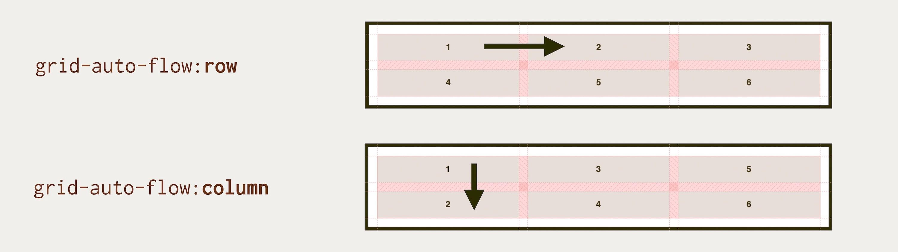

# Principy a vlastnosti CSS gridu

CSS grid má mnoho skvělých vlastností. Ne všechny jsou unikátní, některé jste totiž mohli vidět už [u flexboxu](css-flexbox.md), ale mřížka jejich seznam dále rozšiřuje.

Podívejme se na ně prozatím velmi stručně, ale časem se k nim ještě vrátíme.

## 1) Blokový a inline grid

Kontejner mřížky můžeme definovat kromě `display:grid` také jako `display:inline-grid` a použít ho vedle dalších řádkových (`inline` nebo `inline-block`) elementů. Více je v textu [o vlastnosti `display`](css-display.md).

## 2) Rozměry jaké si umanete: fixní i flexibilní

Šířky a výšky položek mřížky je možné definovat všemi způsoby, které už asi znáte – jednotkami `px`, `em`, `%` a mnoha dalšími.

Přidává se tady ale ještě nová [jednotka `fr`](css-jednotka-fr.md) – *fraction unit*, která umožní snadné dělení volného místa.

<figure>

<figcaption markdown="1">
*Kombinovat můžeme opravdu silně. První sloupec definujeme ve fixních pixelech, druhý v jednotce EM odvozené z velikosti písma. Zbytek plochy rozdělíme podílovou jednotkou FR. Zdroj: [cdpn.io/e/XWrjZRV](https://codepen.io/machal/pen/XWrjZRV?editors=1100)*
</figcaption>
</figure>

Kdyby to nestačilo, máme v gridu k dispozici ještě například [funkci `minmax()`](css-minmax.md), díky níž můžeme rozměry nastavit v rozmezí od minimální po maximální hodnotu.

A dále také [funkce `min()`, `max()` a `clamp()`](css-min-max-clamp.md), které svou působností překračují hranice CSS layoutů.

## 3) Rozměry podle obsahu

Někdy je lepší nenastavovat šířku a výšku autorsky, ale nechat obsah položky, aby do rozměrů mluvil sám. K tomu jsou zde klíčová slova použitelná [ve funkci `minmax()`](css-minmax.md):

* `min-content` – nezmenšuj se pod minimální rozměr obsahu.
* `max-content` – nezvětšuj se nad maximální rozměr obsahu.

Zajímavá je i funkce `fit-content()`, kdy vnutíme šířku podle obsahu i těm prvkům, které by se v daném kontextu chovaly jako blokové.

## 4) Zarovnávání všeho se vším

Už od dob flexboxu asi víte, že možnosti zarovnávání položek layoutu jsou vynikající. Vlastnosti jako `justify-content`, `align-items` nebo `align-self` v té době přinesly velké zjednodušení práce.

Ještě více možností máme v případě gridu – můžeme zde používat další vlastnosti jako [`place-items`](css-place-items.md). Více je v samostatné [části o CSS Box Alignment](css-box-alignment.md).

## 5) Nezávislost vzhledu na HTML zdroji

Frontendové kodérky a kodéři museli vzhledu často obětovat strukturu HTML, což přinášelo komplikace v oblasti přístupnosti stránky například čtečkám pro nevidomé nebo robotům vyhledávačů.

Když vynecháme nepěkné triky s pozicováním, slibně zde vstoupil flexbox. Co je to ale oproti gridu!

* [Vlastnost `order`](css-order.md), která dovoluje změnit pořadí prvků v prohlížeči, už znáte z flexboxu. Ano, tady ji můžete použít taky.
* Pomocí [vlastnosti `grid-area`](css-grid-area.md) budete schopni umístit jakéhokoliv potomka na jakékoliv místo mřížky. A zahodit přitom svěrací kazajku struktury HTML.
* Hodnota `dense` [vlastnosti `grid-auto-flow`](css-grid-auto-flow.md) částečně nechává vykreslení layout na prohlížeči, což oceníte u jednoduchých rozvržení typu „masonry“.

Zde je ale samozřejmě potřeba zvážit možné negativní [vlivy na přístupnost](css-layout-pristupnost.md).

## 6) Automatické umístění položek do mřížky

Díky vlastnosti známé jako „auto-placement“ není nutné položkám gridu definovat, do kterých buněk mřížky je chceme umístit.

Pokud totiž není definováno jinak, každý DOM uzel, který je přímým potomkem kontejneru mřížky, se umístí do jedné buňky.

V našich podmínkách čteme zleva doprava a pak dolů. Položky se samozřejmě budou umísťovat ve stejném směru.

Pokud bychom snad chtěli změnit směr budování mřížky na shora dolů a pak doprava, pomůžeme si [vlastností `grid-auto-flow`](css-grid-auto-flow.md) s hodnotou `column`.

<p></p>

## 7) Oblasti mřížky

Pojmenované oblasti, které definujeme s pomocí [`grid-template-areas`](grid-template-areas.md) velmi usnadňují definování layoutů a jejich přeskládávání v různých rozlišeních:

```css
@media screen and (max-width: 37.49999em) {
  .container {
    grid-template-areas:
      "first first"
      "second second";
  }
}

@media screen and (min-width: 37.5em) {
  .container {
    grid-template-areas:
      "first second"
      "first second";
  }
}
```

## 8) Umísťování prvků přes sebe a vrstvení

Jakmile si s [vlastností `grid-area`](css-grid-area.md) zvyknete umísťovat prvky do konkrétních oblastí, objevíte zcela nový svět vrstvení.

Oblasti mřížky můžete snadno umístit do stejných míst a pomocí vám jistě dobře známé vlastnosti `z-index` pak vytvářet překryvy.

Samozřejmě je možné používat i vlastnost `position`, která snadno vytrhne položky mřížky z jejich původních pozic.

## 9) Zanořování mřížek

To, co je profíkům jasné jako facka, nemusí být patrné všem. Stejně jako blokové prvky nebo flexboxové kontejnery, můžete do sebe vnořovat i kontejnery gridu.

Otevírá to další možnosti a prostor pro tvorbu precizně definovaných layoutů.

Do budoucna zde mohou ještě zaúřadovat a nové možnosti přidat rozpracované vlastnosti jako [podmřížka (subgrid)](css-subgrid.md) nebo nová hodnota [vlastnosti `display:contents`](css-display.md), která umožní nevykreslit rodiče a celý prostor věnovat potomkům.

## 10) Nové typy layoutů

Sečteno, podtrženo: CSS grid může být nástrojem, který k webu přitáhne novou generaci webových designérů a s nimi nové, neotřelé layouty.

<figure>

<figcaption markdown="1">
*The Experimental Layout Lab Of Jen Simmons: Přehlídka layoutových experimentů a neotřelých rozvržení, jejíž homepage je udělaná v gridu. Jak jinak. Zdroj: [labs.jensimmons.com](https://labs.jensimmons.com/*
</figcaption>
</figure>

Grid by vás měl zajímat i když zrovna po experimentech a nových typech rozvržení netoužíte. Je vysoce pravděpodobné, že zjednoduší vaší práci nebo udělá váš kód elegantnějším a lépe čitelným.

Máte se na co těšit.
