# CSS Grid

CSS Grid je sada vlastností pro tvorbu layoutu vsazeného do pravidelné mřížky.

Síla gridu je v tom, že můžeme mřížku definovat v obou směrech – v řádcích i sloupcích. Na rozdíl od [flexboxu](css-flexbox.md) je tedy vhodnější pro celostránkové a komplexnější layouty.

Grid zvládají všechny dnešní prohlížeče. [Internet Explorer](msie.md) 11 ale podporuje jen starší verzi Gridu. Nevadí, i v něm je mřížku s kompromisy [možné použít](css-grid-msie.md).

<!-- AdSnippet -->

Pokud sháníte kompletní příručku ke všem vlastnostem gridu, jste na správném místě. V tomto textu vás čeká:

- [Příručka k vlastnostem](#vlastnosti)
- [Základy a příklad](#priklad)
- [Co je to vlastně mřížka?](#mrizka)
- [Jak se grid liší od flexboxu?](#flexbox)
- [Zásadní plusy a minusy](#plusy-minusy)
- [Grid v Internet Exploreru 11](#ie11)
- [Kde se učit?](#ucit)

## Příručka k vlastnostem {#vlastnosti}

Podívejte se na detailní příručku k jednotlivým vlastnostem gridu.

### Nastavení rodiče mřížky {#grid}

Hodnota [vlastnosti `display`](css-display.md)  `grid` nastaví „grid formatting context“, takže jeho přímí potomkové mohou mít specifické vlastnosti. Možná je také „inline“ hodnota: `inline-grid`.

### Definice mřížky {#vlastnosti-definice}

Pod názvem vlastnosti se skrývá samostatný text s příklady.

<div class="reference-items">

  <article role="article">
    <h4 id="grid-template-columnsrows"><a href="css-grid-template-rows-columns.md"><code>grid-template-columns/rows</code></a></h4>
    <p><a href="css-grid-template-rows-columns.md">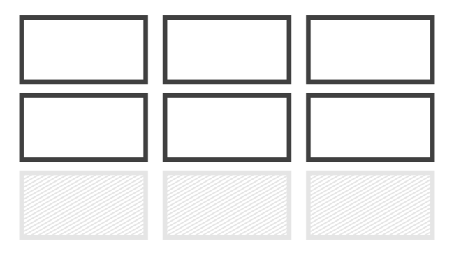</a></p>
    <p>Definice explicitní mřížky <br> <code>grid-template-columns: 150px 1fr 1fr</code></p>
  </article>

  <article role="article">
    <h4 id="grid-template-areas"><a href="css-grid-template-areas.md"><code>grid-template-areas</code></a></h4>
    <p><a href="css-grid-template-areas.md">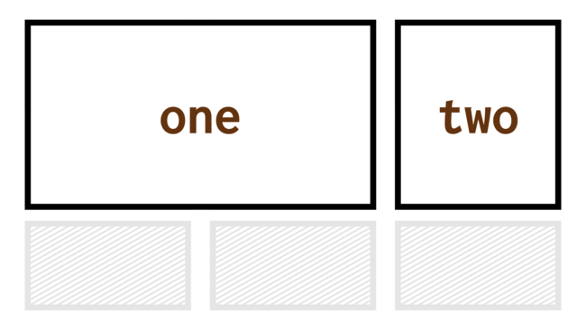</a></p>
    <p>Pojmenování oblastí <br> <code>grid-template-areas: "first first"</code></p>
  </article>

  <article role="article">
    <h4 id="grid-template"><a href="css-grid-template.md"><code>grid-template</code></a></h4>
    <p><a href="css-grid-template.md">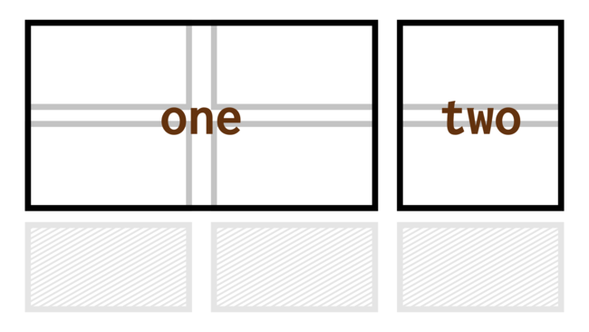</a></p>
    <p>Zkratka pro definici explicitní mřížky <br> <code>grid-template: auto auto / 2fr 1fr</code></p>
  </article>

  <article role="article">
    <h4 id="grid-auto-columnsrows"><a href="css-grid-auto-rows-columns.md"><code>grid-auto-columns/rows</code></a></h4>
    <p><a href="css-grid-auto-rows-columns.md">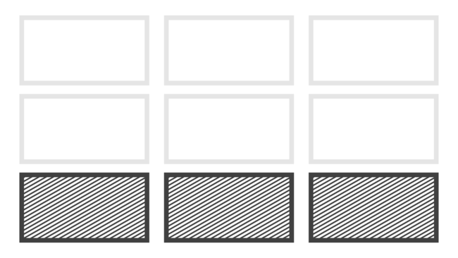</a></p>
    <p>Definice implicitní mřížky <br> <code>grid-auto-rows: 1fr</code></p>
  </article>

  <article role="article">
    <h4 id="grid-auto-flow"><a href="css-grid-auto-flow.md"><code>grid-auto-flow</code></a></h4>
    <p><a href="css-grid-auto-flow.md">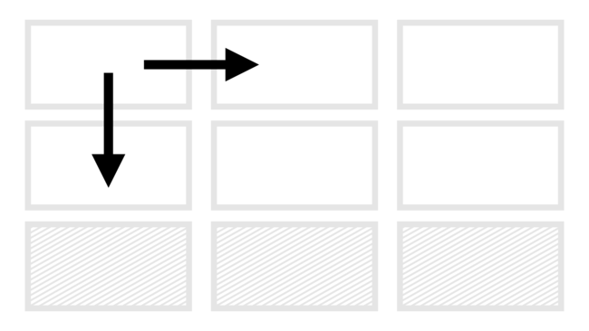</a></p>
    <p>Způsob automatického umísťování do mřížky <br> <code>grid-auto-flow: column</code></p>
  </article>

  <article role="article">
    <h4 id="grid"><a href="css-grid-zkratka.md"><code>grid</code></a></h4>
    <p><a href="css-grid-zkratka.md">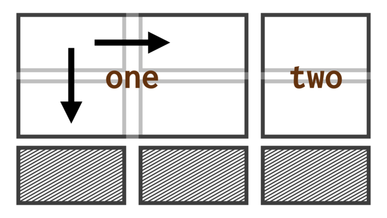</a></p>
    <p>Zkratka pro definici všeho <br> <code>grid: auto-flow 1fr / 100px</code></p>
  </article>

  <article role="article">
    <h4 id="gap"><a href="css-gap.md"><code>gap</code></a></h4>
    <p><a href="css-gap.md"></a></p>
    <p>Definice mezery mezi buňkami <br> <code>gap: 1rem</code></p>
  </article>

</div>

### Umístění do mřížky {#vlastnosti-umisteni}

<div class="reference-items">

  <article role="article">
    <h4 id="grid-columnrow"><a href="css-grid-row-column.md"><code>grid-column/row</code></a></h4>
    <p><a href="css-grid-row-column.md">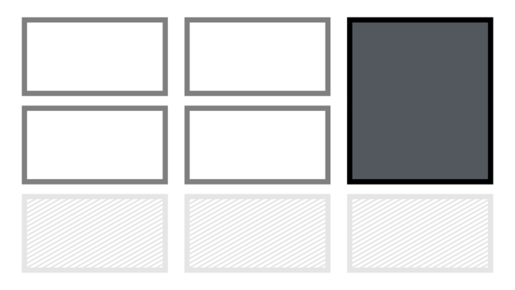</a></p>
    <p>Umístění do explicitní mřížky <br> <code>grid-column: 2 / 3</code></p>
  </article>

  <article role="article">
    <h4 id="grid-area"><a href="css-grid-area.md"><code>grid-area</code></a></h4>
    <p><a href="css-grid-area.md">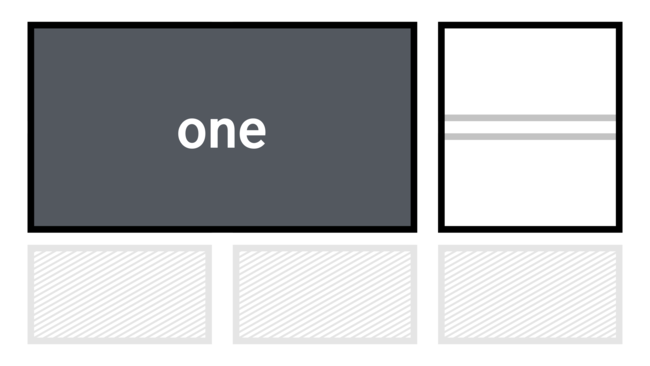</a></p>
    <p>Umístění do pojmenované oblasti <br> <code>grid-area: first</code></p>
  </article>

</div>

### Funkce a klíčová clova {#vlastnosti-funkce}

Aktuálně píšu texty příruček k dalším vlastnostem. Některé nechávám zatím s odkazem na anglické zdroje:

<div class="reference-items">

  <article role="article">
    <h4 id="jednotka-fr"><a href="css-jednotka-fr.md">jednotka <code>fr</code></a></h4>
    <p><a href="css-jednotka-fr.md">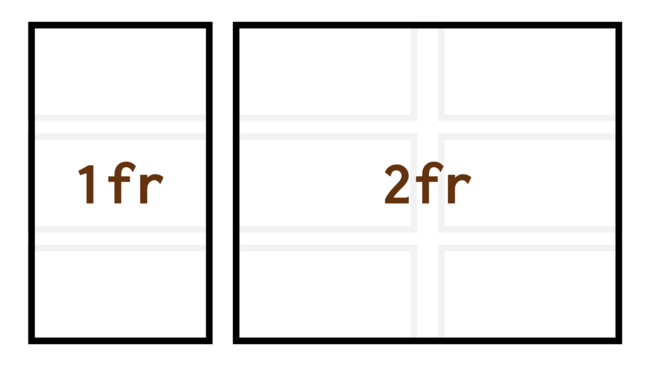</a></p>
    <p>Jednotka pro podíl na celku <br> <code>grid-template-columns: 1fr 2fr</code></p>
  </article>

  <article role="article">
    <h4 id="funkce-repeat-auto-fill-a-auto-fit"><a href="css-repeat.md">funkce <code>repeat()</code>, <code>auto-fill</code> a <code>auto-fit</code></a></h4>
    <p><a href="css-repeat.md">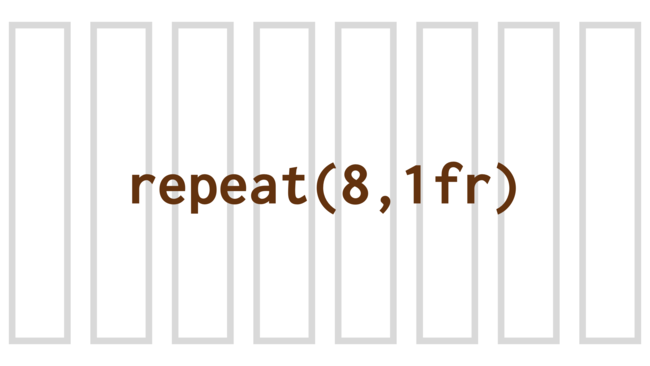</a></p>
    <p>Funkce zkrácení opakujících se zápisů <br> <code>grid-template-columns: repeat(4, 1fr)</code></p>
  </article>

  <article role="article">
    <h4 id="funkce-minmax"><a href="css-minmax.md">funkce <code>minmax()</code></a></h4>
    <p><a href="css-minmax.md"></a></p>
    <p>Omezení minima a maxima v rozměru <br> <code>grid-template-columns: minmax(100px, 1fr)</code></p>
  </article>

  <article role="article">
    <h4 id="masonry"><a href="css-masonry.md"><code>masonry</code></a></h4>
    <p><a href="css-masonry.md">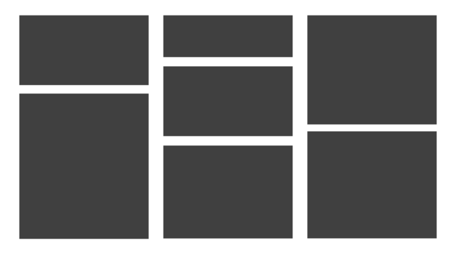</a></p>
    <p>Masonry (zděný) layout <br> <code>grid-template-rows: masonry</code></p>
  </article>

</div>


## Zarovnávání (CSS Box Alignment) {#css-box-alignment}

Ke správnému zarovnávání v gridu budete potřebova také vlastnosti jako [`justify-items`](css-justify-items.md), [`align-self`](css-align-self.md) a mnohé další. Ty jsou součástí samostatné příručky.

→ *Související: [Zarovnání boxů v CSS (Box Alignment Module)](css-box-alignment.md) – Materiál k vlastnostem pro zarovnání boxů.*

## Základy gridu a příklad {#priklad}

Nejprve pojďme na představovací video.

<p class="video">
Video: <a href="https://www.youtube.com/watch?v=9M5RGjlAkeY">CSS Grid</a> ~ Úplné základy ve videu.
</p>


A teď ten příklad. Řekněme, že naše HTML vypadá takto:

```html
<div class="container">
  <div class="content">Content…</div>
  <div class="side-1">Side 1</div>
  <div class="side-2">Side 2</div>  
</div>
```

Obsahový sloupec `content` je na prvním místě, protože se v něm schovává to nejcennější na stránce – obsah. Méně důležité části `side-1` a `side-2` jsou pak na širších displejích po stranách.

Pojďme to nakódovat. Nejprve příprava na layout do mřížky:

```css
.container {
  display: grid;
}
```

Toto – na rozdíl od `display: flex` – automaticky nic nedělá. Nedefinovali jsme mřížku, takže smůla. Vzhůru do ní:

```css
@media screen and (min-width: 600px) {
  .container {
      grid-template-columns: 1fr 3fr 1fr;
  }
}  
```

Vytvoříme tím layout rozdělený na pět sloupečků mřížky. Přičemž první a poslední části pro postranní obsah zaberou jednu pětinu. Prostřední část (`content`) tři pětiny.

V HTML ovšem máme na první místě `content`, takže ještě musíme sáhnout po změně pořadí. Tu už znáte z flexboxu:

```css
@media screen and (min-width: 600px) {
  .side-1 {
    order: -1;
  }
}
```

Ano, některé vlastnosti, které používáte z flexboxu můžete používat i v CSS Grid Layout. Kromě pořadí například i zarovnávání.

Zbývá doladit nějaké ty mezery mezi buňkami mřížky. V Gridu pro ty potřeby máme novou vlastnost `grid-gap`:

```css
.container {
  …
  grid-column-gap: 0.5em;
}
```

CodePen: [cdpn.io/e/QaxGqX](https://codepen.io/machal/pen/QaxGqX?editors=1100)

## Co je to vlastně mřížka? {#mrizka}

- Nic nového. Do pravidelné mřížky se už staletí sází velká část knížek, dnes i novin a tiskovin obecně.
- Veteránům lze CSS Grid přiblížit jako tabulkový layout, jen daleko lépe udělaný a zbavený nevýhod.
- Těm, kteří znají Bootstrap a podobné frameworky, lze Grid podat jako zdokonalený Bootstrap grid vestavěný v prohlížečích.
- Všechno by to ale byla pravda jen částečně. Grid je daleko silnější než uvedené příklady.

## Jak se grid liší od flexboxu? {#flexbox}

Předně chci zdůraznit, že Grid nenahrazuje [flexbox](css-flexbox.md). Potřebujete obojí. Naučte se obojí. Ale nějaké rozdíly zde jsou:

- Grid je silnější pro dvourozměrné layouty – po svislé i vodorovné ose. Flexbox se více hodí na rozvržení jednosměrná.
- Grid budete asi častěji používat pro layout celé stránky, flexbox pro layout menších komponent. Ale není to pravidlo.
- Grid je zaměřený více na „grid in“ layout, kdy se obsah musí vždy přizpůsobit mřížce. Flexbox je super na „content out“ situace, kdy se layout musí přizpůsobit obsahu. Více na [rachelandrew.co.uk](https://rachelandrew.co.uk/archives/2016/03/30/should-i-use-grid-or-flexbox/).
- Grid je také silnější v responzivním designu. Budete potřebovat méně [Media Queries](css3-media-queries.md), protože Grid má *„really powerful functionality like auto layout, minmax(), repeat(), and auto-fill“*. Píšou to na [css-tricks.com](https://css-tricks.com/css-grid-replace-flexbox/).
- Grid rozšiřuje možnosti dané flexboxem. Můžeme v něm dělat i dost neortodoxní layouty. Viz opět [Rachel Andrew](https://twitter.com/rachelandrew/status/899979364225478656).

## Zásadní plusy a minusy {#plusy-minusy}

- Hlavní výhoda: je stejná jako u flexboxu - jde o systém vymyšlený pro tvorbu layoutu. Zbavíme se hacků a desítek až stovek řádků zbytečného CSS i HTML kódu.
- Hlavní nevýhoda: Podpora zatím není plná: IE 11 podporuje jen starší verzi Gridu, která zdaleka neodpovídá variantě podporované v moderních prohlížečích. [caniuse.com/grid](http://caniuse.com/#search=grid) Ale jak už z článku víte, tohle se dá částečně řešit.

<blockquote class="twitter-tweet" data-lang="en"><p lang="cs" dir="ltr">Podpora CSS Grid na dvou z projektů, o které se starám. <br>Zajímavost: problematické už v žádném případě nejsou starší Explorery (10-), ale starší verze Chrome a Safari. Zdroj: <a href="https://twitter.com/caniuse?ref_src=twsrc%5Etfw">@caniuse</a> a Google Analytics. <a href="https://t.co/yJ2tXmb5mF">pic.twitter.com/yJ2tXmb5mF</a></p>&mdash; Martin Michálek (@machal) <a href="https://twitter.com/machal/status/956447238770909184?ref_src=twsrc%5Etfw">January 25, 2018</a></blockquote>
<script async src="https://platform.twitter.com/widgets.js" charset="utf-8"></script>

## Podpora {#podpora}

Podpora gridu v moderních prohlížečích je výborná, takřka bezchybná.

<figure>

<figcaption markdown="1">
*Podpora gridu v prohlížečích. Zdroj: [CanIUse.com](https://caniuse.com/css-grid).*
</figcaption>
</figure>

O podpoře moderních systémů layoutu v prohlížečích píšeme [ve zvláštním textu](css-layout-bugy.md), ale u gridu není v kontextu moderních prohlížečů téměř o čem psát.

Horší je to ve stařičkém prohlížeči od Microsoftu.

### Grid v Internet Exploreru 11 {#ie11}

Explorer a starší Edge podporují dnes už neplatnou specifikaci Gridu. Má jinou syntaxi a jde o podmnožinu dnešních možností Gridu. Navíc nepodporuje automatické umísťování prvků do mřížky. A neumí vlastnost `grid-gap`… No, mohli bychom pokračovat.

Naštěstí je tady [Autoprefixer](autoprefixer.md) a dnes už je možné svěřit [řešení Gridu pro IE](css-grid-msie.md) jemu.

<div class="related" markdown="1">
- [CSS Grid v IE: Oblasti a mezery](css-grid-msie.md)
- [CSS Grid v IE: Automatické umístění](css-grid-msie-autoplacement.md)
</div>

Existence „explorerového“ Gridu nám ale v mnoha případech umožní mřížku vcelku bez problémů používat i bez Autoprefixeru. Jen je potřeba se kromě základních vlastností dnešního Gridu naučit i ten starší.

Vezměme příklad třísloupcového layoutu z prvního dema na této stránce:

Začneme tím nejjednodušším.

```css
display: -ms-grid
```

Ano, prostě to zapíná Grid. Pak přidáme samotný layout:

```css
.layout {
  -ms-grid-columns: 1fr 3fr 1fr
}
```

Ten v moderních prohlížečích řešíme vlastností `grid-template-columns`.

IE11 nepodporuje automatické umísťování do mřížky, takže to u jednotlivých položek musíme obstarat ručně:

```css
.content {
  -ms-grid-column: 2;
  -ms-grid-column-span: 1;
  margin-right: .5em;
}
```

`content` umísťujeme do druhého sloupečku mřížky (`-ms-grid-column: 2`) a říkáme, že zabere jen jeden sloupeček té mřížky (`-ms-grid-column-span: 1`).

Asi si všimnete vlastnosti `margin-right`. Přesně tak, mezeru mezi sloupečky musíme dělat starými prostředky, protože s vlastností `grid-gap` zde neuspějeme.
  
CodePen: [cdpn.io/e/XZbrEY](https://codepen.io/machal/pen/XZbrEY?editors=1100)

## Kde se učit? {#ucit}

Než vše detailně připravím pro Vzhůru dolů a [e-booky](https://www.vzhurudolu.cz/ebooky), odkážu vás na jiné zdroje:

- Moc pěkný český článek od Pavla Satrapy [na Root.cz](https://www.root.cz/clanky/css-grid-revoluce-ve-web-designu/).
- Hra [CSS Grid Garden](http://cssgridgarden.com/).
- Web [CSSGrid.io](https://cssgrid.io/).
- Detailní vlastnosti pak studujte na [MDN](https://developer.mozilla.org/en-US/docs/Web/CSS/CSS_Grid_Layout) nebo [CSS Tricks](https://css-tricks.com/snippets/css/complete-guide-grid/).
- Specifikace [CSS Grid 1](https://www.w3.org/TR/css-grid-1/).

Běžte se podívat ještě na [3 příklady použití Gridu](css-grid-inspirace.md) i s vysvětlením v kódu.

<!-- AdSnippet -->
