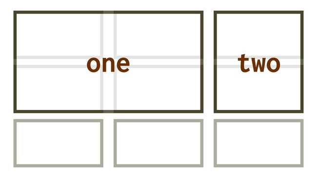
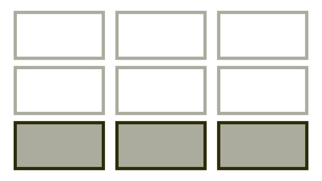
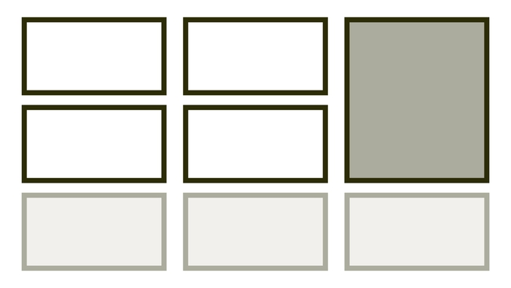
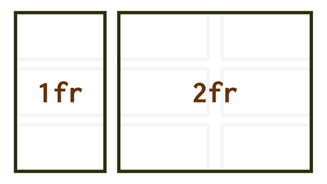
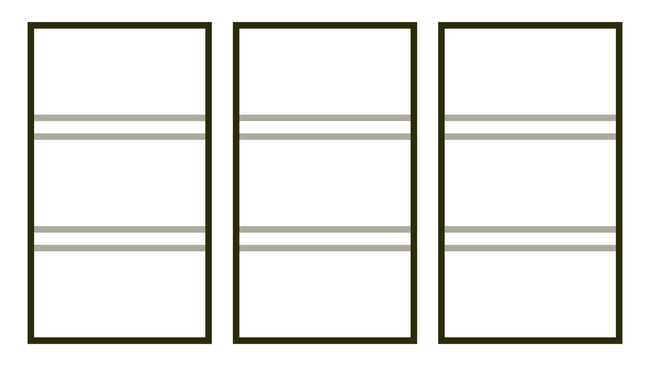

# CSS grid

<div class="book-index" data-book-index="Grid"></div>

CSS grid je sada vlastností pro tvorbu layoutu vsazeného do pravidelné mřížky.

Síla gridu je kromě jiného v tom, že jej můžeme definovat jako mřížku definovat v obou směrech – v řádcích i sloupcích. Na rozdíl od [flexboxu](css-flexbox.md) tedy může být vhodnější pro celostránkové a komplexnější layouty.

Grid zvládají všechny dnešní prohlížeče. [Internet Explorer 11](msie.md) ale podporuje jen starší verzi specifikace CSS gridu. Nevadí, za prvé již téměř vymřel a za druhé – i v něm je možné mřížku s kompromisy [použít](css-grid-msie.md).

<!-- AdSnippet -->

<div class="web-only" markdown="1">

Pokud sháníte kompletní příručku ke všem vlastnostem gridu, jste na správném místě. V tomto textu vás čeká:

<div class="f-6" markdown="1">

- [Příručka k vlastnostem](#vlastnosti)
- [Základy a příklad](#priklad)
- [Co je to vlastně mřížka?](#mrizka)
- [Jak se grid liší od flexboxu?](#flexbox)
- [Zásadní plusy a minusy](#plusy-minusy)
- [Grid v Internet Exploreru 11](#ie11)
- [Kde se učit?](#ucit)

</div>

</div>

## Příručka k vlastnostem {#vlastnosti}

Následuje detailní příručka k jednotlivým vlastnostem CSS gridu.

### Nastavení rodiče mřížky {#grid}

Hodnota [vlastnosti `display:grid`](css-display.md) nastaví „grid formatting context“.

Možná je také „inline“ hodnota: `inline-grid`. To je věc podobná  `inline-block`, tedy uvnitř je možné dělat rozvržení, zde pomocí gridu, zvenčí jde o součást řádku textu.

<div class="pbi-avoid" markdown="1">

### Definice mřížky {#vlastnosti-definice}

Následujícími vlastnostmi je možné definovat kostru rozvržení.

<div class="reference-items">

  <article role="article">
    <h4 id="grid-template-columnsrows"><a href="css-grid-template-rows-columns.md">grid-template-columns/rows</a></h4>
    <p><a href="css-grid-template-rows-columns.md"></a></p>
    <p>
      Definice explicitní mřížky. <br>
      <code>grid-template-columns:1fr 1fr 1fr; grid-template-rows:1fr 1fr;</code>
      </p>
  </article>

  <article role="article">
    <h4 id="grid-template-areas"><a href="css-grid-template-areas.md">grid-template-areas</a></h4>
    <p><a href="css-grid-template-areas.md"></a></p>
    <p>
      Pojmenování oblastí. <br>
      <code>grid-template-areas: "one two"</code>
    </p>
  </article>

  <article role="article">
    <h4 id="grid-template"><a href="css-grid-template.md">grid-template</a></h4>
    <p><a href="css-grid-template.md"></a></p>
    <p>
      Zkratka pro definici explicitní mřížky. <br>
      <code>grid-template:"one one two" 1fr ⏎ "one one two" 1fr / 1fr 1fr 1fr;</code>
    </p>
  </article>

  <article role="article">
    <h4 id="grid-auto-columnsrows"><a href="css-grid-auto-rows-columns.md">grid-auto-columns/rows</a></h4>
    <p><a href="css-grid-auto-rows-columns.md"></a></p>
    <p>
      Definice implicitní mřížky. <br>
      <code>grid-auto-rows:1fr;</code>
    </p>
  </article>

  <article role="article">
    <h4 id="grid-auto-flow"><a href="css-grid-auto-flow.md">grid-auto-flow</a></h4>
    <p><a href="css-grid-auto-flow.md"></a></p>
    <p>Způsob automatického umísťování do mřížky. <br> <code>grid-auto-flow:column;</code></p>
  </article>

  <article role="article">
    <h4 id="grid"><a href="css-grid-zkratka.md">grid</a></h4>
    <p><a href="css-grid-zkratka.md"></a></p>
    <p>
      Zkratka pro definici všeho. <br>
      <code>grid:auto-flow 1fr / 100px;</code>
    </p>
  </article>

</div>
<!-- .reference-items -->

</div>
<!-- .pbi-avoid -->

<div class="pbi-avoid" markdown="1">

### Umístění do mřížky {#vlastnosti-umisteni}

<div class="reference-items">

  <article role="article">
    <h4 id="grid-columnrow"><a href="css-grid-row-column.md">grid-column/row</a></h4>
    <p><a href="css-grid-row-column.md"></a></p>
    <p>Umístění do explicitní mřížky. <br> <code>grid-column:2 / 3;</code></p>
  </article>

  <article role="article">
    <h4 id="grid-area"><a href="css-grid-area.md">grid-area</a></h4>
    <p><a href="css-grid-area.md"></a></p>
    <p>Umístění do pojmenované oblasti. <br> <code>grid-area:first;</code></p>
  </article>

</div>
<!-- .reference-items -->

</div>
<!-- .pbi-avoid -->

<div class="pbi-avoid" markdown="1">

### Funkce a klíčová slova {#vlastnosti-funkce}

Do následující škatulky spadly nejrůznější výpočetní funkce, speciální klíčová slova a jednotky, které vznikly pro potřeby gridu:

<div class="reference-items">

  <article role="article">
    <h4 id="jednotka-fr"><a href="css-jednotka-fr.md">jednotka fr</a></h4>
    <p><a href="css-jednotka-fr.md"></a></p>
    <p>
      Jednotka pro podíl na celku. <br>
      <code>grid-template-columns:1fr 2fr;</code>
    </p>
  </article>

  <article role="article">
    <h4 id="funkce-repeat-auto-fill-a-auto-fit"><a href="css-repeat.md">funkce repeat(), auto-fill a auto-fit</a></h4>
    <p><a href="css-repeat.md"></a></p>
    <p>
      Funkce zkrácení opakujících se zápisů. <br>
      <code>grid-template-columns:repeat(8, 1fr);</code>
    </p>
  </article>

  <article role="article">
    <h4 id="funkce-minmax"><a href="css-minmax.md">funkce minmax()</a></h4>
    <p><a href="css-minmax.md"></a></p>
    <p>Omezení minima a maxima v rozměru. <br> <code>grid-template-columns:minmax(100px, 1fr);</code></p>
  </article>

</div>
<!-- .reference-items -->

</div>
<!-- .pbi-avoid -->

<div class="pbi-avoid" markdown="1">

### Vlastnosti, které zatím nemají plnou podporu {#vlastnosti-funkce}

Následující dvě nové vlastnosti sice zatím není možné snadno použít v praxi, ale vypadá to nadějně a ke všemu je považuji za velmi užitečné:

<div class="reference-items">

  <article role="article">
    <h4 id="masonry"><a href="css-subgrid.md">subgrid</a></h4>
    <p><a href="css-subgrid.md"></a></p>
    <p>Podmřížka uvnitř mřížky. <br> <code>grid-template-cols:subgrid;</code></p>
  </article>

  <article role="article">
    <h4 id="masonry"><a href="css-masonry.md">masonry</a></h4>
    <p><a href="css-masonry.md"></a></p>
    <p>Masonry (zděný) layout. <br> <code>grid-template-rows:masonry;</code></p>
  </article>

</div>
<!-- .reference-items -->

</div>
<!-- .pbi-avoid -->

<div class="web-only" markdown="1">

## Zarovnávání (CSS Box Alignment) {#css-box-alignment}

Ke správnému zarovnávání v gridu budete potřebova také vlastnosti jako [`gap`](css-gap.md), [`justify-items`](css-justify-items.md), [`align-self`](css-align-self.md) a mnohé další. Ty jsou součástí samostatné příručky.

→ *Související: [Zarovnání boxů v CSS (Box Alignment Module)](css-box-alignment.md) – Materiál k vlastnostem pro zarovnání boxů.*

</div>

## Základy gridu a první příklad {#priklad}

<div class="web-only" markdown="1">

Nejprve pojďme na představovací video. Podívejte se na video „CSS grid“.

YouTube: [youtu.be/9M5RGjlAkeY](https://www.youtube.com/watch?v=9M5RGjlAkeY)

</div>

Řekněme, že naše HTML vypadá takto:

```html
<div class="container">
  <div class="side-1">Side 1</div> 
  <div class="content">Content…</div>
  <div class="side-2">Side 2</div>
</div>
```

Pojďme to nakódovat. Nejprve příprava na layout do mřížky:

```css
.container {
  display: grid;
}
```

Toto – na rozdíl od `display:flex` – samo od sebe nic nedělá. Zatím jsme definovali mřížku, takže máme smůlu. Vzhůru do ní:

```css
@media screen and (min-width: 37.5em) {
  .container {
      grid-template-columns: 1fr 3fr 1fr;
  }
}  
```

Vytvoříme tím layout rozdělený na pět sloupečků mřížky, přičemž první a poslední části pro postranní obsah zaberou jednu pětinu. Prostřední část (`content`) má tři pětiny.

<figure>

<figcaption markdown="1">
*Jednoduchý layout s použitím CSS gridu. Ani to nebolelo.*
</figcaption>
</figure>

Zbývá doladit nějaké ty mezery mezi buňkami mřížky. V gridu máme pro ty potřeby novou [vlastnost `gap`](css-gap.md):

```css
.container {
  gap: 0.5em;
}
```

CodePen: [vrdl.in/gzwr7](https://codepen.io/machal/pen/gZQoeL?editors=1100)

Po představení všech vlastností a rychlém příkladu bych se rád pozastavil u teoretických konceptů CSS gridu.

## Co je to vlastně mřížka? {#mrizka}

- Nic nového. Do pravidelné mřížky se už staletí sází velká část knížek, novin a tiskovin obecně.
- Webařským veteránům lze CSS grid přiblížit jako tabulkový layout, jen daleko lépe udělaný a zbavený nevýhod.
- Těm, kteří znají Bootstrap a podobné frameworky, lze grid podat jako zdokonalený Bootstrap grid vestavěný v prohlížečích.

Všechno by to ale byla pravda jen částečně. Grid je daleko silnější než uvedené příklady.

## Jak se liší grid od flexboxu? {#flexbox}

Předně chci zdůraznit, že grid nenahrazuje [flexbox](css-flexbox.md). Potřebujete obojí. Naučte se obojí. Ale nějaké rozdíly zde jsou:

- Grid je silnější pro dvourozměrné layouty – po svislé i vodorovné ose. Flexbox se více hodí na rozvržení jednosměrná.
- Grid budete asi častěji používat pro layout celé stránky, flexbox pro layout menších komponent. Ale není to pravidlo.
- Grid je zaměřený více na layout „grid in“, kdy se obsah musí vždy přizpůsobit mřížce. Flexbox je super na situace „content out“, kdy se layout musí přizpůsobit obsahu.
- Grid může být také silnější v responzivním designu. Budete potřebovat méně Media Queries, protože obsahuje funkcionalitu jako automatický layout, funkce jako [`minmax()`](css-minmax.md), [`repeat()`](css-repeat.md) nebo klíčová slova jako `auto-fill`.
- Grid považuji celkově za robustnější. Jak možná sami vidíte, ve specifikaci gridu je daleko více vlastností než ve flexboxu. Je to i vidět u vlastností [zarovnávání boxů (CSS Box Alignment)](css-box-alignment.md) – těch, které jsou navázané na mřížku, je více než těch, které jsou navázané na flexbox.

Z mého pohledu má grid daleko širší možnosti stylování než při využití flexboxu. Svedeme v něm i dříve těžce kódovatelné layouty.

## Podpora {#podpora}

Podpora gridu v moderních prohlížečích je výborná, takřka bezchybná.

<figure class="figure-thirds">

<figcaption markdown="1">
Podpora gridu v prohlížečích, které mají v ČR nad 0,5 % podílu trhu. Prohlížeče jsou seřazené podle používanosti. Zdroj: [CanIUse.com](https://caniuse.com/css-grid).
</figcaption>
</figure>

<div class="web-only" markdown="1">

O podpoře moderních systémů layoutu v prohlížečích píšu [ve zvláštním textu](css-layout-bugy.md), ale u gridu není v kontextu moderních prohlížečů téměř o čem psát.

</div>

<div class="ebook-only" markdown="1">

O podpoře moderních systémů layoutu v prohlížečích píšu [ve zvláštním textu](css-layout-bugy.md) osmé kapitoly, ale u gridu není v kontextu moderních prohlížečů téměř o čem psát.

</div>

Horší je to ve stařičkém prohlížeči od Microsoftu.

### Grid v Internet Exploreru 11 {#ie11}

Explorer a starší Edge podporují dnes už neplatnou specifikaci gridu. Má jinou syntaxi a jde o podmnožinu dnešních možností gridu. Navíc nepodporuje automatické umísťování prvků do mřížky. A neumí vlastnost `grid-gap`… No, a takhle bychom mohli pokračovat.

Naštěstí je tady [Autoprefixer](autoprefixer.md) a dnes už je možné svěřit [řešení gridu pro MSIE](css-grid-msie.md) jemu.

Existence „explorerového“ gridu nám ale v mnoha případech umožní mřížku vcelku bez problémů používat i bez Autoprefixeru. Jen je potřeba se kromě základních vlastností dnešního gridu naučit i ten starší.

<div class="web-only" markdown="1">

## Kde se učit? {#ucit}

Podívejte se na tyto zdroje:

- Moc pěkný český článek od Pavla Satrapy [na Root.cz](https://www.root.cz/clanky/css-grid-revoluce-ve-web-designu/).
- Hra [CSS grid Garden](http://cssgridgarden.com/).
- Web [CSSGrid.io](https://cssgrid.io/).
- Detailní vlastnosti pak studujte na [MDN](https://developer.mozilla.org/en-US/docs/Web/CSS/CSS_Grid_Layout) nebo [CSS Tricks](https://css-tricks.com/snippets/css/complete-guide-grid/).
- Specifikace [CSS grid 1](https://www.w3.org/TR/css-grid-1/).

Kam pokračovat na Vzhůru dolů? Běžte se podívat ještě na [3 příklady použití gridu](css-grid-inspirace.md) i s vysvětlením v kódu.

</div>

<!-- AdSnippet -->
