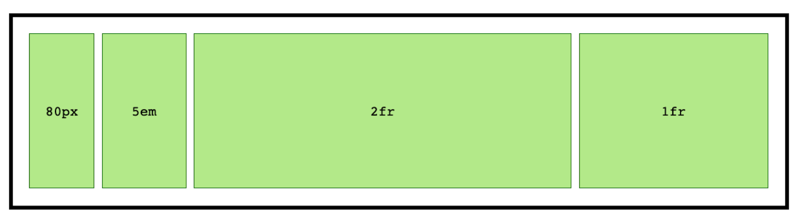

# Jednotka fr v CSS

Jedná se o flexibilní jednotku, která reprezentuje podíl na volném prostoru v [CSS gridu](css-grid.md). Proto `fr` jako *fraction unit*.

Využívá se ve vlastnostech popisující mřížku, jako jsou [`grid-template-columns/rows`](css-grid-template-rows-columns.md) nebo [grid-auto-columns/rows](css-grid-auto-rows-columns.md).

<!-- AdSnippet -->

Ale dost řečí a ukažme si nějaký kód:

```css
.container {
  display: grid;
  grid-template-columns: 1fr 2fr;
}
```

Prostor se rozdělí na tři díly, ale vykreslí do dvou buněk gridu. První bude zabírat třetinu šířky, druhá dvě třetiny.

CodePen: [cdpn.io/e/pozNbmQ](https://codepen.io/machal/pen/pozNbmQ?editors=1100)

Raději zdůrazněme, že šířka buňky se ani zde nikdy nezmenší pod šířku obsahu. Rozdělení `1fr 2fr` tedy bude platit jen v případě dostatku prostoru.

## Je (a není) to jako procenta {#procenta}

Zjednodušeně by se tahle jednotka dala přirovnat k procentům (`%`), ovšem s tím rozdílem, že nemusíme počítat prvky gridu a řešit nastavení box modelu. Demo to ostatně ukáže v celé kráse.

CodePen: [cdpn.io/e/gOYwvrN](https://codepen.io/machal/pen/gOYwvrN?editors=1100)

Procentuální grid v demu nastavujeme jako `grid-template-columns: 33.3% 33.3% 33.3%`. Může to být fajn, ale procentuální hodnotu musíme vypočíst podle počtu sloupců v HTML. No a pokud by se nám ten změnil, nezbývá než upravovat také CSS.

Další problém je v *box modelu*, způsobu počítání šířky. Jak vidíte u prvního prvku v CodePenu, k procentuální šířce se musí ještě připočíst vnitřní okraj (`padding`) a bez změny počítání box modelu pomocí vlastnosti [`box-sizing`](css3-box-sizing.md) nám prvky přetečou z rodičovského kontejneru.

## Podíl na zbytku {#podil}

Jednotka `fr` tvoří podíl na *zbytku* plochy, kterou neokupují prvky s rozměry nastavenými běžnými [jednotkami délky](jednotky.md), jako jsou `%`, `px`, `em`, `rem` a další:

<p></p>

Pomocí `grid-template-columns: 80px 5em 2fr 1fr` definuje čtyřsloupcovou mřížku. První sloupec má fixní šířku `80px`. Druhý má šířku `5em`, takže [jeho šířka](jednotky.md#em) bude záležet na velikosti písma rodičovského prvku. Pokud nám zbude nějaký prostor, prohlížeč jej vydělí třemi (`2fr` + `1fr`) a rozpočítá na dvě buňky definované podílovou jednotkou.

CodePen: [cdpn.io/e/XWrjZRV](https://codepen.io/machal/pen/XWrjZRV?editors=1100)

## Nulová a desetinná čísla. Hodnoty, se kterými je legrace {#hodnoty}

Podívejme se ještě na jeden speciální příklad, který ukazuje použití nulové (`0fr`) a desetinné (`0.1fr`) hodnoty.

CodePen: [cdpn.io/e/PoYGQOw](https://codepen.io/machal/pen/PoYGQOw?editors=1100)

Mřížku definujeme takto:

```css
.container {
  grid-template-columns: 0fr 0.5fr 0.1fr;
}
```

Pokud je nastavená nulová hodnota (`0fr`) vykreslí prohlížeč sloupec v šířce obsahu.

Poměrně užitečné jsou také desetinné hodnoty. Jejich součet je `0.6fr`, takže zanechává `0.4fr` prostoru prázdného.

Obojí se myslím může docela hodit, nemám pravdu?

<!-- AdSnippet -->

Jo a – záporné hodnoty k jednotce `fr` přidávat nezkoušejte. K ničemu to nevede, už jsem to ověřil.

## Poznámky na závěr {#poznamky}

* Asi jste postřehli, že `grid-template-columns: 1fr` se chová podobně jako bezjednotkový údaj ve [flexboxu](css-flexbox.md), např. `flex: 1`.
* `fr` není jednotka délky a nedá se s nimi ani kombinovat. Nemůžeme tedy použít funkci [calc()](css3-calc.md) a výraz jako `calc(1fr - 20px)`.

## Podpora v prohlížečích {#poznamky}

Podpora je skvělá. Nevím o žádném relevantním prohlížeči, který by jednotku `fr` v kombinaci s CSS gridem nezvládal. A to za relevantní prohlížeč v době psaní textu považuji i Internet Explorer 11.

<!-- AdSnippet -->
