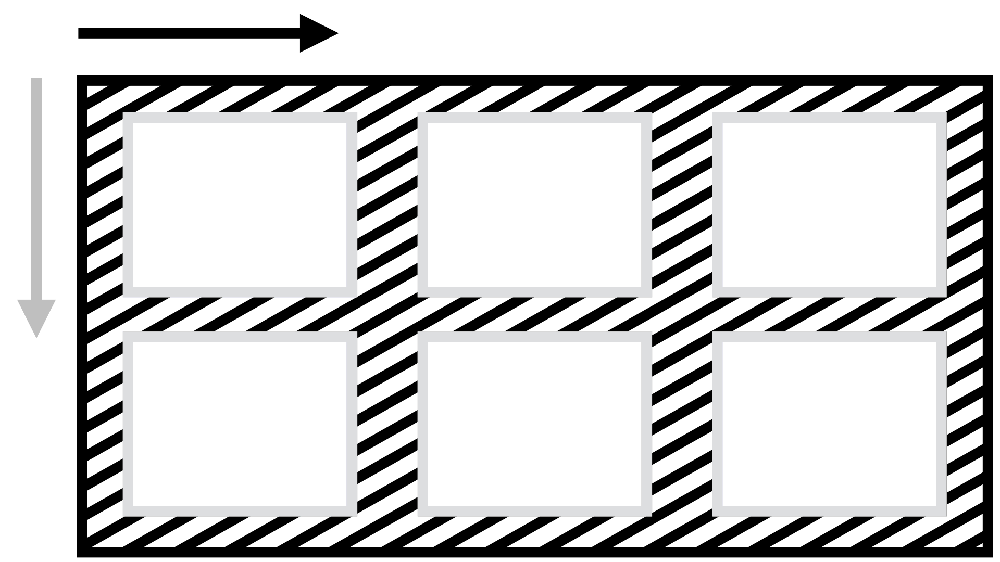
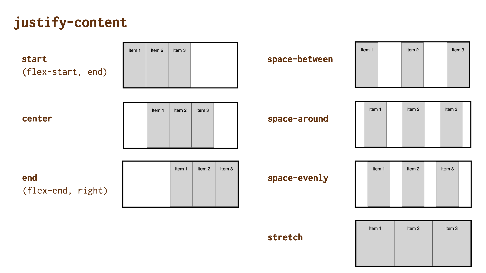

# Vlastnost justify-content: Rozdělení prostoru mezi položkami na hlavní ose

Vlastnost CSS `justify-content` definuje, jak prohlížeč distribuuje prostor mezi položkami obsahu podél hlavní (nebo řádkové) osy kontejneru layoutu.

Ve specifikaci se počítá s použitím pro flexbox, grid, ale také vícesloupcový layout.

<!-- AdSnippet -->

Po pořádek zmiňme, že tahle vlastnost nemusí být pro flexbox užitečná, protože zbylý prostor se rozdělí až poté, co se započtou hodnoty `auto` vnějších okrajů a až poté, co se započtou hodnoty délek položek rozvržení. Stačí tedy jedna flexboxová položka s `flex` nebo `flex-grow` nastavená na 1 a více a žádný volný prostor zde nezbude.

- [CSS Box Alignment](css-box-alignment.md)

## Jednoduchý příklad

V naší ukázce definujeme třísloupcový kontejner gridu. Jeho položky jsme ale, my zlí experimentátoři, přinutili, aby držely minimální a maximální šířku – pomocí `minmax(3em, 5em)`.

CodePen: [cdpn.io/e/qBZmvEy?editors=1100](https://codepen.io/machal/pen/qBZmvEy?editors=1100)

Deklarace `justify-content:space-around` zajistí rozdělení volného prostoru na výšku tak, aby mezi položkami a kontejnerem byla poloviční mezera než mezi jednotlivými položkami.

Můžete si vyzkoušet ještě jedno demo. Je totožné, jen tentokrát pro flexbox.

CodePen: [cdpn.io/e/mdPmoVZ?editors=1100](https://codepen.io/machal/pen/mdPmoVZ?editors=1100)

## Možné hodnoty zarovnání

Vlastnosti `justify-self` můžete předávat všechny hodnoty [z jednotlivých obecných kategorií klíčových slov](css-box-alignment.md#typy-klicova-slova):

### Základní

- `normal` (výchozí)  
  V CSS gridu i flexboxu bude odpovídat hodnotě `start`. Položky se tedy zarovnají za začátek osy, takže obvykle doleva.

### Zbylý prostor

- `space-between`  
  Volné místo se rovnoměrně rozdělí mezi položky, přičemž první a poslední je zarovnaná s hranou kontejneru.
- `space-around`  
  Volné místo se rovnoměrně rozdělí mezi položky a polovina mezery mezi položkami se vloží mezi hrany kontejneru a první a poslední položku.
- `space-evenly`  
  Volné místo se rovnoměrně rozdělí mezi položky i mezi první a poslední položku a okraje kontejneru. Tato vlastnost není v kombinaci s flexboxem podporována v IE11.
- `stretch`  
  Položky rozšíří své rozměry tak, aby v kontejneru nezbylo žádné volné místo. Pokud jsou položky menší než kontejner, jejich velikost se zvětší rovnoměrně (nikoli proporcionálně), přičemž stále respektují omezení uložená vlastnostmi jako `max-width`/`max-height`. Tato hodnota není v kombinaci s flexboxem podporována. 

### Poziční

- `center`  
  Položky se centruje doprostřed kontejneru.
- `start`  
  Položky se zarovnají k hraně začátku kontejneru.
- `end`  
  Položky se zarovnají k hraně konce kontejneru.
- `flex-start`  
  Chová se jako `start`, použitelné hlavně ve flexboxu.
- `flex-end`  
  Chová se jako `end`, použitelné hlavně ve flexboxu.
- `left`  
  Chová se jako `start`.
- `right`  
  Chová se jako `end`.

Hodnoty `left`, `right`, `start` a `end` zatím nemají u této vlastnost dobrou podporu v prohlížečích při použití ve flexboxu.

### Pro přetečení

- `safe`  
  Pokud má položka v daném způsobu zarovnání přetéct z obou stran, bude zarovnání změněno tak, aby byl vidět začátek položky, takže aby například bylo možné přečíst začátek textu.
- `unsafe`  
  Vždy dostane přednost poziční zarovnání, bez ohledu na to, zda bude oříznutý obsah čitelný nebo ne.  

Pokud vím, v žádném prohlížeči toto zatím nefunguje.

## Podpora v prohlížečích

V layoutech postavených na gridu je vlastnost u základních hodnot plně podporována s výjimkou IE11. U flexboxu situaci popisujeme u jednotlivých vlastností.

Více na [caniuse.com/justify-content](https://caniuse.com/#search=justify-content).

<!-- AdSnippet -->
