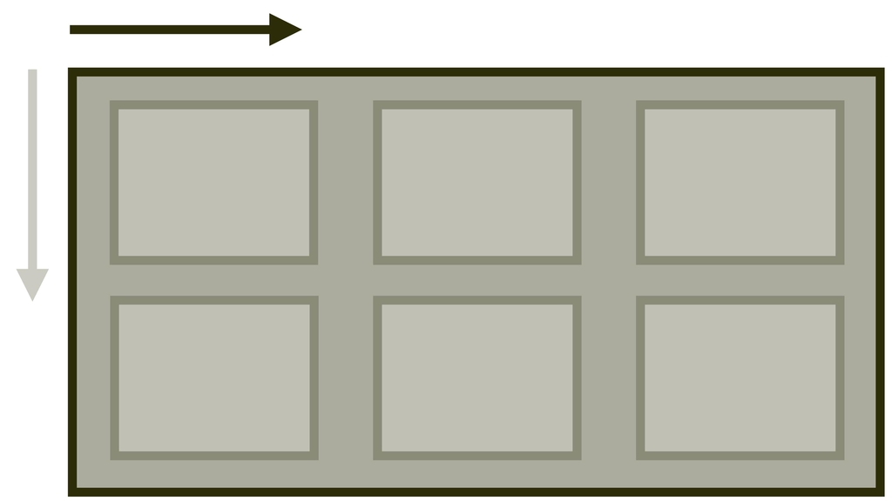
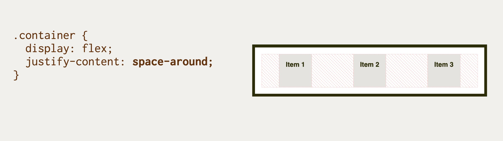
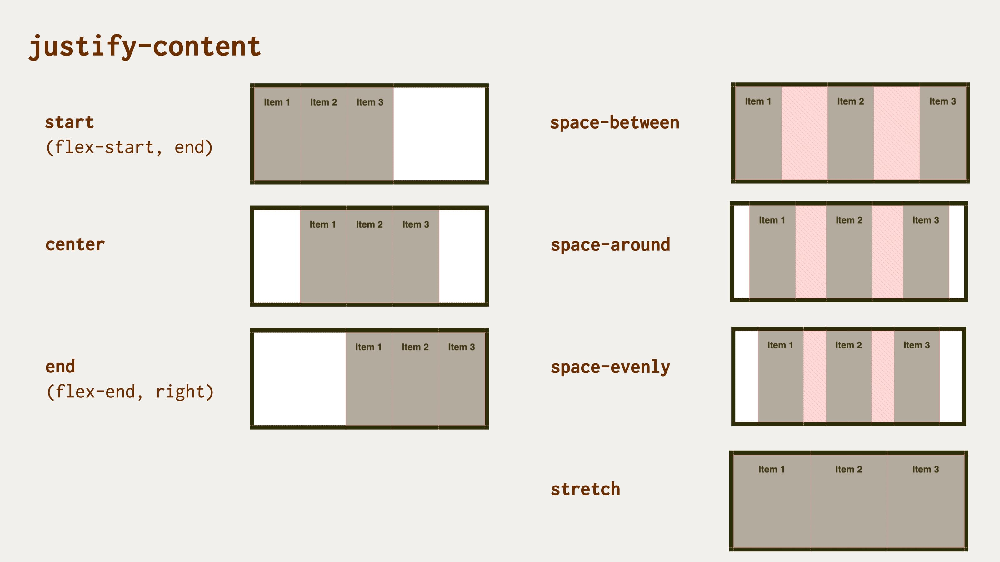

# Vlastnost justify-content: Rozdělení prostoru mezi položkami na hlavní ose

Vlastnost CSS `justify-content` definuje, jak prohlížeč distribuuje prostor mezi položkami obsahu podél hlavní (nebo řádkové) osy kontejneru layoutu.

<div class="connected" markdown="1">



<div class="web-only" markdown="1">

Vlastnost `justify-content` patří do specifikace pro zarovnání boxů – [CSS Box Alignment](css-box-alignment.md).

Počítá se však s použitím pro [flexbox](css-flexbox.md), [grid](css-grid.md), ale také [vícesloupcový layout](css-multicolumn.md).

</div>

<div class="ebook-only" markdown="1">

→ [vrdl.cz/p/css-justify-content](https://www.vzhurudolu.cz/prirucka/css-justify-content)

</div>

</div>

Využití je možné ve všech moderních systémech layoutu: flex, grid i multicol.

## Ve flexboxu je to občas zbytečné {#flexbox}

Po pořádek zmiňme, že tahle vlastnost nebude pro flexbox zase tak užitečná. Zbylý prostor se ve flexboxu rozdělí až poté, co se započtou hodnoty `auto` vnějších okrajů (`margin`) a až poté, co se započtou hodnoty délek položek rozvržení.

Stačí tedy existence jedné flexboxové položky s vlastnostmi [`flex`](css-flex.md) nebo [`flex-grow`](css-flex-grow.md) nastavená na hodnotu `1` a více a žádný volný prostor zde nezbude.

<!-- AdSnippet -->

## Jednoduchý příklad {#priklad}

V naší ukázce definujeme třísloupcový kontejner gridu. HTML:

```html
<div class="container">
  <div class="item item--1">
    Item 1
  </div>
  <div class="item item--2">
    Item 2
  </div>
  <div class="item item--3">
    Item 3
  </div>  
</div>
```

CSS:

```css
.container {
  display: grid;
  grid-template-columns: repeat(3, minmax(3em, 5em));
  height: 10em;
  justify-content: space-around;
}
```

Položky gridu jsme ale, my zlí experimentátoři, přinutili, aby držely minimální a maximální šířku – pomocí `minmax(3em, 5em)`.

<p></p>

CodePen: [cdpn.io/e/qBZmvEy](https://codepen.io/machal/pen/qBZmvEy?editors=1100)

Deklarace `justify-content:space-around` zajistí rozdělení volného prostoru na výšku tak, aby mezi položkami a kontejnerem byla poloviční mezera než mezi jednotlivými položkami.

Můžete si vyzkoušet ještě jedno demo. Je totožné, jen tentokrát rozvržené pomocí flexboxu.

CSS tam vypadá zhruba takto:

```css
.container {
  display: flex;
}
```

<p></p>

Vzhledem k tomu, že jsme zde na položkách nepoužili vlastnost `flex` nebo `flex-grow`, dělení prostoru pomocí `justify-content` zůstává v platnosti.

CodePen: [cdpn.io/e/mdPmoVZ](https://codepen.io/machal/pen/mdPmoVZ?editors=1100)

## Možné hodnoty zarovnání {#hodnoty}



Vlastnosti `justify-content` můžete předávat všechny hodnoty z jednotlivých obecných kategorií klíčových slov:

### Základní

- `normal` (výchozí)  
  V CSS gridu i flexboxu bude odpovídat hodnotě `start`. Položky se tedy zarovnají na začátek osy, takže obvykle doleva.

### Zbylý prostor

- `space-between`  
  Volné místo se rovnoměrně rozdělí mezi položky, přičemž první a poslední je zarovnaná s hranou kontejneru.
- `space-around`  
  Volné místo se rovnoměrně rozdělí mezi položky a polovina mezery mezi položkami se vloží mezi hrany kontejneru a první a poslední položku.
- `space-evenly`  
  Volné místo se rovnoměrně rozdělí mezi položky i mezi první a poslední položku a okraje kontejneru. Tato vlastnost není v kombinaci s flexboxem podporována v MSIE11.
- `stretch`  
  Položky rozšíří své rozměry tak, aby v kontejneru nezbylo žádné volné místo. Pokud jsou položky menší než kontejner, jejich velikost se zvětší rovnoměrně (nikoli proporcionálně), přičemž stále respektují omezení uložená vlastnostmi jako `max-width`/`max-height`. Tato hodnota není v kombinaci s flexboxem podporována v MSIE11.

<!-- AdSnippet -->

### Poziční

- `center`  
  Položky se centruje doprostřed kontejneru. Ve flexboxu nepodporuje MSIE.
- `start`  
  Položky se zarovnají k hraně začátku kontejneru. Ve flexboxu nepodporuje MSIE.
- `end`  
  Položky se zarovnají k hraně konce kontejneru.
- `flex-start`  
  Chová se jako `start`, použitelné jen ve flexboxu.
- `flex-end`  
  Chová se jako `end`, použitelné jen ve flexboxu.
- `left`  
  Chová se jako `start`.
- `right`  
  Chová se jako `end`.

Hodnoty `left`, `right`, `start` a `end` zatím nemají u této vlastnosti dobrou podporu v prohlížečích při použití ve flexboxu.

### Zarovnání na účaří {#ucari}

- `first baseline`  
  Zarovnání na účaří prvního řádku. Pokud to v daném kontextu nelze použít, zarovná se jako `start`.
- `last baseline`  
  Zarovnání na účaří posledního řádku. Pokud to v daném kontextu nelze použít, zarovná se jako `end`.
- `baseline`  
  Zkratka pro `first baseline`.

Toto v době psaní podporuje v Chromu a Edge.

### Pro přetečení

- `safe`  
  Pokud má položka v daném způsobu zarovnání přetéct z obou stran, bude zarovnání změněno tak, aby byl vidět začátek položky, takže aby například bylo možné přečíst začátek textu.
- `unsafe`  
  Vždy dostane přednost poziční zarovnání, bez ohledu na to, zda bude oříznutý obsah čitelný nebo ne.  

Toto v době psaní podporuje jen Firefox.

## Podpora v prohlížečích {#podpora}

V layoutech postavených na gridu je vlastnost u základních hodnot plně podporována s výjimkou MSIE11. Použitím nástroje [Autoprefixer](autoprefixer.md) je ale možné to dohnat.

Ve flexboxových rozvrženích `justify-content` dobře funguje i v Internet Exploreru.

Více na CanIUse. [caniuse.com/justify-content](https://caniuse.com/#search=justify-content).

<!-- AdSnippet -->
