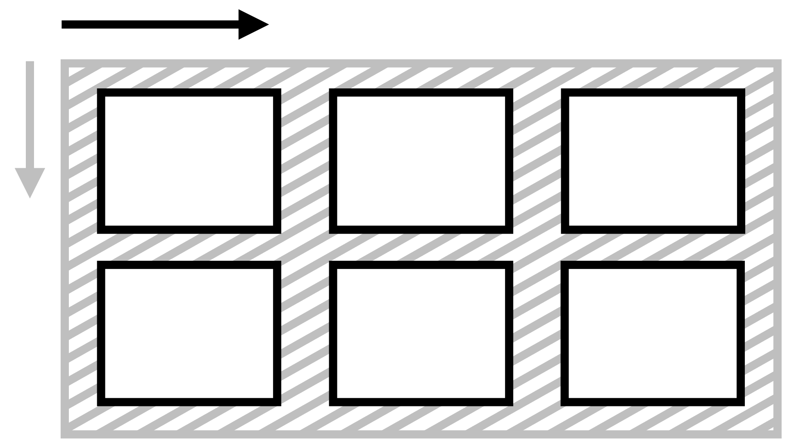

# Vlastnost justify-items: Zarovnání všech položek na hlavní ose

Vlastnost `justify-items` na kontejneru layoutu definuje zarovnání položek na hlavní ose (jinak též řádkové ose) pro layouty v CSS.

Nastavuje výchozí hodnotu `justify-self` pro všechny položky uvnitř kontejneru.

Je dobré zmínit, že ve flexbox layoutu a uvnitř buněk tabulek je vlastnost `justify-items` ignorována.

U flexboxu můžeme pro zarovnání položek na hlavní ose využít klasickou metodu s `margin:auto`, ale `justify-items` zde nerozchodíme. [cdpn.io/e/eYZgOwL?editors=1100](https://codepen.io/machal/pen/eYZgOwL?editors=1100)

## Jednoduchý příklad

V naší ukázce definujeme třísloupcový kontejner Gridu. Všechny tři položky mají omezenou výšku i šířku, aby byl hezky vidět efekt zarovnání, který způsobuje vlastnost `justify-items`.

CodePen: [cdpn.io/e/dyMOxdm?editors=1100](https://codepen.io/machal/pen/dyMOxdm?editors=1100)

## Možné hodnoty zarovnání

<!-- TODO obrázkové schéma pro  základní hodnoty v Gridu podle CodePenu -->

Vlastnosti `justify-items` můžete předávat všechny hodnoty [z jednotlivých obecných kategorií klíčových slov](css-box-alignment.md#typy-klicova-slova):

### Základní

- `normal`  
  Ve většině systémů layoutu, včetně Gridu, bude nastavený jako hodnota `start`, kterou popisujeme níže.
- `auto`  
  Podědí se hodnota `justify-items` od rodičovského elementu. Pokud zde žádný není, dostane prvek hodnotu `normal`.
- `stretch` (výchozí)  
  Položky rozšíří své rozměry tak, aby v kontejneru nezbylo žádné volné místo. Pokud jsou položky menší než kontejner, jejich velikost se zvětší rovnoměrně (nikoli proporcionálně), přičemž stále respektují omezení uložená vlastnostmi jako `max-width`/`max-height`.

### Poziční

- `center`  
  Centruje všechny položky doprostřed kontejneru zarovnání.
- `start`  
  Zarovnává všechny položky k hraně začátku kontejneru.
- `end`  
  Zarovnává všechny položky k hraně konce kontejneru.
- `self-start`  
  Zarovnává všechny položky k hraně začátku kontejneru, která odpovídá začátku předmětu.
- `self-end`  
  Zarovnává všechny položky k hraně konce kontejneru, která odpovídá konci předmětu.
- `flex-start`  
  Hodnota chová jako `start`.
- `flex-end`  
  Hodnota chová jako `end`.
- `left`  
  Chová se jako `start`.
- `right`  
  Chová se jako `end`.

### Podle účaří

- `first baseline`  
  Zarovnání na účaří prvního řádku. Pokud v daném kontextu nelze použít, zarovná se jako `start`.
- `last baseline`  
  Zarovnání na účaří posledního řádku. Pokud v daném kontextu nelze použít, zarovná se jako `end`.
- `baseline`  
  Zkratka pro `first baseline`.

### Pro přetečení

- `safe`  
  Pokud má položka v daném způsobu zarovnání přetéct z obou stran, bude zarovnání změněno tak, aby byl vidět začátek položky, takže aby například bylo možné přečíst začátek textu.
- `unsafe`  
  Vždy dostane přednost poziční zarovnání, bez ohledu na to, zda bude oříznutý obsah čitelný nebo ne.  

Pokud vím, v žádném prohlížeči toto zatím nefunguje.

## Podpora v prohlížečích

Jak už padlo, ve flexboxových layoutech je vlastnost `justify-items` ignorována, takže můžeme i bez nadsázky říct, že ji při použití `display:flex` podporují úplně všechny prohlížeče, které kdy vznikly.

Ale vážněji: při použití `display:grid` zde máme tradiční výjimku – Internet Explorer 11.

Více na [caniuse.com/justify-items](https://caniuse.com/#search=justify-items).
