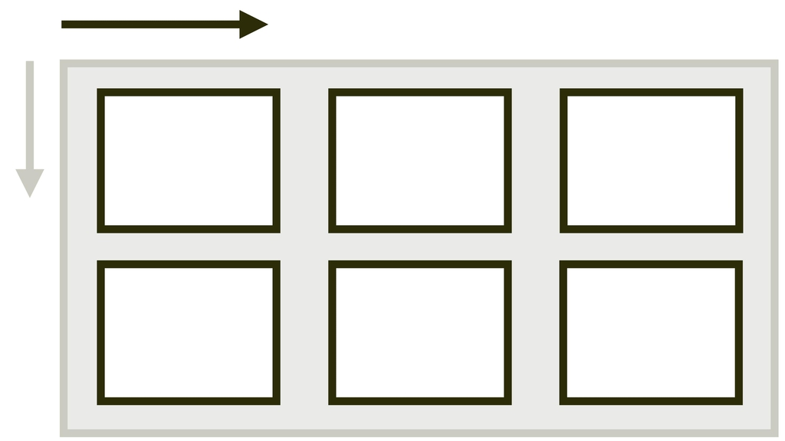
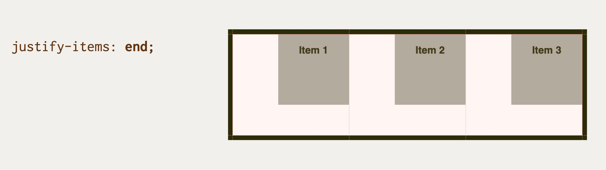
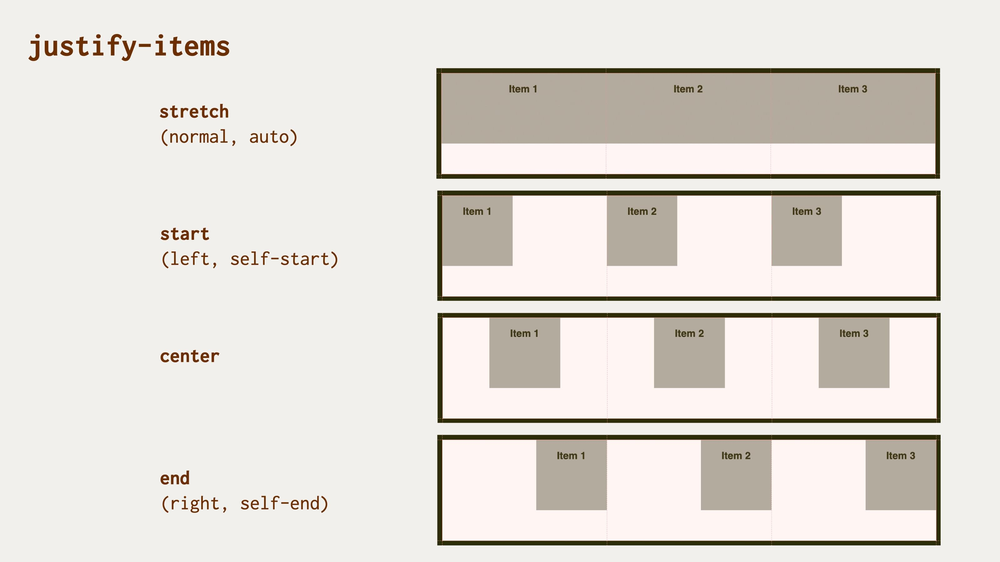

# Vlastnost justify-items: Zarovnání všech položek na hlavní ose

Vlastnost `justify-items` definuje na kontejneru layoutu zarovnání položek na hlavní (jinak též řádkové) ose.

<div class="book-index" data-book-index="justify-items"></div>

<div class="connected" markdown="1">



<div class="web-only" markdown="1">

Vlastnost `justify-items` patří do specifikace pro zarovnání boxů – [CSS Box Alignment](css-box-alignment.md).

Je použitelná uvnitř layoutů dělaných [gridem](css-grid.md).

Můžete také použít zkratku [`place-items`](css-place-items.md).

</div>

<div class="ebook-only" markdown="1">

→ [vrdl.in/cssji](https://www.vzhurudolu.cz/prirucka/css-justify-items)

</div>

</div>

## Příklad s gridem

V naší ukázce definujeme třísloupcový kontejner gridu.

HTML:

```html
<div class="container">
  <div class="item item--1">Item 1</div>
  <div class="item item--2">Item 2</div>
  <div class="item item--3">Item 3</div>
</div>
```

CSS:

```css
.container {
  display: grid;
  grid-template-columns: repeat(3, 1fr);
  justify-items: end;
}
```

Všechny tři položky mají omezenou výšku i šířku, aby byl hezky vidět efekt zarovnání:

```css
.item {  
  height: 5em;
  min-width: 5em;
}
```

Vlastnost `justify-items` zde tedy zarovnává položky na hlavní (vodorovné) ose do prostoru, který je jim vymezený (`1fr`, tedy jeden [podíl na celku](css-jednotka-fr.md)). Hodnota `end` je umístí ke konci onoho vymezeného prostoru.

<figure>

<figcaption markdown="1">
Zarovnání pomocí justify-items:end v Chromu při zapnutém grid overlay.
</figcaption>
</figure>

CodePen: [vrdl.in/5ljcr](https://codepen.io/machal/pen/zYqWgMN?editors=1100)

## Trocha teorie: nastavení justify-self. A pozor, ve flexboxu vlastnost nefunguje

Vlastnost `justify-items` v podstatě nedělá nic jiného, než že nastavuje výchozí hodnotu jiné vlastnosti, a to sice [`justify-self`](css-justify-self.md) pro všechny položky uvnitř kontejneru.

Je dobré zmínit, že ve flexboxovém layoutu a uvnitř buněk tabulek je vlastnost `justify-items` ignorována. Pro vysvětlení jděte na text o [`justify-self`](css-justify-self.md).

U flexboxu můžeme pro zarovnání položek na hlavní ose využít klasickou metodu s `margin:auto`.

V další ukázce můžete vidět, že ve flexboxovém layoutu bude deklarace `justify-items:end` ignorována.

CodePen: [vrdl.in/8sn40](https://codepen.io/machal/pen/eYZgOwL?editors=1100)

## Možné hodnoty zarovnání

<figure>

<figcaption markdown="1">
Hodnoty vlastnosti justify-items.
</figcaption>
</figure>

Vlastnosti `justify-items` můžete předávat všechny hodnoty z jednotlivých obecných kategorií klíčových slov:

### Základní

- `normal` (výchozí)  
  V gridu jde jen o jiný zápis pro hodnotu `stretch`, kterou popisujeme níže.
- `auto`  
  Podědí se hodnota `justify-items` od rodičovského elementu. Pokud zde žádný není, dostane prvek hodnotu `normal`, tedy `stretch`.
- `stretch`  
  Položky rozšíří své rozměry tak, aby v kontejneru nezbylo žádné volné místo. Pokud jsou položky menší než kontejner, jejich velikost se zvětší rovnoměrně (nikoliv proporcionálně), přičemž stále respektují omezení uložená vlastnostmi jako `max-width`/`max-height`.

### Poziční

- `center`  
  Centruje všechny položky doprostřed kontejneru zarovnání.
- `start`  
  Zarovnává všechny položky k hraně začátku kontejneru.
- `end`  
  Zarovnává všechny položky k hraně konce kontejneru.
- `self-start`  
  Zarovnává položky k hraně začátku kontejneru (k začátku předmětu).
- `self-end`  
  Zarovnává položky k hraně konce kontejneru (ke konci předmětu).
- `flex-start`  
  Hodnota se chová jako `start`.
- `flex-end`  
  Hodnota se chová jako `end`.
- `left`  
  Chová se jako `start`.
- `right`  
  Chová se jako `end`.

<!-- AdSnippet -->

### Podle účaří

- `first baseline`  
  Zarovnání na účaří prvního řádku. Pokud hodnotu v daném kontextu nelze použít, zarovná se jako `start`.
- `last baseline`  
  Zarovnání na účaří posledního řádku. Pokud hodnotu v daném kontextu nelze použít, zarovná se jako `end`.
- `baseline`  
  Zkratka pro `first baseline`.

V době psaní funguje zarovnávání na účaří jen ve Firefoxu.

CodePen: [vrdl.in/1ge5c](https://codepen.io/mkfeuhrer/pen/ZEpGQqm?editors=1100)

### Pro přetečení

- `safe`  
  Pokud má položka v daném způsobu zarovnání přetéct z obou stran, bude zarovnání změněno takovým způsobem, aby byl vidět začátek položky, například tak, aby bylo možné přečíst začátek textu.
- `unsafe`  
  Vždy dostane přednost poziční zarovnání, bez ohledu na to, zda bude oříznutý obsah čitelný nebo ne.  

Pokud vím, v žádném prohlížeči ale toto zatím nefunguje.

V následující živé ukázce je možné vyzkoušet několik hodnot:

- výchozí `stretch` (roztažení),
- `end` (zarovnání na konec vymezeného prostoru),
- `left` (obdoba `start`, tedy zarovnání na začátek vymezeného prostoru),
- `center` (zarovnání doprostřed vymezeného prostoru).

CodePen: [vrdl.in/dq0bu](https://codepen.io/machal/pen/OJjyqpK?editors=1100)

## Podpora v prohlížečích

Jak už padlo, ve flexboxových layoutech je vlastnost `justify-items` ignorována, takže můžeme i bez nadsázky říct, že ji při použití `display:flex` podporují úplně všechny prohlížeče, které kdy vznikly…

Ale vážně:

- Zarovnání pro přetečení (`safe`) nepodporuje žádný prohlížeč.
- Zarovnání na účaří podporuje jen Firefox.
- Vlastnost nepodporuje Internet Explorer 11.

Podstatná sada hodnot je v moderních prohlížečích podporována, takže se vlastnosti `justify-items` nebojte.

Více na [caniuse.com/justify-items](https://caniuse.com/#search=justify-items).

<!-- AdSnippet -->
