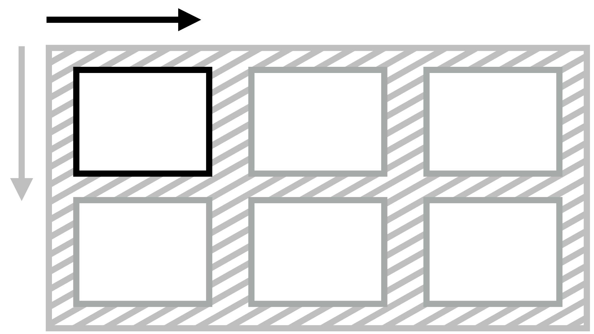

# Vlastnost justify-self: Zarovnání položky na hlavní ose

Vlastnost `justify-self` určuje zarovnání položky na hlavní ose (jinak též řádkové ose).

Je dobré zmínit, že ve flexbox layoutu a uvnitř buněk tabulek je vlastnost `justify-self` ignorována. V Grid layoutu se položka zarovnává uvnitř své oblasti, což je obvykle buňka mřížky.

U flexboxu můžeme pro zarovnání položek na hlavní ose využít klasickou metodu s `margin:auto`, podobně jako u [`justify-items`](css-justify-items.md). Hodnota `auto` u vnějších okrajů má ostatně před touto `justify-self` přednost ve všech systémech rozvržení v CSS.

## Jednoduchý příklad

V naší ukázce definujeme třísloupcový kontejner Gridu.

CodePen: [cdpn.io/e/QWNvKQJ](https://codepen.io/machal/pen/QWNvKQJ?editors=1100)

Následuje několik užitečných vysvětlovacích odrážek:

- První dvě položky nemají vlastnost `justify-self` nastavenou, takže získají výchozí hodnotu `stretch` a roztáhnou se do celé šířky prostoru buňky.
- Poslední položka má nastaveno `justify-self:end`, takže by se měla „scvrknout“ na přirozenou šířku podle obsahu a zarovnat ke konci prostoru buňky, což je zároveň pravá hrana kontejneru.
- Vyhrává ovšem deklarace `margin-right:auto`, která buňku zarovná na začátek prostoru buňky a funguje tedy stejně jako `justify-self:end`.

## Možné hodnoty zarovnání

Vlastnosti `justify-self` můžete předávat všechny hodnoty [z jednotlivých obecných kategorií klíčových slov](css-box-alignment.md#typy-klicova-slova):

### Základní

- `auto` (výchozí)  
  Podědí se hodnota `justify-items` od rodičovského elementu. Pokud zde žádný není, dostane prvek hodnotu `normal`.
- `normal`  
  V CSS Gridu bude nastavený jako hodnota `stretch`, ale například v blokových layoutech (`display:block`) jako `start`.
- `stretch`  
  Položka rozšíří své rozměry tak, aby v kontejneru nezbylo žádné volné místo. Pokud jsou položky menší než kontejner, jejich velikost se zvětší rovnoměrně (nikoli proporcionálně), přičemž stále respektují omezení uložená vlastnostmi jako `max-width`/`max-height`.

### Poziční

- `center`  
  Položka se centruje doprostřed jí určeného prostoru.
- `start`  
  Položka se zarovnává k hraně začátku jí určeného prostoru.
- `end`  
  Položka se zarovnává k hraně konce jí určeného prostoru.
- `self-start`  
  Hodnota chová jako `start`.
- `self-end`  
  Hodnota chová jako `end`.
- `flex-start`  
  Chová se jako `start`.
- `flex-end`  
  Chová se jako `end`.
- `left`  
  Chová se jako `start`.
- `right`  
  Chová se jako `end`.

### Podle účaří

- `first baseline`  
  Zarovnání na účaří prvního řádku. Pokud v daném kontextu nelze použít, zarovná se jako `start`.
- `last baseline`  
  Zarovnání na účaří posledního řádku. Pokud v daném kontextu nelze použít, zarovná se jako `end`.
- `baseline`  
  Zkratka pro `first baseline`.

### Pro přetečení

- `safe`  
  Pokud má položka v daném způsobu zarovnání přetéct z obou stran, bude zarovnání změněno tak, aby byl vidět začátek položky, takže aby například bylo možné přečíst začátek textu.
- `unsafe`  
  Vždy dostane přednost poziční zarovnání, bez ohledu na to, zda bude oříznutý obsah čitelný nebo ne.  

Pokud vím, v žádném prohlížeči toto zatím nefunguje.

## Podpora v prohlížečích

Jak už padlo, ve flexboxových layoutech je vlastnost `justify-self` ignorována, takže i tady můžeme říct, že ji při použití `display:flex` podporují (ale neaplikují) úplně všechny prohlížeče.

Při použití `display:grid` zde máme tradiční výjimku – Internet Explorer 11.

Více na [caniuse.com/justify-self](https://caniuse.com/#search=justify-self).
