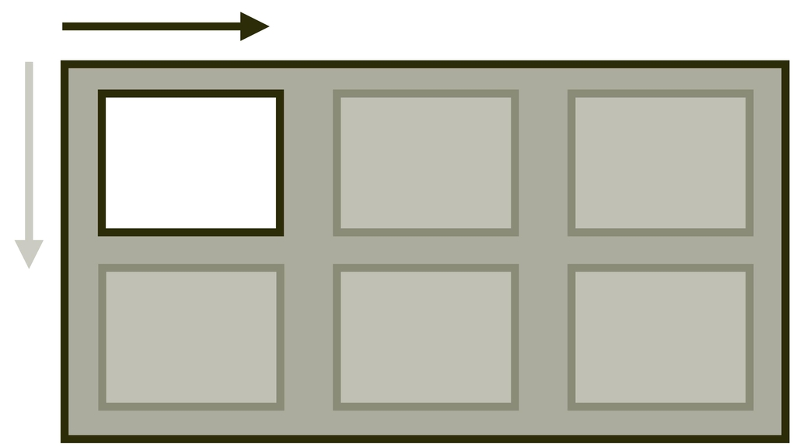
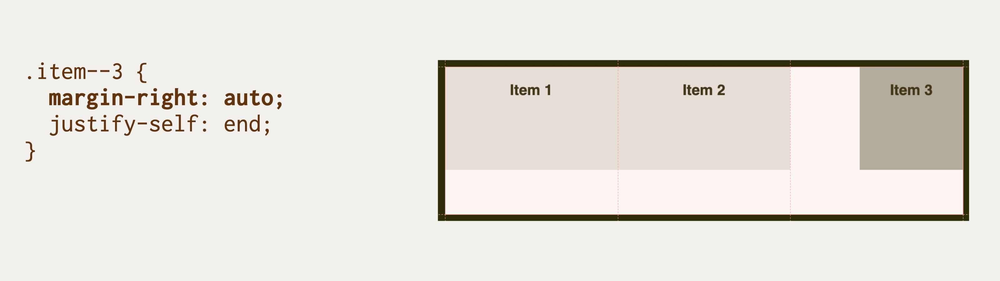
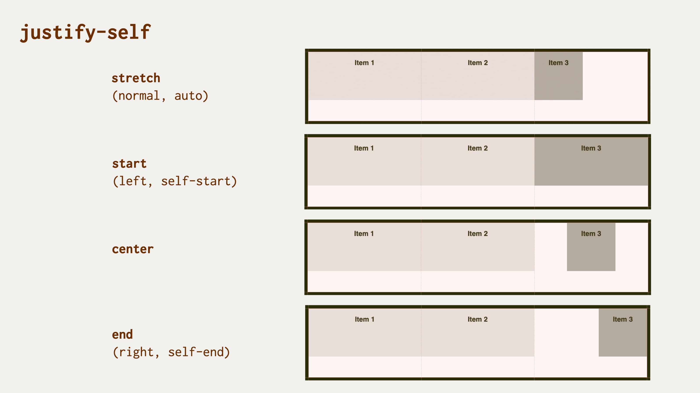

# Vlastnost justify-self: Zarovnání položky na hlavní ose

Vlastnost `justify-self` určuje zarovnání položky na hlavní ose (jinak též řádkové ose).

<div class="book-index" data-book-index="justify-self"></div>

<div class="connected" markdown="1">



<div class="web-only" markdown="1">

Vlastnost `justify-self` patří do specifikace pro zarovnání boxů – [CSS Box Alignment](css-box-alignment.md).

Můžete ji využít v layoutech tvořených [gridem](css-grid.md).

</div>

<div class="ebook-only" markdown="1">

→ [vrdl.in/cssjs](https://www.vzhurudolu.cz/prirucka/css-justify-self)

</div>

</div>

Je dobré zmínit, že uvnitř buněk tabulek a ve [flexboxu](css-flexbox.md) je vlastnost `justify-self` ignorována. V layoutu pomocí gridu se položka zarovnává uvnitř své oblasti, což je obvykle buňka mřížky.

U flexboxu je možné pro zarovnání položek na hlavní ose využít klasickou metodu s automatickým vnějším okrajem `margin:auto`, podobně jako u [`justify-items`](css-justify-items.md).

<!-- AdSnippet -->

## Příklad: margin má přednost před justify-self

V naší ukázce definujeme třísloupcový kontejner gridu. Poslední, jinak zbarvenou položku pak zarovnáváme pomocí `justify-self`.

HTML vám asi bude povědomé:

```html
<div class="container">
  <div class="item item--1">
    Item 1
  </div>
  <div class="item item--2">
    Item 2
  </div>
  <div class="item item--3">
    Item 3
  </div>  
</div>
```

Definice třísloupcového kontejneru gridu pak vypadá zhruba následovně:

```css
.container {
  display: grid;
  grid-template-columns: repeat(3, 1fr);
  height: 10em;  
}
```

Nakonec deklarace pro poslední položku:

```css
.item--3 {
  margin-right: auto;
  justify-self: end;
}
```

Tady vlastně zarovnáváme dvěma způsoby. Všimli jste si toho? Jednou doleva (`margin-right:auto`) a jednou doprava (`justify-self:end`). Co myslíte, bude platit poslední deklarace, jako je tomu u CSS vždy? Nikoliv, zarovnání pomocí vnějších okrajů zde má přednost navzdory kaskádě.

Zkuste si tu první deklaraci schválně v živé ukázce odmazat.

<figure>

<figcaption markdown="1">
Vlastnost margin má přednost před justify-self.
</figcaption>
</figure>

Následuje několik užitečných vysvětlujících odrážek:

- První dvě položky nemají vlastnost `justify-self` nastavenou, takže získají výchozí hodnotu `stretch` a roztáhnou se do celé šířky prostoru buňky.
- Poslední položka má nastaveno `justify-self:end`, takže by se měla „scvrknout“ na přirozenou šířku podle obsahu a zarovnat ke konci prostoru buňky, což je zároveň pravá hrana kontejneru.
- Vyhrává ovšem deklarace `margin-right:auto`, která buňku zarovná na začátek prostoru buňky, a funguje tedy stejně jako `justify-self:start`.

CodePen: [vrdl.in/zmso0](https://codepen.io/machal/pen/QWNvKQJ?editors=1100)

## Příklad: proč to ve flexboxu nefunguje

V dalším CodePenu je vidět, že `justify-self` ve flexboxu opravu nefunguje. Pokouším se tam stylovat poslední položku pomocí `justify-self:end`. A nic.

CodePen: [vrdl.in/eo9cq](https://codepen.io/machal/pen/MWJaVyZ?editors=1100)

Zde je potřeba vysvětlit, proč tomu tak je.

Prvním důvodem je, že ve flexboxu nejsou vlastnosti `justify-self` a tím pádem ani [`justify-items`](css-justify-items.md) potřeba – můžete totiž úplně v pohodě použít `margin` a jeho hodnotu `auto`.

Za druhé, u flexboxu se – na rozdíl od gridu – počítá s přítomností více položek na hlavní ose. Pravděpodobně nechcete dělat flexboxové rozvržení s jednou položkou. Nebo chcete, ale pro tohle flexbox vymyšlený nebyl. Pro zarovnání více položek je dobrá [vlastnost `justify-content`](css-justify-content.md).

Mám tedy jednu dobrou a jednu špatnou zprávu. Ta dobrá: Pro zarovnání položek na hlavní ose ve flexboxu používejte `margin` nebo `justify-content`. A ta špatná? Budete si to muset zapamatovat. Zabývá se tím krásná diskuze „In CSS Flexbox, why are there no ,justify-items’ and ,justify-self’ properties?“ na Stack Overflow. [vrdl.in/qabny](https://stackoverflow.com/a/32569434/889682)

## Možné hodnoty zarovnání

<figure>

<figcaption markdown="1">
Hodnoty vlastnosti justify-self.
</figcaption>
</figure>

Vlastnosti `justify-self` můžete předávat všechny hodnoty z jednotlivých obecných kategorií klíčových slov specifikace CSS Box Alignment:

### Základní

- `auto` (výchozí)  
  Podědí se hodnota `justify-items` od rodičovského elementu. Pokud zde žádný není, dostane prvek hodnotu `normal`.
- `normal`  
  V CSS gridu jde jen o jiný zápis pro hodnotu `stretch`, ale například v blokových layoutech (`display:block`) je to alternativa pro `start`.
- `stretch`  
  Položka rozšíří své rozměry tak, aby v kontejneru nezbylo žádné volné místo. Pokud jsou položky menší než kontejner, jejich velikost se zvětší rovnoměrně (nikoliv proporcionálně), přičemž stále respektují omezení uložená vlastnostmi jako `max-width`/`max-height`.

Po dekódování zašmodrchaností specifikace můžeme konstatovat, že výchozí hodnota je vždy `stretch`, tedy roztažení do šířky.  

<!-- AdSnippet -->

### Poziční

- `center`  
  Položka se centruje doprostřed jí určeného prostoru.
- `start`  
  Položka se zarovnává k hraně začátku jí určeného prostoru.
- `end`  
  Položka se zarovnává k hraně konce jí určeného prostoru.
- `self-start`  
  Hodnota se chová jako `start`.
- `self-end`  
  Hodnota se chová jako `end`.
- `flex-start`  
  Chová se jako `start`.
- `flex-end`  
  Chová se jako `end`.
- `left`  
  Chová se jako `start`.
- `right`  
  Chová se jako `end`.

### Podle účaří

- `first baseline`  
  Zarovnání na účaří prvního řádku. Pokud hodnotu v daném kontextu nelze použít, zarovná se jako `start`.
- `last baseline`  
  Zarovnání na účaří posledního řádku. Pokud hodnotu v daném kontextu nelze použít, zarovná se jako `end`.
- `baseline`  
  Zkratka pro `first baseline`.

### Pro přetečení

- `safe`  
  Pokud má položka v daném způsobu zarovnání přetéct z obou stran, bude zarovnání změněno takovým způsobem, aby byl vidět začátek položky, například tak, aby bylo možné přečíst začátek textu.
- `unsafe`  
  Vždy dostane přednost poziční zarovnání, bez ohledu na to, zda bude oříznutý obsah čitelný nebo ne.  

Toto v žádném prohlížeči zatím nefunguje.

## Podpora v prohlížečích

V rámci flexboxu a v tabulkovém layoutu tuto vlastnost nemůžete použít v žádném prohlížeči.

Při použití s `display:grid` je podpora v prohlížečích plná, jen v Internet Exploreru je hlášeno několik bugů. Více na CanIUse. [caniuse.com/justify-self](https://caniuse.com/#search=justify-self)

<!-- AdSnippet -->
