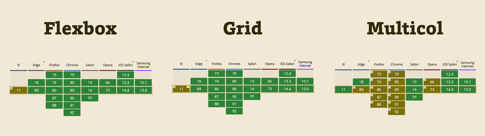
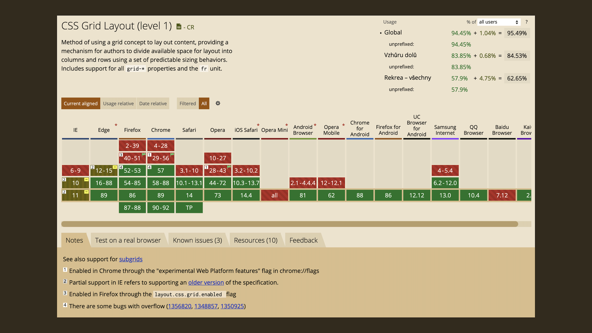
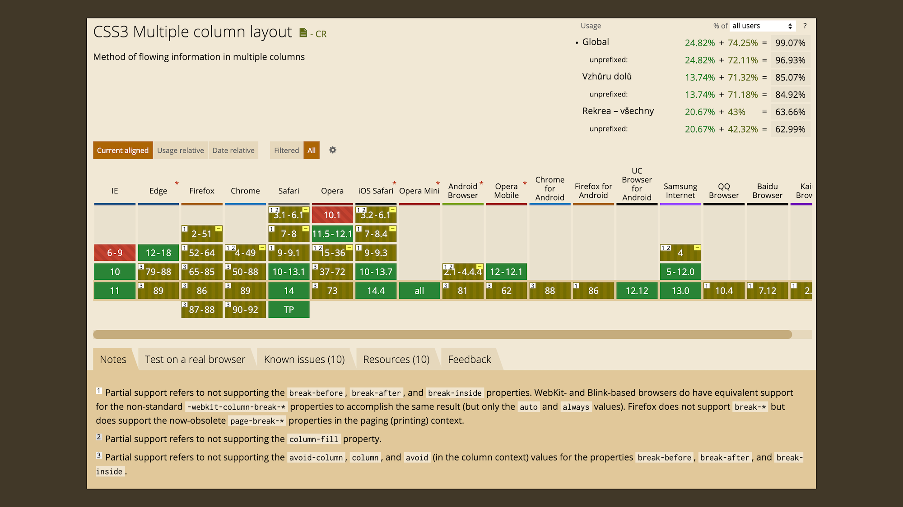
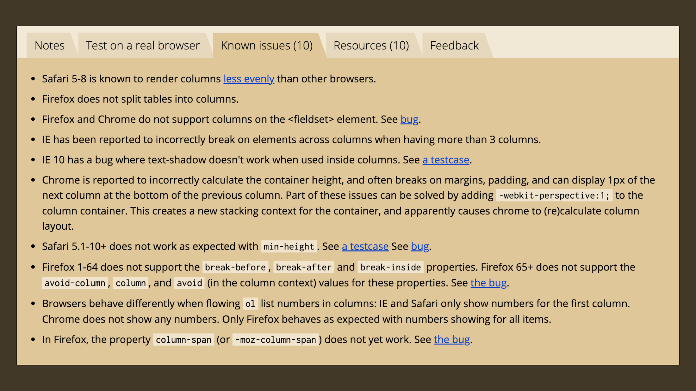

# Podpora flexboxu, gridu a vícesloupcového layoutu v prohlížečích

To, že se v e-booku o layoutech v CSS zabýváme starým Explorerem, samozřejmě není jen tak. V této podkapitole se chceme zaměřit na problémy prohlížečů s podporou flexboxu, gridu a spol.

„Nové systémy layoutu v CSS jsou tak úžasné, že to jistě musí mít nějaký háček“, mohl by si někdo myslet.

Autorovi téhle myšlenky bychom museli přiznat jistou dávku zdravého skepticismu. Nebo dokonce nemalou životní zkušenost s vývojem webů.

- [CSS Flexbox](css-flexbox.md)
- [CSS grid](css-grid.md)
- [CSS Multicol](css-multicolumn.md)
- [CSS Box Align](css-box-alignment.md)

Je to tak, milé čtenářky a milí čtenáři, určitá „ale“ zde jsou. Musíme ovšem s úlevou prohlásit, že oproti dřívějšímu stavu je přítomnost chyb spojených s flexboxem nebo gridem v prohlížečích minimální.

<figure>

<figcaption markdown="1">
*Čím více zelené, tím více podpory. Zelenohnědá značí, že daný prohlížeč má nějaký problém. Zdroj: [CanIUse.com](https://caniuse.com/).*
</figcaption>
</figure>

Flexbox, grid nebo vícesloupcový layout se na nás z CanIUse směje zeleně.

Trošku nás zlobí Internet Explorer v poslední verzi 11, u gridu nás zlobí více.

Co konkrétně znamenají ty zelenohnědé obdélníky?

- Jediným větším a hůře odstranitelným problémem je slabá podpora CSS gridu ze strany Internet Exploreru 11, i to se ale dá částečně [řešit Autoprefixerem](css-grid-msie.md).
- U flexboxu máme prakticky plnou podporu, jen v IE 11 si musíme dát pozor na pár chyb.
- Podpora vícesloupcového layoutu je naopak v Exploreru výborná. Moderní prohlížeče si ale většinou  hůř rozumějí s [vlastnostmi `break-*`](css-multicol-break.md), určenými pro ovládání zalamování vnitřních prvků do sloupců.

<!-- AdSnippet -->

V textu vezmeme nové systémy layoutu jeden po druhém a k jejich podpoře v prohlížečích si něco povíme.

## Flexbox a „flexboty“ v IE11 {#flexbox}

Když jsem začal [flexbox](css-flexbox.md) před lety používat, bylo to trochu jako procházka minovým polem.

Za každým řádkem kódu mohla číhat nekompatibilita v některém prohlížeči. Člověk potřeboval detektor min a tím se stala stránka „Flexbugs“ od Philipa Waltona. Jde o seznam 17 chyb v prohlížečích, které tehdy potřeboval znát každý, kdo pokouší osud psaním flexboxového kódu. [github.com/philipwalton/flexbugs](https://github.com/philipwalton/flexbugs)

Znalost některých chyb byla tak zásadní, že jsem je svého času musel učit na svých školeních. A při té příležitosti jsem jim začal říkal česky: _flexboty_. Boty, které zanechali výrobci prohlížečů při implementaci flexboxu.

Když jsem během psaní tohoto textu srovnával současný stav s tím dřívějším, došel jsem k radostnému poznání.

<figure>

<figcaption markdown="1">
*Jak je to krásně zelené! Podpora flexboxu v moderních prohlížečích je takřka bezchybná. Zdroj: [CanIUse.com](https://caniuse.com/flexbox).*
</figcaption>
</figure>

Je to tak, jak vidíte na obrázku. Takřka všechny chyby v moderních prohlížečích jsou opravené. Zůstaly jen ty navázané na Internet Explorer 11.

Dnes už tedy můžete psát flexboxový kód, aniž byste se museli bát. Stačí se vyhnout určitým zápisům a bude to vše dobře fungovat i v Internet Exploreru 11.

### Podpora flexboxu je prakticky plná {#flexbox-podpora}

Pojďme říct důležitou věc – fungování flexboxu napříč prohlížeči, včetně posledního Exploreru, je konzistentní a podporu považuji za takřka plnou.

U chyb, které v následujícím textu uvádím, se jedná o boty menší velikosti. Ale když už si o flexboxu povídáme takto detailně, je potřeba se o nich zmínit.

### Flexboty v moderních prohlížečích {#flexbox-moderni}

Moderní prohlížeče, tedy všechny kromě Internet Exploreru, byly zodpovědné za 5 chyb ze seznamu Philipa Waltona.

To už ale dávno neplatí, dle mých testů zůstaly jen dvě málo důležité chyby.

- _Některé elementy nemohou být flex-kontejnerem. (Flexbug #9)_  
Dříve to platilo i pro `<fieldset>` a `<button>` ve všech prohlížečích, což je naštěstí opravené. Zůstává jen málo nepříjemné omezení použití flexboxu na prvku `
` v prohlížeči Safari. V tomto případě stačí použít vložený `
` jako kontejner pro rozvržení flexboxem.
- _Zalamované elementy na inline flexboxu přetékají z rodiče (Flexbug #14)_  
Jde o kombinaci použití `flex-flow:column wrap` a `display:inline-flex`, takže poměrně vzácný scénář. Vnitřní prvky pak ve všech prohlížečích „vylezou“ z velikosti rodiče, i když by neměly. Je možné to obejít například pomocí nastavení `flex-direction:row` a změnou směru vykreslení zápisem vlastnosti `writing-mode`.

V CodePenu se můžete podívat na řešení druhé uvedené flexboty.

CodePen: [cdpn.io/e/RjvQgx](https://codepen.io/philipwalton/pen/RjvQgx)

A co náš dědeček mezi prohlížeči?

### Flexboty v IE11 {#flexbox-ie11}

Tohle je zajímavější. Internet Explorer byl sice první prohlížeč, který moderní layouty naimplementoval, ale stejně jako všechny ostatní „prvoimplementace“ šlo o pokus plný chyb.

Problémem IE tedy není množství chyb, chyby dělají všichni programátoři prohlížečů, ale způsob aktualizace.

Kdysi tak populární prohlížeč od Microsoftu vycházel v nových verzích z dnešního pohledu velmi pomalu, po letech, nikoliv měsících. A navíc – jedenáctá verze Exploreru je poslední a nikdo ji už aktualizovat nebude.

Pojďme na ty chyby, ať tu nepříjemnost máme za sebou.

1. Vlastnost `flex-basis` nezohledňuje `box-sizing:border-box` _(flexbug #7)_.
2. Vlastnost `flex` s nulovou `flex-basis` neplatí _(flexbug #4)_.
3. Vlastnost `flex-basis` neumí funkci `calc()` _(flexbug #8)_.
4. Položky flexboxu nemohou být `display:inline` _(flexbug #12)_.
5. Položky flexboxu se špatně zarovnají, když se užívá `max-width` _(flexbug #17)_.
6. Položky flexboxu lezou z kontejneru, který má `align-items:center` _(flexbug #2)_.
7. Vlastnost `min-height` na flex kontejneru nefunguje _(flexbug #3)_.
8. Pložky flexboxu neudržují poměr stran _(flexbug #5)_.
9. Položky flexboxu neumí zarovnání pomocí `margin:auto` na příčné ose _(flexbug #15)_.

Máte přečteno? A máte z toho depresi? Chvilku počkejte.

<!-- AdSnippet -->

Tyhle chyby detailně znát nemusíte. Většinu vaší práce s flexboxem neohrozí. Stačí jen vědět, že si v případě _podivného_ chování IE11 u flexboxu musíte vzpomenout na existenci stránky Flexbugs nebo tohoto textu. A pak ještě jednu věc.

### Zkuste vynechat flex-basis

Když jsem se vývojářů na Twitteru ptal na jejich mentální zkratky spojené s flexboxem a gridem, Daniel Střelec napsal jednu, se kterou se ztotožňuji:

> U flexboxu jsem se naučil definovat vždy kompletní zápis, tedy `flex: 1 1 auto` (nespoléhat na default) a pokud to jde, tak používat `width` místo `flex-basis` nebo obojí.

Často tedy stačí namísto [vlastnosti `flex-basis`](css-flex-basis.md) použít `width` nebo `height` a všechno to dobře funguje.

Věřte mi. Nic komplikovaného na tom není a používat flexbox i s podporou IE11 je úplně v pohodě.

### A co další chyby?

Pokud jste počítali, do celkového počtu 17 chyb stále tři chybí. Ano, máte pravdu a vyhráváte… pobyt v Muzeu historie webových prohlížečů.

Zbývající 3 boty má na svědomí Internet Explorer 10 a ten, jak už jsem psal, dávno vyhynul.

Pokud by vás opravdu hodně zajímaly, podívejte se na tu svého času slavnou stránku Philipa Waltona. Flexbugs: [github.com/philipwalton/flexbugs](https://github.com/philipwalton/flexbugs)

Více informací o podpoře je na Can I Use. [caniuse.com/flexbox](https://caniuse.com/flexbox)

## grid {#grid}

V případě gridu se – daleko silněji než u flexboxu – musíme rozdělit na dvě skupiny vývojářek a vývojářů.

Na ty, kteří nemusí Internet Explorer 11 podporovat.

A pak na ty, kteří mají trochu smůlu.

<figure>

<figcaption markdown="1">
*Podpora gridu v prohlížečích. Zelenohnědá barva u IE nevěští nic dobrého. Zdroj: [CanIUse.com](https://caniuse.com/css-grid).*
</figcaption>
</figure>

Když jsem si na Twitteru dělal průzkum mezi vývojáři, vyšlo mi, že významná většina dává přednost flexboxu před gridem. Obávám se, že za to může komplikace jménem podpora gridu v IE.

Je potřeba říct, že i tenhle prohlížeč grid podporuje a nepodporuje toho z něj vůbec málo: implicitní mřížku, [funkci `repeat()`](css-repeat.md), funkci [`minmax()`](css-minmax.md) nebo klíčová slova `min-content` a `max-content`.

Na druhou stranu – jde jen o menší podmnožinu současné šíře vlastností toho čemu říkáme CSS grid Layout, navíc často jinak implementovanou.

Máme zde sice [Autoprefixer](autoprefixer.md), který „současný grid“ umí překládat do podoby „IE gridu“, ale jen částečně a navíc to vyžaduje další znalosti a schopnost tento nástroj bezchybně nastavit.

Prostě to s gridem v IE je složité a já se vůbec nedivím lidem, kteří říkají „skoro na všechno mě stačí flexbox“, i když pak flexbox používají pro situace, kde by byl výhodnější grid.

Jo, to když Explorer podporovat nemusíte, to je jiná písnička…

<!-- AdSnippet -->

V další podkapitole si o podpoře gridu v IE povíme více.

Odkážu vás ještě na plnohodnotný text [o řešení gridu v Internet Exploreru](css-grid-msie.md) a pojďme dál.

### gridbugs, boty v mřížce {#gridbugs}

Podobně jako první implementace flexboxu, také první napsané enginy pro vykreslování gridu byly v prohlížečích plné chyb.

A tak se známá propagátorka moderních rozvržení v CSS, Rachel Andrew, nechala inspirovat stránkou Flexbugs a vytvořila svého času její obdobu pro mřížku. Vznikly gridbugs. [github.com/rachelandrew/gridbugs](https://github.com/rachelandrew/gridbugs)

Asi jste si všimli, že o té stránce píšu v minulém čase. Ke dni psaní zde vidím poslední commit ze září 2017. Podobně jako u flexboxu, také u gridu postupně prohlížeče chyby odstranily.

Během přípravy pro psaní tohoto textu jsem poctivě prošel všech 14 chyb a podle všeho zůstává aktivní jen jedna bota, _gridbug #3_ – chybějící podpora fragmentace.

Jde o to, že prohlížeče v layoutu dělaném gridem špatně implementují vlastnosti jako `break-*`, kterými můžeme vynucovat konec stránky například v tiskové verzi.

Všechny ostatní chyby jsou, zdá se, opravené. Takže, když nebereme v úvahu Internet Explorer (jak úlevné!), CanIUse nás zaplaví zelenou barvou jako louka na jaře. [caniuse.com/css-grid](https://caniuse.com/css-grid)

## Vícesloupcové rozvržení, CSS Multiple Columns {#css-multicol}

[Multicolumn layout](css-multicolumn.md) v CSS, takže sada specifikovaná kolem vlastnosti `column`, je na tom s podporou v prohlížečích poměrně dobře.

Zajímavé je, že tuto specifikaci trápí spíše nedodělky v moderních prohlížečích. Implementace v Exploreru je vlastně výborná.

<figure>

<figcaption markdown="1">
*Podpora vícesloupcového layoutu v prohlížečích. Zelená je na místech, které byste možná nečekali. Zdroj: [CanIUse.com](https://caniuse.com/multicolumn).*
</figcaption>
</figure>

Chyby v Chrome a Firefoxu zde zůstávají už léta hlavně proto, že sloupcový systém rozvržení v CSS není právě často používaný a tudíž tlak na programátory prohlížečů není tak velký.

Jsou to chyby spíše menšího kalibru, ale je jich poměrně dost.

<figure>

<figcaption markdown="1">
*Pytel blech. Drobné problémy ve vícesloupcovém layoutu. Zdroj: [CanIUse.com](https://caniuse.com/multicolumn).*
</figcaption>
</figure>

Asi nejznámějším bugem je špatná podpora zalamování pomocí [vlastností typu `break-*`](css-multicol-break.md) v prohlížeči Chrome a všech, které z něj vycházejí.

Pokud bychom se ale dnes mohli bavit o nějakém „zabugovaném“ systému layoutu, nebyl byl to grid ani flexbox. Černého Petra bohužel vyhrává vícesloupcové rozvržení.

Více informací najdete na našem oblíbeném webu. [caniuse.com/multicolumn](https://caniuse.com/multicolumn)

## A co zarovnávání, CSS Box Align? {#box-align}

Čtvrtou specifikací z party systémů rozvržení v CSS je [zarovnání boxů](css-box-alignment.md).

Tenhle systém layoutu bohužel samostatný záznam na CanIUse nemá. Je to proto, že původně šlo o součást specifikace flexboxu, kde také na webu sledujícím podporu v prohlížečích vlastnosti ze specifikace CSS Box Alignment zůstaly.

Najdete je zde jako jednotlivé vlastnosti, když budete hledat text `align-` nebo `justify-`.

### Tabulky podpory CSS Box Align v Internet Exploreru {#box-align-tabulka}

Podpora v moderních prohlížečích je zde vynikající, ale je potřeba zmínit, že i v tomto případě je Internet Explorer problematický. Opět hlavně v kombinaci s gridem.

|                                     | **Hlavní osa** (`justify-*`) | **Příčná osa** (`align-*`) | **Oba směry** (`place-*`) |
|-------------------------------------|------------------------------|----------------------------|--------------------------|
| **Zarovnání položek** (`*-items`)   |  [`justify-items`](css-justify-items.md) IE: ~~flex~~, ~~grid~~     | [`align-items`](css-align-items.md) IE: flex, ~~grid~~      | [`place-items`](css-place-items.md) IE: ~~flex~~, ~~grid~~ |
| **Zarovnání sebe sama** (`*-self`)  |  [`justify-self`](css-justify-self.md) IE: ~~flex~~, grid      | [`align-self`](css-align-self.md) IE: flex, grid       | [`place-self`](css-place-self.md) IE: ~~flex~~, ~~grid~~ |
| **Distribuce obsahu** (`*-content`) |  [`justify-content`](css-justify-content.md) IE: flex, ~~grid~~    | [`align-content`](css-align-content.md) IE: flex, ~~grid~~    | [`place-content`](css-place-content.md) IE: ~~flex~~, ~~grid~~ |

Jak je vidno, v moderních prohlížečích je to v pořádku.

Nepodpora `justify-items` i `justify-self` v IE je vlastnost, nikoliv bug. Tyto s flexboxem bohužel nelze kombinovat v žádném prohlížeči.

V případě, že podporujete IE to je u gridu celkově složitější, viz následující [pojednání o tom](css-grid-msie.md).

Explorer také nepodporuje novější hodnoty některých vlastností: `baseline` a `stretch` vlastností [`align-self`](css-align-self.md) a [`justify-content`](css-justify-content.md) nebo také `space-evenly` u [`justify-content`](css-justify-content.md).

### Na layout typu masonry zatím čekáme

`align-tracks`, `justify-tracks` a další části [layoutu typu masonry](css-masonry.md) v CSS zatím žádný prohlížeč nepodporuje.

Layouty typu Masonry v CSS zatím tedy sledujte, ale pro praktické nasazení využijte jinou cestu.

## Shrnutí podpory

Jak sami vidíte, o různých problémech systémů rozvržení v CSS v různých prohlížečích se dá popsat hodně papíru. A to jsem leccos vynechal.

Nicméně, důležitý je celkový dojem. Pokusím se to shrnout takto:

- [Flexbox](css-flexbox.md) je víceméně bezproblémový. Při použití ve Exploreru raději nahraďte `flex-basis` za `width` nebo `height`.
- [Grid](css-grid.md) je v Exploreru problémový, musíte mít [zvláštní znalosti](css-grid-msie.md). V moderních prohlížečích skoro úplně bez potíží.
- [Vícesloupcový layout](css-multicolumn.md) umí zkomplikovat život menšími chybami, ale je jich dost.
- [Zarovnání boxů](css-box-alignment.md) je v případě flexboxu skoro bez zádrhelů všude, v případě gridu je to s IE opět složitější.

A to je vše. Děkuji vám za pozornost.

Setkali jste se někdy s jinou chybou v nových systémech layoutu v CSS? Napište to do komentářů.

