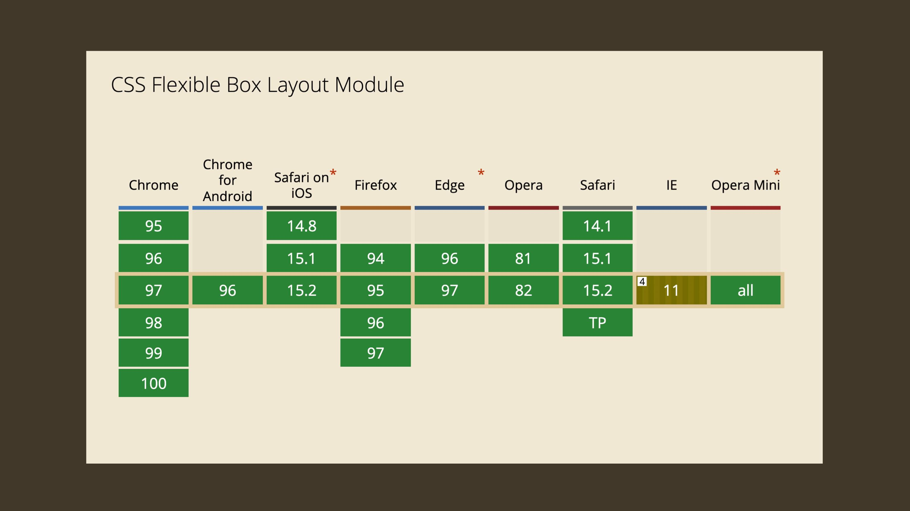
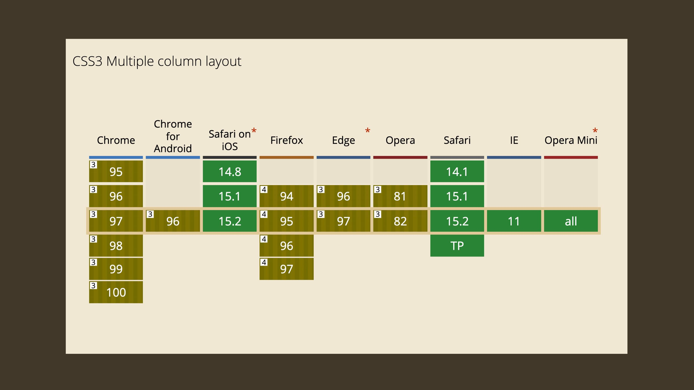

# Podpora layoutů v prohlížečích

To, že se v e-booku o layoutech v CSS zabýváme starým Explorerem, samozřejmě není jen tak. V této podkapitole se chceme zaměřit na problémy prohlížečů s podporou flexboxu, gridu a spol.

Pokud Explorer na svých projektech nepodporujete, pak i tuto podkapitolu směle přeskočte. Explorer vám velmi zkomplikuje využití CSS gridu, všechny ostatní systémy layoutu tam ale jsou použitelné.

Ty drobné chyby, které se vztahují na moderní prohlížeče a mřížku, flexbox, vícesloupcový layout a zarovnání boxů, spíše nestojí za řeč a budu je dále rozebírat v kapitolách s příručkou k jednotlivým vlastnostem.

„Nové systémy layoutu v CSS jsou tak úžasné, že to jistě musí mít nějaký háček,“ mohl by si někdo myslet.

Autorovi téhle myšlenky bychom museli přiznat jistou dávku zdravého skepticismu. Nebo dokonce nemalou životní zkušenost s vývojem webů.

- [CSS Flexbox](css-flexbox.md)
- [CSS grid](css-grid.md)
- [CSS Multicol](css-multicolumn.md)
- [CSS Box Align](css-box-alignment.md)

Je to tak, milé čtenářky a milí čtenáři, určitá „ale“ zde jsou. Musíme ovšem s úlevou prohlásit, že oproti dřívějšímu stavu je přítomnost chyb spojených s flexboxem nebo gridem v prohlížečích minimální.

<figure>

<figcaption markdown="1">
*Čím více zelené, tím více podpory. Zelenohnědá značí, že daný prohlížeč má nějaký problém. Ale ne s vámi, neberte si to osobně. Zdroj: [CanIUse.com](https://caniuse.com/).*
</figcaption>
</figure>

Flexbox, grid nebo vícesloupcový layout se na nás z CanIUse většinou směje zeleně.

Co konkrétně znamenají ty zelenohnědé obdélníky na obrázku?

- Jediným větším a hůře odstranitelným problémem je slabá podpora CSS gridu ze strany Internet Exploreru 11, i to se ale dá částečně řešit Autoprefixerem.
- U flexboxu máme prakticky plnou podporu, jen v MSIE 11 si musíme dát pozor na pár chyb.
- Podpora vícesloupcového layoutu je naopak v Exploreru výborná. Moderní prohlížeče si ale většinou  hůř rozumějí s [vlastnostmi `break-*`](css-multicol-break.md), určenými pro ovládání zalamování vnitřních prvků do sloupců.

Mimochodem, poprvé jsem tady zmínil skvělý nástroj [Autoprefixer](autoprefixer.md), který automaticky dodává CSS prefixy i další kód pro starší prohlížeče. Předpokládám jeho obecnou znalost, ale pokud jste se s ním zatím nesetkali, přidal jsem podkapitolu o něm do poslední „přílohové“ kapitoly.

<!-- AdSnippet -->

V následujícím textu vezmeme nové systémy layoutu jeden po druhém a k jejich podpoře v prohlížečích si něco povíme.

## Flexbox a „flexboty“ v MSIE 11 {#flexbox}

Když jsem začal [flexbox](css-flexbox.md) před lety používat, bylo to trochu jako procházka minovým polem.

Za každým řádkem kódu mohla číhat nekompatibilita v některém prohlížeči. Člověk potřeboval detektor min a tím se stala stránka „Flexbugs“ od Philipa Waltona. Jde o seznam 17 chyb v prohlížečích, které tehdy potřeboval znát každý, kdo pokouší osud psaním flexboxového kódu. [github.com/philipwalton/flexbugs](https://github.com/philipwalton/flexbugs)

Znalost některých chyb byla tak zásadní, že jsem je svého času musel učit na svých školeních. A při té příležitosti jsem jim začal říkal česky: _flexboty_. Každý děláme boty. Flexboty jsou chyby, které zanechali výrobci prohlížečů při implementaci flexboxu.

Když jsem během psaní tohoto textu srovnával současný stav s tím dřívějším, došel jsem k radostnému poznání.

<figure>

<figcaption markdown="1">
*Zelená se tráva… Podpora flexboxu v moderních prohlížečích je takřka bezchybná. Zdroj: [CanIUse.com](https://caniuse.com/flexbox).*
</figcaption>
</figure>

Je to tak, jak vidíte na obrázku. Takřka všechny chyby v moderních prohlížečích jsou opravené. Zůstaly jen ty navázané na Internet Explorer 11.

Podpora flexboxu je prakticky plná. U chyb, které v následujícím textu uvádím, se jedná o boty menší velikosti. Ale když už si o podpoře flexboxu povídáme takto detailně, je potřeba se o nich zmínit.

### Flexboty v moderních prohlížečích {#flexbox-moderni}

Moderní prohlížeče, tedy všechny kromě Internet Exploreru, byly zodpovědné za pět chyb ze seznamu Philipa Waltona.

To už ale dávno neplatí, dle mých testů zůstaly jen dvě málo důležité chyby.

- _Některé elementy nemohou být flex-kontejnerem. (Flexbug #9)_  
Dříve to platilo i pro `<fieldset>` a `<button>` ve všech prohlížečích, což je naštěstí opravené. Zůstává jen málo nepříjemné omezení použití flexboxu na prvku `
` v prohlížeči Safari. V tomto případě stačí použít vložený `
` jako kontejner pro rozvržení flexboxem.
- _Zalamované elementy na inline flexboxu přetékají z rodiče (Flexbug #14)_  
Jde o kombinaci použití `flex-flow:column wrap` a `display:inline-flex`, takže poměrně vzácný scénář. Vnitřní prvky pak ve všech prohlížečích „vylezou“ z velikosti rodiče, i když by neměly. Je možné to obejít například pomocí nastavení `flex-direction:row` a změnou směru vykreslení zápisem vlastnosti `writing-mode`.

Pokud byste netušili, co je „inline flexbox“, jde o flexbox tvořený nastavením `display:inline-flex`. Uvnitř je možné dělat rozvržení, zvenčí jde o součást řádku textu. Více se tomu věnuji ještě v příručce [vlastnosti `display`](css-display.md) v deváté kapitole.

Můžete se podívat na řešení druhé uvedené flexboty.

CodePen: [cdpn.io/e/RjvQgx](https://codepen.io/philipwalton/pen/RjvQgx)

A co náš dědeček mezi prohlížeči?

### Flexboty v MSIE 11 {#flexbox-ie11}

Tohle je zajímavější. Internet Explorer byl sice první prohlížeč, který moderní layouty naimplementoval, ale stejně jako všechny ostatní „prvoimplementace“ šlo o pokus plný chyb.

Problémem MSIE tedy není množství chyb, chyby dělají všichni programátoři prohlížečů, ale způsob aktualizace.

Kdysi tak populární prohlížeč od Microsoftu vycházel v nových verzích z dnešního pohledu velmi pomalu, po letech, nikoliv měsících. A navíc – jedenáctá verze Exploreru je poslední a nikdo ji už aktualizovat nebude.

Pojďme na ty chyby, ať máme tu nepříjemnost za sebou.

Často tady budu mluvit o [vlastnosti `flex-basis`](css-flex-basis.md). Pokud ji neznáte, vězte, že jde o podobnou věc, jako je [vlastnost `flex`](css-flex.md), tedy určení rozměrů položky. Zkratka `flex` toho umí jen o trochu víc.

1. Vlastnost `flex-basis` nezohledňuje `box-sizing:border-box` _(flexbug #7)_.
2. Vlastnost `flex` s nulovou `flex-basis` neplatí _(flexbug #4)_.
3. Vlastnost `flex-basis` neumí funkci `calc()` _(flexbug #8)_.
4. Položky flexboxu nemohou být `display:inline` _(flexbug #12)_.
5. Položky flexboxu se špatně zarovnají, když se užívá `max-width` _(flexbug #17)_.
6. Položky flexboxu lezou z kontejneru, který má `align-items:center` _(flexbug #2)_.
7. Vlastnost `min-height` na flex-kontejneru nefunguje _(flexbug #3)_.
8. Položky flexboxu nedodržují poměr stran _(flexbug #5)_.
9. Položky flexboxu neumí zarovnání pomocí `margin:auto` na příčné ose _(flexbug #15)_.

Máte přečteno? A máte z toho depresi? Chvilku počkejte.

<!-- AdSnippet -->

Tyhle chyby detailně znát nemusíte. Většinu vaší práce s flexboxem neohrozí. Stačí jen vědět, že si v případě podivného chování MSIE 11 u flexboxu musíte vzpomenout na existenci stránky Flexbugs nebo tohoto textu. A pak ještě jednu věc.

### Zkuste vynechat flex-basis

Když jsem se vývojářů na Twitteru ptal na jejich mentální zkratky spojené s flexboxem a gridem, Daniel Střelec napsal jednu, se kterou se ztotožňuji:

> U flexboxu jsem se naučil definovat vždy kompletní zápis, tedy „flex: 1 1 auto“ (nespoléhat na default), a pokud to jde, tak používat vlastnost width místo flex-basis nebo obojí.

Vysvětlím to. Zápis `flex:1 1 auto` je zkratka, která v prvním čísle definuje rozsah zvětšování položky, v druhém rozsah zmenšování a ve třetím výchozí velikost, která se ve flexboxu nastavuje vlastností `flex-basis`. Je možné ji nezapsat a ponechat výchozí hodnotu (`flex:auto`), což vám ale v případě nutnosti podpory MSIE nedoporučuji.

Dalším nutným vstřícným krokem je potřeba vyhnout se vlastnosti [vlastnosti `flex-basis`](css-flex-basis.md). Často tedy stačí namísto ní použít `width` nebo `height` a všechno to dobře funguje. I v Exploreru.

Pokud máte tu smůlu, že s layouty začínáte a ještě pořád držíte podporu Exploreru, neděste se toho. Nic komplikovaného na tom není a používat flexbox i s podporou MSIE 11 je úplně v pohodě.

### A co další chyby?

Pokud jste počítali, do celkových 17 chyb stále tři chybí. Ano, máte pravdu a vyhráváte… pobyt v Muzeu historie webových prohlížečů.

Zbývající tři boty má na svědomí Internet Explorer 10 a ten už dávno vyhynul.

Více informací o podpoře je na CanIUse. [caniuse.com/flexbox](https://caniuse.com/flexbox)

Mimochodem, o flexboxu a jeho vlastnostech detailně píšu ve čtvrté kapitole.

## Grid {#grid}

V případě gridu se – daleko silněji než u flexboxu – musíme rozdělit na dvě skupiny vývojářek a vývojářů.

Na ty, kteří nemusí Internet Explorer 11 podporovat. A pak na ty, kteří mají trochu smůlu.

<figure>

<figcaption markdown="1">
*Podpora gridu v prohlížečích. Zelenohnědá barva u MSIE nevěstí nic dobrého. Zdroj: [CanIUse.com](https://caniuse.com/css-grid).*
</figcaption>
</figure>

Na obrázku vidíte podporu gridu v prohlížečích, které mají v ČR nad 0,5 % podílu trhu. Prohlížeče jsou seřazené podle používanosti.

Když jsem si na Twitteru dělal průzkum mezi vývojáři, vyšlo mi, že významná většina dává přednost flexboxu před gridem. Obávám se, že za to může komplikace jménem podpora gridu v MSIE.

Je potřeba říct, že i tenhle prohlížeč grid podporuje – a nepodporuje toho z něj vůbec málo: implicitní mřížku, [funkci `repeat()`](css-repeat.md), funkci [`minmax()`](css-minmax.md) nebo klíčová slova `min-content` a `max-content`.

Na druhou stranu – jde jen o menší podmnožinu současné šíře vlastností toho, čemu říkáme CSS Grid Layout, navíc často jinak implementovanou.

Máme zde sice [Autoprefixer](autoprefixer.md), který „současný grid“ umí překládat do podoby „IE gridu“, ale jen částečně a navíc to vyžaduje další znalosti a schopnost tento nástroj bezchybně nastavit.

S gridem v MSIE to prostě je složité a já se vůbec nedivím lidem, kteří říkají: „Skoro na všechno mně stačí flexbox“, i když pak flexbox používají pro situace, kde by byl výhodnější grid.

Jo, to když Explorer podporovat nemusíte, to je jiná písnička…

<!-- AdSnippet -->

V další podkapitole si o podpoře gridu v MSIE povíme více.

Odkážu vás ještě na plnohodnotný text [o řešení gridu v Internet Exploreru](css-grid-msie.md) a pojďme dál. Je součástí páté kapitoly, kde o gridu a jeho vlastnostech píšu více.

### Gridbugs, boty v mřížce {#gridbugs}

Podobně jako první implementace flexboxu, také první napsané enginy pro vykreslování gridu byly v prohlížečích plné chyb.

A tak se známá propagátorka moderních rozvržení v CSS Rachel Andrew nechala inspirovat stránkou Flexbugs a vytvořila svého času její obdobu pro mřížku. Vznikly gridbugs. [github.com/rachelandrew/gridbugs](https://github.com/rachelandrew/gridbugs)

Asi jste si všimli, že o té stránce píšu v minulém čase. Ke dni psaní zde vidím poslední změnu ze září 2017. Podobně jako u flexboxu, také u gridu postupně prohlížeče chyby odstranily.

Během přípravy pro psaní tohoto textu jsem poctivě prošel všech 14 chyb a podle všeho zůstává aktivní jen jedna bota, _gridbug #3_ – chybějící podpora fragmentace.

Jde o to, že prohlížeče v layoutu dělaném gridem špatně implementují vlastnosti jako `break-*`, kterými můžeme vynucovat konec stránky například v tiskové verzi.

Všechny ostatní chyby jsou, zdá se, opravené. Takže, když nebereme v úvahu Internet Explorer (jak úlevné!), CanIUse nás zaplaví zelenou barvou jako louka na jaře. [caniuse.com/css-grid](https://caniuse.com/css-grid)

## Vícesloupcové rozvržení, CSS Multiple Columns {#css-multicol}

[Multicolumn layout](css-multicolumn.md) v CSS, takže sada specifikovaná kolem vlastnosti `column`, je na tom s podporou v prohlížečích poměrně dobře.

Zajímavé je, že tuto specifikaci trápí spíše nedodělky v moderních prohlížečích. Implementace v Exploreru je vlastně výborná.

<figure>

<figcaption markdown="1">
Podpora vícesloupcového layoutu v prohlížečích. Zelená je na místech, kde byste to možná nečekali. Zdroj: [CanIUse.com](https://caniuse.com/multicolumn).
</figcaption>
</figure>

Chyby v Chromu a Firefoxu zde zůstávají už léta hlavně proto, že sloupcový systém rozvržení v CSS není právě často používaný, a tudíž není ani tak velký tlak na programátory prohlížečů.

Jsou to chyby spíše menšího kalibru, ale je jich poměrně dost.

<figure>

<figcaption markdown="1">
*Pytel blech. Drobné problémy ve vícesloupcovém layoutu. Zdroj: [CanIUse.com](https://caniuse.com/multicolumn).*
</figcaption>
</figure>

Asi nejznámějším bugem, čili chybou v podpoře, je špatná podpora zalamování pomocí [vlastností typu `break-*`](css-multicol-break.md) v prohlížeči Chrome a všech, které z něj vycházejí. V kontextu tématu této knížky jde spíše o drobnost, ale je zde asi největší rozdíl mezi specifikací na papíře a reálným chováním prohlížečů.

Pokud bychom se dnes mohli bavit o nějakém „zabugovaném“ systému layoutu, nebyl byl to grid ani flexbox. Pokud jde o moderní prohlížeče, Černého Petra si bohužel vytáhlo vícesloupcové rozvržení. Je to samozřejmě proto, že CSS Multicol je výrazně nejméně používaným systémem rozvržení.

Více informací najdete na našem oblíbeném webu. [caniuse.com/multicolumn](https://caniuse.com/multicolumn)

O vícesloupcovém layoutu čtěte více v šesté kapitole.

## A co zarovnávání, CSS Box Align? {#box-align}

Čtvrtou specifikací z party systémů rozvržení v CSS je [zarovnání boxů](css-box-alignment.md), které je nedílnou součástí navrhování layoutů v gridu a flexboxu.

Tenhle systém layoutu bohužel samostatný záznam na CanIUse nemá. Je to proto, že původně šlo o součást specifikace flexboxu, kde také na webu sledujícím podporu v prohlížečích vlastnosti CSS Box Alignment zůstaly.

Najdete je zde jako jednotlivé vlastnosti, když budete hledat text `align-` nebo `justify-`.

### Tabulky podpory CSS Box Align v Internet Exploreru {#box-align-tabulka}

Podpora v moderních prohlížečích je v [zarovnávání](css-box-alignment.md) vynikající, ale je potřeba zmínit, že i v tomto případě je Internet Explorer (MSIE) problematický. Opět hlavně v kombinaci s gridem.

Nepodporované vlastnosti jsou ty, které začínají slovem `place-`, dále vadí nepodpora `align-items` a `align-content`.

|                                     | **Hlavní osa** (`justify-*`) | **Příčná osa** (`align-*`) | **Oba směry** (`place-*`) |
|-------------------------------------|------------------------------|----------------------------|--------------------------|
| **Zarovnání položek** (`*-items`)   |  [`justify-items`](css-justify-items.md) MSIE: ~~flex~~, ~~grid~~     | [`align-items`](css-align-items.md) MSIE: flex, ~~grid~~      | [`place-items`](css-place-items.md) MSIE: ~~flex~~, ~~grid~~ |
| **Zarovnání sebe sama** (`*-self`)  |  [`justify-self`](css-justify-self.md) MSIE: ~~flex~~, grid      | [`align-self`](css-align-self.md) MSIE: flex, grid       | [`place-self`](css-place-self.md) MSIE: ~~flex~~, ~~grid~~ |
| **Distribuce obsahu** (`*-content`) |  [`justify-content`](css-justify-content.md) MSIE: flex, ~~grid~~    | [`align-content`](css-align-content.md) MSIE: flex, ~~grid~~    | [`place-content`](css-place-content.md) MSIE: ~~flex~~, ~~grid~~ |

Chybějící podpora `justify-items` i `justify-self` v MSIE u flexboxu je vlastnost, nikoliv bug. Tyto s flexboxem bohužel nelze kombinovat v žádném prohlížeči. Vysvětlím to v příručce[vlastnosti `justify-self`](css-justify-self.md).

V případě, že podporujete MSIE, to je u gridu celkově složitější, viz následující [podkapitola](css-grid-msie.md).

Explorer také nepodporuje novější hodnoty některých vlastností: `baseline` a `stretch`, vlastností [`align-self`](css-align-self.md) a [`justify-content`](css-justify-content.md) nebo také `space-evenly` u [`justify-content`](css-justify-content.md).

O zarovnání boxů a jeho konkrétních vlastnostech se dočtete v sedmé kapitole.

### Na layout typu masonry zatím čekáme

`align-tracks`, `justify-tracks` a další části [layoutu typu masonry](css-masonry.md) v CSS zatím žádný prohlížeč nepodporuje.

Layouty typu Masonry v CSS tedy sledujte, ale pro praktické nasazení využijte jinou cestu.

## Shrnutí podpory

Jak sami vidíte, o různých problémech systémů rozvržení v CSS v různých prohlížečích se dá popsat hodně papíru. A to jsem leccos vynechal.

Nicméně, důležitý je celkový dojem. Pokusím se to shrnout takto:

- [Flexbox](css-flexbox.md) je víceméně bezproblémový. Při použití v Exploreru raději nahraďte `flex-basis` za `width` nebo `height`.
- [Grid](css-grid.md) je v Exploreru problémový, musíte mít [zvláštní znalosti](css-grid-msie.md). V moderních prohlížečích ale funguje skoro úplně bez potíží.
- [Vícesloupcový layout](css-multicolumn.md) umí zkomplikovat život menšími chybami, kterých je celkem dost.
- [Zarovnání boxů](css-box-alignment.md) je v případě flexboxu skoro bez zádrhelů všude, v případě gridu je to s MSIE opět složitější. Ve vícesloupcovém layoutu nejde vlastnosti Box Align použít.

A to je vše. Děkuji vám za pozornost.

Setkali jste se někdy s jinou chybou v nových systémech layoutu v CSS? Napište to do komentářů.

