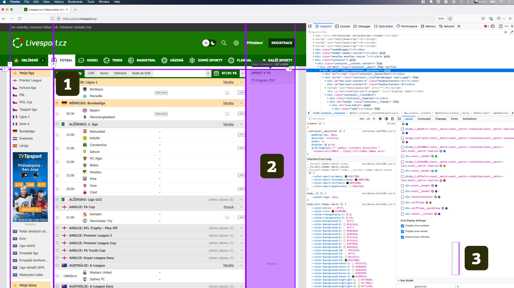
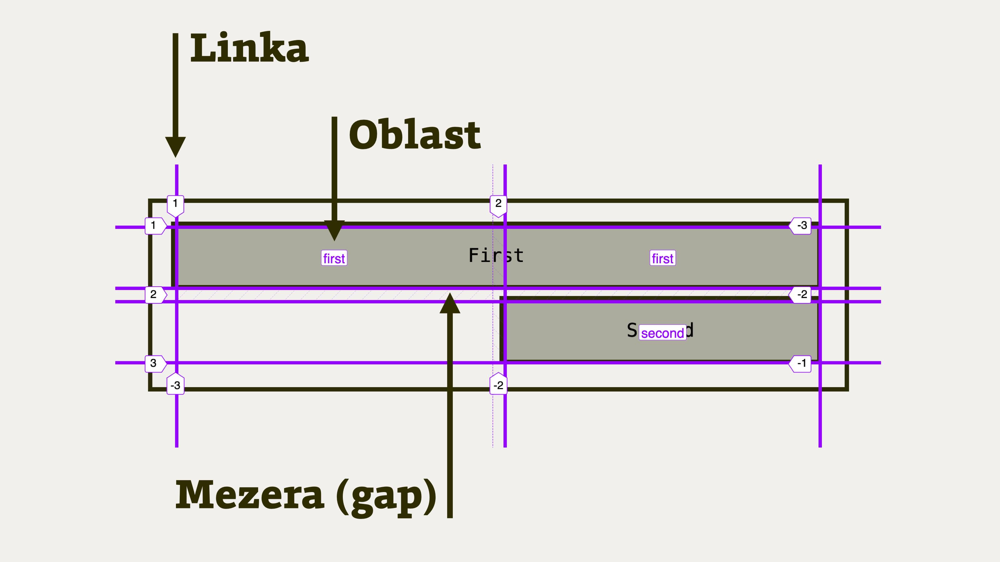

# CSS layout a DevTools

Vsadím se, že už jen při listování touto knížkou jste si všimli, že rozvržení v CSS jsou sakra složitá věc.

Máme ale štěstí, že autoři nástrojů pro vývojáře to vidí také a v „devtools“ všech dnešních prohlížečů je řada nadstaveb, které nám práci s gridem a flexboxem usnadní.

## Firefox, pak Chrome a nakonec i Safari

Lídrem trhu bychom v této oblasti mohli s klidným srdcem jmenovat autory Firefoxu.

<figure>

<figcaption markdown="1">
It works! CSS grid Inspector v DevTools Firefoxu používaný na Livesport.cz.
</figcaption>
</figure>

Už v březnu 2017, zároveň s implementací CSS gridu, do Firefoxu přibyl propracovaný CSS grid Inspector. Jediný prohlížeč nezávislý na velké korporaci v té době patřil v oblasti vývojářského pohodlí mezi lídry trhu.

Firefox ale od té doby bohužel prošel krizí, kdy musel snižovat počet lidí, kteří vývojářské nástroje navrhují a programují.

Někde jsem pod dojmy z nevyváženosti množství vývojářů pracujících na Firefoxu a Chromu napsal, že prohlížeč od Googlu všechny dobré vlastnosti Firefoxu rychle zkopíruje.

<figure>

<figcaption markdown="1">
Jako dvojče. CSS grid na Livesport.cz pitvaný pomocí vývojářských nástrojů Chromu.
</figcaption>
</figure>

V tomto případě to ale trvalo mnoho let, až do podzimu 2020. Tehdy přišli autoři Chromu s vlastní verzí, pojmenovanou „CSS grid debugging tools“, velmi silně inspirovanou Firefoxem. [vrdl.in/griddevchr](https://developer.chrome.com/blog/new-in-devtools-87/)

A co Safari? Jako skoro vždy – dlouho nic a pak to přišlo. V březnu 2021 představili velice podobný nástroj a nyní je možné grid zkoumat už i v Safari.

## Co přesně můžete v prohlížečích zkoumat?

Pojďme se na tyhle nástroje podívat z větší blízkosti.

V Chromu zapnete zkoumání gridu nebo flexboxu takto:

1. Pusťte na stránce DevTools: F12 nebo Ctrl/Cmd+Alt/Option+I.
2. Otevřete záložku Elements. Prvky, které je možné takto ladit, mají štítek „grid“ nebo „flex“. Klikněte na štítek.
3. Na stránce se vám pak objeví překryvná vrstva, která nese více informací o daném rozvržení.
4. Ve vývojářských nástrojích navíc přibyla záložka „Layout“, kde je seznam všech flexových a gridových prvků, plus také další informace.

Pokud používáte Firefox, v návodu namísto záložky Elements dosadíte Inspector.

Osobně se mi zdá, že Firefox má v této oblasti pořád alespoň malý náskok. Zejména jejich překryvná vrstva pro ladění gridu je navržená velmi dobře.

<figure>

<figcaption markdown="1">
Překryvná vrstva ve Firefoxu. Zkoumám tam tento CodePen: [cdpn.io/e/bXeWjb](https://codepen.io/machal/pen/bXeWjb?editors=1100).
</figcaption>
</figure>

V překryvné vrstvě gridu a flexboxu ve Firefoxu krásně vidím [linky, oblasti a další pojmy](css-grid-pojmy.md), které jsou při návrhu gridu podstatné.

Chrome ale přišel s jednou novou vlastností, která se mi moc líbí.

<figure>

<figcaption markdown="1">
Skoro jako WYSIWYG… Vizualizace a možnost přenastavení vlastností layoutu v Chrome.
</figcaption>
</figure>

Ve velmi složité oblasti, kterou představují vlastnosti [gridu](css-grid.md), [flexboxu](css-flex.md) a [zarovnávání](css-box-alignment.md), je tohle dobrý směr. Bez vizuálního ztvárnění začíná být velmi těžké si hodnoty vlastností zapamatovat.

Těším se, co nám konkurence prohlížečů ještě v tomhle směru přinese, a jsem zvědav, zda se Firefoxu podaří těmito chytrými vlastnostmi alespoň v některých věcech porážet rozjetý tým Chromu.

Zde jsou odkazy na texty představující tyto nástroje v jednotlivých prohlížečích:

- „Firefox 52 for developers“. [vrdl.in/griddevfir](https://developer.mozilla.org/en-US/docs/Mozilla/Firefox/Releases/52)
- „Chrome 87: What's New In DevTools“. [vrdl.in/griddevchr](https://developer.chrome.com/blog/new-in-devtools-87/)
- „WebKit: Introducing CSS grid Inspector“. [vrdl.in/griddevsaf](https://webkit.org/blog/11588/introducing-css-grid-inspector/)
