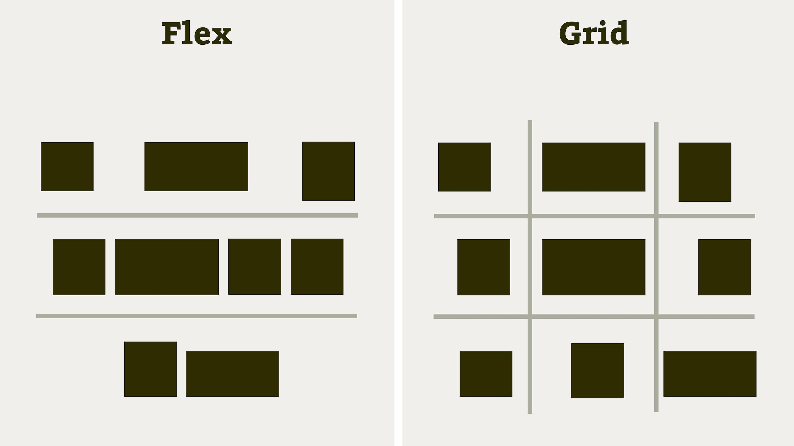

# Grid vs. flex (vs. multicol)

Nyní se zaměříme na jednotlivé systémy rozvržení a povíme si více o rozdílech mezi nimi. Začneme vícesloupcovým layoutem, který se z těch tří trochu vyjímá.

## Multicolumn layout, expert na vícesloupcovou sazbu textu

Tohle bude rychlé. Už totiž víte, že [multicol](css-multicolumn.md) je určený pro vícesloupcovou sazbu textu, nikoliv pro rozvržení rozhraní.

Jasně – rozvržení je možné tvořit i pomocí vlastnosti `column` a podobných, je možné jej omezeně využít pro tvorbu [„No Queries“ layoutů](no-queries.md), ale je dobré si uvědomit, že tím ohýbáme nástroj pro potřeby řešení.

## Grid vs. flexbox

Tyto dva systémy rozvržení tvoří jádro knížky, a proto se jim budeme věnovat s patřičnou péčí. Občas se setkávám s názorem, že [grid](css-grid.md) je novější, a tak nahrazuje starší [flexbox](css-flexbox.md). Nenahrazuje. Potřebujete obojí. A obojí se naučte. Jsou mezi nimi však významné rozdíly. Podívejme se na ně.

## Jednorozměrný flexbox, vícerozměrný grid

Grid navrhli autoři pro dvourozměrné layouty – po svislé i vodorovné ose. Flexbox se více hodí na rozvržení jednosměrná, ať už svislá nebo vodorovná.

<figure class="figure-thirds">

<figcaption markdown="1">
Flexbox zná jen jeden směr. Víceřádkový layout už pak například nezarovnáte do sloupců. Grid je mřížka. Dvourozměrná mřížka.
</figcaption>
</figure>

Jakmile je váš layout víceřádkový, typu mřížka, a nevystačíte si s pouhým zalomením bez definice pravidel layoutu druhé řádky, je pravděpodobné, že potřebujete grid.

### U flexboxu kraluje obsah, u gridu zase nastavený layout

Grid je zaměřenější na layout, kdy se obsah musí vždy přizpůsobit definované mřížce. Layout je král – a obsah, tedy text, obrázky a tak dál, se mu musí přizpůsobit. Této filozofii se v odborné hantýrce říká „grid in“, takže „z mřížky směrem dovnitř“.

Flexbox je naopak navržený pro situace, kdy se layout musí přizpůsobit obsahu. Výhodou je, že nemusíte často nastavovat parametry layoutu a díky rozměrům obsahu to nějak dopadne. Tento přístup k vykreslování layoutu naleznete pod pojmem „content out“, tedy „z obsahu směrem ven“.

Vyplývá to trochu i z jejich podstaty na úrovni kódu:

* Když napíšete `display:flexbox`, potomci se poslušně seskupí do vodorovného rozvržení. Pro definici layoutu použijí prvky své vlastní rozměry.
* Po napsání `display:grid` se nestane vůbec nic, dokud nedefinujete rozvržení pomocí vlastností řady `grid-template`. Tady vládne autor kódu a jeho mřížka, prvky stránky se musí přizpůsobit.

Pokud tedy chcete umístit pár prvků vedle sebe a není nutné jim definovat rozměry, volte flexbox. Jestli položkám flexboxu složitě nastavujete pravidla chování rozměrů, pak asi potřebujete grid.

Samozřejmě, že i z tohoto pravidla existuje řada výjimek. Mřížka například umí layout tvořený z obsahu, ale musíte si to nastavit.

## Flexbox slouží více layoutu komponent, grid zase layoutu celé stránky

Tím, že je flexbox jednosměrný, bude se vám častěji hodit na zarovnávání „věcí“ vedle sebe nebo pod sebe. Užijete jej pro záložkové i globální navigace nebo například zarovnání jednořádkových formulářů. Více jej oceníte u menších komponent uvnitř stránky.

Existují také studie, které zjistily, že flexbox se při použití obrovského množství elementů chová při vykreslování celé stránky [o trochu líněji](css-layout-vykon.md), jak na okraj zmiňuji v osmé kapitole. Ne že by to bylo zvlášť důležité, ale opět to ukazuje na podstatu flexboxu – vycházet z rozměrů vykreslených prvků.

Náš milý grid je obousměrný, takže je vhodné s ním rozvrhnout například složitější formuláře, výpis produktů v kategorii e-shopu nebo celou stránku. Grid je příhodnější pro layout větších celků.

Toto pravidlo samozřejmě neberte dogmaticky. Osobně, když se rozhoduji, jestli použít grid, nebo flexbox, kladu si otázku:

> Je možné přes rozvržení na některých šířkách okna položit neviditelnou vícerozměrnou mřížku?

Představa mřížky je zde zásadní. A úplně nejlepší je, když mřížku v podkladech vizualizuje designér nebo grafik.

## Kompatibilita s Internet Explorerem je silná stránka flexboxu

Flexbox ja takřka plně podporován prohlížeči Internet Explorer verze 10 i 11. Ty už jsou dneska víceméně na odpis, hlavně verze 10. Ale některé weby a webové aplikace mají stále slušnou návštěvnost z MSIE jedenácté verze. Pak je potřeba zvažovat, zda je možné grid použít, například s pomocí náhradních řešení, o kterých zde budu také psát.

Grid v těchto prohlížečích podporu má, jenže s velkým „ale“. Více se tomu věnuji v osmé kapitole.

Pokud nutně potřebujete obsloužit i uživatele těchto prohlížečů a není možné zajistit fallback, tedy náhradní řešení, pak může flexbox vaše problémy eliminovat.

## Společné vlastnosti

Je dobré si uvědomit, že velkou část vlastností mají grid s flexboxem společnou nebo podobnou:

* Všechny vlastnosti pro zarovnávání ve svislém a vodorovném směru.
* Flexibilní jednotky (grid nabízí `fr`, flexbox pak čísla ve vlastnosti `flex`).

Našli bychom toho více. Platí ale, že grid tyhle vlastnosti pokrývá více ze šířky a více do hloubky a je celkově robustnější. Flexbox je takový menší brácha, specializovaný na jeden typ layoutu.

## Srovnání flexboxu a gridu

Abychom si v tom udělali pořádek i vizuálně, připravil jsem si pro vás takovou pěknou tabulku. Berte to tak, že to velmi zjednodušuji:

|   Vlastnost              |   Flexbox   |   Grid   |
|:-------------------------|:-----------:|:--------:|
|   Jednorozměrný layout   |       +     |     +    |
|   Dvourozměrný layout    |             |     +    |
|   Layout z obsahu        |       +     |     ?    |
|   Layout z mřížky        |             |     +    |
|   Kompatibilita v MSIE   |       +     |     ?    |

Tabulka netabulka…  osobně vám doporučuji naučit se flexbox i grid.

Abyste oba dobře poznali, budete potřebovat poznat také jejich předky. Začneme pravěkou historií a pak se zastavíme u nedávné minulosti.
