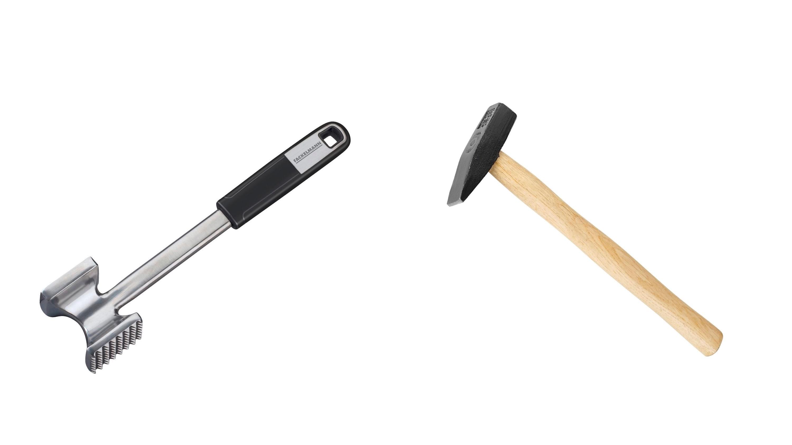
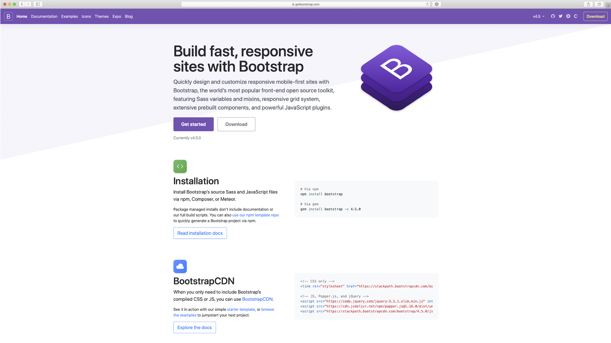

# Moderní a nemoderní layouty

„Musíš se teď odnaučit, co tě dřív učili.“ říká mistr Yoda Lukovi Skywalkerovi v páté epizodě kultovních Star Wars.

Neexistuje lepší citace pro začátek textu, který má zkušenější kodérky a kodéry přesvědčit, aby zkusili zapomenout na vše, co dosud o layoutu v CSS věděli a na uvolněné místo si v mysli dosadili nové systémy rozvržení.

Pokud snad s „webděláním“ začínáte – a pojmy jako „tabulkový layout“, `float` nebo Bootstrap vám nic neříkají – pak nezbývá než vám závidět. Tenhle text zase tak moc číst nemusíte.

## Layout versus „pseudolayout“

Za těch více než dvacet let, co dělám weby, mi bylo dopřáno realizovat rozvržení stránky i jejich komponent opravdu mnoha způsoby.

Z dnešního pohledu zní až krutě, že ani jeden z nich pro layout určený nebyl, takže jsem s nimi vlastně bojoval zbytečně:

* Rámy `<frame>` sice dělí stránku do menších částí, ale jinak nemají s implementací jejího rozvržení nic společného.
* Tabulky `<table>` jsou určené pro vykreslení tabulkového obsahu. Dělat v nich rozvržení? Strašný *hack* určený dnes už jen expertům na kódování newsletterů.
* Plovoucí prvky (vlastnosti `float` a `clear`) vznikly pro zajištění obtékání elementů textovým obsahem. Layout? Dnes už prosím ne.
* Metoda „inline rozvržení“ (pomocí vlastnosti `display:inline-block`) přišla s možností  vkládat blokové prvky do řádků textů, ale layout stránek či komponent není její účel.
* Techniky využívající pozicování lámou přes koleno vlastnost `position`, která slouží k umístění prvků mimo přirozený proud stránky.

Jak vidíme, technik upotřebitelných pro tvorbu layoutu máme v CSS víc než dost. To ale neznamená, že bychom je pro tvorbu rozvržení *měli* používat.

Každá z uvedených metod totiž pravděpodobně vyřeší jen některé z vašich problémů a ještě k tomu do kódu zavede problémy nové.

Paličku na maso je totiž v případě nouze možné využít také k zatloukání hřebíků. Jen si musíte dát pozor na prsty, hřebíky i stěnu, protože ten nástroj vymysleli na úplně jinou práci.

Pojďme na tyto techniky prostě zapomenout. Máme kladívko, takže paličkou dále už jen naklepávejme maso.

<figure>

<figcaption markdown="1">
*Jak říkaly naše babičky: „Paličkou na maso hřebíky nezatloukej, kladívkem neklepej maso a floaty nedělej layout v CSS“.*
</figcaption>
</figure>

Nevýhodou „pseudolayoutů“ je jejich špatná zapamatovatelnost. Tabulkový layout je dodnes relativně populární právě proto, že je velmi logický. 

Ale vysvětlujte začátečníkovi, jak udělat rozvržení pomocí vlastnosti `float`. Musíte vždy dodat „clearování“ nějaký způsob, jak plovoucí prvky resetovat. Není to prostě úplně jednoduché a občas se to chová divně.

„Pseudolayout“ se špatně vysvětluje a špatně používá, proto lidé hledali způsob jak si často se opakující nepříjemnosti zjednodušit. Řešení této situace my v IT říkáme „framework“.

## Layout versus CSS frameworky

V druhé polovině první dekády 21. století (sic!) začaly vznikat nástroje, které měly práci s CSS usnadňovat. A taky usnadňovaly.

Vznik CSS frameworků podpořily problémy v kompatibilitě napříč prohlížeči, které vznikaly i při tvorbě na pohled jednoduchých rozvržení.

### Raný webdesign: Jak to vlastně dělali sazeči knih a novin?

Někdy mezi roky 2005 až 2010 si navíc webaři začali ve velkém všímat typografických principů ze sazby knih, novin a časopisů.

Prvním frameworkem, který jsem v té době pro tyto účely využíval, byl Blueprint CSS. Zavedl mřížku o 24 sloupcích, takže pokud jste chtěli layout rozdělit na dvě poloviny, vypadalo to následovně:

```html
<div class="container">
  <div class="span-12">
    První polovina
  </div>
  <div class="span-12">
    Druhá polovina
  </div>
</div>
```

V té době šlo o zjevení. Dodnes si dobře vybavuji radost z krásných typografických principů, ale také z výrazně rychlejšího psaní kódu, protože jsem nemusel tak často přepínat mezi HTML a CSS.

Následovaly frameworky jako 960 grid System, YUI grids, YAML… a v roce 2011 Twitter představil dosud nejkomplexnější knihovnu pro tvorbu uživatelských rozhraní – Bootstrap.

### Éra Bootstrapu

Bootstrap je skvělý. Kromě základních typografických principů a mřížky obsahuje také hotové komponenty pro tvorbu uživatelských rozhraní a dnes už i prostředky pro systematickou tvorbu komponent vlastních, například v podobě „utilit“.

Pro vývojáře, kteří musí tvořit rozhraní a nemají po ruce designéra a často ani frontendového kodéra, představuje Bootstrap (a z něj vycházející frameworky jako Foundation nebo Semantic UI) hotový zázrak. Všechno co potřebují napíší v HTML a framework se nějak postará o zbytek.

<figure>

<figcaption markdown="1">
*Bootstrap je skvělý nástroj. Občas se ale používá pro nesprávné účely.*
</figcaption>
</figure>

Zároveň zde ale vznikl problém s nadužíváním těchto nástrojů. Jako konzultant rychlosti webu se vývojářů často ptám, proč na webech používají Bootstrap. „Pro mřížku“ zní častá odpověď.

*Pro mřížku* tak řada webů stahuje zhruba 25 kilobajtů zbytečného kódu. To nemusí vypadat jako vysoké číslo, ale uvědomme si, že jde o pětadvacet „kilo“ stylů, které nemohou být ze své povahy asynchronní a bez kterých prohlížeč nemůže vykreslit ani řádku z chystané stránky.

Když se tento laxní přístup k rychlosti nakombinuje s dalšími *ne-optimalizacemi*, na vykreslení stránky uživatel čeká… a čeká…

CSS grid nás nezbavuje nutnosti přepínat pozornost z HTML do CSS, ale řeší problémy s nefunkčními základními layouty a radikálně zjednodušuje znalosti, které o psaní CSS pro rozvržení stránky musíte mít.

V knížce se proto pokusíme nahradit některé základní scénáře použití mřížky z Bootstrapu pomocí CSS gridu.

Tímto tedy oficiálně zahajuji snahu vás přesvědčit, abyste nepoužívali složité frameworky a staré postupy na plnění jednoduchých cílů v kaskádových stylech.

Možná, že to nebude snadné, ale společně to zvládneme. Ostatně – celá citace rozhovoru z úvodu této podkapitoly má znít následovně:

Luke Skywalker: „Umět pohnout kamenem je jedna věc, ale tohle je něco jiného“.  
Mistr Yoda: „Ne, není to jiné. Jiné je to v tvé hlavě. Musíš se teď odnaučit, co tě dřív učili.“  
Luke Skywalker: „Dobře, já to teda zkusím.“  
Mistr Yoda: „Ne, nezkusíš. Uděláš to nebo ne. Už žádné zkusím!“  

V dalších řádcích budu trochu jako mistr Yoda. Ale hodný mistr Yoda.
