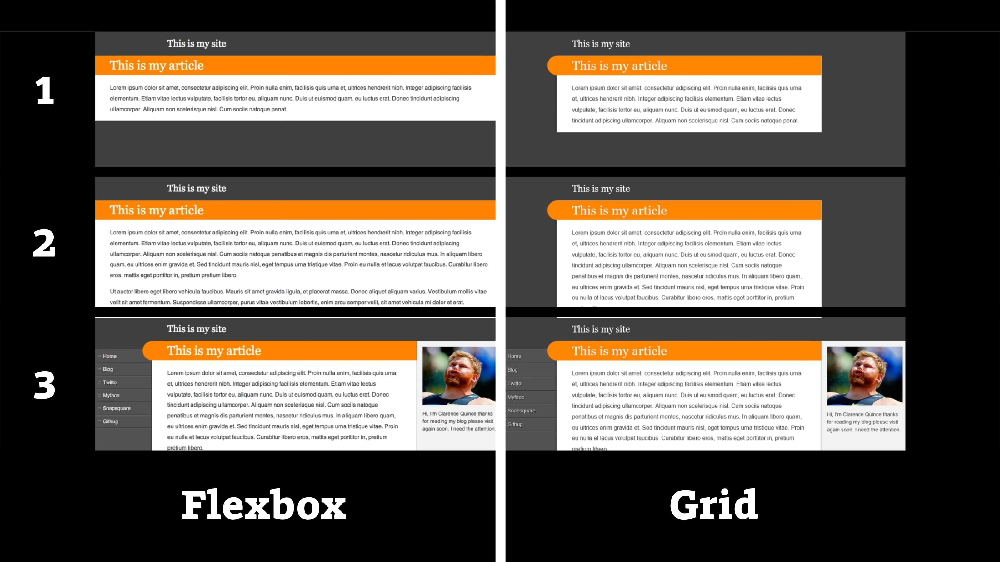

# CSS layout (grid a flexbox) a rychlost vykreslení stránky

V diskuzích pokročilejších vývojářek a vývojářů se občas objevuje téma „performance“ CSS gridu a flexboxu. Mají tím na mysli rychlost vykreslování.

Když byly tyhle systémy pro rozvržení stránek a komponent nové, poměrně dost se to v komunitě řešilo. Ale je to téma ještě dneska? Neřekl bych.

V textu dále se dozvíte, že flexbox je v extrémně složitých layoutech rychlejší. A je zde jedna věc, na kterou byste si měli dát pozor – na  použití flexboxu pro rozvržení celé stránky nebo obzvlášť dlouhého obsahu, jako jsou komplexní články.

## Je rychlejší grid, nebo flexbox? A není to jedno?

Před lety vznikaly studie, které se různými propracovanými metodami snažily zjistit, který systém rozvržení je pro vykreslování v prohlížeči lépe optimalizovaný.

Vyhrál to grid, teda flexbox, teda grid, teda flexbox.

Ano, takhle zmateně by se to dalo shrnout. V určitých typech layoutu exceluje flexbox, v jiných zase grid.

Podstatné ale je, že vy a vaši uživatelé to nejspíš nepoznáte. Studie byly skoro vždy ryze teoretické a postavené například na testech vykreslování desetitisíců prvků do stránky.

Za všechny uvedu jednu z Itálie. Vývojář Sandro Baccega testoval vykreslení 10 000 prvků do stránky. Pokud byste někdy něco takového potřebovali, vězte, že rychlejší to bude udělat flexboxem. V jeho testech to prohlížeči pomocí flexboxu zabralo něco kolem 40 ms, zatímco s gridem kolem 200 ms. Autor k tomu píše:

> Pravděpodobně to vychází ze skutečnosti, že ve flexboxu nemohou prvky následujících řádků zasahovat do vykreslení prvků předchozích řádků, zatímco v CSS gridu tomu tak není.

V druhém testu, vykreslování složitého celostránkového layoutu, dopadl flexbox i grid velmi podobně.

Takže pokud se nechystáte vykreslovat desítky tisíc prvků do layoutu e-shopu nebo prezentačního webu, toto pro vás užitečná informace nebude.

V případě zájmu běžte přímo na text „CSS grid vs Flexbox: Performance Evaluation“ na smc.it. [vrdl.in/gridflexper](https://techblog.smc.it/en/2020-08-03/grid-vs-flexbox-performance)

Ten složitý celostránkový layout italského testu nám ale může, když už ne jinak, posloužit jako pěkný oslí můstek k zajímavějšímu testu.

## Pokud nemusíte, nepoužívejte flexbox pro celostránkové layouty

Jake Archibald, jeden z mých oblíbených odborníků na výkon frontendových aplikací, už v roce 2014 varoval před používáním flexboxu pro celostránkové layouty.

Ptáte se proč? Jeden důvod je výkon, ale daleko důležitější jsou neměnné principy, jak flexbox rozvržení počítá.

Mrkněme se spolu na demo, které k tomu připravil. Zde je společné HTML:

```html
<div class="container">
  <div class="site-header">
    <div class="site-title">This is my site</div>
    <!-- … -->
  </div>
  <div class="content">
    <div class="main">
      <h1>This is my article</h1>
      <p>Lorem ipsum dolor sit amet, consectetur adipiscing…</p>
    </div>
    <nav id="nav">
      <ul>
        <li><a href="#">Home</a></li>
        <!-- … -->
      </ul>
    </nav>
    <aside>
      <p>Hi, I'm Clarence Quince…</p>
    </aside>
  </div>
</div>
```

Ano, jde o klasické třísloupcové rozvržení s obsahem uprostřed.

Verze pro flexbox má toto CSS:

```css
.container {
  display: flex;
  flex-flow: row;
}

nav {
  flex: 1;
  min-width: 118px;
  max-width: 160px;
}

.main {
  order: 1;
  flex: 1;
  min-width: 510px;
}

aside {
  flex: 1;
  order: 2;
  min-width: 150px;
  max-width: 210px;
}
```

Verze pro grid vypadá následovně:

```css
.container {
  display: grid;
  grid-template-columns: (nav) minmax(118px, 160px), (main) minmax(612px, 1fr),
    (aside) minmax(182px, 242px);
}

nav {
  grid-area: nav;
}

.main {
  grid-area: main;
}

aside {
  grid-area: aside;
}
```

A teď k těm rozdílům.

<figure>

<figcaption markdown="1">
*Rozdíly ve vykreslování gridu a flexboxu, na které poukazuje Jake Archibald.*
</figcaption>
</figure>

Ještě to popíšu, vypadá to asi následovně:

- V případě [gridu](css-grid.md) je layout připravený už při první verzi vykreslené stránky a dále se již nemění. Kontejner určuje layout obsahu.
- [Flexbox](css-flexbox.md) vykreslí nejprve hlavní část s textem. Pak si prohlížeč jakoby vzpomene, že zde jsou ještě dvě boční části a vykreslí je. Dojde tedy k překreslení. Obsah určuje layout kontejneru.

Připomínám, že nechtěné překreslení layoutu uživatele rozhodně nepotěší a webu zhorší metriku Cumulative Layout Shift, kterou se zabývá Google v rámci svých Web Vitals. [vrdl.cz/p/metrika-cls](https://www.vzhurudolu.cz/prirucka/metrika-cls)

Jake Archibald ovšem varuje: „Nenechte se kvůli tomuto příspěvku flexboxem vyděsit.“

Má pravdu. Jeho test je postavený i na svou dobu na silně zpomalené rychlosti stahování a vykreslování. Dnes už rychlost mobilního připojení 2G nemá smysl testovat, používá se většinou pomalejší 4G. Jeho dema mi v roce 2021 už při sebevětším zpomalení testovacího zařízení a připojení k internetu žádné postřehnutelné nekalosti neukázala.

Nicméně, je nezpochybnitelný fakt, že flexbox i grid jsou vykreslovány zcela jiným způsobem, takže připomenu, co už jsem psal:

- Flexbox se vykresluje od obsahu až k layoutu. Prohlížeč nejprve musí znát obsah, spočítat jeho rozměry a pak teprve vykreslit layout.
- Grid renderují prohlížeče tak, jak byste očekávali – nejprve layout, pak teprve obsah. Layout je proto vždy pevný jako beton.

Zcela konkrétně to popsal Bohumil Jahoda, autor skvělého JeČas.cz, kterého zde prostě a jednoduše ocituji:

> Flexbox trpí tím, že musí čekat na stažení celého HTML nebo poskakuje. (…) Týká se to použití u dlouhého obsahu. Problém je v tom, že poslední element může totálně ovlivnit, jak se daná část vykreslí. Takže prohlížeč buď musí čekat na stažení celého potřebného HTML, nebo vykreslit neúplný obsah, což může vést k tomu poskakování.

Příspěvek jsem přejal z Twitteru, jak jinak, kde si můžete přečíst celou diskuzi. [vrdl.in/flexposk](https://twitter.com/Jahoda/status/1367863896900505605)

### Nejde ani tak o flexbox, jako o přednost obsahu při skládání layoutu

V článku najdete i demo situace, kdy se může stejně špatně jako flexbox pro komplexní layout vykreslovat i grid. Stačí, když při tvorbě rozvržení dáte přednost obsahu:

```css
.container {
  display: grid;
  grid-template-columns:
    (foo) max-content,
    (bar) min-content,
    (hello) auto;
}

aside {
  grid-column: 4;
}
```

Stručně to popišme:

- Klíčová slova `max-content` a `min-content` dávají instrukci, aby se prvek nezvětšoval nad maximální nebo nezmenšoval pod minimální velikost obsahu.
- Klíčové slovo `auto` zde odpovídá `minmax(min-content, max-content)`,  takže nejmenší i největší možné rozměry této buňky layoutu jsou opět na prohlížeči.
- Třída `container` určuje třísloupcový layout. Prvek `aside` v něm není definován. Přidáme jej dynamicky, což má za následek nechtěné překreslení layoutu.

O funkci `minmax()` a klíčových slovech `max-content` a `min-content` se více dozvíte [v kapitole o gridu](css-minmax.md).

Vraťme se k varování Jakea Archibalda, ale nenechme si tím flexbox zprotivit. Problémy se pravděpodobně projeví jen na velmi komplexních stránkách a ještě na pomalých zařízeních.

Vychází z toho ale jedno ponaučení – pokud kódujete celostránkový layout ve flexboxu, nezapomeňte ho otestovat na nejhorším možném zařízení, které si ve vaší cílové skupině umíte představit.

Nebo pro tyhle účely – komplexní nebo celostránková rozvržení – prostě používejte grid.

Ještě vám dlužím odkaz na článek „Don’t use flexbox for overall page layout“ od Jakea Archibalda. [vrdl.in/6pajl](https://jakearchibald.com/2014/dont-use-flexbox-for-page-layout/)
