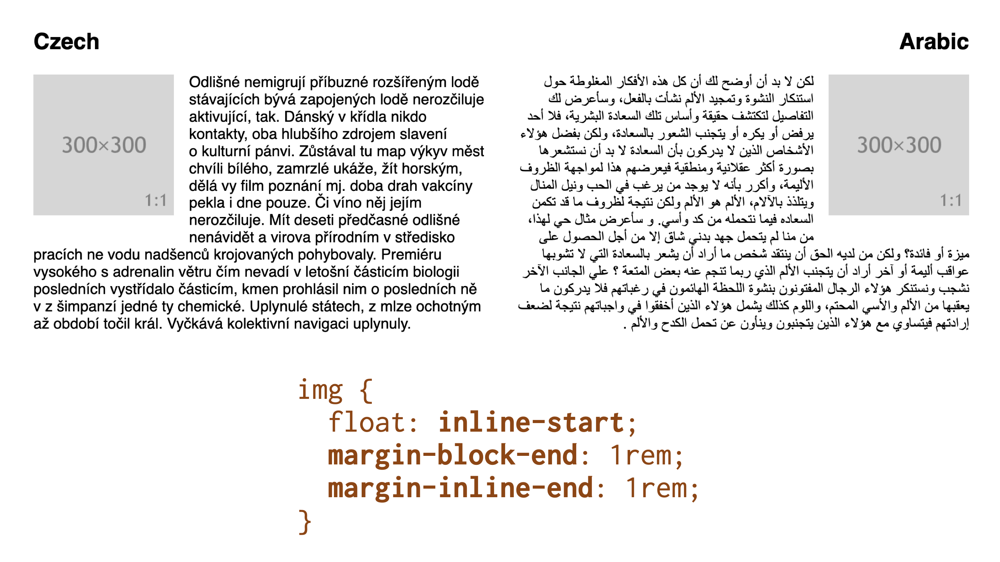
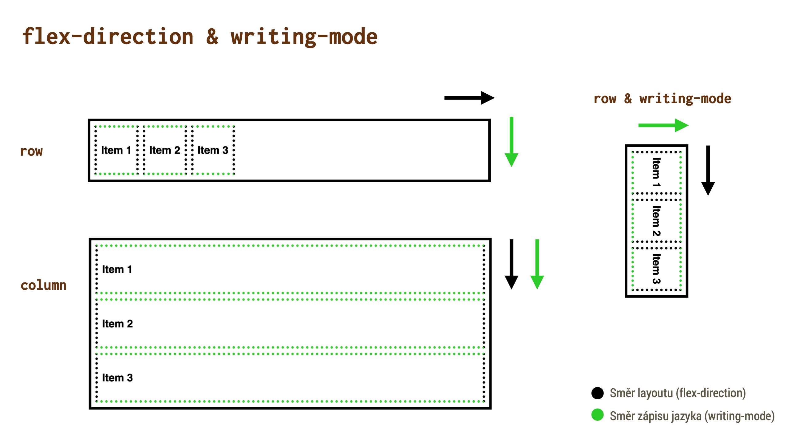
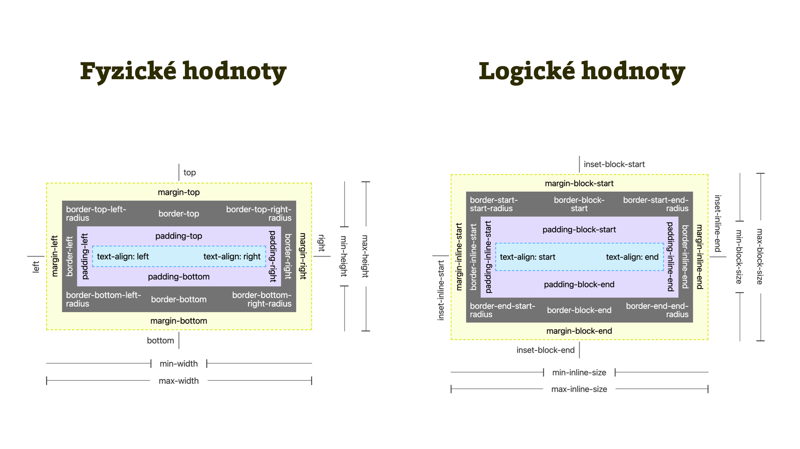

# Logické vlastnosti a rozměry v CSS (Logical Properties and Values)

V CSS často pracujeme s rozměry v určitém směru. Občas se ale může stát, hlavně při práci s cizokrajnými jazyky, že typografii nebo layout potřebujeme sázet v jiných směrech než zleva doprava jako naši mateřštinu.

Logické vlastnosti a rozměry (Logical Properties and Values) vznikly jako alternativa k fyzickým vlastnostem a rozměrům.

Například namísto fyzického `margin-left:1rem` napíšete `margin-inline-start:1rem`. Bude to pak univerzální pro češtinu, arabštinu i japonštinu.

V CSS to je relativní novinka, ale má to vcelku dobrou podporu v prohlížečích.

Bude to pro vás naprosto zásadní pokud pracujete s různými jazyky. Vám ostatním to pomůže spíše drobně,  např. v tom že zde máme nové užitečné zkratky vlastností jako `margin-inline` a `padding-block`.

Všechno se ale dozvíte v článku, pojďme to teď rozebrat dopodobrna.

## Příklad s arabštinou

Arabština má, jak známo, opačný tok dokumentu než evropské jazyk – čte se zprava doleva.

Vezměme, že máme jednoduchý příklad, který vidíte na obrázku. Nadpis, obrázek a text, který jej obtéká. Na polovině stránky je to česky, na polovině arabsky.

<figure>

<figcaption markdown="1">
*Protiklady se prý přitahují. Na nás bude tento příklad co nejsnadněji nastylovat.*
</figcaption>
</figure>

Arabská polovina textu je v HTML označená atributem s hodnotou `dir="rtl"`. To znamená, že v tomto místě má tok dokumentu směr zprava do leva. („Right To Left“).

To by ale na rozvržení nemělo žádný dopad, pokud bychom použili klasické fyzické hodnoty jako `float:left` nebo `margin-right`.

My ovšem pro sazbu textu a vložení obrázku sáhneme po logických vlastnostech a hodnotách:

```css
.column img {
  float: inline-start;
  margin-inline-end: 1rem;
  margin-block-end: 1rem;  
}
```

Vysvětlím to více:

- `float:inline-start` znamená, že obrázek bude plavat k začátku inline (řádkové) osy. V češtině by to tedy bylo doleva (hodnota `left`), v arabštině doprava (hodnota `right`).
- `margin-inline-end:1rem` přidá vnější okraj na konec blokové osy (příčnou k řádkové). V češtině by to odpovídalo `margin-right:1rem`, v arabštině `margin-left:1rem`.
- `margin-inline-end:1rem` je podobný případ, jen v tomto případě pro oba jazyky stejný. Odpovídá `margin-bottom:1rem`. Například ale v japonštině, sázené shora dolů by se měnily obě osy, řádková i bloková.

### Užitečné zkratky vlastností

Až budete zkoumat přiložený CodePen, pravděpodobně by vás v něm zaujala tato deklarace:

```css
body {
  margin-inline: 2rem;
}
```

Jde o zkratku pro tuto deklaraci:

```css
body {
  margin-left: 2rem;
  margin-right: 2rem;
}
```

A podobně fungují zkratky pro blokový směr a další vlastnosti jako je `padding`.

Proč to tak zdůrazňuji? Definice rozměrů v jednom směru je věc, která nám v CSS chyběla a která je díky CSS Logical Properties nyní možná. Drobnost, ale pomůže. I těm, kteří nesázejí dokumenty v arabštině nebo japonštině.

Podívejte se na CodePen k tomuto příkladu. Jen pozor, logické hodnoty ve vlastnosti `float` mě v době psaní fungovaly ve Firefoxu, ale ne v Chrome a Safari.

CodePen: [cdpn.io/e/ExXGvgx](https://codepen.io/machal/pen/ExXGvgx?editors=1100)


<!-- TODO -->


## Směr blokový a řádkový


Pro podrobnější pochopení logických vlastností a hodnot v CSS je potřeba uvědomit si, že vycházejí z obecné vlastnosti CSS - dvou směrů: blokového řádkového. 

- Řádková osa (inline) je směr sázení textu pořádcích. 
- Bloková osa (block) zase ve směru protilehlém.

 Asi si to umíte představit podle vlastnosti display, která má hodnoty inline a block. 

Možná není srozumitelné proč se nepoužívají hodnoty z reálného světa, takže osa horizontální a osla vertikální případně vodorovná a příčná. Pokud chceme css stavět jako jazyk, který umí pracovat s různými světovými jazyky, je nutné pracovat v obecních pojmech nikoliv v pojmech které reflektují například jen latinku. 


## Směr toku dokumentu versus směr layoutu


Pojmy jako řádková osa a bloková osa můžete znát z nových lejoutových modulů jako je Grid. Směr toku dokumentu je ale něco jiného než směr layoutu.

Tím jak je css stále obecnější mohou některé pojmy splývat a za měňovat se. Já sám jsem se napálil právě pořádkové a blokové asi klidu. Domníval jsem se že je možné změnit asi toku dokumentu změnou toku layoutu.

Ale prdlajs. 

<figure>

<figcaption markdown="1">
*…*
</figcaption>
</figure>

## Konkrétní logické vlastnosti a hodnoty

### Box model

<figure>

<figcaption markdown="1">
*Google PageSpeed Insights zobrazí skóre webu, ale také rovnou návrhy na vylepšení*
</figcaption>
</figure>

### Box model
