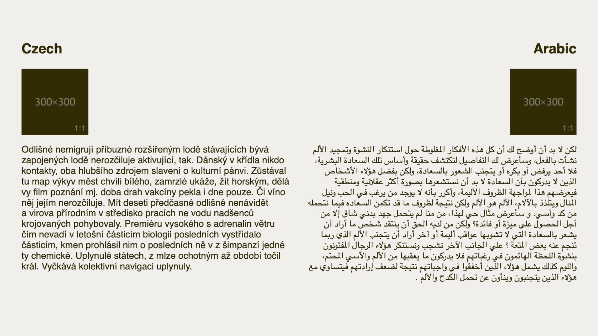

# Logické vlastnosti a rozměry v CSS (Logical Properties and Values)

<div class="book-index" data-book-index="Logické vlastnosti"></div>

V CSS často pracujeme s rozměry v určitém směru. Občas se ale může stát, hlavně při práci s cizokrajnými jazyky, že typografii nebo layout potřebujeme sázet v jiných směrech než zleva doprava jako naši mateřštinu.

Logické vlastnosti a rozměry (podle specifikace „CSS Logical Properties and Values“) vznikly jako alternativa k fyzickým vlastnostem a rozměrům.

Například místo fyzického zápisu `margin-left:1rem` můžete uvést `margin-inline-start:1rem`. Bude to pak univerzální pro češtinu, arabštinu i jazyky případně zapisované shora dolů. Vnější okraj se totiž pokaždé vykreslí na jiné straně.

<div class="ebook-only" markdown="1">

CSS Logical Properties velmi souvisí se změnou směru layoutu pro různé směry toku dokumentu. V knížce o CSS layoutech tedy mají své místo, i když uznávám, že jejich využití v praxi je relativně omezené.

</div>

<!-- AdSnippet -->

V CSS to je víceméně novinka, ale má vcelku dobrou podporu v pro&shy;hlí&shy;že&shy;čích.

Bude to pro vás naprosto zásadní, pokud pracujete s různými jazyky. Vám ostatním Logical Properties pomohou spíše drobně,  např. v tom, že zde máme nové užitečné zkratky vlastností jako `margin-inline` a `padding-block`.

Všechno se ale dozvíte v textu, pojďme to teď rozebrat dopodrobna.

## Příklad s arabštinou {#priklad-arabstina}

Arabština má, jak známo, opačný tok textu než evropské jazyky – čte se zprava doleva.

Vezměme jednoduchý příklad, který vidíte na obrázku. Nadpis, obrázek a text, který jej obtéká. Na polovině stránky je to česky, na polovině arabsky.

<figure class="figure-thirds">

<figcaption markdown="1">
Zleva doprava. Zprava doleva. Jak to safra nastylovat co nejuniverzálněji?
</figcaption>
</figure>

Arabská polovina textu je v HTML označená atributem s hodnotou `dir="rtl"`. To znamená, že v tomto místě má tok dokumentu směr zprava doleva. (`rtl` jako „Right to Left“).

To by ale na rozvržení nemělo žádný dopad, pokud bychom použili klasické fyzické hodnoty jako `float:left` nebo `margin-right:1rem`.

My ovšem pro sazbu textu a vložení obrázku sáhneme po logických vlastnostech a hodnotách:

```css
.column img {
  float: inline-start;
  margin-inline-end: 1rem;
  margin-block-end: 1rem;  
}
```

Vysvětlím to více:

- `float:inline-start` znamená, že obrázek bude plout k začátku řádkové (inline) osy. V češtině by to tedy bylo doleva (hodnota `left`), v arabštině doprava (hodnota `right`).
- `margin-inline-end:1rem` přidá vnější okraj na konec blokové osy (příčnou k řádkové). V češtině by to odpovídalo `margin-right:1rem`, v arabštině `margin-left:1rem`.
- `margin-block-end:1rem` je podobný případ, jen v tomto případě pro oba jazyky stejný. Odpovídá `margin-bottom:1rem`. Například ale v japonštině, která může být vysázená shora dolů, by se měnily obě osy, řádková i bloková.

### Užitečné zkratky vlastností {#priklad-arabstina-zkratky}

Až budete zkoumat přiložený CodePen, pravděpodobně vás v něm zaujme toto:

```css
body {
  margin-inline: 2rem;
}
```

Jde o zkratku pro tuto deklaraci:

```css
body {
  margin-left: 2rem;
  margin-right: 2rem;
}
```

Podobně fungují zkratky pro blokový směr a další vlastnosti, jako je `padding`. Proč to tak zdůrazňuji? Definice rozměrů v jednom směru je věc, která nám v CSS chyběla a která je nyní díky CSS Logical Properties možná. Drobnost, ale pomůže. I těm, kteří nesázejí dokumenty v arabštině nebo japonštině.

Podívejte se na CodePen k tomuto příkladu. Jen pozor, logické hodnoty ve vlastnosti `float` mi v době psaní fungovaly ve Firefoxu, ale ne v Chromu a Safari.

CodePen: [vrdl.in/8rfda](https://codepen.io/machal/pen/ExXGvgx?editors=1100)

## Směr blokový a řádkový {#smer}

<div class="book-index" data-book-index="Bloková osa"></div>
<div class="book-index" data-book-index="Inline osa"></div>

Pro podrobnější pochopení logických vlastností a hodnot v CSS je potřeba si uvědomit, že vycházejí z obecné vlastnosti CSS – dvou směrů: blokového a řádkového.

- _Řádková osa (inline)_ je směr sázení textu po řádcích.
- _Bloková osa (block)_ zase ve směru protilehlém.

Asi si to umíte představit podle [vlastnosti `display`](css-display.md), která má hodnoty `inline` a `block`.

Možná není úplně jasné, proč se nepoužívají hodnoty z reálného světa – osa horizontální a osa vertikální, případně vodorovná a příčná? Důvod je v obecnosti.

Pokud od CSS chceme, aby umělo pracovat s různými světovými jazyky, je nutné, aby se umělo vyjadřovat v obecných pojmech, nikoliv v pojmech, které reflektují například jen jazyky vycházející z latiny.

## Směr toku dokumentu versus směr layoutu {#smer-layoutu}

<div class="book-index" data-book-index="Směr layoutu"></div>

Pojmy jako řádková osa a bloková osa můžete znát z nových layoutových modulů, jako je [grid](css-grid.md). Směr toku dokumentu je ale něco jiného než směr layoutu.

Díky tomu, že je CSS stále obecnější, mohou některé pojmy splývat a zaměňovat se.

Já sám jsem se napálil právě u řádkové a blokové osy, když jsem se domníval, že je možné změnit osu toku dokumentu pro konkrétní komponenty změnou toku layoutu:

```css
/* Změní to směr toku dokumentu? */
.container {
  flex-direction: column;
}
```

Ale prdlajs. Takhle to nefunguje. To, co změní [vlastnost `flex-direction`](css-flex-direction.md) nebo třeba [`grid-auto-flow`](css-grid-auto-flow.md), je směr rozvržení, nikoliv směr toku dokumentu.

Směr toku dokumentu mění pouze tyto vlastnosti:

- `writing-mode` – určuje tok dokumentu na blokové úrovni. Možnosti hodnot jsou třeba `horizontal-tb` nebo `vertical-rl`.
- `direction` – (nebo atribut `dir` v HTML) určí směr sázení na řádkové (inline) ose. Možnosti `ltr` nebo `rtl`.
- `text-orientation` – mění orientaci textu sázeného svisle.

V praxi se to pak projevuje následovně: Vezměme, že máme flexový kontejner a v něm několik položek. Každá z nich má tuto deklaraci:

```css
.container p {
  margin: 1rem;
  padding: 1rem;
  border: .5rem dotted #abab9d;
  padding-block: 2rem;
  border-block-color: #2E2C08;
}
```

Ano, manipulujeme tady s vlastnostmi prvku na blokové ose, tedy v případě sázení v češtině na výšku. Prvek má vyšší vnitřní okraj (`padding-block:2rem`) a tmavou barvu rámečku (`border-block-color:#2E2C08`).

V případě, že směr rozvržení změníme z vodorovného (`flex-direction:row`) na svislý (`flex-direction:column`), tmavé okraje položek zůstávají umístěné ve svislém směru.

Změnil se směr layoutu, ale ne směr toku dokumentu.

Pozice blokových vlastností se mění až se směrem toku dokumentu, tedy zapojením deklarace `writing-mode:vertical-rl`.

<figure>

<figcaption markdown="1">
Tmavé blokové okraje změní směr až se změnou toku dokumentu.
</figcaption>
</figure>

CodePen: [vrdl.in/hizs7](https://codepen.io/machal/pen/vYZQRxN?editors=1100)

Podobné to bude u vlastnosti `grid-auto-flow`, která dokáže změnit směr rozvržení v gridu.

CodePen: [vrdl.in/nao34](https://codepen.io/machal/pen/jOwQzxx?editors=1100)

## Konkrétní logické vlastnosti a hodnoty {#vlastnosti-hodnoty}

V další části textu už následuje jen výčet nových logických vlastností a hodnot, které jsou adekvátní fyzickým vlastnostem.

Než je začnete používat, dobře si vše otestujte v různých prohlížečích.

### Box model {#vlastnosti-hodnoty-box}

<div class="book-index" data-book-index="Box model"></div>

Pro box model máme hezký obrázek s porovnáním fyzických a logických variant:

<figure class="figure-thirds">

<figcaption markdown="1">
Logické hodnoty jako synonyma těch fyzických.  
Zdroj: Adrian Roselli. [vrdl.in/3l57u](https://codepen.io/aardrian/pen/bGGxrvM).
</figcaption>
</figure>

Logická výška a šířka:

<div class="rwd-scrollable prop-table f-6"  markdown="1">

| Logicky           | Fyzicky         |
|-------------------|-----------------|
| `block-size`      |  `height`       |
| `inline-size`     |  `width`        |
| `min-block-size`  |  `min-height`   |
| `min-inline-size` |  `min-width`    |
| `max-block-size`  |  `max-height`   |
| `max-inline-size` |  `max-width`    |

</div>

Logické vnitřní okraje:

<div class="rwd-scrollable prop-table f-6"  markdown="1">

| Logicky               | Fyzicky         |
|-----------------------|-----------------|
| `padding-block-start`  |  `padding-top`         |
| `padding-block-end`    |  `padding-bottom`      |
| `padding-inline-start` |  `padding-left`        |
| `padding-inline-end`   |  `padding-right`       |
| `padding-block`        |  `padding-top` a `padding-bottom`  |
| `padding-inline`       |  `padding-left` a `padding-right`  |

</div>

Logické vnější okraje:

<div class="rwd-scrollable prop-table f-6"  markdown="1">

| Logicky               | Fyzicky         |
|-----------------------|-----------------|
| `margin-block-start`  |  `margin-top`         |
| `margin-block-end`    |  `margin-bottom`      |
| `margin-inline-start` |  `margin-left`        |
| `margin-inline-end`   |  `margin-right`       |
| `margin-block`        |  `margin-top` a `margin-bottom`  |
| `margin-inline`       |  `margin-left` a `margin-right`  |

</div>

<!-- AdSnippet -->

Logické posuny (ofsety):

<div class="rwd-scrollable prop-table f-6"  markdown="1">

| Logicky              | Fyzicky         |
|----------------------|-----------------|
| `inset-block-start`  |  `top`         |
| `inset-block-end`    |  `bottom`      |
| `inset-inline-start` |  `left`        |
| `inset-inline-end`   |  `right`       |
| `inset-block`        |  `top` a `bottom`  |
| `inset-inline`       |  `left` a `right`  |

</div>

<div class="pbi-avoid" markdown="1">

Logické rámečky:

<div class="rwd-scrollable prop-table f-6"  markdown="1">

| Logicky              | Fyzicky         |
|----------------------|-----------------|
| `border-block-start`  |  `border-top`         |
| `border-block-end`    |  `border-bottom`      |
| `border-inline-start` |  `border-left`        |
| `border-inline-end`   |  `border-right`       |
| `border-block`        |  `border-top` a `border-bottom`  |
| `border-inline`       |  `border-left` a `border-right`  |

</div>

Poznámka: Vzhledem k tomu, že vlastnost `border` představuje zkratku, uvádím jen ji. Adekvátně ale existují zkratky pro všechny podvlastnosti a příbuzné vlastnosti:

- Šířka: `border-width` (`border-block-start-width` = `border-top-width`)
- Styl: `border-style` (`border-block-start-style` = `border-top-style`)
- Barva: `border-color` (`border-block-start-color` = `border-top-color`)
- Zakulacení: `border-radius` (`border-block-start-radius` = `border-top-radius`)

</div>
<!-- .pbi-avoid -->

### Klíčové slovo logical {#vlastnosti-hodnoty-logical}

Tohle může být zajímavé, ale zatím to v prohlížečích nemá podporu. Když uvedete klíčové slovo `logical` před zápisem hodnot ve zkratkách vlastností…

```css
.box {
  margin: logical 1em 2em 3em 4em;
}
```

… interně se to bude považovat za logické hodnoty:

```css
.box {
  margin-block-start: 1em;
  margin-inline-start: 2em;
  margin-block-end: 3em;
  margin-inline-end: 4em;
}
```

Takto to má fungovat pro následující vlastnosti: `inset`, `margin`, `padding`, `border-width`, `border-style`, `border-color`, `scroll-padding`, `scroll-margin`. Tedy až to bude fungovat v prohlížečích…

Jen znovu připomínám, že logický směr je pro různé jazyky různý.

### Hodnoty pro vlastnosti {#vlastnosti-hodnoty-hodnoty}

Jak už je asi z textu zřejmé, logické alternativy nemusí mít jen vlastnosti, ale také jejich hodnoty:

<div class="rwd-scrollable prop-table f-6"  markdown="1">

| Logicky        | Fyzicky         |
|----------------|-----------------|
| `block-start`  |  `top`         |
| `block-end`    |  `bottom`      |
| `inline-start` |  `left`        |
| `inline-end`   |  `right`       |

</div>

Ve vlastnostech `float` nebo `clear` pak budeme moci použít nové hod&shy;noty `inline-start` a `inline-end`.

Pro `text-align` je to jednodušší, protože jde zarovnávat jen v jednom směru. Takže `text-align:start` bude `text-align:left`.

Vlastnost `resize` zase bude moci nabývat hodnot `block` a `inline`.

## Podpora v prohlížečích {#podpora}

V době psaní aktualizace tohoto textu (únor 2022) můžu konstatovat, že obecná podpora CSS Logical Properties je v moderních prohlížečích plná. Konkrétní vlastnosti vám ale doporučuji si dobře otestovat.

Více na CanIUse. [caniuse.com/css-logical-props](https://caniuse.com/css-logical-props)

<!-- AdSnippet -->
