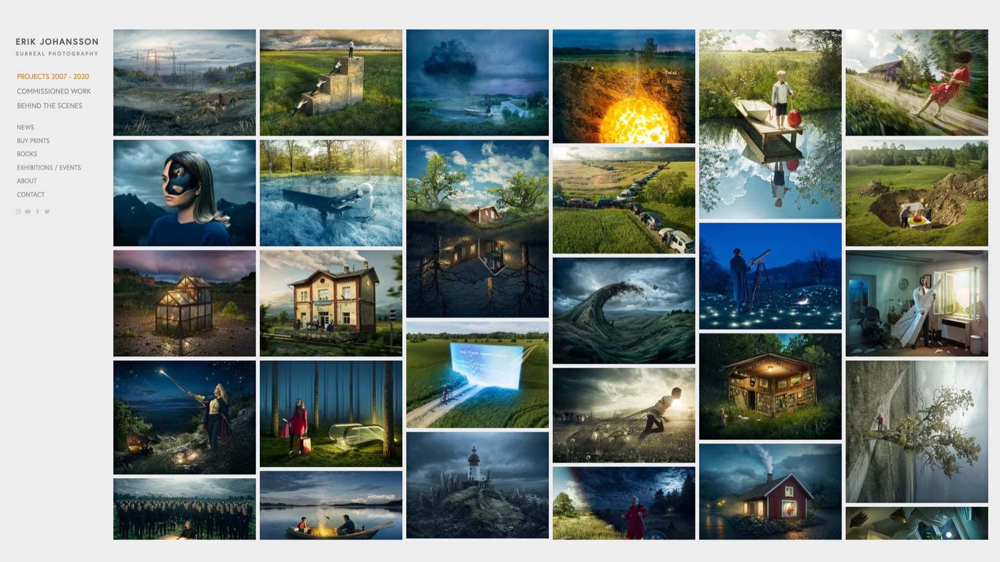

# Masonry layout nativně v CSS

Rozvržení typu Masonry je ve webdesignu populární jako zednická lžíce mezi zedníky.

Kodérky a kodéři jsou ovšem dneska nucení jej dělat pomocí JavaScriptu. Nativní implementace v CSS byla součástí našich snů už od příchodu [flexboxu](css3-flexbox.md), ale plně to nevyřešil ani [grid](css-grid.md).

Teď už se ale blýská na lepší čas. Chystaná [třetí verze specifikace CSS gridu](https://drafts.csswg.org/css-grid-3/) totiž počítá s hodnotou `masonry` pro vlastnosti [`grid-template-rows/columns`](css-grid-template.md):

```css
.container {
  display: grid;
  grid-template-rows: masonry;
}
```

Zatím to má podporu jen v Nightly verzi Firefoxu, ale předpokládáme, že se to ujme a že nás to zbaví dalšího nadbytečného javascriptového pluginu.

Skvěle to (jako vždy) popisuje Rachel Andrew v textu [Native CSS Masonry Layout In CSS Grid](https://www.smashingmagazine.com/native-css-masonry-layout-css-grid/) na Smashing Magazine, ze kterého tady budu vycházet.

## Co je to „masonry“? {#co}

Určitě zde jsou tací, kteří o Masonry layoutu nicmoc nevědí. „Masonry“ je v překladu zdivo, takže jde o „zděné“ rozvržení stránky.

<figure>

<figcaption markdown="1">
*Masonry layout [na webu Erika Johanssona](https://www.erikjo.com/work). Jediná vada na kráse je vykreslení pomocí klientského JavaScriptu.*
</figcaption>
</figure>

Když se položky ve zděném rozvržení přesunou na další řádek, nezarovnávají se do rovné linky, ale přesunou se nahoru do mezer, které zanechají kratší položky v prvním řádku. Je to podobné jako u jedné z vlastností CSS Gridu, automatického umístění (autoplacement), ale bez přísného dodržení mřížky pro řádky.

Však se podívejte na obrázek výše, z toho to bude asi vidět lépe. Hlavní směr typického Masonry layoutu je inline, tedy po řádcích.

V současnosti se tyto typy rozvržení dělají pomocí dnes už legendární javascriptové kompomenty [Masonry od Davida DeSandra](https://masonry.desandro.com/).

Autorovi všechna čest, ale je nutné si přiznat, že z pohledu vykreslovacího (ale i načítacího) výkonu stránky nebude takto razantní ovlivňování layoutu JavaScriptem nikdy optimální. Tohle prostě má dělat prohlížeč.

## Masonry v CSS gridu {#css-grid}

Masonry layout budeme podle specifikace definovat pomocí `grid-template-rows:masonry` nebo `grid-template-columns:masonry`, podle toho, zda si pro „zdění“ vybereme vodorovný nebo svislý směr.

Směr definovaný pomocí `masonry` se pak bude označovat jako osa zdiva. Druhá osa bude mít stopy mřížky definované jako normální. To bude osa mřížky.

Příkládám CodePen, ale v době psaní bude fungovat jen ve zmíněném [Firefox Nightly](https://www.mozilla.org/cs/firefox/channel/desktop/), takže neuškodí, když si jej stáhnete.

CodePen: [cdpn.io/e/wvWmZWB](https://codepen.io/rachelandrew/pen/wvWmZWB?editors=0100)

V uvedeném prohlížeči si můžete pohrát s hlavním kouskem kódu, který vypadá takto:

```css
.container {
  display: grid;
  gap: 10px;
  grid-template-columns: repeat(4, 1fr);
  grid-template-rows: masonry;
}
```

Raději to vysvětlím:

- `display:grid` definuje [layout do mřížky](css-grid.md).
- `gap:10px` nabádá prohlížeč k vykreslení desetipixelové [mezery mezi buňkami](css-gap.md).
- `grid-template-columns:repeat(4,1fr)` vykreslí čtyři stejně široké sloupce mřížky. Viz [vlastnost `repeat()`](css-repeat.md).
- `grid-template-rows:masonry` dělá to zděné kouzlo. Řádky nebudou zarovnané podle osy, ale nalepí se na položky výše a přeskupí se. Viz [vlastnost `grid-template-rows`](css-grid-template.md).

Výsledek tohodle zápisu nicméně bez Firefox Nightly lépe uvidíte na obrázku. Tady je.

<figure>

<figcaption markdown="1">
*Nativně vykreslený masonry layout. Zdroj: [Rachel Andrew](https://codepen.io/rachelandrew/pen/wvWmZWB).*
</figcaption>
</figure>

Je to nativní. Není to krásné?

Napiš řádek kódu,  
postav třeba zeď.  
Zpívej přitom ódu,  
začni s tím hned teď.

Po básnické vsuvce, vyvolané vidinou světa bez další javascriptové knihovny, pojďme dál.

## Další vlastnosti CSS gridu v masonry? No jasně! {#dalsi-grid}

Vzhledem k tomu, že jsme v systému rozvržení pomocí CSS gridu, můžeme používat i další vlastnosti:

- Stále můžeme porušit automatické umísťování a konkrétní položku vložit na konkrétní místo mřížky. Viz prvek `.positioned` [v tomto CodePenu](https://codepen.io/rachelandrew/pen/PozRvZb) od Rachel Andrew.
- Je samozřejmě dovoleno používat i roztažení prvků do více buněk mřížky. To je zase vidět na prvku `.landscape` [v jiném CodePenu](https://codepen.io/rachelandrew/pen/QWEmPMK).

### `masonry-auto-flow`, kontrola toku položek {#dalsi-grid-flow}

Tato vlastnost ještě není naprogramovaná ani ve Firefox Nightly, ale je podobná existující [`grid-auto-flow`](css-grid-auto-flow.md). Prostě ovlivňuje, v jakém pořadí se budou položky do zděného rozvržení sázet.

- Ve výchozím stavu položku prohlížeč vloží do sloupce s největším prostorem.
- Hodnota `next` – umístí položku na další místo na ose mřížky.
- Hodnota `ordered` – layout bude vždy v pořadí, v jakém jsou položky v dokumentu, pokud není řečeno jinak pomocí [vlastnosti `order`](css-order.md).

### Zarovnání pomocí `justify-tracks` a `align-tracks` {#dalsi-grid-zarovnani}

V layoutu typu masonry potřebujeme i dvě nové zarovnávací vlastnosti.

Jako by nám nestačily ty desítky, co jich už máme, řekl by bručoun. Ale neměl by pravdu, tento typ zarovnání je úplně nový a nic adekvátního zatím nemáme.

Pokud máte v kontejneru mřížky více prostoru ve směru rozloženém pomocí masonry, zjistíte, že se položky zarovnají na začátek kontejneru. Počáteční hodnota vlastnosti `align-tracks` je totiž `start`.

Další možnosti jsou podobné jako u vlastností `align-content` a `justify-content` (např. `end` nebo asi i `space-between`) s několika modifikacemi:

- Hodnota `normal` – u těchto vlastností se chová jako `start`.
- Hodnota `stretch` - položky automatické velikosti v rozložení se roztáhnou.

### Podpora v prohlížečích a implementace {#podpora}

Standardizátoři mají CSS Grid Level 3 zatím rozpracovaný. V téhle fázi je tedy potřeba, aby vývojářky a vývojáři neváhali [dávat zpětnou vazbu](https://github.com/w3c/csswg-drafts/issues/).

Jak už jsem zmínil – v době psaní je tato skvělá nová věc podporovaná jen v Nightly verzi Firefoxu. I tam je ale potřeba zapnout vlaječku `layout.css.grid-template-masonry-value` v `about:config`.

Řešit [fallbacky](fallback.md) bude v případě nativní implementace technicky snadné řešit, protože máme podmínku podpory – `@supports`:

```css
@supports (grid-template-rows: masonry) {
  .container {
    display: grid;
    grid-template-rows: masonry;
  }  
}
```

Je samozřejmě otázkou, jak může vypadat náhradní řešení z vizuálního pohledu.

Osobně nicméně věřím, že po připomínkovém řízení ke specifikaci dojde k implementaci v Chrome a odvozených prohlížečích a pak chvíli čekání na Safari, jak už to ve světě dnešního vývoje webů chodí.

Takže podpora naprosté většiny prohlížečů zde může přijít relativně brzy, ale teď je na nás, abychom to zkoušeli a připomínkovali.

### Další možnosti jak řešit Masonry {#dalsi}

Do doby než se dokončí specifikace a prohlížeče nativní masonry naimplementují, přidávám sem také seznam alternativních metod. Mají dvě věci společné. Na rozdíl od DeSandrova pluginu nepotřebují JavaScipt. A řeší vždy jen část scénářů, pro které zděný layout vývojáři používají.

### Vícesloupcový layout {#dalsi-multicol}

[CSS Multi-column Layout](css3-multicolumn.md) je možné použít pro účely jednoduchého Masonry:

```css
.container {
  column-count: 4;
  column-gap: 10px;
}
```

Nevýhodou je to, že směr layoutu bude vždy po sloupcích, nikoliv po řádích. Prohlížeč také – díky povaze vícesloupcové sazby – nebude trápit, když poslední sloupec zůstane vyplněný jen z malé části.

CodePen: [cdpn.io/e/QWEmPvK](https://codepen.io/rachelandrew/pen/QWEmPvK?editors=1100)

### CSS Grid a husté umístění {#dalsi-autoflow}

[Vlastnost `grid-auto-flow`](css-grid-auto-flow.md) může mít hodnotou `dense`, která zajistí že prohlížeč může vyplnit mezery změnou pořadí prvků.

```css
.container {
  display: grid;
  grid-template-columns: repeat(4, 1fr);
  grid-auto-flow: dense;
  gap: 10px;
}
```

Nevýhoda? Pořád jde o vykreslení do mřížky, takže mezi jednotlivými položkami většinou zůstávají nevyplněné mezery.

CodePen: [cdpn.io/e/mdExgmZ](https://codepen.io/rachelandrew/pen/mdExgmZ?editors=1100)

### Flexbox, :nth-child a order {#dalsi-flexbox-nthchild}

[Tobias Ahlin Bjerrome](https://tobiasahlin.com/blog/masonry-with-css/) se pokusil o řešení [flexboxem](css3-flexbox.md), [selektorem `:nth-child(n)`](css3-selektory.md) a [vlastností `order`](css-order.md):

```css
/* Render items as columns */
.container {
  display: flex;
  flex-flow: column wrap;
}

/* Re-order items into rows */
.item:nth-child(3n+1) { order: 1; }
.item:nth-child(3n+2) { order: 2; }
.item:nth-child(3n)   { order: 3; }

/* Force new columns */
.container::before,
.container::after {
  content: "";
  flex-basis: 100%;
  width: 0;
  order: 2;
}
```

Je to plné dobrých nápadů, relativně dobře to funguje, ale ne na všech rozlišeních. Navíc je složité to nastavoval pro různý počet sloupců v layoutu.

CodePen: [cdpn.io/e/mdJVmLRaExgmZ](https://codepen.io/tobiasahlin/pen/JVmLRa?editors=1100)

Další možná řešení už budu jmenovat jen stručně:

- [Paul Bakaus: A 'perfect' row-based image masonry](https://paulbakaus.com/tutorials/css/a-perfect-row-based-image-masonry/) (využívá také [vlastnost `object-fit`](css-object-fit-position.md))
- [W3Bits: CSS Masonry Generator](https://w3bits.com/tools/masonry-generator/) (opět postaveno na sloupcovém layoutu, ale pro zobrazení v řádcích už používá JavaScript)
- [Kristóf Poduszló: Building Highly Performant Masonry Layouts with Gatsby.js](https://blog.usejournal.com/building-highly-performant-masonry-layouts-with-gatsby-js-54115acc3e72) (zapojení serverového renderingu je v případě JAMstacku dobrý nápad)

Pokud znáte další řešení, které pomůže ostatním čtenářkám a čtenářům, než prohlížeče začnou podporovat nativní variantu, neváhejte se ozvat v komentářích.
