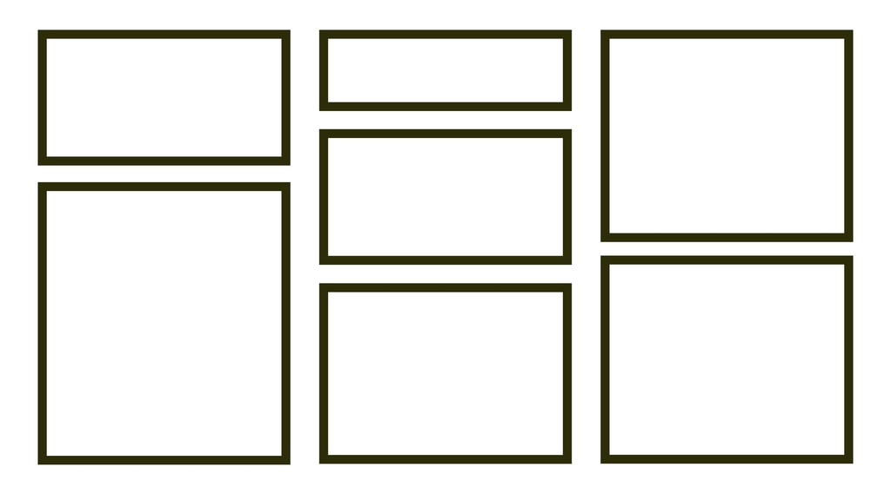

# Masonry layout nativně v CSS

Rozvržení typu masonry je ve webdesignu stejně populární jako zednická lžíce mezi zedníky.

<div class="book-index" data-book-index="Masonry"></div>

<div class="connected" markdown="1">



<div class="web-only" markdown="1">

CSS masonry snad jednou bude součástí specifikace [CSS gridu](css-grid.md).

</div>

<div class="ebook-only" markdown="1">

→ [vrdl.in/cssmas](https://www.vzhurudolu.cz/prirucka/css-masonry)

</div>

</div>

Kodérky a kodéři jsou ovšem dneska nucení se s ním vypořádat pomocí JavaScriptu. Nativní implementace v CSS byla součástí našich snů už od příchodu flexboxu, ale plně to nevyřešil ani grid.

Teď už se ale snad blýská na lepší časy. Chystaná třetí verze specifikace gridu totiž počítá s hodnotou `masonry` pro vlastnosti [`grid-template-rows/columns`](css-grid-template.md):

```css
.container {
  display: grid;
  grid-template-rows: masonry;
}
```

Subgrid má zatím bohužel podporu jen ve verzi Firefoxu Nightly. Je ale možné, že se ujme a že nás zbaví dalšího nadbytečného javascriptového pluginu.

Aktuálně tuto funkci ale na webech používat nemůžeme, proto se v článku kromě budoucnosti (nativní implementace v CSS) věnujeme i současnosti (řešení pomocí JS komponent).

<!-- AdSnippet -->

Skvěle to (jako vždy) popisuje Rachel Andrew v textu „Native CSS Masonry Layout In CSS grid“ ve Smashing Magazine, ze kterého tady budu vycházet. [vrdl.in/smmas](https://www.smashingmagazine.com/native-css-masonry-layout-css-grid/)

## Co je to „masonry“? {#co}

Určitě zde jsou tací, kteří o layoutu masonry nic moc nevědí. „Masonry“ je v překladu zdivo, takže jde o „zděné“ rozvržení stránky.

<figure>

<figcaption markdown="1">
*Masonry na webu Erika Johanssona. Jediná vada na kráse je vykreslení pomocí klientského JavaScriptu. [erikjo.com/work](https://www.erikjo.com/work)*
</figcaption>
</figure>

Když se položky ve zděném rozvržení přesunou na další řádek, nezarovnávají se do rovné linky, ale přesunou se nahoru do mezer, které zanechají kratší položky v prvním řádku.

Je to podobné jako u jedné z vlastností CSS gridu, automatického umístění (autoplacement), ale bez přísného dodržení mřížky pro řádky. Však se podívejte na obrázek výše, na něm to asi pochopíte nejlépe. Hlavní směr typického masonry je inline, tedy po řádcích.

<!-- AdSnippet -->

V současnosti se tyto typy rozvržení dělají pomocí dnes už takřka legendární javascriptové komponenty „Masonry“ od Davida DeSandra.  
[masonry.desandro.com](https://masonry.desandro.com/)

Autorovi všechna čest, je však nutné si přiznat, že z pohledu vykreslovacího (ale i načítacího) výkonu stránky nebude takto razantní ovlivňování layoutu JavaScriptem nikdy optimální. Tohle má prostě dělat prohlížeč a autoři to mají definovat v CSS.

## Masonry v CSS gridu {#css-grid}

Masonry budeme podle specifikace definovat pomocí `grid-template-rows:masonry` nebo `grid-template-columns:masonry`, podle toho, zda si pro „zdění“ vybereme vodorovný nebo svislý směr.

Směr definovaný pomocí `masonry` se pak bude označovat jako „osa zdiva“. Druhá osa bude mít stopy mřížky definované jako normální. To bude osa mřížky.

Přikládám CodePen, ale v době psaní bude fungovat jen ve zmíněném Firefox Nightly, takže neuškodí, když si tuto verzi prohlížeče pro zkoušení nových vlastností stáhnete.

CodePen: [vrdl.in/i2dgv](https://codepen.io/rachelandrew/pen/wvWmZWB?editors=0100)

V uvedeném prohlížeči si můžete pohrát s hlavním kouskem kódu, který vypadá takto:

```css
.container {
  display: grid;
  gap: 10px;
  grid-template-columns: repeat(4, 1fr);
  grid-template-rows: masonry;
}
```

Raději to vysvětlím:

- `display:grid` definuje [layout do mřížky](css-grid.md).
- `gap:10px` nabádá prohlížeč k vykreslení desetipixelové [mezery mezi buňkami](css-gap.md).
- `grid-template-columns:repeat(4,1fr)` vykreslí čtyři stejně široké sloupce mřížky. Viz [zápis `repeat()`](css-repeat.md).
- `grid-template-rows:masonry` zařídí to zděné kouzlo. Řádky nebudou zarovnané podle osy, ale nalepí se na položky výše a přeskupí se. Viz [vlastnost `grid-template-rows`](css-grid-template.md).

Výsledek tohoto zápisu nicméně bez Firefox Nightly lépe uvidíte na obrázku. Tady je.

<figure class="figure-thirds">

<figcaption markdown="1">
Nativně vykreslený layout typu masonry. Zdroj: CodePen Rachel Andrew.
</figcaption>
</figure>

Je to nativní. Není to krásné?

> Napiš řádek kódu,  
> postav třeba zeď.  
> Zpívej přitom ódu,  
> začni s tím hned teď.

Po básnické chvilce, vyvolané vidinou světa bez další javascriptové knihovny, pojďme dál.

## Další vlastnosti CSS gridu v masonry? No jasně! {#dalsi-grid}

Vzhledem k tomu, že jsme v systému rozvržení pomocí CSS gridu, můžeme používat i další vlastnosti:

- Stále můžeme porušit automatické umísťování a konkrétní položku vložit na konkrétní místo mřížky. Viz prvek `.positioned` v tomto CodePenu od Rachel Andrew. [vrdl.in/0yh1j](https://codepen.io/rachelandrew/pen/PozRvZb)
- Je samozřejmě dovoleno používat i roztažení prvků do více buněk mřížky. To je zase vidět na prvku `.landscape` v jiném CodePenu. [vrdl.in/ar9ex](https://codepen.io/rachelandrew/pen/QWEmPMK)

### Vlastnost masonry-auto-flow, kontrola toku položek {#dalsi-grid-flow}

<div class="book-index" data-book-index="masonry-auto-flow"></div>

Tato vlastnost ještě není naprogramovaná ani ve Firefox Nightly, ale je podobná existující [`grid-auto-flow`](css-grid-auto-flow.md). Prostě ovlivňuje, v jakém pořadí se budou položky do zděného rozvržení sázet.

- Ve výchozím stavu vloží prohlížeč položku do sloupce s největším prostorem.
- Hodnota `next` – umístí položku na další místo na ose mřížky.
- Hodnota `ordered` – layout bude vždy v pořadí, v jakém jsou položky v dokumentu, pokud není řečeno jinak pomocí [vlastnosti `order`](css-order.md).

### Zarovnání pomocí vlastností justify-tracks a align-tracks {#dalsi-grid-zarovnani}

<div class="book-index" data-book-index="justify-tracks"></div>
<div class="book-index" data-book-index="align-tracks"></div>

V layoutu typu masonry potřebujeme i dvě nové zarovnávací vlastnosti.

Jako by nám nestačily ty desítky, co jich už máme, řekl by bručoun. Ale neměl by pravdu, tento typ zarovnání je úplně nový a nic adekvátního zatím nemáme.

Pokud máte v kontejneru mřížky více prostoru ve směru rozloženém pomocí masonry, zjistíte, že se položky zarovnají na začátek kontejneru. Počáteční hodnota vlastnosti `align-tracks` je totiž `start`.

Další možnosti jsou podobné jako u vlastností `align-content` a `justify-content` (např. `end` nebo z podstaty věci také `space-between`) s několika modifikacemi:

- Hodnota `normal` – u těchto vlastností se chová jako `start`.
- Hodnota `stretch` – položky automatické velikosti v rozložení se roztáhnou.

## Podpora v prohlížečích a implementace {#podpora}

Standardizátoři mají CSS grid Level 3 zatím rozpracovaný. V únoru 2022 byla tato skvělá nová věc podporovaná jen ve verzi Firefoxu Nightly. I tam je ale potřeba zapnout vlaječku `layout.css.grid-template-masonry-value` v `about:config`.

Řešit fallbacky bude v případě nativní implementace relativně snadné, protože máme [podmínku podpory – `@supports`](css-supports.md):

```css
@supports (grid-template-rows: masonry) {
  .container {
    display: grid;
    grid-template-rows: masonry;
  }  
}
```

Je samozřejmě otázkou, jak může vypadat náhradní řešení z vizuálního pohledu.

Doufejme, že o náhradních řešeních nebudeme muset dlouho přemýšlet a po připomínkovém řízení ke specifikaci dojde k implementaci v Chromu a odvozených prohlížečích a pak chvíli čekání na Safari, jak už to ve světě dnešního vývoje webů chodí.

<div class="ebook-only" markdown="1">

Mimochodem, velmi užitečné „Feature Queries“, dotazy na podporu vlastností, a tedy klíčové slovo `@supports`, popisuji pro zájemce více [v poslední, přílohové kapitole](css-supports.md).

</div>

## Další možnosti, jak řešit masonry {#dalsi}

Do doby, než se dokončí specifikace a prohlížeče nativní masonry implementují, přidávám sem také seznam alternativních metod.

### Javascriptové pluginy Davida DeSandra {#dalsi-desandro}

Existují dvě varianty:

- *Masonry*  
„JavaScript Grid Layout library“ je použitelná s jQuery nebo také s čistým JavaScriptem. Má spoustu možností nastavení. 24 kB dat po minifikaci, 8 kB po gzipu. [masonry.desandro.com](https://masonry.desandro.com/)
- *Colcade*  
Jedna osmina velikosti Masonry. Na druhou stranu neumí některé funkce sesterské knihovny jako spojování sloupečků (multi-column-spanning) nebo přechody (transitions). [github.com/desandro/colcade](https://github.com/desandro/colcade)

Další metody alternativního řešení zděného layoutu mají dvě věci společné. Na rozdíl od DeSandrova pluginu nepotřebují JavaScript. A řeší vždy jen část scénářů, pro které zděný layout vývojáři používají.

### Vícesloupcový layout {#dalsi-multicol}

[CSS Multi-column Layout](css-multicolumn.md) je možné použít pro účely jednoduchého masonry:

```css
.container {
  column-count: 4;
  column-gap: 10px;
}
```

Nevýhodou je to, že směr layoutu bude vždy po sloupcích, nikoliv po řádcích. Prohlížeč se také – díky povaze vícesloupcové sazby – nebude trápit tím, když poslední sloupec zůstane vyplněný jen z malé části.

CodePen: [vrdl.in/y5b7l](https://codepen.io/rachelandrew/pen/QWEmPvK?editors=1100)

### CSS grid a zahuštěné umístění {#dalsi-autoflow}

[Vlastnost `grid-auto-flow`](css-grid-auto-flow.md) může mít hodnotu `dense`, která zajistí, že prohlížeč může vyplnit mezery změnou pořadí prvků.

```css
.container {
  display: grid;
  grid-template-columns: repeat(4, 1fr);
  grid-auto-flow: dense;
  gap: 10px;
}
```

Nevýhoda? Pořád jde o vykreslení do mřížky, takže mezi jednotlivými položkami většinou zůstávají nevyplněné mezery.

CodePen: [vrdl.in/km26b](https://codepen.io/rachelandrew/pen/mdExgmZ?editors=1100)

### Flexbox, `:nth-child` a `order` {#dalsi-flexbox-nthchild}

Tobias Ahlin Bjerrome se pokusil o řešení [flexboxem](css-flexbox.md), [selektorem `:nth-child(n)`](css3-selektory.md) a [vlastností `order`](css-order.md). [vrdl.in/tobmas](https://tobiasahlin.com/blog/masonry-with-css/)

```css
/* Render items as columns */
.container {
  display: flex;
  flex-flow: column wrap;
}

/* Re-order items into rows */
.item:nth-child(3n+1) { order: 1; }
.item:nth-child(3n+2) { order: 2; }
.item:nth-child(3n)   { order: 3; }

/* Force new columns */
.container::before,
.container::after {
  content: "";
  flex-basis: 100%;
  width: 0;
  order: 2;
}
```

Je to plné dobrých nápadů, relativně dobře to funguje, ale ne ve všech rozlišeních. Navíc je složité to nastavovat pro různý počet sloupců v layoutu.

CodePen: [vrdl.in/dghb6](https://codepen.io/tobiasahlin/pen/JVmLRa?editors=1100)

<div class="web-only related" markdown="1">

Pokud znáte další řešení, které pomůže ostatním čtenářkám a čtenářům, než prohlížeče začnou podporovat nativní variantu, neváhejte se ozvat v komentářích.

</div>

<!-- AdSnippet -->
