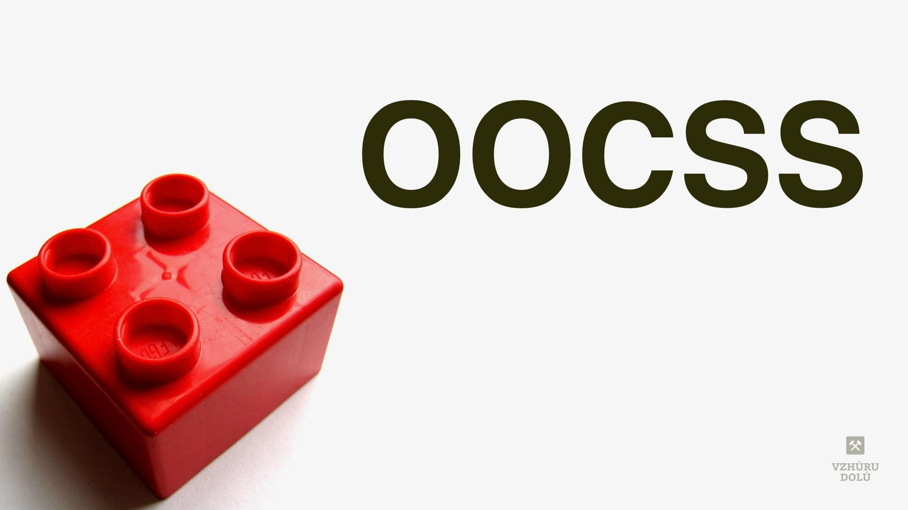
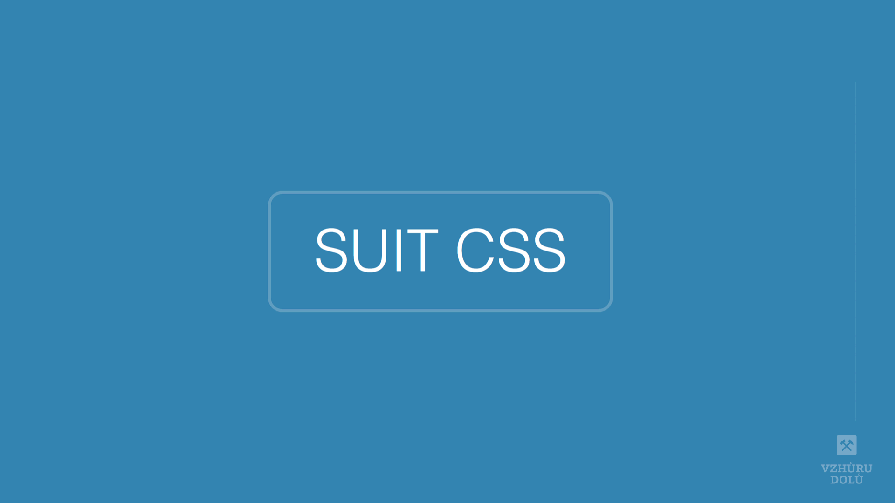
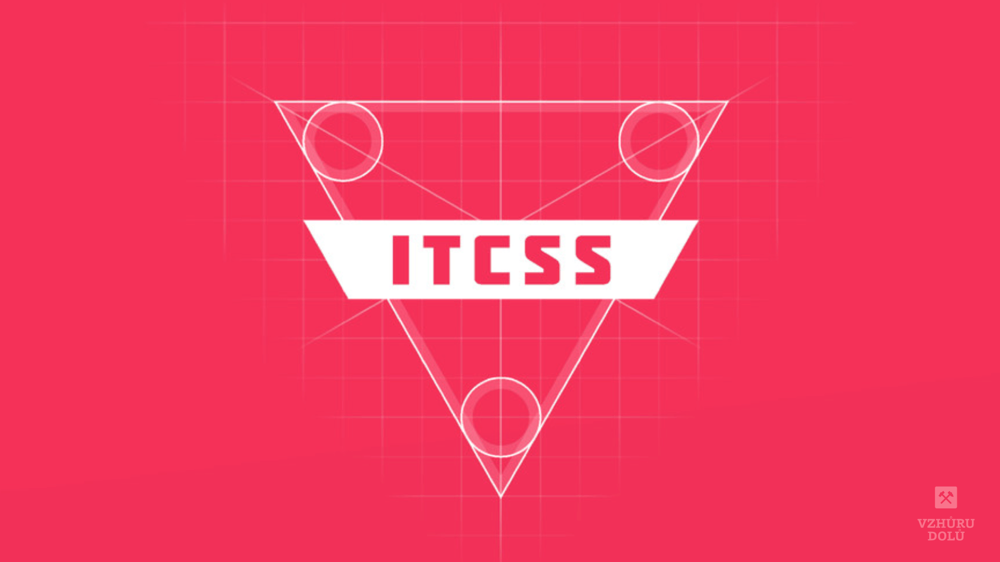
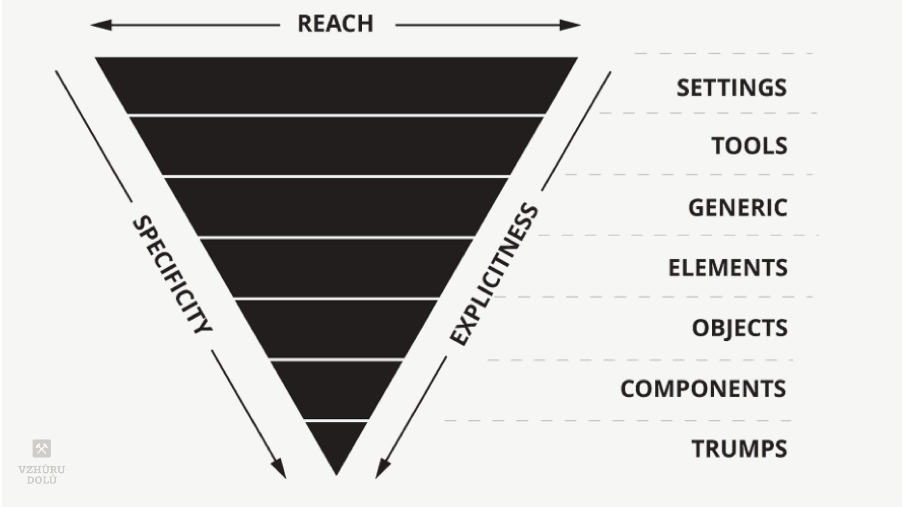

# Metodiky pro organizaci CSS kódu

CSS kód je snadné psát, ale špatně se spravuje jeho větší množství. 

Proto pro psaní kaskádových stylů vznikla celá řada metodik, které mají za úkol problémy jazyka řešit.

Nemám zde ambice sepsat kompletního průvodce metodami organizace stylů. Je jich totiž opravdu hodně, nemluvě o různých variantách, mutacích a vlastních úpravách.

<!-- AdSnippet -->

Projdeme si jen ty metodiky, které jsem někdy používal v rámci své [organizace CSS](rcss-zasady.md), což ale nemusí být ke škodě, protože si troufám říct, že jde zároveň o ty nejpodstatnější.

## OOCSS {#oocss}

Objektově orientované CSS byl dle mého první větší pokus o řešení velmi častých problémů při psaní stylů.

Původní zdroj téhle nepříliš dobře zdokumentované metodiky je v přednášce [Nicole Sullivan už z roku 2009](https://www.slideshare.net/stubbornella/object-oriented-css).

Hlavním cílem OOCSS je zapouzdření stylů do samostatných objektů, nebo komponent chcete-li. Z toho vycházejí hlavní principy:

- *Nezávislost vzhledu na struktuře*  
Do CSS selektorů nikdy nedáváme HTML tagy. Mohou se totiž změnit. Selektor `.button` je univerzálnější než `input` nebo `input.button`.
- *Nezávislost obsahu na kontejneru*  
Do CSS selektorů nikdy nepromítáme strukturu stromu DOM. I ta se totiž může v různých kontextech změnit. `.button-tiny` je tedy lepší než např. `.login-form .button { … }`. Udržovat komponenty je vždy snazší než [udržovat kontexty](komponenty-kontexty.md).

→ Na Vzhůru dolů píšu [o OOCSS](oocss.md) velmi podrobně.

OOCSS je základ všech dnešních metodik, ale přímo tuto metodiku asi nikdo nepoužívá.

## BEM {#bem}

BEM (Block, Element, Modifier) je buď [plnohodnotná metodika](https://en.bem.info/methodology/) organizace CSS i JS od Yandexu nebo jen [způsob zápisu CSS komponent](http://getbem.com/).

<!-- AdSnippet -->

V dennodenní kodérské praxi se ujala hlavně ta druhá varianta, protože je velmi účinná a jednoduchá. Taky o ní zde chci psát. Vůbec si totiž bez ní neumím představit psát dneska styly.

Každá komponenta se označuje a zapisuje jako *blok*, dceřiný prvek jako *element* a obměna komponenty jako *modifikátor*.

Jednotlivé typy prvků jsou pak odlišeny způsobem zápisu třídy:

| Typ třídy            | Způsob pojmenovávání |
|----------------------|----------------------|
| Blok                 | `.block`             |
| Element              | `.block__element`    |
| Modifikátor          | `.block--modifier`   |
| Modifikátor elementu | `.block__element--modifier` |

BEM je skvělý, ale má jednu nevýhodu – pokrývá sice nejdůležitější, ale pořád relativně malý výsek typů prvků, které v CSS dneska můžeme popisovat. Ano, jsou to komponenty.

→ [O BEM](bem.md) na Vzhůru dolů.

## SUIT CSS {#SUIT-CSS}

[SUIT CSS](https://suitcss.github.io/) od Nicolase Gallaghera staví na BEM a tvoří metodiku s dosahem na další důležité typy prvků – stavy a utility.

- [Zásady psaní respektujícího CSS](rcss-zasady.md)
- [Podcast: O utility třídách v CSS](/podcast/103-podcast-fakturoid-css)

Součástí sady SUIT CSS je také [preprocesor](https://github.com/suitcss/preprocessor), který se snaží zavádět syntaxi, která by se dříve či později měla objevit v CSS, což už znáte z [PostCSS](postcss.md). Ale ten teď, spolu s dalšími vlastnostmi SUIT CSS, nechme stranou.

Tabulku v případě SUIT CSS můžeme rozšířit:

| Typ třídy               | Způsob pojmenovávání |
|-------------------------|----------------------|
| Komponenta              | `.MyComponent`       |
| Část komponenty         | `.MyComponent-part`    |
| Modifikátor komponenty  | `.MyComponent--modifier`   |
| Stav komponenty         | `.MyComponent.is-animating` |
| Utilita                 | `.u-fontSmall` |

SUIT CSS tedy oproti BEM zavádí:

- *Příjemně pozměněné pojmenování*  
Leckomu bude sympatický `CamelCase` zápis a to, že díky tomu není nutné zapisovat dceřinné prvky komponenty se dvěma podtržítky jako v BEMu (tam by šlo o `.my-component__part`).
- *Stavy*  
Na rozdíl od modifikátorů, kde jde o úpravy vzhledu původní komponenty v CSS (`.Button--large`), jde u stavů o změnu chování (`.Box.is-expanded`) a obvykle jsou ovládané JavaScriptem nebo backendem.
- *Utility*  
[Užitkové třídy](css-utility.md) jsou v dnešní organizaci CSS více či méně nepostradatelné a proto je dobře, že na ně SUIT CSS myslí.

→ Mrkněte se do dokumentace [SUIT CSS](https://suitcss.github.io/).

Poslední metodika, na kterou si zde chci posvítit, na to jde jinak – přes organizaci typů stylů.

## ITCSS {#ITCSS}

Metodika Harryho Robertse ITCSS (Inverted Triangle CSS) se primárně nezaměřuje na názvy selektorů ani psaní samotného kódu, ale na dělení a organizaci souborů s CSS kódem do jednotlivých typů.

Myšlenka ITCSS je v obráceném trojúhelníku. Prvky, které jsou nahoře, mají nízkou [specificitu selektorů](css-kaskada.md), ale zároveň ovlivní větší množství prvků na stránce. Čím jdeme v trojúhelníků níže, tím méně prvků na stránce ovlivňujeme, ale tím vyšší je váha selektoru.

<figure>

<figcaption markdown="1">
*Obrázek: Zdá se, že ITCSS převrací věci vzhůru nohama, jenže ve skutečnosti dává CSS řád.*
</figcaption>
</figure>

Základní typy prvků podle ITCSS:

| Název       | O co jde?          | Ukázky                   |
|:------------|:-------------------|:-------------------------|
| Settings    | Proměnné, config…  | `$color-primary`         |
| Tools       | Globální mixiny    | `@mixin clearfix { … }`  |
| Generic     | Reset, Normalize…   | `p`, `h1`               |
| Base        | Základní typografie | `p`, `h1`               |
| Components  | Komponenty          | `.button`, `.nav`       |
| Trumps      | Utility, helpery…   | `.mb-0`, `.text-center` |

→ V češtině ITCSS [výborně popsal Adam Kudrna](https://frontend.garden/proc-je-itcss-nejpokrocilejsi-metodika-organizace-css/), a angličtině asi nejlépe [Lubos Kmetko](https://www.xfive.co/blog/itcss-scalable-maintainable-css-architecture/).

## Závěr: Když nevíte, používejte ITCSS a SUIT CSS {#zaver}

Pokud jste bedlivě četli, vidíte teď určitě nemalé rozdíly mezi prvními třemi metodikami a tou čtvrtou.

Je to přesně tak, ITCSS je metodika souborová, kdežto ty předchozí se zabývají hlavně selektory.

<!-- AdSnippet -->

Ještě to můžeme říci jinak – OOCSS je předchůdcem a podmnožinou BEMu a ten je předchůdcem a podmnožinou SUIT CSS. Pokud byste si tedy chtěli vybrat jen jednu z nich, naučte se uvedené základy SUIT CSS.

ITCSS je rámující metodika, které se zabývá pořadím kódu a jeho dělením do souborů. Tu vám do vaší vlastní organizace stylů doporučuji přidat v každém případě.
