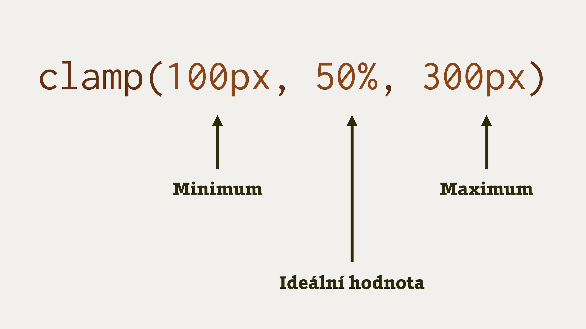

# Porovnávací funkce v CSS: min(), max() a clamp()

Funkce, které se uvádějí namísto hodnot v deklaracích stylů, umožňují porovnat dvě a více hodnoty:

|   Funkce     |   Význam     |
|--------------|--------------|
| `min()`      |  Vrací nejmenší hodnotu z argumentů oddělených čárkou. <br> Např. `min(50%, 200px)`. |
| `max()`      |  Vrací největší hodnotu z argumentů oddělených čárkou. <br> Např. `max(50%, 10vw, 200px)`. |
| `clamp()`    |  Vrací prostřední hodnotu, pokud není menší než první a větší než třetí. <br> Např. `clamp(100px, 20%, 200px)`. |

Jsou součástí čtvrté verze specifikace „CSS Values and Units Module“, podporují je všechny moderní prohlížeče a ještě k tomu jsou užitečné.

Funkce `min()`, `max()` a `clamp()` v CSS nám prakticky umožní lépe řídit velikost prvků, dodržovat správné mezery mezi prvky nebo třeba implementovat plynulou („fluidní“) typografii.

<div class="ebook-only" markdown="1">

Mají samozřejmě své místo i v této knize. Používám je například pro [řešení svatého grálu](priklad-holy-grail.md) mezi layouty nebo při vysvětlování [krkavčí techniky](krkavci-technika.md).

</div>

Jak fungují?

## Funkce `min()` a `max()` {#min-max}

U funkcí `min()` a `max()` to je jednoduché – zadáte seznam argumentů a prohlížeč určí, která z hodnot je nejmenší nebo největší.

<div class="web-only related" markdown="1">
- [CSS funkce `minmax()`](css-minmax.md)
</div>

Příklad:

```css
.box-1 {
  width: min(100px, 50%);
}
```

Šířka `.box-1` bude určena tím menším přepočtem na pixely z obou hodnot.

V dostatečně širokém rodičovském prvku to bude většinou `100px`, ale v opravdu malých šířkách se může použít `50%`, protože vypočtená hodnota šířky bude menší než `100px`.

<!-- AdSnippet -->

Zkusme si představit totéž pro funkci `max()`:

```css
.box-2 {
  width: max(100px, 50%);
}
```

Šířka `.box-1` bude určena větší pixelovou hodnotou vypočtenou z obou atributů. Jak asi sami tušíte, většinou se použije hodnota `50%` a jen na opravdu malých rozlišeních prohlížeč vybere `100px`.

V tomto případě jde o obdobu zápisu `width:50%;  min-width:100px;`. V ukázce to sami uvidíte.

CodePen: [cdpn.io/e/gOmeoEj](https://codepen.io/machal/pen/gOmeoEj?editors=1100)

## Funkce `clamp()` {#clamp}

Jeden z významů slova „clamp“ v angličtině (_[klæmp]_) je „svěrka“, což je vcelku přesné. První a poslední atribut v závorce totiž udává minimální a maximální sevření, prostřední je ideální hodnota:

```css
.box-3 {
  width: clamp(100px, 50%, 300px);
}
```

<p></p>

Vysvětlíme to ještě detailně:

- Prostřední argument je _ideální hodnota_. `.box-3` bude široký `50%`, pokud nevstoupí v platnost svěrka z jedné nebo druhé strany.
- První argument je _minimální hodnota_. Prvek nesmí být užší než `100px`.
- Třetí argument je _maximální hodnota_. `.box-3` nebude nikdy širší než `300px`.

Je to srozumitelné? Ještě si to případně zkuste na CodePenu.

CodePen: [cdpn.io/e/poeLazv](https://codepen.io/machal/pen/poeLazv?editors=1100)

Následující ukázku jsem si vypůjčil od Uny Kravets. Je to krásná vizualizace, ve které je vidět aktuální šířka rodiče, elementu a pak také argument funkce `min()`, který je v dané šířce obrazovky aktivní.

<p class="ebook-only"></p>

Pokud si to budete zkoušet na živo, zkuste si hýbat se šířkou viewportu.

CodePen: [cdpn.io/e/rNeGNVL](https://codepen.io/una/pen/rNeGNVL)

Ve specifikaci se uvádí, že funkci `clamp()` je možné zapsat pomocí `min()` a `max()` jako `max(MIN, min(VAL, MAX))`. Nevím, jak vám, ale mě to moc při snaze pochopit funkci `clamp()` nepomohlo.

## Krása univerzálnosti {#univerzalnost}

Pojďme ale vzoreček ze specifikace rozebrat více. Nakonec možná dojdeme k tomu, že bude užitečný. V případě výše uvedeného kódu by zápis vypadal takto:

```css
.box-3 {
  width: max(100px, min(50%, 300px));
}
```

<!-- AdSnippet -->

Zopakuji i původní zápis pomocí funkce `clamp()`:

```css
.box-3 {
  width: clamp(100px, 50%, 300px);
}
```

Jak už jste jistě pochopili, kód výše je stejný jako bychom napsali následující deklaraci:

```css
.box-3 {
  width: 50%;
  min-width: 100px;
  max-width: 300px;
}
```

Konstrukce s `min-width` a `max-width` v CSS máme a mnozí známe už od pravěkých dob. Tak proč zavádět nový zápis v podobě funkcí `min()`, `max()` a `clamp()`?

Za prvé je nový zápis stručnější a možná přehlednější, nejdůležitější je ale jeho _univerzálnost_. Použití není limitované na délkové vlastnosti `width` a `height`.

To je tak zajímavé, že to musíme rozebrat. Jen chvíli počkejte.

## Demo: ideální šířka textu {#demo-typograficka-sirka}

Ve známé knize [The Elements of Typographic Style](http://webtypography.net/2.1.2#:~:text=%E2%80%9CAnything%20from%2045%20to%2075,is%2040%20to%2050%20characters.%E2%80%9D) od Roberta Bringhursta se píše, že „za uspokojivou délku řádku pro jednosloupcovou stránku s patkovým písmem se obecně považuje 45 až 75 znaků“.

Toto můžeme krásně definovat právě pomocí porovnávací funkce:

```css
.card {
  width: clamp(45ch, 50%, 75ch);
}
```

Prvek `.card` bude zabírat `50%` šířky rodiče, ale nikdy méně než `45ch` a více než `75ch`.

Pokud to nevíte, jednotka `ch` v sobě obsahuje šířku znaku `0`, což se považuje za průměrnou šířku znaku.

CodePen: [cdpn.io/e/QWyLxaL](https://codepen.io/una/pen/QWyLxaL)

## Demo: Plynulá typografie {#demo-fluid-typo}

V další ukázce Uny Kravets konečně odbočíme mimo vlastnosti určující šířku elementu. Budeme nastavovat maximální a minimální velikost textu a tím plně využijeme nových porovnávacích funkcí.

```css
h1 {
  font-size: clamp(1.5rem, 5vw, 3rem);
}
```

Velikost písma se bude s rozšiřováním okna zvětšovat od `1.5rem` až po `5rem`.

[Jednotkou `vw`](jednotky.md) nastavujeme velikost písma na pět procent šířky viewportu. Abychom se přitom vyhnuli extrémně malým a extrémně velkým hodnotám `font-size`, pomáháme si funkcí `clamp()`.

CodePen: [cdpn.io/e/ExyYXaN](https://codepen.io/una/pen/ExyYXaN)

Čtenář Dan Srb mi po vydání tohoto textu na Vzhůru dolů poslal ještě jeden tip ke stupňovitému zvětšování písma:

> Pokud chcete  například zajistit, aby se od 500px šířky viewportu začalo písmo zvětšovat z 1rem na 2rem až k hranici šířky viewportu 900px, pak je tu tahle kalkulačka na snadno zapamatovatelné adrese: [xgkft.csb.app](https://xgkft.csb.app/). (Lze použít např. i pro vlastnost padding.)

Dodejme ještě, že autorka původního CodePenu nás nabádá, abychom si těchto hrátkách s velikostí písma dávali pozor na přístupnost.

Omezení velikosti textu pomocí funkcí `max()` nebo `clamp()` může být proti pravidlům přístupnosti WCAG, která doporučují, aby si uživatelé mohli písmo libovolně zvětšovat sami.

## Co byste ještě měli vědět o porovnávacích funkcích? {#co-jeste}

Funkce `min()`, `max()` a `clamp()` mají v DNA pár důležitých vlastností, které se mi jinam nevešly, ale přesto si zaslouží vaši pozornost:

- Funkce můžete skládat a zanořovat. Např. `font-size:max(min(0.5vw, 1em),2rem)`. Není ale garantováno, že vás z toho nerozbolí hlava.
- Stejně jako [funkce `calc()`](css3-calc.md) umožňují porovnávací funkce používat matematické výrazy se sčítáním (+), odčítáním (-), násobením (*) a dělením (/) jako součástí hodnot. Zápis `font-size:max(calc(0.5vw - 1em),2rem)` je tudíž stejný jako `font-size:max(0.5vw - 1em,2rem)`.
- Co když ve funkci `clamp()` prohodíte minimum a maximum? Vyhraje minimum. Například zápis `clamp(100px, …, 50px)` bude vracet hodnotu `100px`, čímž překročí maximum uvedené ve třetím argumentu.

## Podpora v prohlížečích

Je to dobré. Funkce `min()`, `max()` a `clamp()` podporují všechny moderní prohlížeče. V Internet Exploreru vám tyto funkce neprojdou.

Můžete to ověřit na CanIUse: [caniuse.com/css-math-functions](https://caniuse.com/css-math-functions)

<!-- AdSnippet -->
