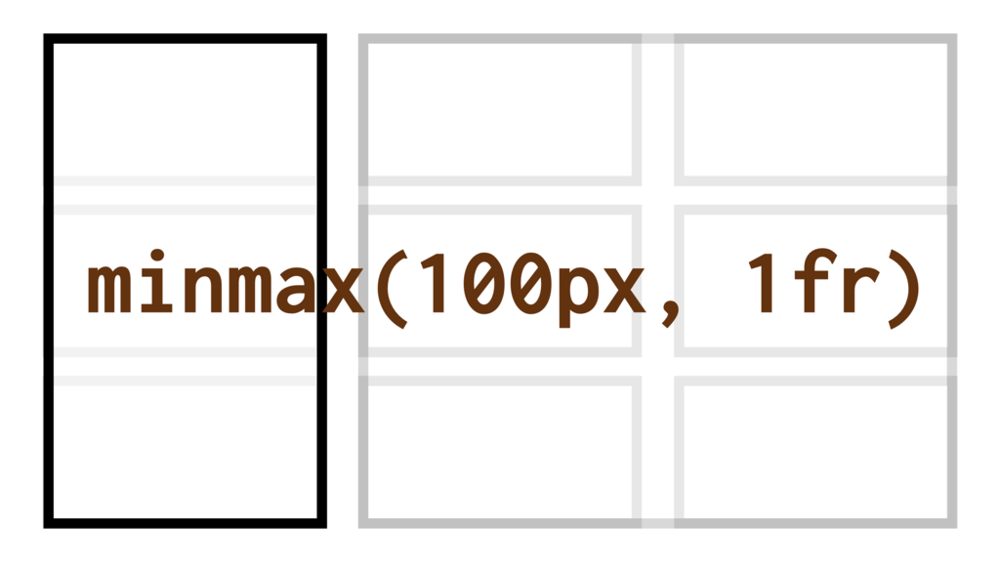

# CSS funkce minmax() a klíčová slova min-content, max-content a fit-content

Funkce (nebo přesněji řečeno „zápis“) `minmax()` a navázaná klíčová slova definují rozsah šířky nebo výšky pro sloupce či řádky mřížky v CSS gridu.

<div class="connected" markdown="1">



<div class="web-only" markdown="1">

Zápis `minmax()` je součástí specifikace [CSS gridu](css-grid.md).

</div>

<div class="ebook-only" markdown="1">

→ [vrdl.cz/p/css-minmax](https://www.vzhurudolu.cz/prirucka/css-minmax)

</div>

</div>

V CSS už máme [funkce `min()`, `max()` a `clamp()`](css-min-max-clamp.md), ale funkce `minmax()` a klíčová slova `min-content`, `max-content` a `fit-content` jsou zásadní pro použití v mřížce.

Pro plnohodnotné používání mřížky je to skoro nepostradatelné, ale je v tom řada nejasností, záludností a… opičáren. Pojďme se na ně v tomto textu podívat.

Možných hodnot je více:

<div class="rwd-scrollable prop-table f-6"  markdown="1">

| Hodnota                          | Ukázka                       |
|----------------------------------|------------------------------|
| Statický rozsah                  | `minmax(100px, 200px)`       |
| Flexibilní rozsah                | `minmax(100px, 1fr)`         |
| `max-content` (maximální velikost obsahu)                    | `minmax(100px, max-content)` |
| `min-content` (minimální velikost obsahu)                    | `minmax(min-content, 200px)` |
| `auto` (automaticky)                           | `minmax(auto, auto)`         |
| `fit-content` (podle obsahu)                  | `fit-content`         |
| `fit-content()` (podle obsahu, s maximem)                  | `fit-content(200px)`         |

</div>

V tomhle textu řešíme vlastnosti pro nastavení rozměrů stop mřížky podle vlastních (obsahových nebo v angličtině *intrinsic*) velikostí prvků uvnitř. Zabýváme se rozměry obsahu.

<!-- AdSnippet -->

Je dobré si uvědomit, že se to liší od nastavení rozměrů zvenčí pomocí nadřazeného prvku. Tam užijete fixní [jednotky](jednotky.md) (`px`, `rem`, …) nebo podílové jednotky `fr`. Ty obsah uvnitř příliš nezajímá a nastavují rozměry prvku, ve kterém se obsah nachází.

Projďeme si teď vše podrobně na příkladech.

## Základy: Statický rozsah {#zaklady}

Zápis `minmax()` se tváří jako funkce se dvěma parametry: minimálním a maximálním rozměrem buněk mřížky layoutu:

```css
.container {
  grid-template-columns: minmax(100px, 200px) 1fr 1fr;
}
```

Tohle je asi jednoduché, že?

- První sloupeček se nikdy nezmenší pod `100px` a nepřesáhne šířku `200px`. To přesně dělá zápis `minmax(100px, 200px)`.
- Další dva sloupečky si rovnoměrné rozdělí šířku zbylého prostoru, protože jsou jsou nastavené [podílovou jednotkou](css-jednotka-fr.md) na `1fr`.

CodePen: [cdpn.io/e/XWrLErd](https://codepen.io/machal/pen/XWrLErd?editors=1100)

## Flexibilní rozsah (použití jednotky fr) {#fr}

Příklad pozměníme:

```css
.container {
  grid-template-columns: minmax(100px, 1fr) 1fr 1fr;
}
```

Uvedený zápis asi opět nebude žádná velká věda, protože [zlomkovou jednotku `fr`](css-jednotka-fr.md) už známe.

- Všechny sloupečky si rovnoměrné rozdělí šířku na tři části.
- První sloupeček se ale nikdy nezmenší pod `100px`. Důvodem je zápis `minmax(100px, 1fr)`.

CodePen: [cdpn.io/e/qBWGooy](https://codepen.io/machal/pen/qBWGooy?editors=1100)

## Klíčové slovo max-content {#max-content}

`max-content` dává instrukci, aby se buňka nezvětšovala nad maximální velikost obsahu:

```css
.container {
  grid-template-columns: minmax(100px, max-content) 1fr 1fr;
}
```

Instrukce pro vykreslení prvního sloupce mřížky zní:

- Nikdy nebudeš užší než `100px`.
- Nikdy se nerozšíříš nad rámec maximální šířky obsahu (`max-content`).

<!-- AdSnippet -->

Co je ale ta „maximální velikost obsahu“? Je to různé. U [pružných responzivních obrázků](pruzna-media.md) například jde o jejich maximální pixelovou velikost. Blok s textovým obsahem se může zvětšovat, dokud slova stačí. Však si to zkuste na příkladu.

CodePen: [cdpn.io/e/wvwbmQM](https://codepen.io/machal/pen/wvwbmQM?editors=1100)

Pojďme si to ještě ukázat na příkladu s obrázkem. Kód je totožný jako v předchozím demíčku:

CodePen: [cdpn.io/e/eYOaMvv](https://codepen.io/machal/pen/eYOaMvv?editors=1100)

Obrázek nebude ve stopě mřížky definované jako `minmax(100px, max-content)` nikdy menší než `100px` a větší než maximální velikost. Ta je `400px` a je zde definovaná v atributu `width` značky ``.

## Klíčové slovo min-content {#min-content}

`min-content` funguje opačně než `max-content`, to byste nečekali, že?

Při použití ve funkci `minmax()` přikazuje, aby se buňka nikdy nezmenšila pod minimální velikost obsahu:

```css
.container {
  grid-template-columns: minmax(min-content, 200px) 1fr 1fr;
}
```

Co je zase ta „minimální velikost obsahu“? U textu délka nejdelšího slova, u obrázků a jiných vkládaných médií s pružnými rozměry žádnou minimální šířku či výšku nemáme.

CodePen: [cdpn.io/e/wvwbmGV](https://codepen.io/machal/pen/wvwbmGV?editors=1100)

Možné je samozřejmě i použití jak `min-content`, tak `max-content`: `minmax(min-content, max-content)`:

```css
.container {
  display: grid;
  grid-template-columns: minmax(min-content, max-content) 1fr 1fr;
  gap: 10px;
}
```

Dotčená stopa layoutu se pak nezmenší pod minimální a nezvětší nad maximální šířku či výšku obsahu.

CodePen: [cdpn.io/e/ZEzNxmX](https://codepen.io/machal/pen/ZEzNxmX?editors=1100)

## Klíčové slovo auto {#auto}

V hodnotách zápisu `minmax()` je možné uvádět i klíčové slovo `auto`, které velmi dobře známe odjinud z CSS. V gridu se chová skoro tak, jak bychom očekávali. Skoro.

- Pokud je `auto` v druhém parametru, chová se stejně jako `max-content`. Takže zápis `minmax(100px, auto)` bude mít stejný dopad jako `minmax(100px, max-content)`.
- Jakmile jej však uvedeme v prvním parametru, může přebírat hodnotu vlastností `min-width` nebo `min-height`. Pokud ty nejsou definované, chová se stejně jako `min-content`, a tedy zápis `minmax(auto, 200px)` bude ekvivalentní k `minmax(min-content, 200px)`.

Klíčové slovo `auto` si ještě vyzkoušíme na příkladu. Mřížku definujeme následovně:

```css
.container {
  grid-template-columns: minmax(auto, auto) 1fr 1fr;
}
```

CodePen: [cdpn.io/e/eYOaXyW](https://codepen.io/machal/pen/eYOaXyW?editors=1100)

Uvnitř první buňky máme obrázek, který má pružné rozměry (definované pomocí `max-width: 100%; height: auto;`). Použitím `minmax(auto, auto)` prohlížeči říkáme: Sloupec mřížky se smí zmenšit jen na minimální obsahovou velikost a zvětšit na maximální.

Jenže u vkládaných pružných médií není rozměrové minimum a maximum nijak definováno. My to ale můžeme udělat. Maximum v našem CodePenu definuje už uvedeným atributem `width="400"` v HTML. A minimum? Tady se dostáváme k použití vlastnosti `min-width`, kterou zde nastavujeme na `100px`.

Musíme zmínit, že pouze stopy mřížky s rozměry nastavenými na `auto` je možné roztáhnout na šířku či výšku pomocí `align-content: stretch` nebo `justify-content: stretch`.

### Co když je ve stopě mřížky buněk více? {#vice-bunek}

Považuji zde za vhodné připomenout, že naše příklady jsou hodně zjednodušené, protože v daném sloupci rozvržení pomocí CSS gridu máme vždy jen jednu obsahovou buňku.

Jak se ovšem bude `minmax()` chovat v případě použití u sloupečků (nebo řádků), kde je buněk více? U maxima vezme vždy tu nejmenší velikost z obsahu všech buněk, u minima pak největší.

Prostě vytvoří nejmenší možný rozsah rozměrů všech obsahů dotčených buněk. Tak, aby se žádný z prvků mřížky nedeformoval pod své obsahové minimum nebo nad své maximum. To je fér, ne?

## Klíčové slovo nebo funkce fit-content() {#fit-content}

`fit-content` je způsob jak v podporovaných prohlížečích deklarovat, že si přejeme rozměr prvku podle obsahu. Hodí se to například v situaci, kdy chceme, aby se blokový prvek neroztahoval do celé šířky rodiče:

```css
.box {
  width: fit-content;
}
```

CodePen: [cdpn.io/e/NWKZyrY](https://codepen.io/machal/pen/NWKZyrY?editors=1100).

V CSS gridu se `fit-content` používá s parametrem:

```css
.container {
  grid-template-columns: fit-content(200px) 1fr 1fr;
}
```

Takový zápis říká, aby prohlížeč zařídil šířku prvního sloupce vždy podle obsahu, ale s maximem `200px`.

`fit-content()` se tedy počítá jako `minmax(auto, max-content)` s tím že hodnota v argumentu funkce slouží jako zarážka pro maximální rozměr, pokud je větší než minimum.

CodePen: [cdpn.io/e/GRKbQom](https://codepen.io/machal/pen/GRKbQom?editors=1100).

Může vás také zajímat, jak to funguje s obrázky a jejich vnitřními nastaveními minima a maxima.

Následuje tedy ještě jedna ukázka vycházející z dřívějšího CodePenu s obrázkem.

```html
<div class="container">
  <p class="column">
    
  </p>
  <p class="column">2</p>
  <p class="column">3</p>
</div>
```

```css
.container {
  display: grid;
  grid-template-columns: fit-content(200px) 1fr 1fr;
  gap: 10px;
}
```

Funguje to dobře. I přes to, že obrázek má nastavenou šířku 400 pixelů, v layoutu si drží maximální šířku definovanou v CSS pomocí `fit-content(200px)`. 

CodePen: [cdpn.io/e/JjPQpYj](https://codepen.io/machal/pen/JjPQpYj?editors=1100).

## Co když… pár specifičností zápisu minmax() {#co-kdyz}

Pokud byste chtěli zápis `minmax()` mermomocí rozbít, prohlížeče by se podle specifikace měly chovat následovně:

- Pokud uvedete vyšší minimum než maximum (např. `minmax(200px, 100px)`), maximum se bude ignorovat a prohlížeče budou počítat jen s minimem.
- Jako minima zatím nemá smysl uvádět zlomkovou jednotku `fr`. Ale v budoucí verzi specifikace by se to prý mohlo změnit.

## Podpora v prohlížečích {#podpora}

Teď už zbývá jen rekapitulace podpory v prohlížečích.

- Funkce `minmax()`, ale i klíčové slova `min-content` a `max-content` podporují všechny prohlížeče včetně Internet Exploreru 11. V tomto prohlížeči-dědečkovi ale doporučuji testovat, občas se to chová podivně.
- `fit-content()` podporují skoro všechny relevantní prohlížeče ale v IE 11 ostrouháte. Je však možné tam vlastnost obejít pomocí šířky stopy nastavené na `auto` a vlastnosti `max-width` aplikované na buňky layoutu.

Viz CanIUse: [caniuse.com/intrinsic-width](https://caniuse.com/#search=intrinsic-width).

<div class="web-only related" markdown="1">

Použili jste `minmax()` ještě nějak jinak? Neváhejte napsat do komentářů, rád to do článku doplním.

</div>

<!-- AdSnippet -->
