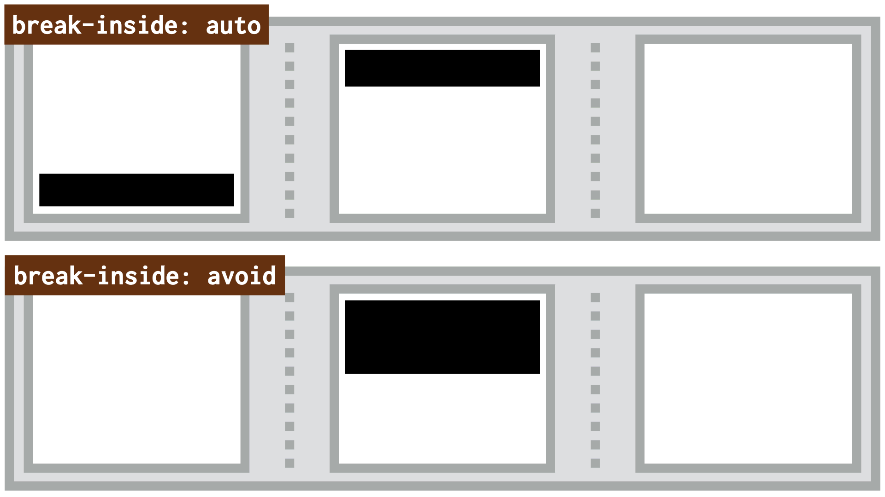

# Vlastnosti break-before, break-after a break-inside: zalamování ve vícesloupcovém rozložení

V automatickém vícesloupcovém layoutu můžete mít prvky, u kterých si nepřejete, aby prohlížeče udělaly zalomení z jednoho sloupce na druhý. Může jít o nadpisy a podnadpisy, tabulky nebo obrázky s jejich popisky – vlastně jakékoliv prvky, které mají potomky.

<!-- AdSnippet -->

Slouží k tomu následující tři vlastnosti, které znáte možná ještě z CSS modulu pro ovlivnění stránkování během tisku stránky:

- `break-before` – zalamování před prvkem.
- `break-after` – zalamování za prvkem.
- `break-inside` – zalamování uvnitř prvku.

<div class="related web-only" markdown="1">
- [CSS Multi-column Layout](css-multicol.md)
</div>

Potíž v kombinaci těchto vlastností s vícesloupcovým rozložením je v jejich nedostatečné podpoře v prohlížečích.

<figure>

<figcaption markdown="1">
*Na obrázku je vidět, že jsme černému prvku zakázali, aby se jeho obsah rozbil do dvou sloupečků. Tím ďábelským nástrojem je zde právě `break-inside:avoid`.*
</figcaption>
</figure>

Pojďme si to ale alespoň teoreticky rozebrat. Je možné, že v době, kdy toto čtete, už bude podpora lepší.

## `break-before` – zalamování před prvkem {#break-before}

Vlastnost `break-before` slouží k vynucení nebo zakázání zalomení před prvkem. V kontextu vícesloupcového rozložení jsou možné tyto hodnoty:

- `auto` – ponechej výchozí chování prohlížeče.
- `avoid` nebo `avoid-column` – zakazuje zalomení před prvkem.
- `column` – vynucuje zalomení před prvkem.

## `break-after` – zalamování za prvkem {#break-after}

Toto bychom mohli psát přes kopírák – vlastnost `break-after` vynucuje nebo zakazuje zalomení za prvkem. Možné jsou tyto hodnoty:

- `auto` – ponechej výchozí chování prohlížeče.
- `avoid` nebo `avoid-column` – zakazuje zalomení za prvkem.
- `column` – vynucuje zalomení za prvkem.

## `break-inside` – zalamování uvnitř prvku {#break-inside}

Vlastnost `break-before` můžeme použít k vynucení nebo zakázání zalomení uvnitř prvku. V kontextu vícesloupcového rozložení jsou možné tyto hodnoty:

- `auto` – ponechej výchozí chování prohlížeče.
- `avoid` nebo `avoid-column` – zakazuje zalomení uvnitř prvku.
- `column` – vynucuje zalomení uvnitř prvku.

## Příklad {#priklad}

Nakódoval jsem příklad, ve kterém se snažím všem možnými způsoby rozbít vícesloupcový layout definovaný takto:

```css
.container {
  columns: 20em 3;
}
```

Z povídání [o vlastnosti `columns`](css-multicol-columns.md) už víte, že tímto jsem nastavil doporučenou šířku sloupce kolem `20em` a maximální počet sloupců na tři.

Nepokouším se zde ale rozbít samotný layout, nýbrž prvek `<h2>`, který obsahuje další vnořený prvek:

```html
<h2>
  The heading is really long, really long
  <br>
  <small>(and also has a subheading)</small>
</h2>
```

Když si patřičně upravíte šířku okna tak, aby druhý nadpis připadl na konec sloupce, prohlížeč by mohl usoudit, že někde v oblasti kolem `<br>` může prvek zalamovat.

CodePen: [cdpn.io/e/jOMaMdq](https://codepen.io/machal/pen/jOMaMdq?editors=1100)

V první možnosti (`auto`) necháváme vše na prohlížeči. V běžném kódu bychom to nemuseli zapisovat, zde je ale potřeba smazat hodnoty dalších nastavení. Jen připomínám, že k tomu slouží hodnota `auto` u všech vlastností:

```css
.container h2 {
  break-before: auto;
  break-after: auto;
  break-inside: auto;
}
```

U dalších dvou možností se snažíme zalamování vynutit nebo zakázat:

- `break-before: column` - vynucuje zalomení nadpisů vždy do nového sloupce.
- `break-inside: avoid` – zakazujeme zalomení uvnitř nadpisu.

Sami můžete posoudit, jak to v jednotlivých prohlížečích funguje.

Nebo spíše nefunguje.

## Podpora v prohlížečích {#podpora}

<!-- TODO podporu je potřeba detailnější -->

Výše uvedený příklad mě plně funguje jen v nejnovějším Safari (verze 14). Firefox zvládne jen možnost `break-inside:avoid`, Chrome je u obou ukázek zcela chromý.

Tabulky na webu CanIUse hovoří o různorodé podpoře, ale těm zeleným políčkům se na základě mých testů nedá příliš věřit. [caniuse.com/break-](https://caniuse.com/?search=break-%20multi-)

Na jiném místě CanIUse se o Chrome uvádí, že ve všech zde zmíněných vlastnostech nyní (v prosinci 2020) nepodporuje hodnoty `avoid-column`, `column` a `avoid`, což jsou ty potenciálně nejužitečnější. [caniuse.com/multicolumn](https://caniuse.com/multicolumn)

<!-- AdSnippet -->

Vlastnosti `break-before`, `break-after` a `break-inside` pro mě tedy při použití v CSS Multi-Column Layout zůstávají jako na papíře krásně vypadající, ale v praxi zatím nepříliš použitelné.
