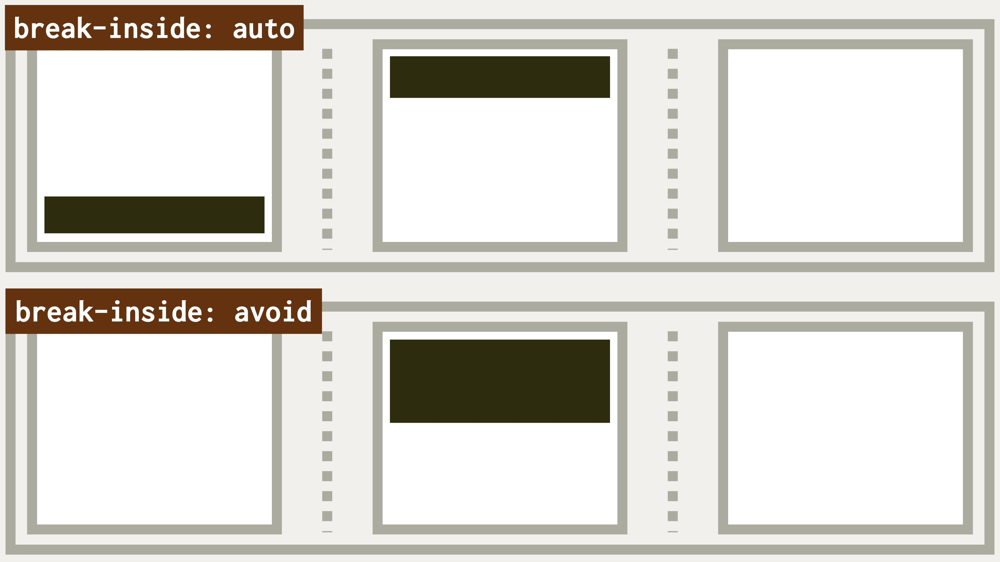

# Vlastnosti break-before, break-after a break-inside: zalamování ve vícesloupcovém rozložení

Uvnitř vícesloupcového layoutu můžete mít prvky, které si nepřejete zalamovat při přechodu z jednoho sloupce do druhého.

Může jít o nadpisy a podnadpisy, tabulky nebo obrázky s jejich popisky – vlastně jakékoliv prvky, které mají potomky.

<div class="book-index" data-book-index="break-before"></div>
<div class="book-index" data-book-index="break-after"></div>
<div class="book-index" data-book-index="break-inside"></div>

<div class="connected" markdown="1">


<div class="web-only" markdown="1">

Vlastnosti `break-before`, `break-after` a `break-inside` patří do specifikace vícesloupcového layoutu – [CSS Multi-column Layout](css-multicolumn.md).

</div>

<div class="ebook-only" markdown="1">

→ [vrdl.in/colb](https://www.vzhurudolu.cz/prirucka/css-multicol-break)

</div>

</div>

Poslouží jim následující tři vlastnosti, které znáte možná ještě z CSS modulu pro ovlivnění stránkování během tisku stránky:

- `break-before` – zalamování před prvkem.
- `break-after` – zalamování za prvkem.
- `break-inside` – zalamování uvnitř prvku.

Potíž v kombinaci těchto vlastností s vícesloupcovým rozložením je v jejich nedostatečné podpoře v prohlížečích.

To nás ale od jejich zdokumentování nemůže odradit. A pokud vás ano, mě určitě ne.

<figure class="figure-thirds">

<figcaption markdown="1">
Tmavému prvku jsme zakázali, aby se jeho obsah rozbil do dvou sloupečků. Tím ďábelským nástrojem je zde právě break-inside:avoid.
</figcaption>
</figure>

Pojďme si to alespoň teoreticky rozebrat. Je ovšem možné, že v době, kdy toto čtete, už bude podpora lepší.

## Vlastnost break-before – zalamování před prvkem {#break-before}

Vlastnost `break-before` slouží k vynucení nebo zakázání zalomení před prvkem. V kontextu vícesloupcového rozložení jsou možné tyto hodnoty:

- `auto` – ponechej výchozí chování prohlížeče.
- `avoid` nebo `avoid-column` – zakazuje zalomení před prvkem.
- `column` – vynucuje zalomení před prvkem.

## Vlastnost break-after – zalamování za prvkem {#break-after}

Toto bychom mohli psát přes kopírák – vlastnost `break-after` vynucuje nebo zakazuje zalomení za prvkem. Možné jsou tyto hodnoty:

- `auto` – ponechej výchozí chování prohlížeče.
- `avoid` nebo `avoid-column` – zakazuje zalomení za prvkem.
- `column` – vynucuje zalomení za prvkem.

## Vlastnost break-inside – zalamování uvnitř prvku {#break-inside}

Vlastnost `break-inside` můžeme použít k vynucení nebo zakázání zalomení uvnitř prvku. V kontextu vícesloupcového rozložení jsou možné tyto hodnoty:

- `auto` – ponechej výchozí chování prohlížeče.
- `avoid` nebo `avoid-column` – zakazuje zalomení uvnitř prvku.
- `column` – vynucuje zalomení uvnitř prvku.

<!-- AdSnippet -->

## Příklad {#priklad}

Nakódoval jsem příklad, ve kterém se snažím všemi možnými způsoby rozbít vícesloupcový layout definovaný takto:

```css
.container {
  columns: 20em 3;
}
```

Z povídání [o vlastnosti `columns`](css-multicol-columns.md) už víte, že tímto jsem nastavil doporučenou šířku sloupce kolem `20em` a maximální počet sloupců na tři.

Nepokouším se zde ale rozbít samotný layout, nýbrž prvek `<h2>`, který obsahuje další vnořený prvek:

```html
<h2>
  The heading is really long, really long
  <br>
  <small>(and also has a subheading)</small>
</h2>
```

Když si patřičně upravíte šířku okna tak, aby druhý nadpis připadl na konec sloupce, prohlížeč by mohl usoudit, že někde v oblasti kolem `<br>` může prvek zalamovat.

CodePen: [vrdl.in/zwcia](https://codepen.io/machal/pen/jOMaMdq?editors=1000)

V ukázce byste měli vidět tři možnosti, jak zalamování zakázat:

- `auto` – nastavuje všechny tři vlastnosti na tuto hodnotu.
- `break-before:column` – vynucuje zalomení nadpisů vždy do nového sloupce.
- `break-inside:avoid` – zakazuje zalomení uvnitř nadpisu.

V první možnosti (`auto`) necháváme vše na prohlížeči. V běžném kódu bychom to nemuseli zapisovat, je to výchozí stav, ale vypadá to takto:

```css
.container h2 {
  break-before: auto;
  break-after: auto;
  break-inside: auto;
}
```

Sami můžete posoudit, jak to v jednotlivých prohlížečích funguje. Nebo spíše nefunguje.

## Podpora v prohlížečích {#podpora}

Výše uvedený příklad mi plně funguje jen v nejnovějším Safari (verze 14). Firefox zvládne pouze možnost `break-inside:avoid`, Chrome je u obou ukázek zcela chromý.

Tabulky na webu CanIUse hovoří o různorodé podpoře, ale těm zeleným políčkům se na základě mých testů nedá příliš věřit. [caniuse.com/break-](https://caniuse.com/?search=break-%20multi-)

Na jiném místě CanIUse se o Chromu uvádí, že ve všech zde zmíněných vlastnostech nyní (v únoru 2022) nepodporuje hodnoty `avoid-column`, `column` a `avoid`, což jsou ty možná nejužitečnější. [caniuse.com/multicolumn](https://caniuse.com/multicolumn)

<!-- AdSnippet -->

Vlastnosti `break-before`, `break-after` a `break-inside` pro mě tedy při použití v CSS Multi-column Layout zůstávají jako na papíře krásně vypadající, ale v praxi zatím nepříliš použitelné.
