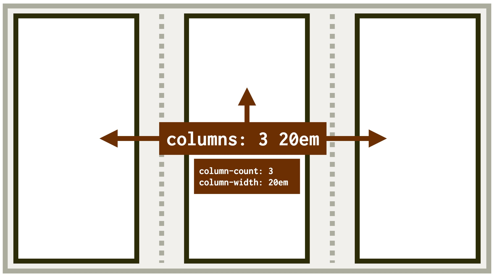

# Vlastnosti column-width, column-count a columns: počet sloupců a jejich šířka ve vícesloupcovém rozložení

Pokud chcete pro rozvržení použít CSS Multi-column Layout, pak je nutné začít alespoň jednou z těchto vlastností.

<div class="connected" markdown="1">


<div class="web-only" markdown="1">

Vlastnosti `column-width`, `column-count` a `columns` patří do specifikace vícesloupcového layoutu – [CSS Multi-column Layout](css-multicolumn.md).

</div>

<div class="ebook-only" markdown="1">

→ [vrdl.cz/p/css-multicol-columns](https://www.vzhurudolu.cz/prirucka/css-multicol-columns)

</div>

</div>

- `column-width` – nastavíte doporučenou šířku sloupce, jejich počet se pak přizpůsobí šířce rodiče.
- `column-count` – rozvržení definujete přes počet sloupců, zde se naopak přizpůsobí jejich šířka.
- `columns` – zkratka pro obě vlastnosti.

<div class="web-only" markdown="1">

Zejména vlastnost `column-width` je u vícesloupcového rozvržení v CSS kouzelná.

Umožňuje totiž dělat něco jako automatický responzivní layout. Tedy určit počet sloupečků automaticky podle dostupného prostoru.

</div>

<figure>

<figcaption markdown="1">
*Tady je máme. Vlastnost `columns` je zkratkou pro dvě jiné, `column-width` a `column-count`. V tomto případě jsem vyrobili rozvržení, které obsahuje maximálně tři sloupce o šířce `20em`.*
</figcaption>
</figure>

## `column-width`: doporučená šířka sloupce {#column-width}

Vlastnost nastaví doporučenou šířku všem sloupcům v kontejneru.

Možné hodnoty:

- `auto` (výchozí) – šířka se nebere v potaz, pravděpodobně se tedy použije hodnota `column-count`.
- `<délka>` – jakýkoliv rozměr v délkových jednotkách. Použité hodnoty se vždy upraví na minimum `1px`.

<div class="web-only" markdown="1">

→ *Související: [Jednotky pro tvorbu webu](jednotky.md)*

</div>

Skutečná šířka sloupce může být širší, aby vyplnila dostupný prostor, nebo užší, ale to pouze pokud je dostupný prostor menší než zadaná šířka sloupce.

## `column-count`: počet sloupců {#column-count}

Vlastnost nastaví počet sloupců v kontejneru.

Možné hodnoty:

- `auto` (výchozí) – počet sloupců se nebere v potaz, pravděpodobně se tedy použije hodnota z `column-width`.
- `<počet>` – jakékoliv celé číslo větší než 0.

Teď přichází trik. Pokud nastavíte vlastnosti `column-width` i `column-count`, z logiky už napsaného by měly jít proti sobě, že ano?

Ale ne. Prohlížeče by měly vzít v potaz obojí a celočíselná hodnota v `column-count` pak popisuje _maximální_, nikoliv jasně daný počet sloupců.

## `columns`: zkratka pro `column-width` a `column-count` {#columns}

Vlastnost `columns` je zkratkou pro obě výše uvedené:

```css
columns: <column-width> <column-count>
```

Na pořadí v deklaraci tentokrát nezáleží, prohlížeč pozná definovanou vlastnost podle hodnoty – buď jde o celé číslo nebo o délkovou jednotku.

Ukázky možných hodnot:

```css
/* column-width: 20em; column-count: auto: */
columns: 20em;

/* column-width: 20em; column-count: auto: */
columns: auto 20em;

/* column-width: auto; column-count: 3: */
columns: 3;

/* column-width: auto; column-count: 3: */
columns: 3 auto;

/* column-width: auto; column-count: auto: */
columns: auto;

/* column-width: auto; column-count: auto: */
columns: auto auto;
```

## Příklad {#priklad}

Připravil jsem demo pro vlastnost `columns`. Vy už víte, že obstarává obě možnosti – definici počtu sloupců a nebo definici jejich šířky.

CodePen: [cdpn.io/e/mdrMYBE](https://codepen.io/machal/pen/mdrMYBE?editors=1100)

Pokud si příklad vyzkoušíte naživo, uvidíte, že můžete přepínat mezi několika možnostmi zobrazení. Pro případ, že nezkoušíte a jen čtete, zde uvádím všechny možnosti:

- `columns:auto` - vícesloupcový layout se vůbec nepoužije.
- `columns:20em` – doporučená šířka sloupce je `20em`. Je to stejné, jako kdybyste napsali `column-width:20em`. Při testování v různě širokých oknech prohlížeče vidím jeden až pět sloupců. Měly by být široké kolem 400 pixelů, protože velikost písma je zde kolem `20px`. Zde jde ovšem o doporučení, takže v prohlížeči vidím šířky od 400 až po 650 pixelů.
- `columns:3` – na každé šířce okna se vykreslí tři sloupce. Prohlížeč zde nepoužije jinou variantu ani na nejmenších rozlišeních.
- `columns:3 20em` – zde deklarujeme jak počet sloupců (`column-count:3`), tak doporučenou šířku (`column-width:20em`). Prohlížeče se zde chovají konzistentně – drží se doporučené šířky, ale nikdy nevykreslí více než tři sloupce.

## Podpora v prohlížečích {#podpora}

V případě `column-width`, `column-count` i `columns` není potřeba s podporou v prohlížečích stresovat.

Tabulky na CanIUse jsou v případě těchto tří vlastností zelené jako pečlivě udržovaný fotbalový trávník. Tyto vlastnosti dobře zvládají dokonce Explorery verze 11 i 10 (!). [caniuse.com/column](https://caniuse.com/?search=column)

Narazil jsem jen na menší vykreslovací bugy v Safari, takže vícesloupcový layout raději otestujte i v prohlížeči od Apple. Ale jsou to opravdu jen malé nedostatky, rozhodně se nebojte tyto vlastnosti použít.

<!-- AdSnippet -->
