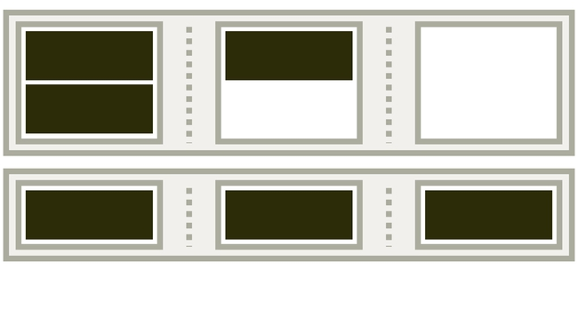
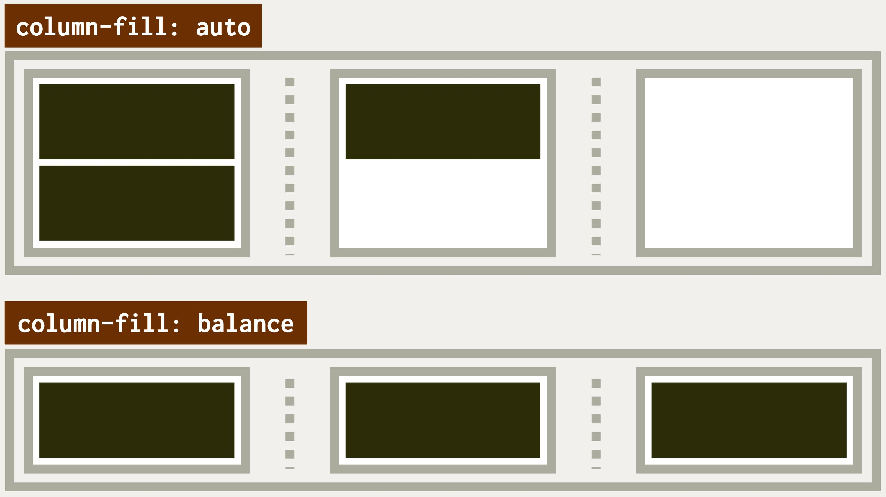

# Vlastnost column-fill: vyvažování výšky sloupců ve vícesloupcovém rozvržení

Vlastnost `column-fill` umožňuje rozdělit obsah vícesloupcového rozložení do několika sloupečků tak, aby všechny zabíraly přibližně stejnou výšku.

<span class="book-index" data-book-index="column-fill"></span>

<div class="connected" markdown="1">



<div class="web-only" markdown="1">

`column-fill` patří do specifikace vícesloupcového layoutu – [CSS Multi-column Layout](css-multicolumn.md).

</div>

<div class="ebook-only" markdown="1">

→ [vrdl.cz/p/css-multicol-fill](https://www.vzhurudolu.cz/prirucka/css-multicol-fill)

</div>

</div>

V případě nastavení `column-fill:balance` se prohlížeče snaží minimalizovat odchylky výšky sloupců a zároveň ctít zalamování, ošetřovat typografické vdovy a sirotky, tedy sázet text opravdu hezky.

Podívejme se na možné hodnoty:

- `auto` – sloupečky se obsahem vyplňují postupně. Výchozí hodnota.
- `balance` – rozdělení obsahu do sloupečků tak, aby byla jejich výška co nejpodobnější.
- `balance-all` – stejně jako `balance`, jen se do sloupečků rozděluje veškerý obsah. V době, kdy toto píšu, však tuhle vlastnost žádný prohlížeč nepodporuje.

Rozdíl mezi `balance` a `balance-all` uvidíte jen ve vícestránkových kontextech, jako je CSS pro tisk („paged media“ nebo také „fragmented contexts“). V případě `balance` se do sloupců má rozdělit jen poslední fragment, např. poslední stránka. U hodnoty `balance-all` se rozdělí všechny fragmenty či stránky.

<!-- AdSnippet -->

Vlastnost se vám asi zatím bude používat hůře. Implementace v prohlížečích je různorodá.

<figure class="figure-thirds">

<figcaption markdown="1">
Rozdíl mezi hodnotami vlastnosti column-fill: auto a balance.
</figcaption>
</figure>

Pojďme se ale podívat, jak to celé funguje.

## Příklad {#priklad}

Toto demo už znáte z jiných vlastností vícesloupcového rozvržení. Máme zde kontejner, který má nastavenou šířku sloupečku `15em` a maximální počet sloupců na tři. Tentokrát jsem ještě přidal výšku bloku, zde vynucenou na `10em`.

```css
.container {
  columns: 15em 3;
  height: 10em;
}
```

V demu můžete přepínat mezi nastavením vlastnosti `column-fill` na hodnoty `auto` nebo `balance`. Poslední hodnotu, `balance-all`, jsem nezahrnoval, protože ji prohlížeče zatím nepodporují a vzhledem k jejímu využití pro stránkovaná média by ani demonstrace v CodePenu nedávala smysl.

CodePen: [cdpn.io/e/PoGEadq](https://codepen.io/machal/pen/PoGEadq?editors=1000)

Pokud byste si hráli s vlastnostmi `height` u kontejneru, s obsahem prvku a šířkou okna, dojdete k témuž co já – v každém prohlížeči to funguje trochu jinak.

## Podpora v prohlížečích {#podpora}

Podle CanIUse podporují `column-fill` všechny moderní prohlížeče, včetně Internet Exploreru. [caniuse.com/column-fill](https://caniuse.com/?search=column-fill)

Mohli bychom tím skončit, ale po hrátkách s mým CodePenem v různých prohlížečích vás musím upozornit na následující:

- V Chromu hodnota `balance` nefunguje bez vynucení nastavení výšky na `.container`, ať už to uděláme vlastností `height` nebo jinak.
- Safari má chybu opačnou – pokud nenastavíme kontejneru výšku, rozděluje sloupečky tak, jako bychom použili vyvažování – hodnotu `balance`. V prohlížeči od Applu se navíc přepnutí mezi hodnotami `balance` a `auto` projeví až po změně šířky okna.

Naopak se mi zdá, že tato vlastnost velmi dobře funguje – přinejmenším v mém demu – v nejméně používaném moderním prohlížeči, tedy ve Firefoxu.

Určitě vás nechci od používání vlastnosti `column-fill` odradit. Občas se vám bude hodit. Jen si to vždy dobře otestujte v různých prohlížečích.

<!-- AdSnippet -->
