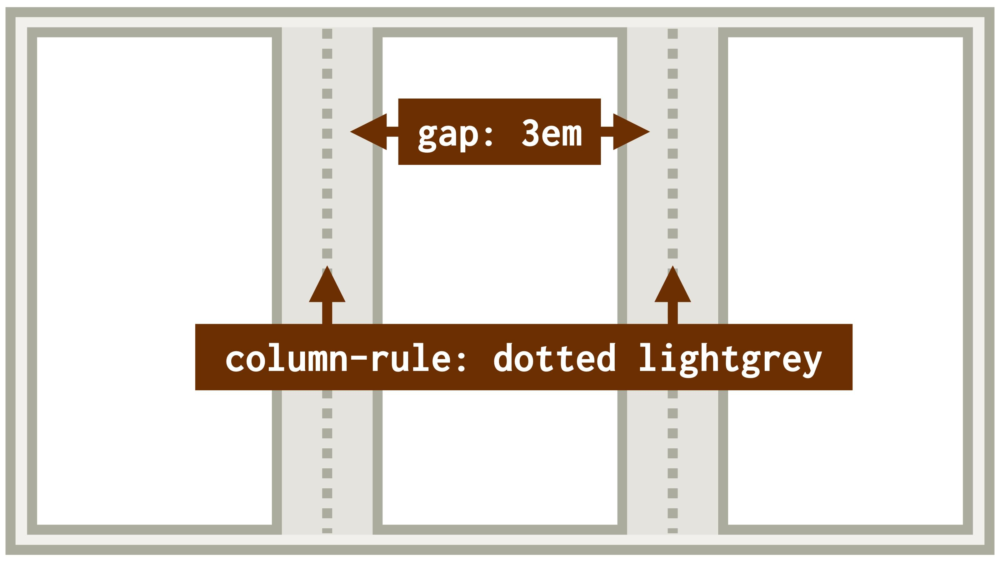

# Vlastnosti column-gap a column-rule: Mezery a oddělovače ve vícesloupcovém rozložení

Ve vícesloupcovém rozvržení (CSS Multi-column Layout) je většinou potřeba změnit výchozí mezeru mezi sloupci nebo přidat oddělovač. K tomu slouží tyto vlastnosti.

<div class="book-index" data-book-index="column-gap"></div>
<div class="book-index" data-book-index="column-rule"></div>

<div class="connected" markdown="1">


<div class="web-only" markdown="1">

Vlastnosti `column-gap` a `column-rule` patří do specifikace vícesloupcového layoutu – [CSS Multi-column Layout](css-multicolumn.md).

</div>

<div class="ebook-only" markdown="1">

→ [vrdl.in/colgr](https://www.vzhurudolu.cz/prirucka/css-multicol-gap-rule)

</div>

</div>


Je jich hned několik:

- `column-gap` – nastavení šířky mezery mezi sloupci.
- `column-rule` – definice grafického oddělovače sloupců. Jde o zkratky pro vlastnosti `column-rule-color`, `column-rule-style` a `column-rule-width`.

Je dobré vědět, že mezery místo v layoutu zabírají, ale oddělovače nikoliv. Oddělovač jakékoliv šířky neubírá místo mezerám nebo sloupcům v rozvržení. Nedává vám to smysl? Podívejte se na následující příklad.

<figure class="figure-thirds">

<figcaption markdown="1">
*Na obrázku jsme definovali mezeru mezi sloupečky o šířce 3em a k ní ještě přidali šedivý čárkovaný oddělovač .*
</figcaption>
</figure>

A co teď? No, co by…? Vzhůru na jednotlivé vlastnosti.

## Vlastnost column-gap: mezera mezi sloupci {#column-gap}

Šířka výchozí mezery je `1em`. Pokud ji chcete změnit, je pro její definici možné použít vlastnost `column-gap`.

<!-- AdSnippet -->

Mezeru můžeme definovat také pomocí obecné [vlastnosti `gap`](css-gap.md), kterou asi znáte z flexboxu nebo CSS gridu. Ta ale nebude fungovat v Exploreru a ke dni psaní tohoto textu ani v Safari.

Možné hodnoty jsou následující:

- `auto` nebo `normal` – výchozí mezera (`1em`).
- `<délka>` – jakákoliv délka, včetně nulové.

<div class="web-only" markdown="1">

→ *Související: [Jednotky pro tvorbu webu](jednotky.md)*

</div>

Záporné hodnoty délky pochopitelně nejsou možné.

## Vlastnost column-rule-color: barva oddělovače {#column-rule-color}

Barvu oddělovače je možné definovat přesně tak, jak jste na to zvyklí u všech možných vlastností. Nebudeme tedy příklady ztrácet čas.

Je ale dobré zmínit, že jako výchozí barva se zde použije `currentcolor`, tedy barva textu deklarovaná nebo poděděná pro kontejner vícesloupcového rozvržení.

<div class="web-only" markdown="1">

→ *Související: [Dědičnost v CSS](css-dedicnost.md)*

</div>

## Vlastnost column-rule-style: grafické ztvárnění oddělovače {#column-rule-style}

Grafický styl oddělovače můžete určit stejnými klíčovými slovy, jakými určujete barvy rámečků: `dotted`, `dashed`, `solid`, `double`, `groove`, `ridge`, `inset` nebo `outset`.

Grafiku oddělovače je také samozřejmě možné vypnout pomocí hodnoty `none`, čímž se pochopitelně vypne i zobrazení oddělovače.

## Vlastnost column-rule-width: šířka oddělovače {#column-rule-width}

I zde jsou logicky akceptovány jakékoliv jednotky šířky, které si v CSS umíte představit, včetně slovních označení `thin`, `medium` a `thick`, jež ale pravděpodobně každý prohlížeč vykreslí jinak. V Chromu to dle mých propočtů odpovídá šířce 1, 2 a 5 pixelů. Výchozí hodnota je `medium`.

Také oddělovač je možné vypnout, opět pomocí hodnoty `none`, což vás jistě nepřekvapilo.

## Vlastnost column-rule: zkratka pro deklaraci oddělovače na jednom místě {#column-rule}

Všechny tři vlastnosti můžete použít v jedné zkratce:

```css
column-rule: <column-rule-width> <column-rule-style> <column-rule-color>
```

Samozřejmě je možné vlastnosti `column-rule-width` nebo `column-rule-color` vynechat, vyplývá to z jejich výchozích hodnot. Všechny tyto zápisy by fungovaly:

```css
column-rule: 2px solid blue;
column-rule: 2px solid;
column-rule: solid blue;
```

## Ukázka tří možností použití {#ukazka}

Připravil jsem pro vás CodePen, ve kterém si můžete přepínat mezi třemi různými deklaracemi.

<div class="ebook-only" markdown="1">

Slibuji si od toho, že vám to pomůže pochopit výše uvedené. I když v tomto případě se nejedná o nic složitého, a pokud nemáte možnost zkoušet naživo, o nic nepřicházíte.

</div>

CodePen: [vrdl.in/aervw](https://codepen.io/machal/pen/eYdGEKR?editors=1100)

1. První deklarace (`gap:auto;column-rule:none;`) nastavuje mezeru i oddělovač na výchozí hodnoty, tzn. mezera má šířku `1em` a oddělovač se nevykresluje. Všimněte si použití vlastnosti `gap` namísto `column-gap`. V moderních prohlížečích je to prostě synonymum.
2. Druhá deklarace (`gap:3em;column-rule:dotted lightgrey;`) nastaví trojnásobnou mezeru a tečkovaný oddělovač. Jeho šířku jsem byl líný definovat, takže se použije `medium`.
3. Třetí deklarace (`gap:3em;column-rule:4em solid lightgrey;`) je záludná – nastaví oddělovač o větší šířce, než má mezera. Jasně, asi to hned nepoužijete, to chápu. Chtěl jsem zde totiž ukázat to, co píšu výše – oddělovač si z celkové šířky rodičovského kontejneru nevezme ani pixel. Vykreslí se doprostřed mezery, a když ta mu přestane stačit, neváhá překrývat obsah ve sloupcích. Ano, takhle bezskrupulózní ten oddělovač je…

Jak tyhle legrace můžete využívat v dnešních prohlížečích?

## Podpora v prohlížečích {#podpora}

Žádné strachy, vlastnosti `column-gap`, `column-rule` i všechny ostatní zde zmíněné každý moderní prohlížeč zvládne.

A zvládá je také Internet Explorer. Ten ovšem neumí nahradit `column-gap` pomocí vlastnosti `gap`. Stejně tak Safari. Ale to je jen malá bolístka jinak výborné podpory.

Více je na CanIUse. [caniuse.com/column](https://caniuse.com/?search=column)

<!-- AdSnippet -->
