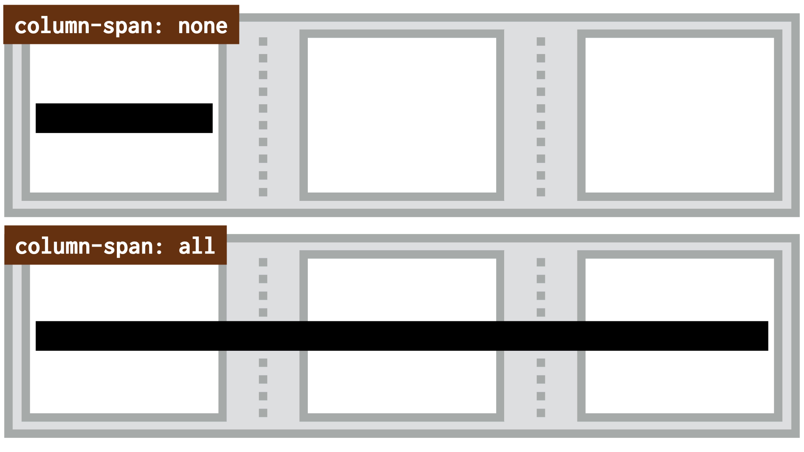

# Vlastnost column-span: Překlenutí ve vícesloupcovém rozložení

Vlastnost `column-span` umožňuje, aby se prvek rozprostřel přes několik sloupců ve vícesloupcovém rozvržení.

<div class="related web-only" markdown="1">
- [CSS Multi-column Layout](css-multicol.md)
</div>

Možné hodnoty jsou tyto:

- `none` - prvek se nepřeklenuje.
- `all` – prvek se překlenuje přes všechny dostupné sloupce.

Jak přesně to funguje? To uvidíte nejlépe v příkladu nebo na obrázku.

<figure>

<figcaption markdown="1">
*Černý prvek se standardně spokojí jen s jedním sloupcem. Dokud mu nenastavíte `column-span:all`.*
</figcaption>
</figure>

Vlastnost je velmi zajímavá pro použití na nadpisy a podobné prvky, které mají oddělovat sekce obsahu.

## Příklad {#priklad}

Máme zde opět náš starý známý kontejner, tentokrát jen mírně upravený:

```css
.container {
  padding: 1rem;
  columns: 15em 3;
}
```

[Vlastnost `columns`](css-multicol-columns.md) jste už měli příležitost poznat, takže můžete vědět, že prohlížeč vytvoří maximálně tři sloupce a každému poskytne kolem `15em` prostoru.

CodePen: [cdpn.io/e/jOMaYVg](https://codepen.io/machal/pen/jOMaYVg?editors=1100)

V přepínači nahoře je možné volit mezi dvěma hodnotami pro nadpisy `<h2>`:

- `column-span: none` neudělá nic. Nebo prostě maže překlenutí získané druhou možností.
- `column-span: all` zapíná překlenutí přes všechny sloupečky Multi-column layoutu.

## Poznámka ke splynutí okrajů {#margin}

Asi víte, že svislé vnější okraje (`margin-top` a `margin-bottom`) prvků v běžném textu splývají.

<!-- AdSnippet -->

Z příkladu výše pak hezky uvidíte, že v případě nadpisu majícího `column-span: all` to neplatí. Je to proto, že prohlížeč pokaždé když začne tvořit sloupečkové rozvržení, zároveň vytvoří nový blokový formátovací kontext.

Pokud byste ale umístili dva nadpisy s nastavením `column-span: all` k sobě, jejich svislé vnější marginy by splývaly.

## Podpora v prohlížečích {#podpora}

K mému překvapení je podpora vynikající. Demo z CodePen hezky funguje jak v Chrome, tak v Safari i Firefoxu.

Podle webu CanIUse je vlastnost dostupná také v Internet Exploreru 10 a 11. No výborně. [caniuse.com/column-span](https://caniuse.com/?search=column-span)

<!-- AdSnippet -->
