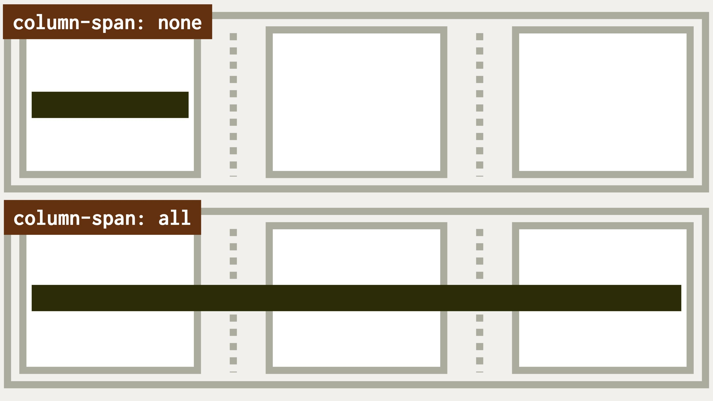

# Vlastnost column-span: Překlenutí ve vícesloupcovém rozložení

Vlastnost `column-span` umožňuje, aby se prvek rozprostřel přes několik sloupců ve vícesloupcovém rozvržení.

<div class="book-index" data-book-index="column-span"></div>

<div class="connected" markdown="1">


<div class="web-only" markdown="1">

`column-span` patří do specifikace vícesloupcového layoutu – [CSS Multi-column Layout](css-multicolumn.md).

</div>

<div class="ebook-only" markdown="1">

→ [vrdl.in/colsp](https://www.vzhurudolu.cz/prirucka/css-multicol-span)

</div>

</div>

Možné hodnoty jsou tyto:

- `none` – prvek nepřeklenuje.
- `all` – prvek překlenuje všechny dostupné sloupce.

Vlastnost je velmi zajímavá pro použití na nadpisy a podobné prvky, které mají oddělovat sekce obsahu.

Jak přesně to funguje? To uvidíte nejlépe v příkladu nebo na obrázku.

<figure class="figure-thirds">

<figcaption markdown="1">
Tmavý prvek se standardně spokojí jen s jedním sloupcem. Dokud mu nenastavíte vlastnost column-span:all.
</figcaption>
</figure>

Ukázka bude. To víte, že ano.

## Příklad {#priklad}

Máme zde opět náš starý známý kontejner, tentokrát jen mírně upravený:

```css
.container {
  padding: 1rem;
  columns: 15em 3;
}
```

[Vlastnost `columns`](css-multicol-columns.md) jste už měli příležitost poznat, takže můžete vědět, že prohlížeč vytvoří maximálně tři sloupce a každému poskytne kolem `15em` prostoru.

CodePen: [cdpn.io/e/jOMaYVg](https://codepen.io/machal/pen/jOMaYVg?editors=1000)

Při prohlížení ukázky naživo je možné v přepínači nahoře volit mezi dvěma hodnotami pro nadpisy `<h2>`:

- `column-span:none` neudělá nic. Nebo prostě maže překlenutí získané dříve hodnotou `all`.
- `column-span:all` zapíná překlenutí přes všechny sloupečky CSS Multi-column Layoutu.

## Poznámka ke splynutí okrajů {#margin}

Asi víte, že svislé vnější okraje (`margin-top` a `margin-bottom`) prvků v běžném textu splývají.

<!-- AdSnippet -->

Z příkladu výše pak hezky uvidíte, že v případě nadpisu, který nastavíte jako překlenující (`column-span:all`), to neplatí.

Je to proto, že pokaždé, když začne prohlížeč tvořit sloupcové rozvržení, zároveň vytvoří nový blokový formátovací kontext.

Pokud byste ale umístili dva nadpisy s nastavením `column-span:all` k sobě, jejich svislé vnější okraje by splývaly.

## Podpora v prohlížečích {#podpora}

K mé velké radosti je podpora vlastnosti `column-span` vynikající. Demo z CodePenu hezky funguje jak v Chromu, tak v Safari i Firefoxu.

Podle webu CanIUse je vlastnost dostupná také v Internet Exploreru 10 a 11. Tahle překvapení mám rád. Jsou vzácná. [caniuse.com/column-span](https://caniuse.com/?search=column-span)

<!-- AdSnippet -->
