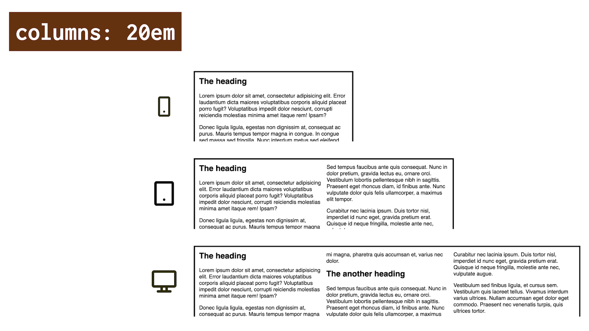
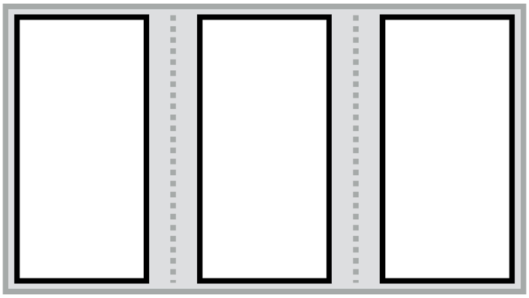
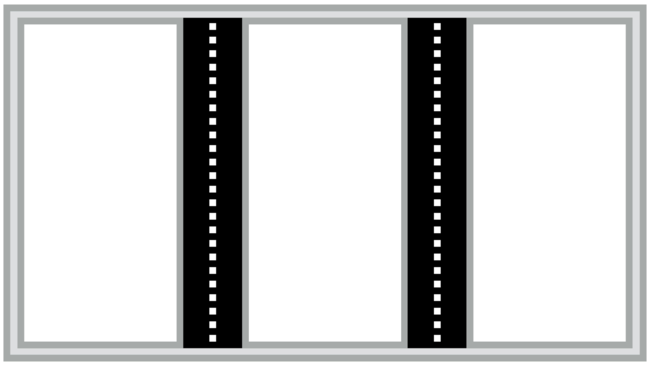
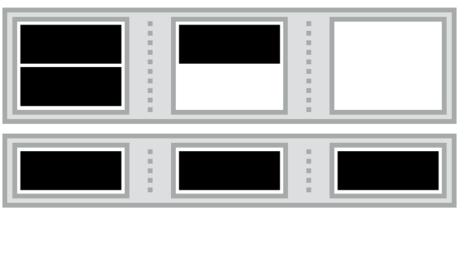
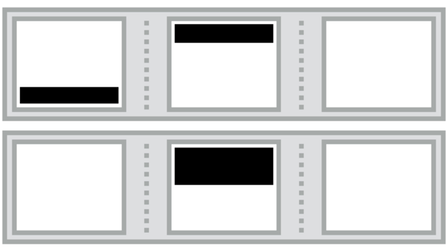
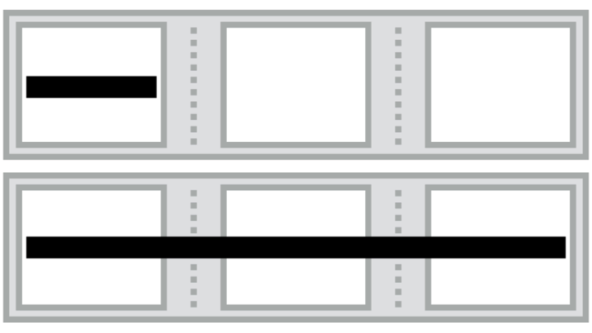

# Vícesloupcové rozvržení: příručka pro vlastnosti CSS Multi-column Layout

Díky vlastnosti `column` a dalším definovaným v sadě modulu CSS Multi-column Layout můžeme obsah vysázet do více sloupců definované šířky podobně jako v novinové sazbě.

<div class="related web-only" markdown="1">
- [CSS Grid](css-grid.md)
- [Flexbox](css3-flexbox.md)
- [CSS Box Alignment](css-box-alignment.md)
</div>

Na rozdíl od podobných layoutových modulů – CSS Gridu a flexboxu – navrhli vícesloupcové rozvržení v konsorciu W3 spíše pro obsah, nikoliv pro layout stránek nebo komponent.

Ale kreativitě se samozřejmě meze nekladou. Multi-column Layout má totiž jednu krásnou vlastnost – automatickou responzivitu.

<figure>

<figcaption markdown="1">
Kouzlo automatického přizpůsobení šířce okna. Vícesloupcový layout s nastavením `columns:20em`.
</figcaption>
</figure>

V následujícím příkladu se té responzivitě mrkneme na zoubek.

## Příklad k vyzkoušení {#priklad}

V jednoduchém demu máme prvek `.container` a v něm nějaký text:

```html
<div class="container">
  <h2>
    The heading
  </h2>
  <p>
    Lorem ipsum…
  </p>
</div>    
```

V CSS jsme pomocí vícesloupcového rozvržení definovali následující:

```css
.container {
  columns: 20em; 
}
```

Prohlížeč by pak měl vnitřní prvky kontejneru rozdělit do sloupců o šířce kolem `20em`, což také udělá. Při šířkách okna do zhruba 950 pixelů zde vidíme jeden sloupec.

Od této šířky sloupce v layoutu pořád přibývají.

CodePen: [cdpn.io/e/rNMzwaN](https://codepen.io/machal/pen/rNMzwaN?editors=1100)

Když si v CodePenu budete klikat na tlačítka s přiblížením a oddálením (0.5×…), uvidíte, jak to funguje v praxi.

Je to automaticky responzivní, aniž bychom museli definovat [Media Queries](css-media-queries.md).

## Vlastnosti pro kontejner {#vlastnosti-kontejner}

Pomocí vlastnosti `columns` a dalších definujeme na rodičovském kontejneru podmínky tvorby sloupečků.

To, co je na obrázcích zvýrazněno černě, je předmětem ovlivňování uvedenou vlastností.

<div class="rwd-scrollable f-6" markdown="1">

| Vlastnosti                           | Co dělají a příklad  |
|--------------------------------------|----------------------|
| [`column-width`, `column-count`, `columns`](css-multicol-columns.md) <br> [](css-multicol-columns.md)       | Počet sloupců a jejich šířka. <br>`columns: 3 20em` – maximálně tři sloupce o šířce `20em`. |
| [`column-gap`, `column-rule`](css-multicol-gap-rule.md)       <br> [](css-multicol-gap-rule.md) | Definice mezer a oddělovačů mezi sloupci. <br> `gap: 3em; column-rule: dotted lightgrey;` – mezera `3em`, oddělující čára tečkovaná a světle šedá. |
| [`column-fill`](css-multicol-fill.md) <br> [](css-multicol-fill.md)               | Vyvažování výšky sloupců. <br> `column-fill: balance` – prvky se rozdělí do sloupců a jejich výška bude podobná. |

</div>

## Vlastnosti pro vnitřní prvky {#vlastnosti-prvky}

Prostřednictvím následujících vlastností můžete ovlivnit způsob zalamování obsahu do sloupců a nebo roztažení vnitřních prvků do všech sloupců.

<div class="rwd-scrollable f-6" markdown="1">

| Vlastnosti                               | Co dělají a příklad  |
|------------------------------------------|----------------------|
| [`break-before`, `break-after`, `break-inside`](css-multicol-break.md) <br> [](css-multicol-break.md) | Zalamování prvků do sloupců. <br> `break-inside: avoid` – zabrání zalamování obsahu prvku do více sloupců. |
| [`column-span`](css-multicol-span.md)    <br> [](css-multicol-span.md) | Prvek může překlenout více sloupců. <br> `column-span: all` – prvek překlene všechny sloupce. |

</div>

## Co byste ještě o vícesloupcovém layoutu měli vědět? {#vice}

Je to už spíše teorie, ale pokud se ji naučíte, může vám to pomoci s pochopením téhle užitečné sady vlastností.

### Anonymní fragmentačním kontejnery {#vice-kontejnery}

Jiné metody rozložení v CSS, pokud jsou použity na nadřazený prvek, mění vlastnosti zobrazení. Například při použití hodnoty [vlastnosti `display`](css-display.md) `grid` se podřízené prvky stávají položkami mřížky a umísťují se do definované mřížky. Hodnota `flex` dělá z vnitřních elementů položky flexboxu, které mají specifické chování.

<!-- AdSnippet -->

V případě CSS Multi-column Layout však podřízené prvky kontejneru s více sloupci pokračují v normálním toku a ten je uspořádán do několika sloupců. Tyto sloupce mají pružnou velikost ve směru řádků, a proto reagují na dostupné místo změnou velikosti nebo počtu zobrazených sloupců.

Vícesloupcové rozložení zavádí kontext fragmentace tvořený anonymními fragmentačními kontejnery, které se nazývají sloupcové boxy (nebo zkráceně sloupce).

<!-- TODO
- [ ] https://www.w3.org/TR/css-multicol-1/#the-multi-column-model
- [ ] https://www.w3.org/TR/css-multicol-1/#overflow 
-->

## K čemu se hodí? {#priklady}

Kromě „novinové“ sazby textu se hodí také na položky seznamu. Třeba náhledy obrázků ve fotogalerii nebo položky e-shopu…

<figure>

<figcaption markdown="1">
Weby používající vícesloupcové rozvržení: Learning Log Romana Veselého, program konference PyCon nebo rozvržení položek v navigaci webu OnlineSekáč.cz.
</figcaption>
</figure>

Možností využití je překvapivě hodně a určitě si na nějakou vzpomenete.

Vícesloupcový layout má sice z trojice Multi-column, Flexbox, Grid nejméně možností, na druhou stranu je nejjednodušeji definovatelný, umí si automaticky poradit s šířkou okna a navíc — prohlížeče si s ním velmi dobře rozumí.

## Podpora v prohlížečích {#podpora}

Podpora podstatných vlastností vícesloupcového rozvržení je vynikající. Historicky zde exceloval i Internet Explorer, specifikaci CSS Multi-column Layout naimplementoval v podstatě celou už ve verzi 10.

Moderní prohlížeče si jen hůř rozumějí s [vlastnostmi `break-*`](css-multicol-break.md), určenými pro ovládání zalamování vnitřních prvků do sloupců, o čemž píšu v příručce k těmto vlastnostem.

Více najdete na CanIUse. [caniuse.com/multicolumn](https://caniuse.com/multicolumn)

<!-- AdSnippet -->
