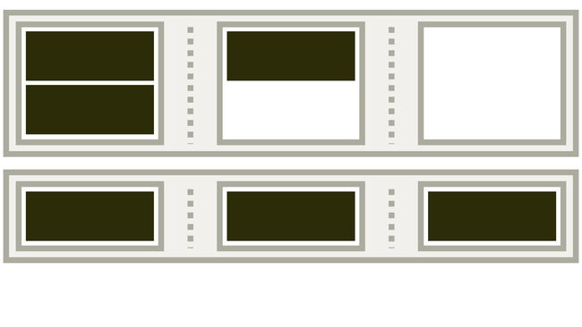
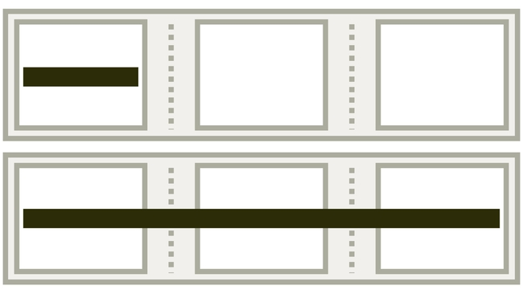

# Vícesloupcové rozvržení: příručka pro vlastnosti CSS Multi-column Layout

Díky vlastnosti `column` a dalším definovaným v sadě modulu CSS Multi-column Layout můžeme obsah stránky vysázet do více sloupců definované šířky podobně jako v novinové sazbě.

<div class="related web-only" markdown="1">
- [CSS grid](css-grid.md)
- [Flexbox](css-flexbox.md)
- [CSS Box Alignment](css-box-alignment.md)
</div>

Na rozdíl od podobných layoutových modulů – CSS gridu a flexboxu – navrhli vícesloupcové rozvržení v konsorciu W3 spíše pro textový a obrázkový obsah, nikoliv pro layout stránek nebo komponent.

Ale kreativitě se samozřejmě meze nekladou. Multi-column Layout má totiž jednu krásnou vlastnost – automatickou responzivitu. Na obrázku vidíte vícesloupcový layout s nastavením `columns:20em`.

<figure>

<figcaption markdown="1">
Kouzlo automatického přizpůsobení se šířce okna.
</figcaption>
</figure>

<div class="web-only" markdown="1">

Žádné [Media Queries](css-media-queries.md), opravdu!

</div>

<div class="ebook-only" markdown="1">

Žádné [Media Queries](content-vdlayout/media-queries.md), opravdu!

</div>

V následující části se tomuto příkladu pořádně mrkneme na zoubek.

## Příklad k vyzkoušení {#priklad}

V jednoduchém demu máme prvek `.container` a v něm nějaký text:

```html
<div class="container">
  <h2>
    The heading
  </h2>
  <p>
    Lorem ipsum…
  </p>
</div>    
```

V CSS jsme pomocí vícesloupcového rozvržení definovali následující:

```css
.container {
  columns: 20em; 
}
```

Prohlížeč by pak měl vnitřní prvky kontejneru rozdělit do sloupců o šířce kolem `20em`, což také udělá. Při šířkách okna do zhruba 950 pixelů zde vidíme jeden sloupec.

Od této šířky sloupce v layoutu pořád přibývají. Viděli jste to na obrázku výše.

CodePen: [cdpn.io/e/rNMzwaN](https://codepen.io/machal/pen/rNMzwaN?editors=1100)

Když si v CodePenu poklikáte na tlačítka s přiblížením a oddálením (0.5×…), uvidíte, jak to funguje v praxi.

Je to automaticky responzivní, aniž bychom museli definovat Media Queries. Bezva.

Tady jsme ale v příručce o CSS Multicol-Layout. Teď se proto pojďme podívat na vlastnosti spadající do tohoto modulu.

## Vlastnosti pro kontejner {#vlastnosti-kontejner}

Pomocí vlastnosti `columns` a dalších definujeme na rodičovském kontejneru podmínky tvorby sloupečků.

To, co je na obrázcích zvýrazněno černě, ovlivňuje uvedená vlastnost.

<div class="reference-items">

  <article role="article">
    <h4><a href="css-multicol-columns.md"><code>column-width</code>, <code>column-count</code>, <code>columns</code></a></h4>
    <p><a href="css-multicol-columns.md"></a></p>
    <p>
      Počet sloupců a jejich šířka.
      <br>Např. <code>columns:3 20em</code> – maximálně tři sloupce o šířce <code>20em</code>.
    </p>
  </article>  
  <article role="article">
    <h4><a href="css-multicol-gap-rule.md"><code>column-gap</code>, <code>column-rule</code></a></h4>
     <p><a href="css-multicol-gap-rule.md"></a></p>
     <p>
      Definice mezer a oddělovačů mezi sloupci. <br>
      Např. <code>gap:3em; column-rule:dotted lightgrey;</code> – mezera <code>3em</code>, oddělující čára tečkovaná a světle šedá.</p>
   </article>  
  <article role="article">
    <h4><a href="css-multicol-fill.md"><code>column-fill</code></a></h4>
    <p><a href="css-multicol-fill.md"></a></p>
    <p>
      Vyvažování výšky sloupců. <br>
      Např. <code>column-fill:balance</code> – prvky se rozdělí do sloupců a jejich výška bude podobná.</p>
  </article>  

</div>

## Vlastnosti pro vnitřní prvky {#vlastnosti-prvky}

Prostřednictvím následujících vlastností můžete ovlivnit způsob zalamování obsahu do sloupců anebo roztažení vnitřních prvků do všech sloupců.

<div class="reference-items">

  <article role="article">
    <h4><a href="css-multicol-break.md"><code>break-before</code>, <code>break-after</code>, <code>break-inside</code></a></h4>
    <p><a href="css-multicol-break.md"></a></p>
    <p>
      Zalamování prvků do sloupců. <br>
      Např. <code>break-inside:avoid</code> – zabrání zalamování obsahu prvku do více sloupců.
    </p>
  </article>

  <article role="article">
    <h4><a href="css-multicol-span.md"><code>column-span</code></a></h4>
     <p><a href="css-multicol-span.md"></a></p>
     <p>
      Prvek může překlenout více sloupců. <br>
      Např. <code>column-span:all</code> – prvek překlene všechny sloupce.
    </p>
  </article>

</div>

## K čemu se vícesloupcový layout hodí? {#priklady}

Kromě „novinové“ sazby textu se hodí také na položky seznamu. Třeba náhledy obrázků ve fotogalerii nebo položky e-shopu…

<figure>

<figcaption markdown="1">
Weby používající vícesloupcové rozvržení: Learning Log Romana Veselého (1), program konference PyCon (2) nebo rozvržení položek v navigaci webu OnlineSekáč.cz (3).
</figcaption>
</figure>

Možností využití je překvapivě hodně a určitě si na nějakou vzpomenete.

Vícesloupcový layout má sice z trojice multi-column, flexbox a grid nejméně možností, na druhou stranu je nejjednodušeji definovatelný, umí si automaticky poradit s šířkou okna a navíc – prohlížeče si s ním velmi dobře rozumí.

## Anonymní fragmentační kontejnery {#vice-kontejnery}

Je to už spíše teorie, ale pokud se ji naučíte, může vám to pomoci s pochopením téhle užitečné sady vlastností.

Jiné metody rozložení v CSS jako flex nebo grid, pokud jsou použity na nadřazený prvek, mění vlastnosti zobrazení.

Například při použití [vlastnosti `display`](css-display.md) s hodnotou `grid` se podřízené prvky stávají položkami mřížky a umísťují se do definované mřížky. Hodnota `flex` dělá z vnitřních elementů položky flexboxu, které mají specifické chování.

<!-- AdSnippet -->

V případě CSS Multi-column Layout však podřízené prvky kontejneru s více sloupci pokračují v normálním toku a ten je uspořádán do několika sloupců.

Tyto sloupce mají pružnou velikost ve směru řádků, a proto reagují na dostupné místo změnou velikosti nebo počtu zobrazených sloupců.

Vícesloupcové rozložení zavádí „kontext fragmentace“ tvořený „anonymními fragmentačními kontejnery“, které se nazývají sloupcové boxy (nebo zkráceně sloupce).

## Podpora v prohlížečích {#podpora}

Podpora podstatných vlastností vícesloupcového rozvržení je vynikající. Historicky zde exceloval i Internet Explorer, specifikaci CSS Multi-column Layout naimplementoval v podstatě celou už ve verzi 10.

<figure>

<figcaption markdown="1">
Podpora vícesloupcového layoutu v prohlížečích. Zelená je na místech, kde byste to možná nečekali. Zdroj: [CanIUse.com](https://caniuse.com/multicolumn).
</figcaption>
</figure>

Moderní prohlížeče to zvládají taky, to víte, že ano. Jen si hůř rozumějí s [vlastnostmi `break-*`](css-multicol-break.md), určenými pro ovládání zalamování vnitřních prvků do sloupců, o čemž píšu v příručce k těmto vlastnostem.

<div class="web-only" markdown="1">

Více najdete [v textu o podpoře](css-layout-bugy.md) nových systémů layoutu v prohlížečích.

</div>

<div class="ebook-only" markdown="1">

Více najdete [v textu o podpoře](css-layout-bugy.md) nových systémů layoutu v prohlížečích (osmá kapitola).

Podívejme se teď na jednotlivé vlastnosti specifikace CSS Multicol.

</div>

<!-- AdSnippet -->
