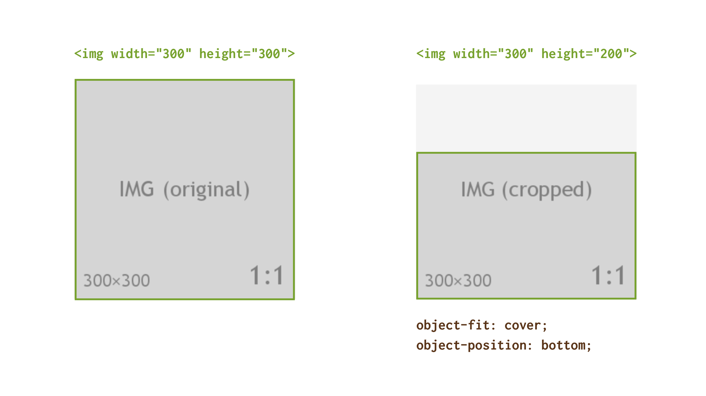

# CSS vlastnosti object-fit a object-position

Vlastnosti `object-fit` a `object-position` slouží k upřesnění rozměru a pozice u externích médií vkládaných do HTML, takže především obrázků ve značce ``, ale také obsahu prvků `<video>`, `<iframe>` nebo `<embed>`.

Vlastnosti nepodporuje Internet Explorer, proto jsou zatím použitelné spíše na projektech, kde to nevadí.

`object-fit` a `object-position`  je možné vnímat jako paralelní k vlastnostem obrázků na pozadí `background-size` a `background-position`. Jen jsou určené pro prvky vkládané přímo do HTML.

<figure>

<figcaption markdown="1">
*Obrázek: Vlastnosti object-fit a object-position určují, jak se má chovat vkládané médium, když se zmenší nebo zvětší prostor mu určený.*
</figcaption>
</figure>

Ukažme si to na jednoduchém příkladu.

HTML máme následující:

```html

```

CSS:

```css
.img--cut {
  object-fit: cover;
  object-position: bottom;
}
```

<!-- AdSnippet -->

A vysvětleme:

- Obrázek má přirozené rozměry 300 × 300 pixelů, v HTML je mu však povoleno zabrat jen 200 pixelů na výšku, viz vlastnost `height`.
- `object-fit:cover` říká, že se má obrázek roztáhnout do celé plochy prvku `` tak, aby nikde nezůstalo volné místo. Viz `object-fit`.
- `object-position:bottom` určuje zarovnání na spodní hranu plochy prvku ``. Viz `object-position`.

CodePen: [cdpn.io/e/KKKYzqq](https://codepen.io/machal/pen/KKKYzqq?editors=1100)

→ *Související: [CSS aspect-ratio](css-aspect-ratio.md)*

## Vlastnost object-fit – způsob napasování {#object-fit}

Určuje, jakým způsobem se má externí médium vměstnat do plochy, která je mu určena vlastnostmi `width` a `height` v HTML nebo CSS.

<figure>

<figcaption markdown="1">
*Obrázek: Hodnoty vlastnosti object-fit aplikované na obrázek o velikosti 150 × 150 pixelů.*
</figcaption>
</figure>

Je to velmi podobné jako u pasování obrázků na pozadí pomocí vlastnosti [`background-size`](css3-background-size.md).

<div class="rwd-scrollable f-6" markdown="1">

| Hodnota            | Jak se chová?                                                                              |
|--------------------|--------------------------------------------------------------------------------------------|
| `fill` (výchozí)   | Vyplní celou plochu. Klidně zdeformuje poměr stran obsahu, ale neořízne ho.                |
| `contain`          | Nevyplní vždy celou plochu. Obsah nezdeformuje, neořízne a zobrazí celý.                   |
| `scale-down`       | Stejně jako `contain`, ale nikdy nezvětší obrázek nad přirozenou velikost.                 |
| `cover`            | Vyplní celou plochu. Nenechá volné místo, nezdeformuje obsah, ořízne ho.                   |
| `none`             | Drží původní velikost a poměr stran. Někdy ořízne, někdy nechá volné místo.                |

</div>

V praxi je nejpoužitelnější hodnotou `object-fit:cover`.

CodePen: [cdpn.io/e/jOOJjXJ](https://codepen.io/machal/pen/jOOJjXJ?editors=1100)

## Vlastnost object-position – způsob umístění {#object-position}

Definuje, kde bude pozicovaný prvek používající `object-fit`. Je to vlastně úplně stejné jako u vlastnosti `background-position`.

<figure>

<figcaption markdown="1">
*Obrázek: Ukázky hodnot vlastnosti object-position.*
</figcaption>
</figure>

Mrkněme se na příklady hodnot.

<div class="rwd-scrollable f-6" markdown="1">

| Příklad hodnoty       | Jak se chová?                                                         |
|-----------------------|-----------------------------------------------------------------------|
| `50% 50%` (výchozí)   | Vycentruje objekt doprostřed vykreslovacího boxu.                     |
| `0 0`                 | Umístí objekt do horního levého rohu.                                 |
| `0 -50px`             | 0px seshora a 50px doleva mimo vykreslovací box.                      |
| `top right`           | Do pravého horního rohu.                                              |
| `bottom`              | Na spodní hranu. Druhá hodnota se bere jako výchozí, tedy `center`.   |

</div>

CodePen: [cdpn.io/e/JjjVRYW](https://codepen.io/machal/pen/JjjVRYW?editors=1100)

## Použití v praxi {#praxe}

- Obě vlastnosti se velmi hodí pro [vynucení poměru stran](css-pomer-stran.md), když na na serveru máme uložené obrázky v různých tvarech a velikostech.
- [Ořez videa](https://codepen.io/remersonc/pen/JXyvbZ) na pozadí hlavičky stránky funguje dobře. Totéž [se značkou `iframe`](https://codepen.io/machal/pen/yLLrJPZ) ovšem nikoliv.

## Podpora v prohlížečích {#podpora}

Od doby, kdy prohlížeč Edge přešel na jádro Chromium, vlastnost neumí jen staříček Internet Explorer 11.

Na většině českých veřejných webů má v době psaní ještě významný podíl, takže bude nutné nějak pořešit fallback. [caniuse.com/object-fit](https://caniuse.com/#feat=object-fit)

<!-- AdSnippet -->

Možnosti, jak problém vyřešit i v Internet Exploreru:

1. Namísto `object-fit`/`object-position` umístit obrázek na pozadí a využít vlastnosti [`background-size`](css3-background-size.md)/`background-position`. Alternativně je možné pohrát si s [vlastností transform](css3-transforms.md) a absolutním pozicováním (viz [StackOverflow](https://stackoverflow.com/a/47450998/889682)).
2. Pro IE11 využít [polyfill](polyfill.md) – [fregante/object-fit-images](https://github.com/fregante/object-fit-images). Moc to nedoporučuji, protože to nemálo zatíží vykreslovací výkon v již tak nemálo pomalém Exploreru.
3. Detekovat nepodporující prohlížeč (např. pomocí knihovny Modernizr) a podsunout mu náhradní řešení. Na [StackOverflow](https://stackoverflow.com/a/37792830/889682) například nabízejí změnit `` na `<svg>` a vyřešit problém v něm.

<!-- AdSnippet -->
