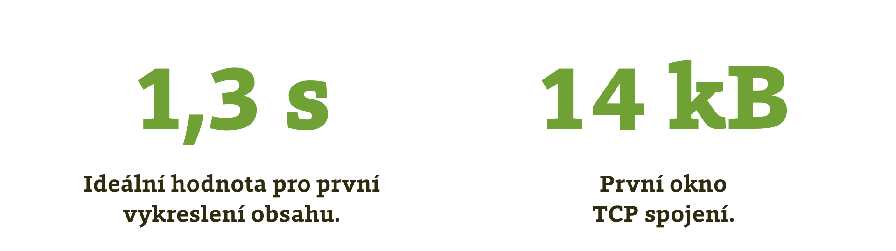
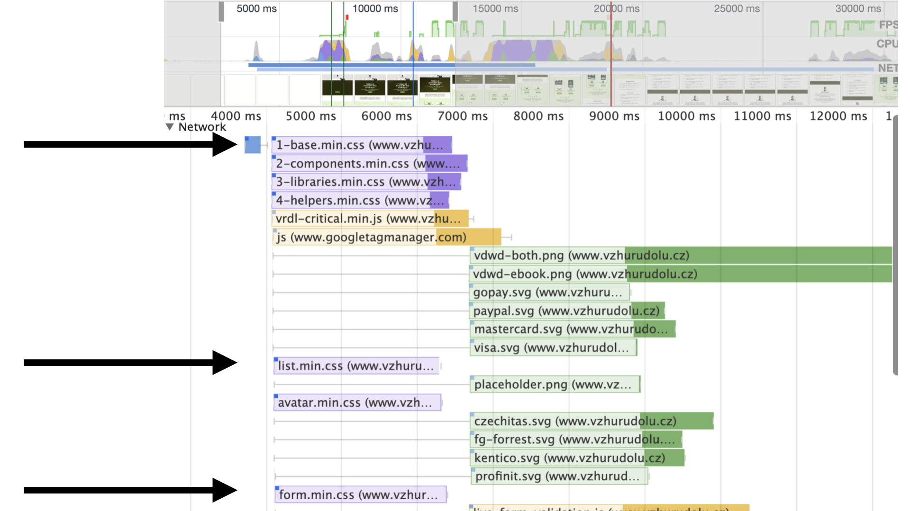

# CSS: Optimalizace datové velikosti

CSS je zdroj, který vždy blokuje vykreslení stránky a proto se každý jeho kilobajt počítá. Ukažme si osm kroků, kterými je možné optimalizovat datovou velikost stylů a zlepšit tak rychlost webu.

<p class="video">
Video: <a href="https://www.youtube.com/watch?v=Ibg7FbDnQJE">CSS: techniky optimalizace datové velikosti</a> ~ Během akce „Livesport talk VIII“ jsem se podíval na nejproblematičtější zdroje blokující zobrazení webů.
</p>

## První zobrazení stránky a jeho ideální hodnota

Ještě než prohlížeč stránku vykreslí, musí proběhnout úkony, která provádí server a síť (čas známe jako [„Time To First Byte“ aneb TTFB](ttfb.md)). Prohlížeč pak obdrží HTML, následně CSS musí je zpracovat.

Zde vznikají metriky prvního vykreslení: [First Paint (FP)](metrika-fp.md), [First Contentful Paint (FCP)](metrika-fcp.md) nebo [First Meaningful Paint (FMP)](metrika-fmp.md). Jsou důležité proto, že odpovídají na nevyřčenou otázku uživatele „Děje se něco?“ a mají vliv na ukazatele uživatelského prožitku jako je _Míra opuštění stránky (Bounce Rate)_.

Jaká je ale cílová hodnota těchto metrik?

<figure>

<figcaption markdown="1">
_Obrázek: První verzi obsahu stránky bychom měli zobrazit do 1,3 vteřiny. To se nejsnadněji zařídí, pokud HTML a CSS dostaneme do limitu 14 kB_
</figcaption>
</figure>

Pojďme si ta dvě čísla vysvětlit:

Podívejme se nejprve na [ideální hodnoty metrik](https://www.vzhurudolu.cz/blog/112-metriky-cile) v nástroji [Lighthouse](lighthouse.md). Podle jeho autorů bychom měli zařídit, aby prohlížeč stihl zobrazit stránku do _1,3 sekundy_ na mobilním zařízení při rychlosti 3G Fast.

Pokud bychom chtěli být ještě přísnější, měli bychom se vejít do prvního okna na TCP spojení ([TCP Initial Window](https://tylercipriani.com/blog/2016/09/25/the-14kb-in-the-tcp-initial-window/)), což je první balíček dat, který putuje ze serveru na prohlížeč a je tedy nejrychlejší. To by znamenalo stahovat v HTML a CSS jen _14 kB dat_.

Čtrnáct kilobajtů je vážně dost málo. Podívejme se, jak si v porovnání s touto ideální hranicí stojí skutečné weby.

## Jak velké je HTML a CSS u vybraných webů?

Před přednáškou, na kterou odkazuji v textu výše, jsem měřil velikost HTML a CSS u několika webů:

<figure>

<div class="rwd-scrollable"  markdown="1">
|                     |HTML|CSS|Celkem|
|---------------------|---:|---:|---:|
|mall.cz|130|100|230|
|smashingmagazine.com|30|90|120|
|alza.cz|26|41|67|
|heureka.cz|14|24|38|
|vzhurudolu.cz|12|15|27|
|idnes.cz|8|4|12|

<figcaption markdown="1">
_Tabulka: Velikost HTML a CSS na mobilních úvodních stránkách některých webů. Hodnoty jsou v kB po kompresi Gzipem. Měřil jsem v Chrome DevTools 23. dubna 2019_
</figcaption>

</figure>

Pokud bychom tedy jako laťku nastavili oněch 14 kilobajtů prvního okna spojení, testem by v době měření z vybraných webů prošla jen zjednodušená mobilní verze idnes.cz.

Weby jsou vybrané v zásadě náhodně, takže tabulku berte za ilustrační. Je dobré si také uvědomit, že uvedená data nic neříkají o celkové rychlosti těchto webů. Datový objem HTML a CSS má ovšem vliv na první zobrazení stránky a musím dodat, že velká část webů, které jsem dosud testoval, stahovala v těchto prvních souborech více než 100 kB dat. Cíl 14 kB je tedy v nedohlednu.

HTML nechme dneska stranou. Jak ale zmenšit velikost stylů?

Budu předpokládat, že ve výchozím stavu máte do všech stránek vložené jedno velké CSS pro celý web:

```html
<!-- Všechny styly: -->
<link href="style.css" rel="stylesheet">
```

## Krok 1: Mažeme

CSS kód většiny projektů, které se nějakou dobu vyvíjejí, má jednu specifickou vlastnost. _Bobtnavost_. Zdroják obvykle roste, roste a roste. Nově věci se přidávají, ale staré se nemažou. A nemažou se proto, že se vývojáři bojí, že tím něco rozbijí. Co s tím?

* _Projít si [pokrytí kódu (Coverage)](https://www.vojtechruzicka.com/measuring-javascript-and-css-coverage-with-google-chrome-developer-tools/)v Chrome DevTools_  
Zjistíte, jakou část CSS na projektu skutečně používáte a jakou ne. CSS nikdy nebude mít stoprocentní pokrytí, ale hodnoty pod polovinu nevyužitého kódu jsou k řešení.
* _Zkusit automatické odstraňovače nepoužívaného CSS_  
Nejnovější je [DropCSS](https://github.com/leeoniya/dropcss). Dříve také [PurifyCSS](https://github.com/purifycss/purifycss) nebo [UnCSS](https://github.com/uncss/uncss). Nečekejte od nich ale zázraky.
* _Refaktoring_  
Je to nepříjemné, protože časově náročně, ale u větších projektů se neobejdete bez dobrého řízení kvality kódu a průběžného refaktoringu. Je to dlouhodobý proces a téma na samostatné [školení kvality CSS kódu](https://www.vzhurudolu.cz/kurzy/css-kod).

Během mazání je možné datovou velikost CSS zmenšit, ale obvykle se po prvních snadných úlovcích zjistí, že dotažení tohoto procesu bude vyžadovat čas, peníze a dlouhodobé soustředění na úkol. Takže ano, v refaktoringu je potřeba pokračovat, ale nedá se někde velikost stylů optimalizovat rychleji?

## Krok 2: CSS dělíme podle šablon

Dříve platilo: Zabalme všechno CSS pro web do jednoho souboru. Zpomalíme tím sice vstup uživatelů do stránky, ale použití dalších stránek už bude rychlé, protože veškeré styly jsou umístěné v prohlížečové cache.

Právě ono „zpomalení“ vstupu uživatelů do stránky se ale dnes už bere jako sakramentsky velká nevýhoda. Konkurence mezi weby je ve většině oborů velká a uživatelé [nemají důvod čekat](rychlost-nacitani-proc.md) dlouhé vteřiny na zobrazení stránky, když tentýž obsah nebo tutéž službu mohou mít jinde k dispozici rychleji.

Dneska už nevidím důvod, proč by například uživatel úvodní stránky e-shopu měl stahovat styly pro celý nákupní proces. Doporučuji tedy oddělit styly určené pro konkrétní sekce nebo stránky do samostatných souborů. Schematicky by to mohlo vypadat asi takto:

```html
<!-- Homepage: -->
<link href="base.css" rel="stylesheet">
<link href="page-home.css" rel="stylesheet">

<!-- Nákupní košík: -->
<link href="base.css" rel="stylesheet">
<link href="page-cart.css" rel="stylesheet">
```

Jak později uvidíte, zahájili jsme proces rozbíjení CSS na atomy. Abychom mohli rozumně pokračovat, musíme si na webu něco zapnout.

## Krok 3: Zapínáme HTTP/2

[HTTP/2](http-2.md), rychlejší verzi protokolu, už znáte. V tomto bodě vám jen doporučím ověřit, zda jej máte zprovozněný i na vašem webu. Pomůže vám v tom například rozšíření pro Chrome [HTTP/2 and SPDY indicator](https://chrome.google.com/webstore/detail/http2-and-spdy-indicator/mpbpobfflnpcgagjijhmgnchggcjblin).

Připomínám, že hlavní výhodou HTTP/2 je možnost souběžného stahování více souborů najednou. To v důsledku znamená, že si můžeme dovolit posílat uživateli více menších frontendových souborů.

Máme zapnuto? Pojďme si ještě správně nastavit práci s mezipamětí v prohlížeči.

## Krok 4: Upravujeme cache v prohlížeči a její invalidaci

Nejprve si nastavíme v `.htaccess` nebo podobném serverovém konfiguračním souboru instrukci pro dlouhou dobu ukládání. Jeden rok:

```htaccess
Cache-Control: max-age=31536000
```

CSS soubory budou uložené v mezipaměti prohlížeče jeden rok, pokud je sami nezměníme. Více informací o kešování v prohlížeči je na [developers.google.com](https://developers.google.com/web/fundamentals/performance/optimizing-content-efficiency/http-caching#cache-control).

Dále je potřeba dohlédnout na to, aby váš nasazovací proces uměl k souborům přidával číslo verze:

```html
<link href="base.v1.css" rel="stylesheet">
<link href="page-home.v2.css" rel="stylesheet">
```

`v1` a `v2` je samozřejmě možné nahradit za hash (např. `base.12345678.css`) nebo to celé dát za otazník (např. `base.css?12345678` či base.css`?v=1`).

Co je ovšem podstatné – hash nebo verze by se měla měnit jen na základě změny obsahu souboru. Často se chybně mění při každém vystavení nové verze webu, což je škoda, protože tím smažeme uživatelům celou mezipaměť frontendových souborů v prohlížeči.

Doporučuji toto nastavit nejen pro CSS, ale ideálně také pro všechny frontendové soubory.

## Krok 5: Dělíme CSS podle typu

Když už tedy máme připravené HTTP/2 a správné ukládání do cache prohlížeče, můžeme CSS soubory rozdělit nejen podle šablon, ale také podle typu:

```html
<!-- Vše: -->
<link href="base.v1.css" rel="stylesheet">
<link href="components.v2.css" rel="stylesheet">
<link href="libs.v1.css" rel="stylesheet">
<link href="helpers.v1.css" rel="stylesheet">

<!-- Nákupní košík: -->
<link href="cart.v1.css" rel="stylesheet">
```

Z předchozích kroků už asi tušíte, co získáme rozdělením na `base.css`, `components.css`, `libs.css` a `helpers.css`.

Díky HTTP/2 nebude zaslání čtyř menších souborů oproti jednomu velkému o moc pomalejší.

Díky tomu, že soubory ukládáme do mezipaměti prohlížeče na dlouhou dobu a cache invalidujeme změnou názvu souboru, uživatelé budou stahovat vždy jen ty soubory, které jsme změnili.

V CSS se obvykle často mění komponenty (`components.v2.css`), méně často už například základní typografie (`base.v1.css`). A je škoda, když v případě spojování do jednoho souboru uživatel po každé změně stahuje znovu všechno.

Rozbíjení tady ovšem skončit nemusí.

## Krok 6: Dělíme podle komponent

Zaměříme se teď na `components.v2.css`. Soubory s komponentami jsou zpravidla největší, protože obsahují větší část designu webu a tudíž budou datově nejobjemnější.

Ideální stav je takový, že do konkrétních šablon posíláme jen ty komponenty, které se v nich používají:

```html
<!-- Vše: -->
<link href="base.v1.css" rel="stylesheet">
<link href="components.v2.css" rel="stylesheet">
<link href="libs.v1.css" rel="stylesheet">
<link href="helpers.v1.css" rel="stylesheet">

<!-- Nákupní košík: -->
<link href="cart.v1.css" rel="stylesheet">
<link href="components/table.v1.css" rel="stylesheet">
<link href="components/form.v2.css" rel="stylesheet">
```

Na šabloně nákupního košíku potřebujeme kromě obecných stylů šablony (`cart.css`) také komponenty `table.css` a `form.css`. Díky tomu je pak nemusí obsahovat soubor se sadou všech komponent (`components.css`).

Tohle řešení ovšem vyžaduje vytvoření nějaké logiky pro spolupráci backendu a frontendu, takže může být vcelku náročně na realizaci. Zkusme to ještě jinak.

## Krok 7: CSS v prvku BODY

Přidávání `<link>` do těla dokumentu je poměrně stará myšlenka. Ve [známém článku](https://jakearchibald.com/2016/link-in-body/) se jí už před třemi lety zabýval Jake Archibald. Od té doby se takto se styly naučil pracovat Chrome a Safari, takže je myšlenka dnes už široce použitelná:

Vezměme náš příklad s oddělením komponent `table.css` a `form.css` do samostatných souborů. Co kdybychom CSS umístili až k výskytu komponent v HTML?

```html
<link href="components/table.v1.css" rel="stylesheet">
<table class="table"> … </table>

<link href="components/form.v2.css" rel="stylesheet">
<form class="form"> … </form>
```

Odstranili bychom tím zbytečnou logiku na straně backendu. Prostě CSS přiložíme vždycky k výskytu komponenty v šablonách, což by ideálně na straně backendu mělo obnášet jeden sdílený kus kódu.

Tento způsob servírování CSS podporuje kromě Chrome (a z něj vycházejích prohlížečů) také zmíněné Safari a překvapivě i Internet Explorer.

### Ošetření Firefoxu

Z aktuálních prohlížečů zbývá jen Firefox, který to sice podporuje, ale zároveň při stahování CSS z `<body>` nezastaví vykreslování stránky. To se [dá vyřešit](http://css.chobits.ch/css-rychle-a-efektivne/) poměrně snadno přidáním značky `<script>`, která obsahuje prázdný znak:

```html
<link href="components/table.v1.css" rel="stylesheet">
<script> </script>
<table class="table"> … </table>

<link href="components/form.v2.css" rel="stylesheet">
<script> </script>
<form class="form"> … </form>
```

Problém ve Firefoxu se snad povede vyřešit a osobně doufám, že se tento způsob posílání CSS ujme. Prohlížeče by se pak mohly naučit vykreslovat stránku postupně nebo jinak pracovat s prioritizací CSS.

Práce s prioritizací už se ostatně děje. Když jsem zkoušel nasazovat tuto techniku zde, na Vzhůru dolů, v záložce Performance vývojářských nástrojů Chrome na mě čekalo příjemné překvapení:

<figure>

<figcaption markdown="1">
_Obrázek: Postup vykreslování stránky knížky „Vzhůru do (responzivního) webdesignu“ v záložce Performance vývojářských nástrojů Chrome_
</figcaption>
</figure>

Za normálních okolností by prohlížeč stáhl všechna CSS a pak teprve začal uvažovat o zbytku zdrojů stránky. Tady ovšem stáhne zdroje obsažené v hlavičce (`<head>`) a následně také obrázky vložené ve stránce nahoře. Až pak stahuje CSS pro jednotlivé komponenty v `<body>`. Dostanou tedy přednost prvky umístěné v horní částí obrazovky, což je přesně to co chceme.

Tím bychom mohli skončit, ale je tady ještě jeden možný krok.

## Krok 8: Zrychlíme základní CSS

Řekněme, že se nám povedlo rozdělit CSS podle komponent i podle typů a do šablon posíláme jen styly určené právě jim. Komponenty navíc posíláme z těla dokumentu.

V dalším kroku bychom se pak mohli zaměřit na styly společné pro celý web. Může nás začít trápit to, že prohlížeč je začne stahovat až během parsování HTML. Dalo by se to nějak zrychlit? Nejspíš ano.

### Umístit základní styly do STYLE

Můžeme vzít obsah `base.css` a dalších stylů společných pro celý web a vložit je přímo do HTML, do značky `<style>`. Zrychlíme to o dotaz a stažení externího souboru. Přijdeme však o jeho kešování v prohlížečích. Tohle se tedy bude hodit jen pro opravdu malé základny CSS, řekněme pod pět kilobajtů.

### HTTP/2 Server Push

Pokud bychom chtěli zrychlit poslání CSS společného pro celý web, můžeme využít mechanismu [Server Push](https://www.jakpsatweb.cz/server/http-2-server-push.html). CSS soubor odejde ze serveru zároveň s HTML, tedy bez prodlevy způsobené parsováním. Výhodou je, že lze zajistit [kešování CSS v prohlížeči](https://css-tricks.com/cache-aware-server-push/). Nevýhodou pak nutnost nastavení na serveru, což navíc [může být složité](https://jakearchibald.com/2017/h2-push-tougher-than-i-thought/).

Teď už jsme vyčerpali všechny možnosti, proto si text už jen pojďme převyprávět jinými slovy.

## Shrnutí

* Datová velikost CSS je důležitá. Každý bajt se počítá. Ideální maximum je 14 kB i s HTML pro prvotní zobrazení.
* Zařiďte si HTTP/2 a přidávání antikešovacích příznaků k názvům souborů podle data jejich změny. V prohlížeči kešujte jeden rok nebo delší dobu.
* Rozdělte CSS do menších souborů a využijte výhody dlouhé prohlížečové cache.
* CSS dělte podle šablon, ale i jinak zařiďte, aby se na konkrétní stránce nestahovalo příliš nevyužitého kódu.
* Pokud vám to backend dovolí, rozdělte CSS na malé části a vkládejte přímo k HTML komponent do značky `<body>`.
* Je společné CSS velké jen pár kilobajtů? Zvažte vložení do inline `<style>` nebo použití HTTP/2 Server Push.
