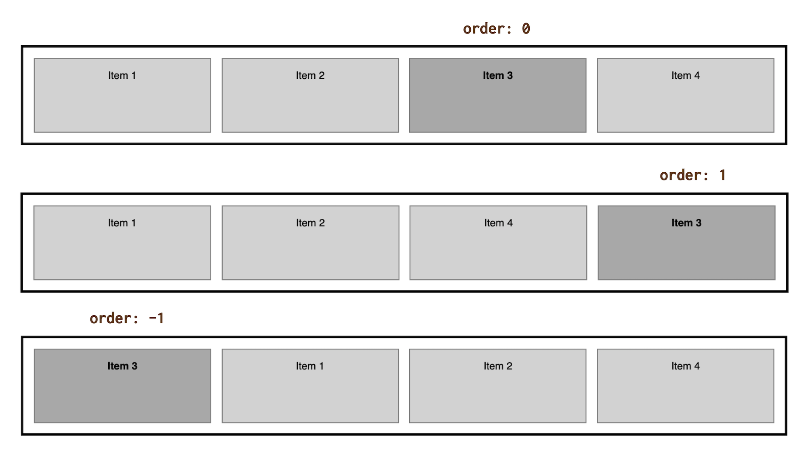

# CSS vlastnost order

Vlastnost `order` nastavuje pořadí položky v kontejneru [flexboxu](css-flexbox.md) nebo [CSS gridu](css-grid.md).

Občas se může kodérům a kodérkám  hodit proto, že zajistí odlišení *vizuálního* pořadí položek od pořadí *zdrojového* vycházejícího z HTML nebo lépe ze stromu DOM.

Jenže kouzlo téhle vlastnosti je zároveň rizikem z pohledu přístupnosti.

<!-- AdSnippet -->

Ale než se k tomu dostaneme, pojďme si tu vlastnost rozebrat, jak je na Vzhůru dolů zvykem.

## Jednoduchý příklad s flexboxem {#priklad}

Pro účely demonstrace zneužijeme čtyři nevinné položky v kontejneru flexboxu:

```html
<div class="container">
  <div class="item item--1">
    Item 1
  </div>
  <div class="item item--2">
    Item 2
  </div>
  <div class="item item--3">
    Item 3
  </div>  
  <div class="item item--4">
    Item 4
  </div>
</div>
```

Vlastnost `order` budeme nastavovat jen u třetí položky:

```css
.item--3 {
  order: 1;
}
```

Kam si myslíte, že se třetí položka posune? Na první místo? Na druhé?

Do obrázku jsem nakreslil řešení a rovnou hned dvě další nastavení.

<figure>

<figcaption markdown="1">
*Obrázek: Tři různá nastavení hodnoty vlastnosti `order`.*
</figcaption>
</figure>

Už tady je hezky vidět, že vlastnost mění pořadí prvků možná trošku jinak, než byste čekali:

- `order: 0` – u nulové hodnoty se od ovlivňované položky asi dá očekávat, že bude držet původní pozici. Nezklamala.
- `order: 1` – kladné hodnoty vytvářejí novou řadu položek řazených od nejmenšího po největší číslo. Ale pozor – až *za* původními, vlastností `order` nedotčenými položkami.
- `order: -1` – ano, lze použít i záporná čísla. Slouží k vytváření pořadí *před* původní řadou položek.

Jen si s tím směle pohrejte v mém CodePenu.

CodePen: [cdnp.io/e/oNxmLRe](https://codepen.io/machal/pen/oNxmLRe?editors=1000)

## Pár věcí, které si stojí za to zapamatovat {#zapamatujte-si}

Jak je vidět, vlastnost `order`, jakkoliv se zdá jednoduchá a přímočará, trošku klame tělem. A to jsme ještě nezačali mluvit o přístupnosti.

Jsou zde ale i další vědomosti, které byste měli mít v hlavě, než si s `order` začnete hrát.

1. Pokud má více položek nastavenu stejnou hodnotu `order`, seřadí se podle pořadí v DOMu.
2. Podle specifikace vlastnost `order` ovlivňuje také pořadí vykreslování při renderingu stránky prohlížečem, což asi má logiku.
3. Absolutně pozicované položky vždy dostanou nastavení `order: 0`, takže drží pořadí vykreslení dle DOMu, což je vidět v mém CodePenu. [cdnp.io/e/JjXxVJy](https://codepen.io/machal/pen/JjXxVJy?editors=1100)

## Ošemetná změna pořadí z pohledu přístupnosti {#pristupnost}

Ve specifikaci se píše:

> Autoři musí použít změnu pořadí pouze pro vizuální, nikoli logické přeskupování obsahu.

Dává to smysl. Když pomocí vlastnosti `order` nebo jiným způsobem změníte pořadí prvku na obrazovce, nijak nezměníte pořadí logické, tedy způsob, jakým obsah konzumují roboti nebo jakým probíhá sekvenční navigace na stránce.  

Více to rozebírám v textu [CSS layout a přístupnost](css-layout-pristupnost.md).

## Raději si na `order` dávejte pozor {#shrnuti}

Shrňme si to. Vlastnost `order` určitě může být v některých případech užitečná pro změnu vizuálního pořadí.

Je zde však nebezpečí, že uživatelům zároveň rozbijeme navigaci z klávesnice a zrakově postiženým čtení obsahu přes odečítače.

Takže s `order` prosím zacházejte opatrně, jako se zápalkami.

<!-- AdSnippet -->
